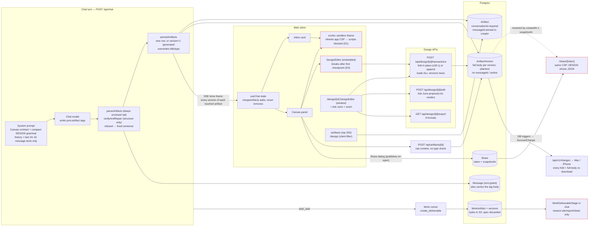

# Juno Artifacts & Design: website audit

**Scope.** This audit covers the website (Next.js, React and Prisma) on `main` at `d0997af2`, 23 Sept 2026. It looks at chat artifacts, the Canvas panel, the Artifacts library, the Design home, the Design editor, the Design model with its AI and export paths, and Work deliverables as they appear in Chat after the Work merge. Nine area audits and four follow-up audits were run. A verifier re-checked every defect: it re-read the code and in most cases re-ran a probe. This document merges those results and removes duplicates. Native (Mac/iPhone) items appear only where web or server code causes them, plus one short spillover table in §6.6.

**How claims are sourced.** A file:line citation means an auditor read that code. "Probe" means an auditor ran a scratch script against the repo's own modules. "Browser" means a Chromium test. "Inferred" means reasoning, not observation. When this synthesis resolved a contradiction by looking at the code itself, it says so in the text.

**Verification labels used in §6:**
- **confirmed**: an independent verifier re-read the code, often re-ran a probe, and agreed. Corrections are noted inline.
- **found-by-verifier**: the verifier found it; the area auditor did not.
- **uncertain**: the code path is confirmed, but the effect a user would see depends on something not observed at runtime. Usually this is defect D1, which today stops the script from running at all.
- **unverified**: an auditor's reading that no verifier checked. This applies mostly to UX and motion observations in §4 and §5.

**Repo state at synthesis time:** clean apart from the untracked `docs/design/artifacts-design/`. On `mac/liquid-glass-chat`, none of the audited web files differ except the header and digest of `src/lib/design/tokens.generated.ts`.

---

## 1. Summary

1. **The data model is already the shape Anthropic moved to. The lifecycle around it is not.** DESIGN is an ordinary typed `Artifact`, sharing versions, the library, share tokens and sync with HTML, React, Markdown and the other types (`prisma/schema.prisma:1344-1356`). So "Design as a typed artifact in the conversation" is a product and UI unification, not a data migration. What blocks it: artifacts are owned only through a chat message, the model cannot see them, and ordinary chat gestures destroy them.

2. **On the website, every artifact preview that needs a script has been dead since 26 Aug 2026.** That covers React, scripted HTML, Tailwind, Mermaid (including inline ```mermaid in chat), the JS/Python console, the public share page and Work site previews. The cause is the enforcing app CSP (nonce + `strict-dynamic`, `src/middleware.ts:55-77`, `src/lib/csp.ts:31`), which the `srcdoc` sandbox inherits. This was reproduced in Chromium with the production header. It matches a user report quoted in commit `a0e41c9b` ("static, doesn't move and doesn't load"). That commit fixed the inner meta policy only. (D1)

3. **Ordinary gestures destroy user work silently.** Three are hard deletes: editing an earlier message, pressing Regenerate/Try again, and deleting a chat that holds a hand-started design. Each takes artifacts, every hand-made version, design checkpoints and comments, and public share links, with no warning and no undo (D2, D3, D11). A plain chat follow-up also rebuilds the artifact from the model's own old message text. That reverts hand edits, and for designs it deletes components, variables, effects, motion and comments (D5, D6).

4. **Outside its own editor, Design barely exists.** In a conversation, the inline card "previews" a design as raw JSON labelled *Live* (M16). The embedded editor breaks on the first edit, because it remounts on a synthetic version whose content is "" (D4). A public share of a design shows JSON (D10), and so do library tiles (L30). The chat's compact design grammar cannot express images (an image node always makes the whole design fail, D9), effects, gradients, components, variables or motion.

5. **The design engine is the strongest engineering in the area, with real correctness gaps.** It has 37 atomic, invertible, schema-validated operations; one pure layout engine and one pure SVG renderer shared by canvas, thumbnails and nine export formats; and 277 passing tests. But the renderer ignores a container's opacity, rotation, blend and filter for its children, so canvas and code exports disagree (D16). Auto-layout "fill" and grid are wrong (M37). Several undos lose data (M38). SVG, PDF and HTML exports return 500 for any name containing a curly apostrophe, em dash, emoji or CJK (D15).

6. **The Design editor is a capable inspector with thin direct manipulation and fragile fields.** Escape *commits* instead of cancelling in every text and number field; this was reproduced (M48). Drawing and rotating have no live preview. You cannot marquee inside a frame. Clicking a resize handle silently switches Hug to Fixed. Touch devices cannot pan. Below laptop width the editor is unusable (M51–M58). Ask Juno is a single blocking, non-streaming, blind request. With nothing selected it sees only top-level nodes (M40, M41).

7. **Information architecture is fragmented.** Things Juno made live in four places on four data models: Library (files and generated images), Artifacts, Design, and a per-task Work panel. The same objects carry different names on each surface. The project page always shows 0 artifacts because it reads a key the API never sent (D17). The library silently stops at 200 (M26). After the Work merge, Work `.docx` and `.pptx` deliverables have **no web surface at all** (D18).

8. **Public links have no governance.** A share is an anonymous snapshot resolved by timestamp. It is not actually frozen, because in-place edits leak into it (M31). A re-share hands back the old snapshot while the dialog says "as it is now" (M30). There is no moderation of what gets published (D13), no takedown path short of deleting the whole account, a banned user's pages keep serving (D12), there is no report link, and none of the relevant routes are rate-limited (M32).

9. **Cost grows with history, and nobody can see it.** Every artifact read ships every version body. Measured: an hour of design editing makes a 9–27 MB chat-thread payload (gzip 0.3–0.7 MB), and each design transaction reads the whole history twice (D14, M12). Nothing is instrumented: `src/lib/observability.ts` is imported by nothing, and there is no error or metrics sink.

10. **Order of work before any merge:** (a) run previews from a separate origin; (b) stop hard deletes and give artifacts their own owner and lifetime; (c) give the model the current artifact and route follow-ups through patches and design operations; (d) render designs as SVG wherever they appear; (e) cut payloads to metadata plus the current body; (f) add governance and telemetry. Detail is in §11.

---

## 2. What exists (feature inventory by surface)

Maturity key: **solid** (works as designed), **partial** (works, with gaps), **broken** (does not work as intended today), **stub** (modelled but not wired), **absent** (searched for and not found).

### 2.1 Chat artifacts: generation, verification, persistence, API

| Feature | What it does | Maturity | Where |
|---|---|---|---|
| Canvas contract in the system prompt | The model decides by itself when to write an artifact (there is no user toggle). 7 types. A revision means re-emitting the complete artifact under the same identifier. Includes a compact DESIGN grammar and Markdown shapes for doc, sheet and deck. Turned off for voice, private chats and assistants without canvas. There are no visual craft rules and no list of the libraries the runtime provides. | partial | `src/lib/chat/system-prompt.ts:238-300`; `src/app/api/chat/route.ts:2104-2111` |
| Tag parser | Regex parser for closed tags, a still-streaming tail, and a salvaged unclosed tail. Edge cases fail: `>` in an attribute, a literal close tag inside the body, entities, MIME-style types. A Swift twin mirrors it. | partial | `src/lib/message-content.ts:29-171, 250-291` |
| Verify + one repair pass | Checks for empty content, the 200k cap (measured on the *compact* body), SVG root and close, a Mermaid header allowlist, and DESIGN normalisation. HTML, React, Code and Markdown get no completeness check. Refused artifacts are replaced by one fixed sentence; an activity receipt is written. | partial | `src/lib/chat-artifact-verification.ts:60-179`; `src/app/api/chat/route.ts:433-462` |
| Storage and versions | Unique on (conversation, identifier). A reused identifier appends version+1 with origin `generated` and overwrites title, type and language. Full content is stored per version, as plaintext. | partial | `src/lib/artifacts-store.ts:38-95`; `prisma/schema.prisma:1125-1160` |
| Targeted Canvas edit ("Modify") | Up to 12 exact, unique search/replace anchors. Coverage, growth and size limits. Compare-and-swap on the base version. A partial patch is never saved. The only path where the model sees the *current* stored source. | solid | `src/lib/artifact-edit.ts`; `src/lib/artifacts-store.ts:103-127`; `src/app/api/chat/route.ts:1450-1484, 3049-3070` |
| Manual edit / restore / rename / delete API | POST appends a version with a stale-base 409 guard and no type check. PATCH changes the title. DELETE is a hard cascade to versions and shares. | solid (no type validation) | `src/app/api/artifacts/[id]/route.ts:7-126` |
| Office export | Markdown to docx/xlsx/pptx. Formats are detected server-side. Each file is re-opened by an independent validator before it is served. Rate-limited. Always exports the latest version. | solid | `src/app/api/artifacts/[id]/export/route.ts`; `src/lib/office-export.ts` |
| Deep-research report artifact | A fixed `research-report` identifier, plus a later citation-audit version with no base check and no verification. | partial | `src/app/api/chat/route.ts:220-240, 2819, 3546-3598` |
| Regenerate / fork / account export | Regenerate hard-deletes the answer's artifacts. Fork copies messages but not artifacts. Account export and import skip artifacts. | broken / absent | `route.ts:2565-2593`; `api/conversations/[id]/fork/route.ts:17-27`; `api/account/export/route.ts:29-60` |
| Artifact runtime capabilities | Storage is an in-memory stand-in only. No model-call API, no persistent or shared storage, no file or connector access. | absent | `src/components/canvas/sandbox-frame.tsx:236-262` |

### 2.2 Canvas panel and inline cards

| Feature | What it does | Maturity | Where |
|---|---|---|---|
| Inline card | A fixed-height live mini-surface (`min(44vh,360px)`). Preview/Output, Code and Console views. Streaming state ("Writing", a sweep, a breathing glyph). "Open" hands off to the Canvas. | partial | `src/components/chat/artifact-inline-card.tsx:156-457`; `src/components/chat/message-item.tsx:1362-1378` |
| Canvas dock | Opens only on click or the `?artifact=` deep link, never automatically. A resizable right column with a persisted width. Below 50rem it replaces the chat. Fullscreen mode. Coexistence rules with the thought dock and file viewer. | solid | `src/components/chat/chat-view.tsx:897-993, 1145-1200, 2479-2541` |
| Tabs | Preview/Design/Output, Code, and Console (the Console tab has an error badge). | solid | `src/components/canvas/canvas-panel.tsx:1112-1137` |
| Sandbox preview | srcdoc iframe with an opaque origin and a meta CSP. Bridges for console, status and links, plus an element inspector. Runtimes: React (dev UMD builds with unpinned Babel), Tailwind Play, Mermaid ESM, Pyodide. **Scripts blocked on web (D1).** | broken | `src/components/canvas/sandbox-frame.tsx:1-931` |
| Width presets | Fit / 834 / 390, driven by the panel's width rather than the viewport. | solid | `canvas-panel.tsx:64-72, 1155-1172` |
| Edit in place (Code tab) | A textarea overlaid on highlight.js. Cmd/Ctrl+S saves as a new version. A stale write gets a "Saved elsewhere" banner. The preview ignores the unsaved draft. | partial | `canvas-panel.tsx:505-546, 1320-1382`; `code-surface.tsx:141-361` |
| Version history | A rail with origin labels, a movable compare base, a line diff, Copy diff, and Restore-as-new. It **cannot render** an older version. | partial | `canvas-panel.tsx:374-459, 943-1102` |
| Copy / download / Office export / Share | Present. Share creates or reuses a snapshot link. No PDF or PNG export. | partial | `canvas-panel.tsx:346-367, 461-503, 842-847` |
| Select → Ask/Modify quote | Text or line selection in Markdown or code, plus an element inspector for web previews. The resulting quote chip drives targeted edits. | partial | `canvas-panel.tsx:568-740, 1392-1420`; `src/lib/quote-context.ts` |
| DESIGN in the Canvas | Mounts the full `DesignEditor` in its "embedded" surface. **Breaks after the first new checkpoint (D4).** No Ask Juno, no link to `/design/[id]`, rails keyed to the viewport. | broken | `canvas-panel.tsx:1236-1257`; `design-editor.tsx:549-550` |
| DESIGN inline card | The "Preview" is escaped JSON in a `<pre>`, status "Live". | broken | `artifact-inline-card.tsx:181-185`; `sandbox-frame.tsx:786-803` |
| Session Outputs popover | A fetch-free index of the conversation's artifacts and generated images, plus provenance ("Used in this session"). | solid | `src/components/chat/session-outputs.tsx` |
| Comments, auto-fix of errors | — | absent | searched canvas-panel and schema |

### 2.3 Artifacts library, navigation, search and sharing

| Feature | What it does | Maturity | Where |
|---|---|---|---|
| `/artifacts` list and grid | List/grid views kept in localStorage. Type chips with counts. Client-side search over at most 200 rows. Menu: Open in canvas / Open conversation / Rename / Download / Share / Delete. Offline auto-retry, skeleton, stagger. No sort, no paging, no bulk actions, no trash. | partial | `src/app/(app)/artifacts/page.tsx`; `src/app/api/artifacts/route.ts:20-97` |
| Grid previews | SVG renders as an ``. Every other type shows its first 20 source lines. DESIGN shows one clipped line of JSON. | partial | `src/components/artifacts/artifact-preview.tsx:59-129` |
| Project > Sources artifacts | Designed, but always empty (D17). Rows link to `?id=`, which nothing reads. | broken | `src/app/(app)/projects/[id]/page.tsx:305-318`; `project-sources-list.tsx:321` |
| Sidebar destinations | Chat: Library, Projects, Artifacts, Design. Code: Artifacts (which flips the product to Chat, M27). | partial | `src/components/app/app-sidebar.tsx:1068-1125` |
| ⌘K / unified search | Search covers all version history, but the `?v=` it links to is ignored (M28). ⌘K has no "New design" and no artifact titles. | partial | `src/lib/search/sql.ts:317-354`; `src/lib/search/engine.ts:420-441`; `command-palette.tsx:1122-1181` |
| Public share page `/share/[token]` | noindex, force-dynamic, revocable, counts views. Artifact viewer with Preview/Code tabs; DESIGN gets Code (JSON) only. Chat shares render artifacts as inert chips. No report link, no legal links. | partial | `src/app/share/[token]/page.tsx`; `src/components/share/*`; `src/lib/share.ts` |
| Shared links (Settings) | List, copy, revoke, view counts. Does not know about DESIGN (a generic glyph and label). No link back to the source. | partial | `src/components/share/shared-links-card.tsx` |
| `/library` (files) | The reference listing: server search, 4 sorts, cursor paging, bulk select, "Recently deleted", drag-and-drop upload. Generated images and videos live here as `Attachment` rows with origin `generated`. | solid | `src/app/(app)/library/page.tsx`; `src/app/api/library/route.ts` |
| Global index of Work deliverables | Deliverables are listed per task only. | absent | `src/components/work/work-transport.tsx:1571` |
| Hand-created docs, slides, sites | The only "New" flows are the four design presets. No Slides or Design System type exists. | absent | `design/page.tsx:55-60`; `schema.prisma:1344-1356` |

### 2.4 Design home (`/design`)

| Feature | What it does | Maturity | Where |
|---|---|---|---|
| Start presets | Phone 375×812, Tablet 834×1194, Desktop 1440×900, Square 1080×1080. Each click POSTs `/api/design`, which creates **an empty holder chat plus a DESIGN artifact**. | solid | `src/app/(app)/design/page.tsx:55-195`; `src/app/api/design/route.ts:37-101` |
| Recent list | The `/api/artifacts` response (capped at 200) filtered to DESIGN in the browser. Rows are bordered cards with no thumbnails. The only action is Delete. Rows open through `router.push`, so middle-click does not work. | partial | `design/page.tsx:71-90, 218-286` |
| States | Skeleton, empty and error states. The error state has no retry and no offline handling. | partial | `design/page.tsx:198-217`; `design/loading.tsx` |

### 2.5 Design editor (`/design/[artifactId]`, plus the embedded copy in the chat Canvas)

| Feature | What it does | Maturity | Where |
|---|---|---|---|
| Workspace header | Back, inline name (renames both artifact and document), vN, a Chat link (full navigation away), and a ⋯ menu whose only item is Delete. No Share, Present, comments or version history. | partial | `src/components/design/design-workspace.tsx:124-207` |
| Tools | Select V, Frame F, Rectangle R, Ellipse O, Line L (horizontal only), Text T, Image I. No pen, hand, comment, polygon or eyedropper. | partial | `design-editor.tsx:124-132`; `design-canvas.tsx:610-650` |
| Navigation | Wheel pan, ⌘-wheel or pinch-trackpad zoom, middle or Alt drag to pan, a zoom bar. No Space-to-pan, no keyboard zoom, no touch, no rulers, no minimap, no animated camera. | partial | `design-canvas.tsx:258-347, 858-887, 1951-2015` |
| Selection | Outermost-first hits, descend on repeat click, ⌘ deep-select, Shift toggle, marquee (not inside frames). Tested pure helpers. | partial | `design-canvas.tsx:362-374, 463-605, 1311-1498` |
| Transform | Move with an outline ghost and smart guides; group and rotated resize; rotation snapping; nudge. No live preview when drawing or rotating. No Alt-duplicate. | partial | `design-canvas.tsx:376-426, 516-719, 942-1006, 1542-1712` |
| Text | A double-click overlay in the same face. One style per node. | partial | `design-canvas.tsx:803-843, 1733-1809` |
| Images | PNG/JPEG/GIF/WebP up to 96 KB, inlined as data URLs. No downscaling, no paste, no drop. | partial | `use-design-document.ts:560-608` |
| Layers panel | A real ARIA tree: pages, filter, drag to reorder or reparent, eye and lock toggles, badges. | solid | `src/components/design/layers-panel.tsx` |
| Components / variables | Component library with thumbnails and an instance variant picker. No create-variant, detach or go-to-main. Variables are editable per mode; only `fills.0.color` can be bound. | partial | `layers-panel.tsx:809-1279`; `inspector-panel.tsx:373-554` |
| Inspector | Full: auto layout including grid and wrap, constraints, min/max, per-corner radius + smoothing, multi fill/stroke, gradients, a 7-kind effect stack, typography, blend, variables. Reads Mixed values per layer. Font family is a free-text field. | solid | `inspector-panel.tsx`; `effects-panel.tsx` |
| Motion timeline | Tracks for 13 properties, keyframes, easing including bezier and spring, scrub and play. The preview is a derived document. | partial | `motion-panel.tsx`; `motion-model.ts` |
| Prototype tab | 7 triggers × 10 actions, with transitions. **No player.** | partial | `interactions-panel.tsx:1-260` |
| Ask Juno | A scoped, non-streaming, single-turn proposal. Preview → review card → Apply/Reject. "Tune Juno's change" adjustment controls afterwards. | partial | `ask-juno-bar.tsx`; `design-editor.tsx:964-1015`; `design-adjustments.tsx` |
| Export menu | SVG, PNG (rasterised on the client), PDF, HTML prototype, React, SwiftUI, tokens, JSON, Juno Code handoff. Silently narrows to a single selected layer. | partial | `design-editor.tsx:298-345, 656-682` |
| Panes | Resizable, collapsible and persisted. | solid | `panel-layout.tsx` |
| Save | Optimistic apply with a coalesced queue and one request in flight. Any failure rolls back **and clears undo and redo**. | partial | `use-design-document.ts:149-326` |
| Comments, share, presence, player, rulers and guides, vector tools, system clipboard, version browsing | — | absent | see §7 |

### 2.6 Design model, AI and export (`src/lib/design`)

| Feature | What it does | Maturity | Where |
|---|---|---|---|
| Scene document | A flat node map with explicit child order and 10 node types; stacked paints (solid, linear, radial, image); strokes (only the first is drawn); a 7-kind effect stack including glass; squircle radius; auto layout; constraints; components and variants; variables with modes and aliases; interactions; keyframe motion; comments (model only); pages; assets. Validated by zod plus a JSON Schema mirror for Swift. | solid (breadth) | `types.ts:436-789`; `schema.ts` |
| Operations | 37 kinds, validated, applied atomically on a clone, each with an inverse; ids are deterministic. Several inverses lose data (M38). | solid | `operations.ts:124-392` |
| Persistence | A revisioned compare-and-swap store. User edits within 30 s of the newest edit checkpoint fold **into that row in place**; otherwise a new version is appended. Document budget: 200,000 characters. | partial | `store.ts:89-203`; `operations.ts:511-539` |
| Layout and render | A pure layout engine and a deterministic SVG renderer, shared by canvas, thumbnails, exports and the AI context. Text is measured with Helvetica/Times metric tables. | partial (D16, M37) | `layout.ts`; `render.ts` |
| Exports | SVG, PNG, PDF (weak), HTML prototype, React, SwiftUI (absolutely positioned), JSON, tokens, and a handoff bundle. Losses are recorded as `unsupported` notes, but the UI shows only the first one. | partial | `export.ts`; `api/design/[artifactId]/export/route.ts` |
| AI edit (Ask Juno) | A `<juno:design-ops>` JSON proposal of at most 60 operations, previewed on a clone with a scope check. Metered and rate-limited to 20/min. Text-only context, no image. | partial | `ai.ts:30-395`; `api/design/[artifactId]/edit/route.ts` |
| Compact authoring (chat) | 7 node types with basic properties, expanded through the operation layer. No effects, gradients, components, variables, motion or assets; `image` always fails. | broken | `authoring.ts` |
| Import (Figma, SVG, HTML → scene) | — | absent | `authoring.ts:215-235`; no `/api/design` import route |
| Multiplayer | `crdt.ts` is a text-only CRDT that only tests use. `capabilities.ts` nevertheless lists "Canvas CRDT Collaboration" as stable. | absent | `src/lib/collaboration/crdt.ts`; `src/lib/capabilities.ts:49-55` |

### 2.7 Work deliverables as they appear in Chat after the merge

| Feature | What it does | Maturity | Where |
|---|---|---|---|
| Typed spec generators | document→.docx, spreadsheet→.xlsx, presentation→.pptx (5 fixed layouts), report→.md, site→script-free .zip. | solid / partial (decks) | `src/lib/work/deliverables/*` |
| Validator | Re-opens each file with an independent reader, enforces caps, path safety and zip-bomb budgets. **Shared with chat Office export.** Its site-markup scan has false positives. | solid | `validate.ts`; `src/lib/office-export-verify.ts:42-62` |
| Storage | S3 blobs plus append-only `WorkArtifactVersion` keyed by (session, identifier). **The typed spec is thrown away**, so nothing can be edited or re-rendered. | partial | `prisma/schema.prisma:2608-2665`; `scripts/work-runner.ts:1985-2078` |
| Download / preview routes | Hash-verified downloads. A windowed spreadsheet preview. A sandboxed site preview (subject to D1). A careful report preview. | solid | `api/work/artifacts/[id]/*`; `work-site-preview.tsx` |
| In-chat stage | Shows only the newest previewable file (site, report or sheet), only after the task finishes, and only for the newest task. No validation verdict. | broken | `work-deliverable-stage.tsx:33-81`; `work-run-panel.tsx:356-358` |
| Full deliverable cards, verdicts, provenance, version history | Built but **unmounted** since `/work` was retired (`ff3963ec`). | broken | `work-documents.tsx:111-518` |
| Provenance | Modelled and rendered into report Sources, but never recorded. | stub | `scripts/work-runner.ts:1826`; `runner/agent-core/src/work/tools.ts:949-952` |
| Edit, share, comments, library, delete/rename/restore | — | absent | `schema.prisma:1808-1828` (Share references `Artifact` only) |

### 2.8 Searched for and absent everywhere

Comments on any artifact: the only comment model is `FeatureComment` (`schema.prisma:1473`); `DesignComment` has no write operation. Also absent: per-artifact permissions and roles (ownership is always `artifact → conversation.userId`); live or updatable links; remix or duplicate; embed; soft delete or trash for artifacts; per-version provenance (`ArtifactVersion` has no `messageId` or author); injecting current artifact state into the model's context; a prototype player; importers; telemetry.

---

## 3. Architecture & data flow



**Key facts behind the diagram (read):**

- **Ownership.** Every artifact route authorises through `artifact → conversation.userId`. The Prisma ownership guard does not cover `Artifact` (`src/lib/db.ts:22-25`). `Artifact.conversationId` is required (`schema.prisma:1127`). That is why `/design` creates an empty chat for every blank design (`api/design/route.ts:66-79`).
- **The model's view.** A normal turn sees only message text from a 24–31 message window (`route.ts:1852-1861`; `context-assembly.ts:18-44`). Hand edits, design-editor checkpoints and hand-started designs are invisible to it. The one exception is a Canvas "Modify" turn, which loads the stored current version (`route.ts:1450-1483`).
- **Two write paths for DESIGN.** One is typed transactions through `commitTransaction`. The other is raw content through the generic `POST /api/artifacts/[id]`, which the Canvas History restore and the Mac library save both use (`artifacts/[id]/route.ts:7-16`; `canvas-panel.tsx:420-446`). This contradicts the rule stated at `transactions/route.ts:17-24`.
- **What deletes an artifact.** The row is keyed for deletion by `messageId`. Editing a message deletes artifacts whose creating message is newer (`messages/[id]/route.ts:38-40`). Regenerate deletes the answer's artifacts (`route.ts:2573`). Deleting a conversation cascades (`schema.prisma:1137`). Versions and Share rows cascade from `Artifact` (`schema.prisma:1157, 1823`). Every one of these is a hard delete.
- **Three separate "made thing" systems.** `Artifact` (text rows, per conversation). `WorkArtifact` (S3 blobs, per session, with provenance and validation). Generated media as `Attachment` rows with origin `generated` (`api/generate/route.ts:263-272`). Each has its own versioning, serializers, sync entities and list pages.
- **Rendering.** `SandboxFrame` builds one document per type and loads it as `srcDoc` with `sandbox` set and no `allow-same-origin` (`sandbox-frame.tsx:849-931`). Designs render through `renderPageSvg` into a single `<svg>` via `dangerouslySetInnerHTML` (`design-canvas.tsx:177-193, 1078`).
- **I checked this myself during synthesis.** The middleware matcher covers every route except static assets (`src/middleware.ts:119-121`), so `/share/*` gets the same CSP as the app. `csp.ts:31` adds `'unsafe-eval'` only in development and always sends a nonce with `'strict-dynamic'`. The middleware comment still says the srcdoc iframe is "unaffected" (`src/middleware.ts:55-57`).

---

## 4. UI/UX findings

Status in this section is **unverified** unless a defect ID is cited; cited defects carry their own status in §6.

### 4.1 The main use case fails on the most common path

- **Asking for "a React todo app" or "a Tailwind landing page" gets a blank or unstyled frame on the web** (D1). The failure is silent: no error, and the status stays at Loading.
- **Designs made in chat are invisible in the conversation.** The card shows JSON labelled *Live* (M16). The Canvas editor breaks on the first drag (D4). The share link shows JSON (D10). The grid tile shows one line of JSON (L30). Because the Canvas never opens by itself, the JSON card is the default experience of "Juno designed a screen for you".
- **Valid output reaches the user as an error.** Mermaid `quadrantChart`, YAML front-matter, `xychart-beta`, C4 and others are refused (M2). Designs fenced in ```json are refused (M3). The source is erased from the message, and the reason is never shown (M4).

### 4.2 Silent data loss and trust

| Gesture | What it silently destroys | Warning? | Defect |
|---|---|---|---|
| Edit an earlier message (hover pencil, or ↑ in an empty composer, then Enter) | Every later artifact with all versions, hand edits, design checkpoints, design comments, public links | none (only Cancel/Send) | D2 |
| Regenerate / Try again / Switch model / More concise | That answer's artifacts, versions, links. A re-emitted identifier gets a **new id**, so `/design/<id>` URLs and share links break. | none | D3 |
| Delete a chat, or "Delete all conversations" | Hand-started designs (which live in holder chats named "Untitled design"), their links, and Code sessions | Copy mentions only "messages" | D11 |
| A plain chat follow-up ("make the title bigger") | Hand edits become non-current. For a DESIGN: components, variables, effects, motion, interactions and comments | none | D5, D6 |
| Stop mid-revision, or hit the token cap | The complete previous version stops being current. A cut version is saved and labelled "verified". | Only a message-level "stopped" note | D7 |
| Close the Canvas, open a file, or switch artifact | Unsaved Code-tab edits | none | M19, M20 |
| One failed design save | Every queued edit, plus the whole undo and redo history | a toast | M60 |

By contrast, the explicit "Delete design" dialog is honest ("permanently removed", `design-workspace.tsx:240-262`), which makes the silent paths more dangerous. The native apps treat "Edit" as a non-destructive branch (`NativeConversationStore.swift:2304-2315`), so the same gesture keeps data on Mac and iPhone but destroys it on the web.

### 4.3 Information architecture and naming

- **Four surfaces and four data models, with no single index of what Juno made.** The Artifacts lede ("Everything Juno built with you", `artifacts/page.tsx:378`) is not true: generated media lives in the Library, and Work deliverables appear nowhere (`api/generate/route.ts:263-272`; `work-transport.tsx:1571`).
- **One object, many names.** An Attachment is "Library", "Files" or "Sources". An Artifact is "Artifacts", "Outputs", "Sources" or "Canvas". MARKDOWN is "Documents", "Markdown", "Doc", raw `MARKDOWN`, or "document". "Document" is also the name of a knowledge viewer and of a Work kind. Design is "Design", "Designs" or "Juno Design". (`artifacts/page.tsx:51-60`; `session-outputs.tsx:53-61`; `project-sources-list.tsx:332`; `search/types.ts:41-53`)
- **One design, two editors.** From `/artifacts`, search or Outputs, a design opens in the embedded Canvas editor, which has no Ask Juno and no zoom chrome. From `/design` it opens in the full-window editor. Neither links to the other: the workspace's "Chat" link carries no `?artifact` (`design-workspace.tsx:176-181`).
- **Clicking "Artifacts" inside Code flips the whole product to Chat** (M27). **Deep links break their promise** in three places: search `?v=` (M28), the project `?id=` (L27), and Code-session artifacts (L28).
- **Creation is almost entirely by prompt.** The four design presets are the only "New" flow, and `/artifacts` always uses the Phone preset (`artifacts/page.tsx:279`). ⌘K has no "New design". Starter chips never mention design.
- **Tab titles.** Every open design tab reads "Design · Juno" (L37).

### 4.4 Canvas ergonomics

- **No auto-open and no streaming into the panel.** While the model rewrites an open artifact, the Canvas shows nothing until `done` (`canvas-panel.tsx:313-315`; `route.ts:3016`). The inline card says "Writing" but shows the *old* source (M15). Once the closing tag arrives, it flips to a red "Source unavailable" until `done` (M14).
- **Older versions cannot be rendered.** The rail only diffs text (`canvas-panel.tsx:407-410`). For DESIGN that diff is one removed line and one added line of minified JSON.
- **No "fix it" action** on a failed preview; the banner offers only Console and "View vN" (`canvas-panel.tsx:1223-1235`).
- **Every card for an identifier shows the latest version**, never the one its own turn produced (L9).
- **Small issues.** On a phone-width Canvas the history rail is a fixed `w-48`. The first open has no loading fallback, because the chunk includes the whole design editor. Esc closes the thought dock but not the Canvas. The DESIGN Code tab is one unhighlighted line of up to 200k characters.

### 4.5 Design editor against Figma UI3

- **Direct manipulation.** Moving shows an outline only. Drawing and rotating show nothing (M55). There is no marquee inside frames (M54). Dragging an auto-layout child does nothing visible and records an undo entry (M53). A selection click can move and snap a layer (M52). Clicking a handle switches Hug/Fill to Fixed (M51).
- **Fields.** Escape commits (M48, reproduced). Inline hex and opacity inputs have no draft, so keystrokes are lost or committed (M49). Gradient pads write one undo entry per pointer move (M50). The system colour picker resets alpha (L59). Font family is free text, and weight is a bare number.
- **Missing keyboard vocabulary.** ⌘C/⌘V/⌘X (copy is a context-menu list of ids, `design-context-menu.tsx:40-79`), Space/H to pan, zoom keys, Enter/Shift+Enter/Esc to move through the hierarchy, Shift axis-lock, Alt-drag duplicate (Alt pans instead), Alt-hover measurement.
- **Responsiveness.** In the window surface the rails never auto-collapse and the toolbar clips, so the canvas collapses to 0 px on a phone (M58). In the embedded surface the rails hide by *viewport* breakpoint with no way back (M17), which breaks PREMIUM_AUDIT rule 11. Touch cannot pan (M57).
- **Prototyping.** Interactions can be authored but not experienced. The panel says outright that there is no player (`interactions-panel.tsx:19-25`).

### 4.6 AI editing UX

- **Ask Juno** is one blocking call of up to 120 s, with no stop button, no streaming, no history, no attachments, no before/after toggle, and no image of the design (`edit/route.ts:22, 150-155, 186-201`). Designs started at `/design` have no conversation model, so it runs on `qwen3.8-flash` (M41). With nothing selected it cannot address anything below the top level, and the placeholder never suggests selecting first (M40).
- **Proposal review is not isolated.** Keyboard shortcuts and the Layers panel stay live and write to the hidden committed document (M46). Apply reports "applied" even when it fails (M47).
- **Two AI channels that cannot see each other.** The chat composer regenerates whole artifacts through tags; Ask Juno sends operations. Neither shares history or context with the other, and Ask Juno requests never appear in the owning conversation.
- **Refusals** show raw schema paths ("operations.0.nodeId: …", `ai.ts:106-110`) or a fixed sentence that gives no reason (M4).

### 4.7 Sharing UX

- **Opening the Share dialog publishes a link** (L5). There is no explicit Publish step.
- The dialog promises "as it is now" but hands back an old snapshot (M30). Revoking and re-creating is the only way to refresh, and it breaks the URL already sent.
- **No artifact surface shows that something is public.** The only place to answer "what of mine is public?" is Settings > Data & privacy, and those rows do not link back to the artifact.
- Link unfurls drop `og:image`, and X cards say "Juno" instead of the item's title (L72). Shared chats show artifacts as chips that cannot be opened.

### 4.8 Accessibility

- The Canvas takes no focus when it opens and returns none when it closes. Fullscreen sets `aria-modal` without trapping focus (M23).
- The Ask/Modify toolbar cannot be reached by keyboard (M22).
- The design canvas is `role=application` with its outline removed (L66). Rail tabs are `aria-pressed` buttons rather than tabs. Disabled toolbar keys never show their tooltip (L60).
- Keyframe diamonds cannot be activated from the keyboard and are labelled only "Keyframe at N ms" (`motion-panel.tsx:683-722`).
- Frame titles on the default page colour have about 2.1:1 contrast in dark mode (L58).
- Deliverable titles are an `<h2>` inside the panel's `<h3>` (L88).

### 4.9 Conformance with the design laws

- **FLAT_UI §3.1 / §6 (selected state = `bg-selected` with foreground ink).** Violated by the accent tint (`bg-primary/10` with `text-primary`) on layer rows, pages, tools, the Ask Juno scope chip (the same pill PREMIUM_AUDIT §2d P1 removed from the composer), the Canvas history row and inline-visual cards (`layers-panel.tsx:436, 463, 552, 619`; `ask-juno-bar.tsx:157-160`; `canvas-panel.tsx:983`).
- **PREMIUM_AUDIT rule 3 (a list row is text on the panel).** Design home rows are bordered cards (`design/page.tsx:233`). **Rule 6 (one trailing signal):** Artifacts rows carry 3–4 facts (`artifacts/page.tsx:622-634`). **Rule 11 (size by the container):** broken by the embedded editor rails and by the inline card's `h-[min(44vh,360px)]`.
- **ICONS_AND_MOTION §3.** Hit targets are below 32/44 px in many places (inline card segments `h-6`, layer row keys 18 px, Canvas Clear and base chips, the Download button `h-7`). Raw `z-10`/`z-40` is used instead of the four named rungs. Icon-only buttons lack tooltips on the Design home. Artifact kinds lack a single registry: four type-to-glyph maps and three label vocabularies.
- **Composition that follows the laws.** The public share page (card-rung header, reading measure, one primary action). The `/artifacts` list rows (tonal hover, glyph lift, no card lift). Floating editor layers, which use the `overlay-glass` material. Empty, loading and error states that use one shared vocabulary.
- **Radius drift.** The inline card's white sheet uses `rounded-md` (8 px, off the ladder). Comments disagree on whether a card radius is 14 or 16 (`inline-visual-block.tsx:213-226`; `tailwind.config.ts:28`).

### 4.10 Phone

On the web, phone editing of a design is not supported by this code: there is no touch pan or pinch, the window rails are pinned, and the toolbar clips (M57, M58). The Canvas goes full-bleed below 50rem, which is good, but its history rail and focus handling are not adapted to phones. The brief says the iPhone app is read-only for designs. The lifecycle auditor found that it actually edits and saves designs (`JunoMobileWorkspaceViews.swift:2062-2067, 2258-2277`), and that it drops unsaved drafts when a new version arrives remotely (native spillover, §6.6).

---

## 5. Motion findings

### 5.1 Product motion (how the UI moves)

**Strong foundation.** One ladder of 6 durations and 9 curves lives in `globals.css:314-349`. It is generated into framer (`src/lib/motion.ts`) and Swift (`JunoDesignTokens.swift`). A source-reading test keeps the Mac editor's stylesheet in step (`tests/design-host-motion-tokens.test.ts`). Reduced motion is handled in tiers. The shared primitives are `IconSwap`, `Collapse` and a stagger capped at 8–10. Artifact and design surfaces largely follow ICONS_AND_MOTION:
- tonal hovers with a glyph lift instead of a card lift;
- a staggered rise-in for rows;
- IconSwap for copy→check, more→spinner, play/pause, eye, lock and link;
- `useFlash` timers;
- framer `variants.fade` for the history swap;
- a live-only loop for the streaming sweep and breathing icon;
- the Canvas dock entering on `ease-drawer` with a fade-only branch under reduced motion;
- carets rotating, and `Collapse` for disclosures.

**Violations and gaps (unverified unless cited):**
- **Exits missing.** The save bar, stale-conflict banner, failure banner, selection toolbar, proposal review card, "Tune" card, Ask Juno error strip, fullscreen exit and deleted library rows all vanish in one frame. This breaks ICONS_AND_MOTION §2.2 rules 4 and 6 (`canvas-panel.tsx:789, 1223-1404`; `design-editor.tsx:795-799, 973`; `design-workspace.tsx:224-226`; `artifacts/page.tsx:328-330`).
- **Reduced motion.** The Canvas, file and thought docks still slide 16 px on exit under reduced motion (L16). Raw `.pressable` controls in the design panels still scale on the web (L19).
- **The Canvas replays its whole entrance after every resize drag** (L15). The thought dock already fixed this with `animateDock`.
- **Off-ladder loop.** The inline card's live dot uses stock `animate-pulse`, while the Canvas header uses `status-glow`, so the two "live" dots breathe differently side by side (L17).
- **The design canvas has no motion of its own.** Zoom to fit or selection jumps. A proposal preview or Apply swaps the whole scene in one frame, with no cross-fade to show what Juno changed. Selection chrome appears instantly.
- **Version switches remount behind a fade.** The preview, markdown and design containers are keyed by `selectedVersion` and fade in (`canvas-panel.tsx:1237, 1260, 1284`). For the design editor this key *causes* D4, and the editor fades in to an error state.
- **Continuity.** Opening the Canvas plays a 16 px slide with no shared-element morph from the card that was clicked. No moment says "a new version landed" when the audit or the model replaces a version.
- **Dead stagger.** The `/artifacts` in-page skeleton sets a stagger delay without any animation (L18). Switching list and grid replays the whole entrance stagger.
- **Cost.** Product motion stays on transform and opacity, apart from the documented `Collapse` grid-rows fold and the timeline playhead (which animates `left`).

### 5.2 Authored motion (what a design can animate)

- **Model.** 13 absolute properties per track: x, y, width, height, scale, rotation, opacity, corner radius, fill colour, stroke colour, font size, letter spacing, blur. Easing per keyframe (linear, named curves, cubic-bezier, spring). Looping. State animations (the `state` field has no UI). Prototype interactions with 7 triggers, 10 actions, 5 transition kinds, and "match layers by id" (`types.ts:645-731`). Keyframe easing governs the *outgoing* segment; Figma's governs the incoming one.
- **Preview.** A pure derived document with closed-form bezier and spring maths; it never commits (`motion-model.ts`). It disagrees with the export in five reproduced cases:
  - x/y tracks on auto-layout children do nothing on the canvas but move in the export (M64);
  - track order moves the scale origin (L21);
  - scale does not scale glyphs or radius (L22);
  - keyframes past the duration play in the preview but are folded silently into 100% in the export (M65);
  - springs jump by up to about 50% at the next keyframe, and export as ease-out (L20).

  Playback re-lays-out and re-serialises the whole page SVG every frame. The 200k document cap bounds this at about 1 ms of JS, measured (L24).
- **Export.** Only the HTML prototype runs motion: real `@keyframes`, a reduced-motion kill switch, and a small trigger runtime. Its problems:
  - transitions (dissolve, slide, push, move, smart-animate) reach no runtime, so navigation is an instant cut and nothing reports it (M61);
  - "After a delay" timers start at page load for every frame, and key triggers fire from hidden frames (M62);
  - "While hovering" and "While pressed" are one-shot (L26);
  - reverse play sticks (M63).

  React and SwiftUI only print a note pointing at the handoff bundle. There is no video, GIF or Lottie export.
- **Authoring gaps.** No player in any form (in canvas, full screen, or at a link). No Smart Animate engine. No easing presets or curve editor. No duration+bounce springs, although the product's own `lib/motion.ts` uses that form. No timeline zoom, multi-select, copy, snapping or record mode. Delete with a keyframe selected deletes the *layers* (M66). The chat's compact grammar cannot express motion at all.

### 5.3 Liquid Glass branch

No motion changes reach the artifact or design surfaces. The branch rewrites `JunoMotion` (generated curves, `shift()`/`scaleFrom()`), but the Mac Canvas still enters on ease-out-expo (L-native motion-18). The web dropped that curve as "a lurch that then hung" (`chat-view.tsx:2493-2496`).

---

## 6. Defects, ranked by severity

Duplicates found by several auditors are merged, and the source IDs are kept for traceability. Where auditors disagreed on severity, the rank chosen here is stated. **"Latent: D1"** means the code path is confirmed, but on the web today no script runs, so the effect a user would see is suppressed until D1 is fixed.

**A contradiction resolved here.** Several area audits describe script behaviour inside previews as live: auto-running console cards, prompt dialogs, the lucide stub, the link bridge, forged `juno:selected` messages, exfiltration from shared pages. The pipeline auditor and its verifier reproduced in Chromium that the enforcing app CSP blocks every script in a `srcdoc` preview. I checked `csp.ts:31` and the middleware matcher (`src/middleware.ts:119-121`); I did not re-run the browser test. Those defects are therefore marked *latent: D1* or **uncertain**. The pipeline verifier *inferred* that development builds are also blocked, and that Firefox and Safari behave the same. Neither was tested.

### 6.1 Critical

| ID | Defect | Where | Status | Sources |
|---|---|---|---|---|
| D1 | **The enforcing app CSP is inherited by the `srcdoc` sandbox, so every scripted preview is dead on the web.** React, scripted HTML, Tailwind, Mermaid (including inline), JS/Python, the public share viewer and Work site previews show blank or static frames with no status messages. Enforcing since `fb3a42b5` (26 Aug). `a0e41c9b` "verified" documents standalone only. | `src/middleware.ts:55-77`, `src/lib/csp.ts:31`, `src/components/canvas/sandbox-frame.tsx:918-929` | confirmed (browser; the synthesis re-read the matcher and policy) | web-artifact-pipeline-1 |
| D2 | **Editing an earlier user message hard-deletes every later chat-made artifact**, with all hand edits, /design checkpoints, design comments and public share links. No confirmation. The route's own comment says "an edit never destroys history". Hand-started designs (`messageId` null) are immune. | `src/app/api/messages/[id]/route.ts:38-40` (claim at `:9-14`) | confirmed | followup-lifecycle-1, web-artifact-pipeline missed-1 (ranked critical, per the lifecycle audit) |

### 6.2 High

| ID | Defect | Where | Status | Sources |
|---|---|---|---|---|
| D3 | **Regenerate hard-deletes the answer's artifacts**, their versions and share links, inside the same transaction as the message overwrite. A re-emitted identifier then becomes a **new row with a new id**, which breaks share links, `/design/<id>` and native selections. Covers web Try again, Switch model, More concise and Add detail. On `main`, native Try again on a completed answer is a no-op. The glass branch makes it reach this path. | `src/app/api/chat/route.ts:2566-2574`; `src/lib/artifacts-store.ts:48-50, 76-89` | confirmed (native part corrected) | web-artifact-pipeline-3, followup-lifecycle-2, public-link-11 |
| D4 | **The chat-Canvas design editor breaks on the first edit that creates a checkpoint** (always the first edit of an AI-made design). `onCommitted` appends `{version, content:""}`; `selectedVersion` follows it; `?? artifact.content` does not catch `""`; the editor, keyed by version, remounts and shows "Design document is not valid JSON". Copy and Download give an empty file, and the history diff compares against "". Only a page reload recovers. Present since `7c344b96` (5 Aug). The `/design/[id]` window is unaffected. | `src/components/canvas/canvas-panel.tsx:1243-1253` (with `313-315`, `369-370`, `1237`) | confirmed (traced independently by six auditors; not run in a browser) | web-artifact-surface-1, followup-lifecycle-10, motion-1, followup-scale-3, web-library-ia missed-1, web-design-model missed-1 |
| D5 | **Model revisions silently overwrite user edits.** A normal turn sees only old message text, and `persistArtifacts` appends a `generated` version with no base check. A Canvas save or design edit is reverted on the next "make it X". Designs started at `/design` are invisible to their own conversation. A race with a manual save can throw after the message is written. The Canvas "Modify" path is the exception. | `src/lib/artifacts-store.ts:52-75`; `src/app/api/chat/route.ts:1852-1861` | confirmed (corrected: Modify path excluded) | web-artifact-pipeline-2, followup-model-4, followup-lifecycle missed-2 |
| D6 | **A chat revision of a DESIGN rebuilds the document from scratch.** Every component, variable, effect, animation, interaction, comment and editor-made node is deleted, because the compact grammar cannot express them and the model is forbidden to write the full document. | `src/lib/design/authoring.ts:161-203`; `src/lib/chat/system-prompt.ts:257, 291` | confirmed | followup-model-3 |
| D7 | **A stopped or cut revision becomes the current version and is labelled "verified".** The unclosed tail is salvaged; HTML, React, Code and Markdown get no completeness check; both the success and partial paths persist regardless of `finishReason`; the saved message **closes the tag**, so later turns cannot see the cut. Continue sends a plain message and joins nothing. `looksTruncated()` exists but is unused here. Mostly FREE (8,192 tokens) and Stop. | `src/lib/message-content.ts:100-115, 143-150`; `src/lib/chat-artifact-verification.ts:60-106`; `src/app/api/chat/route.ts:3058-3112, 3271-3292`; `src/hooks/use-chat.ts:1862-1864` | confirmed (probe) | web-artifact-pipeline-4, followup-model-1, -5, followup-model missed-1 |
| D8 | **The DESIGN size cap is checked before expansion (about 6.5× growth).** A 41 KB compact design is stored at 266 KB. After that, every editor edit is refused with 413 "too large", Canvas and manual saves fail, and one oversized version fails the **whole** Mac and iPhone artifact library load. | `src/lib/chat-artifact-verification.ts:63`; `src/lib/artifacts-store.ts:16-25`; `src/lib/design/store.ts:117-120` | confirmed (measured) | web-artifact-pipeline-6, followup-scale-6 (ranked high, per pipeline) |
| D9 | **The compact DESIGN `image` node, which the prompt advertises, always makes the whole design fail.** The schema has no asset field, and `createNode` requires one. | `src/lib/design/authoring.ts:47`; `src/lib/design/operations.ts:571-575`; `src/lib/chat/system-prompt.ts:286` | confirmed (probe) | web-design-model-3, followup-model-2 |
| D10 | **A public share of a DESIGN shows only raw document JSON**, including base64 image blobs. There is no Preview tab. `/artifacts` and the Canvas offer Share on designs. Library image assets are owner-only, so even a renderer would draw holes. | `src/components/share/shared-artifact-viewer.tsx:32` | confirmed | web-artifact-pipeline-10, web-library-ia-2, web-artifact-surface missed-3, public-link-5 |
| D11 | **Deleting a conversation, or "Delete all conversations", hard-deletes hand-started designs and their links** (and all Code sessions). The dialogs mention only "the conversation and its messages". Holder chats look empty ("Untitled design"), so they are the likeliest to be deleted. | `src/components/app/app-sidebar.tsx:2268-2273`; `src/components/settings/sections/data-privacy.tsx:106, 118-121`; `src/app/api/design/route.ts:69-90`; `prisma/schema.prisma:1137` | confirmed | web-library-ia-3, followup-lifecycle-11, followup-lifecycle missed-5 |
| D12 | **A banned user's public shares keep serving, and there is no takedown path** short of deleting the account, which also cascades away the moderation evidence. No admin route touches Share or Artifact. `ModerationFlag` cannot reference either. | `src/lib/share.ts:135-139`; `src/lib/moderation.ts:149-199`; `prisma/schema.prisma:1397-1414` | confirmed | public-link-1 |
| D13 | **Published artifact content is never moderated.** Classifiers see only the user's chat text. Manual version writes (`POST /api/artifacts/[id]`, any string up to 200k), design transactions, native appends and share creation are unscreened. The shared page carries Juno's header and a "· Juno" title. | `src/app/api/artifacts/[id]/route.ts:40-90`; `src/lib/share.ts:85-106` | confirmed; exfiltration mechanics **uncertain** (latent: D1; `img-src https:` still allowed) | public-link-2 |
| D14 | **Every artifact or design request loads every version's full content, with no retention and no rate limit.** A design transaction reads the whole history twice (and three times on a conflict). A script forcing `origin:"restore"` checkpoints can grow a design until any GET crashes the single Node process (PM2 restarts at 1,400 MB), killing everyone's in-flight streams. The attack speeds up as it runs. | `src/lib/design/store.ts:33-39, 163-167, 193-197`; `src/app/api/artifacts/[id]/route.ts:20-25`; `src/lib/queries.ts:117-121` | confirmed (arithmetic inferred) | public-link-3, followup-scale-2, web-design-model-22, web-design-editor-21, web-library-ia missed-5, followup-scale-13 |
| D15 | **SVG, PDF and HTML exports return 500 for any design or layer name with a character above U+00FF** (a curly apostrophe, em dash, emoji, CJK). The name is placed in `Content-Disposition` and in `X-Juno-Export-Notes`. The error says only "Export failed. Please try again." | `src/app/api/design/[artifactId]/export/route.ts:172-182, 213`; `src/lib/design/export.ts:57-60` | confirmed (Node) | web-design-model-1, web-design-editor missed-1 |
| D16 | **The renderer never passes a container's opacity, rotation, blend mode or filter down to its children.** The canvas, SVG and PNG exports and the AI preview therefore disagree with HTML, React and SwiftUI. Groups with no fill ignore these settings entirely. | `src/lib/design/render.ts:859-866, 935-950, 1024-1031` | confirmed (probe) | web-design-model-2, web-design-model missed-2 |
| D17 | **The project page always shows 0 artifacts.** It reads `res.artifacts`; the API has always returned `items`. The header, rail counts and Sources tab are all affected. Fixing the key alone would list every artifact in the account, because the API has no project filter. | `src/app/(app)/projects/[id]/page.tsx:305-318` | confirmed | web-library-ia-1 (high), web-artifact-pipeline-12 (medium); ranked high |
| D18 | **After the Work merge, Word and PowerPoint deliverables are unreachable on the web.** The only mounted deliverable UI stages site, report or sheet files. The "N more files under Outputs" line points at a popover that lists only chat artifacts. | `src/components/work/detail/work-deliverable-stage.tsx:33-44, 74-77` | confirmed (corrected: PDF is not a generated kind) | web-work-deliverables-1 |
| D19 | **Account deletion leaves every Work deliverable object** (and runner cloud files) in object storage. Only attachments and the avatar are purged. This is an erasure failure. | `src/app/api/account/delete-account.ts:41-53` (user delete at `:72`) | confirmed | web-work-deliverables-2 |

### 6.3 Medium

**Chat artifact pipeline, verification and model contract**

| ID | Defect | Where | Status | Sources |
|---|---|---|---|---|
| M1 | Deep research always uses `research-report`, so a second report in the same chat overwrites the first (and it is retitled). | `src/app/api/chat/route.ts:233-236` | confirmed | pipeline-5 |
| M2 | Valid Mermaid diagrams are refused and their source erased: quadrantChart, YAML front-matter, a leading `%%` comment, xychart, sankey, C4, requirement, block, architecture, packet, kanban, fenced bodies. | `src/lib/chat-artifact-verification.ts:84-86` | confirmed (probe) | pipeline-7 |
| M3 | A DESIGN body in a ```json fence is refused. The two sibling JSON parsers strip fences; this one does not. | `src/lib/design/authoring.ts:216-221` | confirmed (probe) | pipeline-8, model-6 |
| M4 | The refusal reason is never shown to the user or the model. The body becomes a fixed sentence; the reason lives in an activity field that nothing reads. | `src/app/api/chat/route.ts:441-447`; `src/lib/chat-artifact-verification.ts:186` | found-by-verifier | model missed-2; UX obs (pipeline) |
| M5 | SVG "repair" appends `</svg>` to a body cut mid-element, or to a fenced body, and reports it as "repaired and verified". A test enshrines this. | `src/lib/chat-artifact-verification.ts:78, 110-112` | confirmed (probe) | model-12, pipeline-20, pipeline missed-4 |
| M6 | Compact DESIGN silently drops unknown keys (text `color` falls back to near-black, and shadows and gradients vanish) and malformed hex values. Yet any non-hex colour (`transparent`, `white`, `rgba()`) refuses the whole design. | `src/lib/design/authoring.ts:33, 46-88, 113-116, 148` | confirmed + found-by-verifier | model-7, model missed-4 |
| M7 | Auto classifies build and design prompts as "simple" and routes them to the cheapest intelligence-4 model. Artifact size and type are never considered. | `src/lib/auto-model.ts:61-66, 289, 366-419` | confirmed (model picked depends on the environment) | model-9 |
| M8 | The React contract never states what the runtime provides. Imports are stripped, only 17 lucide icons exist, and recharts or shadcn become ReferenceErrors. | `src/lib/chat/system-prompt.ts:258`; `sandbox-frame.tsx:124-133, 188-225` | confirmed (latent: D1) | model-11, surface-16 |
| M9 | The account data export and import skip every Artifact and ArtifactVersion. | `src/app/api/account/export/route.ts:29-60` | confirmed | pipeline-14 |
| M10 | The generic `POST /api/artifacts/[id]` writes any string into a DESIGN, bypassing validation. Canvas History restore uses it and rewinds `revision`, which makes open editors conflict and lose their undo. | `src/app/api/artifacts/[id]/route.ts:7-16, 40-90`; `canvas-panel.tsx:420-446` | confirmed | design-model-21, public-link-12 |
| M11 | Each model re-emission overwrites title and type. A user rename is lost; a DESIGN can become HTML, after which `/design/<id>` 404s. | `src/lib/artifacts-store.ts:63-67` | confirmed | lifecycle-9 |
| M12 | The chat thread (SSR and API) ships every artifact version body, plus a duplicate of the latest. Measured: 9.2/18.5/27.5 MB raw at 100/200/300 layers after an hour of editing, 0.3–0.7 MB gzip. The cost is server encoding plus client parse and memory. Recovery is bounded to a 6 s window, about 4 GETs; I checked `use-chat.ts:126-130, 873, 1032`. The comment at `queries.ts:108-110` still describes the removed hour-long poll. | `src/lib/queries.ts:117-121`; `src/lib/serializers.ts:207-223` | confirmed (downgraded from high by the verifier) | scale-1 |
| M13 | The SSE `done` frame and its encrypted stream log carry every version of each touched artifact. | `src/lib/artifacts-store.ts:72, 88, 121`; `src/app/api/chat/route.ts:3185-3196` | confirmed | scale-12 |

**Canvas and inline cards**

| ID | Defect | Where | Status | Sources |
|---|---|---|---|---|
| M14 | From the closing tag until `done`, the card shows the red "Source unavailable" error state. | `src/components/chat/message-item.tsx:1366-1373`; `artifact-inline-card.tsx:441-454` | confirmed (probe) | surface-2 |
| M15 | While an existing artifact is rewritten, the "Writing" card shows the old saved content. | `src/components/chat/message-item.tsx:1369-1372` | confirmed | surface-3 |
| M16 | A DESIGN inline card "Preview" is escaped JSON with status "Live", in a sandbox that loads the Tailwind CDN, repeated for every revision card. | `artifact-inline-card.tsx:181`; `sandbox-frame.tsx:786-803` | confirmed (probe) | surface-4, motion-15, scale-8 |
| M17 | The embedded editor's rails are keyed to the window width. On a laptop they consume the whole docked Canvas (about 464 px of rails in a 449 px panel). | `src/components/design/design-editor.tsx:549-550` | confirmed | surface-5, editor-18 |
| M18 | Unmemoised `openArtifactByIdentifier` **and** `handleSpeak` defeat `MessageItem.memo`, so every message re-renders on every stream chunk. | `src/components/chat/chat-view.tsx:969, 1503`; `message-list.tsx:353, 363` | confirmed + found-by-verifier | surface-6, surface missed-1 |
| M19 | Unsaved Code-tab edits are discarded silently when the Canvas closes or is replaced by a file, a voice session or another artifact. | `canvas-panel.tsx:252-254`; `chat-view.tsx:951-967, 1020-1032` | confirmed | surface-9 |
| M20 | When a regenerate re-emits an open artifact's identifier, the Canvas unmounts in one frame and loses its draft. A Save made mid-stream succeeds and is then deleted. | `src/components/chat/chat-view.tsx:871-874, 951-967, 2498` | confirmed | lifecycle-4 |
| M21 | "Ghost" artifacts stay in client state after an edit or regenerate. Save, Share and Modify then fail with misleading "try again" errors. In chats created in the same view this persists for the session. | `src/hooks/use-chat.ts:344-354, 1706-1719` | confirmed (scope corrected) | lifecycle-3, surface-23 |
| M22 | The Ask/Modify selection toolbar cannot be reached by keyboard (WCAG 2.1.1). | `canvas-panel.tsx:1393-1420` | confirmed | surface-11 |
| M23 | No focus management. Opening below the split drops focus to `<body>`; fullscreen is `aria-modal` without a trap; closing returns no focus. | `chat-view.tsx:969-993, 1996-2000`; `canvas-panel.tsx:786-788` | confirmed | surface-12 |
| M24 | Every inline card mounts and runs its sandbox eagerly (no lazy mounting or virtualisation). Console JS and Python auto-run on every transcript render, with `allow-modals`. | `artifact-inline-card.tsx:181-202`; `sandbox-frame.tsx:849-931` | confirmed in code; runtime effect **uncertain** (latent: D1) | surface-13, scale-9 |
| M25 | Tab with a multi-line selection in the Code editor replaces it with two spaces, and ⌘Z cannot undo it. | `src/components/canvas/code-surface.tsx:256-265` | found-by-verifier | surface missed-2 |

**Library, IA, sharing and governance**

| ID | Defect | Where | Status | Sources |
|---|---|---|---|---|
| M26 | The library stops at the 200 most recent artifacts, with no paging. `/design` filters that capped list in the browser, so older designs disappear from it. | `src/app/api/artifacts/route.ts:24-40`; `src/app/(app)/design/page.tsx:75-79` | confirmed | pipeline-13, library-ia-4, scale-14 |
| M27 | Code's "Artifacts" sidebar row flips the product to Chat. A test locks this in. | `src/components/app/product-switch.tsx:130-137`; `app-sidebar.tsx:1084` | confirmed | library-ia-6 |
| M28 | Search promises the matching version (`?v=`), but the chat page ignores it and opens the current version. | `src/lib/search/engine.ts:432-434`; `src/app/(app)/chat/[id]/page.tsx:31-35` | confirmed | library-ia-8 |
| M29 | Every hand-started design leaves a permanent empty "Untitled design" chat in Recents. It is not renamed with the design, not deleted with it, and not created in a transaction. | `src/app/api/design/route.ts:69-90` | confirmed | library-ia-11 |
| M30 | A re-share returns the original frozen snapshot while the dialog says "as it is now" (for chats, "up to now"). There is no update action. | `src/lib/share.ts:67-71, 91-95`; `src/components/share/share-dialog.tsx:120-122` | confirmed + found-by-verifier (chat) | pipeline-11, library-ia-12, surface-18, public-link-7, library missed-2 |
| M31 | **Snapshots are not frozen.** They are resolved by `createdAt`, so in-place rewrites of rows created before the snapshot leak into it. Cases: a message edit (new text shows, the rest of the thread disappears); design checkpoint folding within 30 s; native appends with a backdated `createdAt`. A regenerate removes the answer from a shared chat. Artifact title and type are read live. | `src/lib/share.ts:196-199, 251-265`; `src/app/api/messages/[id]/route.ts:35`; `src/lib/design/store.ts:179-197`; `src/lib/message-append.ts:74-78` | confirmed (regenerate part corrected) + found-by-verifier | public-link-4, pipeline-17, pipeline missed-3, surface-19, lifecycle-12, scale-7, library missed-2 (design), public-link missed-1 |
| M32 | No rate limit on `POST /api/share`, `POST /api/artifacts/[id]`, `POST /api/design`, design transactions, or design export (which is CPU-bound and does a storage HEAD per asset). `canvas: true` on every plan makes the plan gate dead code. | `src/app/api/share/route.ts:26`; `api/artifacts/[id]/route.ts:40`; `api/design/route.ts:37`; `api/design/[artifactId]/transactions/route.ts:29`; `.../export/route.ts:136`; `src/lib/plans.ts:55` | confirmed | public-link-6 |
| M33 | Every anonymous view increments `views`, which fires the change-capture trigger. Each view becomes a sync change in the owner's device feed. Bots and unfurlers count too. | `src/lib/share.ts:156-158`; `prisma/migrations/20260716200000_account_change_log/migration.sql:123` | confirmed | public-link-8 |
| M34 | User-authored ASSISTANT turns (native append route) are stored unmoderated with a free-form model label, and published in chat shares with a model eyebrow. | `src/lib/message-append.ts:23-31` | confirmed | public-link-9 |
| M35 | Every design checkpoint fold writes 2 sync changes, and every device re-downloads the full body. That is up to about 135–400 MB per device per hour of web editing (inferred). | `migration.sql:116-117`; `src/lib/sync-entities.ts:244-258` | confirmed | scale-4 |

**Design model, AI and export**

| ID | Defect | Where | Status | Sources |
|---|---|---|---|---|
| M36 | `coalesceOperations` drops earlier partial typography patches, so size snaps back when size and weight are set quickly one after the other. | `src/lib/design/operations.ts:448` | confirmed (probe) | design-model-4 |
| M37 | Auto-layout errors. (a) Horizontal "fill" is measured at the full row width and overflows its siblings. (b) Cross-axis fill/stretch uses the row height, not the container's. (c) Grid has no column tracks, so columns go ragged and fill cells take the whole grid width. | `src/lib/design/layout.ts:335-339, 505-516, 348-355` | confirmed (probe) | design-model-5, -6, -7 |
| M38 | Lossy undo. Undoing an instance delete gives back a plain frame. Undoing a component delete loses its variants. Ungroup is allowed on frames and components, and its undo gives back a bare group with no fill, radius or auto layout, leaving the component root dangling. | `src/lib/design/operations.ts:1608-1611, 806-825, 1058, 1076` | confirmed (probe) | design-model-8, -9, -11 |
| M39 | The selection-scope check misses document-wide changes (theme mode, rename, page background, new pages) and any edit to an ancestor. "Only your selection changes" is not guaranteed. | `src/lib/design/operations.ts:1682-1714` | confirmed (probe) | design-model-13 |
| M40 | Unscoped Ask Juno sees only top-level node ids and no variable ids, yet it is told to address nodes by id and to prefer variables (1 of 6 ids visible in the fixture). | `src/lib/design/selection-context.ts:327-361` | confirmed | design-model-14, model-8 |
| M41 | Ask Juno is blind (no render sent), single-turn, and has no reasoning. `/design`-made designs always run on `qwen3.8-flash`. `DESIGN_TOOLS` advertises a render tool that nothing uses. | `src/app/api/design/[artifactId]/edit/route.ts:60-73, 151-155` | confirmed | model-10 |
| M42 | Deleting a prototype target leaves dangling interactions. In the HTML prototype, clicking one blanks the page, and no note is written. | `src/lib/design/operations.ts:829-834`; `export.ts:1197-1202` | confirmed (probe) | design-model-18 |
| M43 | PDF export silently drops alpha, node opacity, text wrapping, alignment, family and weight. A 10% scrim becomes opaque black. | `src/lib/design/export.ts:144, 163-175, 249-251` | confirmed (probe) | design-model-19 |
| M44 | Export safety regexes scan user text as well as markup. "online = true" blocks SVG and PNG; "fetch(" blocks HTML. | `src/app/api/design/[artifactId]/export/route.ts:109, 121` | confirmed (probe) | design-model-20 |
| M45 | Protocol-relative asset URLs (`//host/p.png`) pass the "app-relative" rule. The web canvas and the pending AI preview then load third-party images, which works as a beacon. | `src/lib/design/schema.ts:553` | confirmed (web only; the native bundle's CSP blocks it) | design-model-23 |

**Design editor**

| ID | Defect | Where | Status | Sources |
|---|---|---|---|---|
| M46 | During a proposal review, keyboard shortcuts and the Layers panel edit the hidden committed document. Layers the proposal created cannot be selected. | `src/components/design/design-editor.tsx:410-516, 747`; `use-design-document.ts:488` | confirmed + found-by-verifier | editor-1, editor missed-4 |
| M47 | Apply reports "applied" even when `acceptPending` failed. It unblocks the bar and shows "Tune" controls for a change that never happened. | `design-editor.tsx:1003-1006` | confirmed | editor-2 |
| M48 | **Escape commits instead of cancelling** in number, text, hex and name fields, and in page and layer rename. The design is renamed server-side anyway. | `effects-panel.tsx:1769-1788, 1868-1882, 1917-1930, 2199-2208`; `design-workspace.tsx:313-321`; `layers-panel.tsx:444-451, 588-595` | confirmed (reproduced in Chromium against react-dom 19.2.7) | editor-3 |
| M49 | Inline fill hex and opacity inputs have no draft. Keystrokes are reverted, or committed on each keypress. | `effects-panel.tsx:354-384` | confirmed | editor-4 |
| M50 | Gradient stop, axis and radial pad drags commit on every pointermove. About 60 undo entries per second evict real history. | `effects-panel.tsx:603-609, 728-736, 780-798` | confirmed | editor-5 |
| M51 | Clicking a resize handle without dragging switches hug/fill sizing to fixed and records a transaction. A click on the rotate knob records a no-op. | `design-canvas.tsx:670-719` | confirmed | editor-8 |
| M52 | A click that selects a new layer can move or snap it by pointer jitter (up to 24 pt at 25% zoom). | `design-canvas.tsx:498-501, 546-576` | confirmed | editor-9 |
| M53 | Dragging, nudging, aligning or typing X/Y on an auto-layout child writes coordinates the layout ignores. No reorder happens, but undo history grows. | `design-canvas.tsx:652-667`; `inspector-panel.tsx:185-186` | confirmed | editor-10 |
| M54 | Layers inside a frame cannot be marquee-selected. | `design-canvas.tsx:593-603, 1376-1378, 1496` | confirmed | editor-12 |
| M55 | No live preview while drawing a shape or rotating. | `design-canvas.tsx:962-1006` | confirmed | editor-13 |
| M56 | The line tool only makes horizontal lines, and zero-height lines are nearly impossible to click. | `src/lib/design/render.ts:966-969`; `design-canvas.tsx:611-624, 1334` | confirmed | editor-15 |
| M57 | Touch devices cannot pan, and there is no pinch zoom. | `design-canvas.tsx:470-473, 858-887, 1031` | confirmed | editor-16 |
| M58 | The window surface is unusable at narrow widths. Rails never auto-collapse (376 px minimum), and the toolbar needs about 865 px and clips. | `design-editor.tsx:549-555` | confirmed (rails can be collapsed by hand) | editor-17 |
| M59 | Ask Juno sends the local revision. It fails with "still saving" while a save is in flight, and stays stuck forever after another tab or the Mac edits. | `ask-juno-bar.tsx:73`; `edit/route.ts:125-133` | confirmed | editor-19 |
| M60 | One failed save (including a 413 from a single large image) discards every unacknowledged edit and the whole undo and redo history. | `use-design-document.ts:200-209, 257-270` | confirmed | editor-20 |

**Authored motion and the hosted editor bundle**

| ID | Defect | Where | Status | Sources |
|---|---|---|---|---|
| M61 | Authored transitions (dissolve, slide, push, move, smart-animate) reach no runtime. HTML navigation is an instant `hidden` toggle, and no note says so. There is no player. | `src/lib/design/export.ts:1198-1202` | confirmed | motion-2 |
| M62 | In the HTML prototype, "After a delay" timers start at page load for every frame, and key triggers fire from hidden frames. | `export.ts:1211-1218` | confirmed | motion-3 |
| M63 | Playing an animation in reverse leaves the element reversed for every later forward play. | `export.ts:1187` | confirmed | motion-5 |
| M64 | The canvas preview ignores x/y tracks on auto-layout children; the export moves them 100 px. | `src/components/design/motion-model.ts:365-377` | confirmed (probe) | motion-6 |
| M65 | Keyframes past the duration play in the preview but are folded silently into 100% in the export. | `export.ts:836` | confirmed (probe) | motion-9 |
| M66 | Delete/Backspace with a keyframe selected deletes the selected *layers* and their tracks. | `design-editor.tsx:476-482`; `motion-panel.tsx:683-722` | confirmed | motion-11 |
| M67 | The committed Mac/iPhone editor bundle is stale (`--check` exits 1; 11 commits and 16 files behind; Mac 1.6.0 shipped with it). Its freshness hash and Tailwind scan skip 13 shared sources, including `ui/button`, `collapse`, `tooltip`, `icons` and `lib/motion`. The host stylesheet lacks `.surface-float`/`.overlay-glass`. A rebuild at HEAD grows it by 75% (Phosphor). | `scripts/build-design-editor.mjs:55-78, 163-174`; `src/components/design/host/editor.css`; `native/macOS/JunoDesktop/Resources/DesignEditor/index.html` | confirmed + found-by-verifier | motion-14, scale-11, scale missed ×2 |

**Work deliverables**

| ID | Defect | Where | Status | Sources |
|---|---|---|---|---|
| M68 | The site validator flags ordinary prose ("one = true", "fetch (and cache)", "javascript: the good parts", "@import"). Safe sites are stored as unvalidated, and the model is told to warn. | `src/lib/work/deliverables/validate.ts:642-653, 698-700` | confirmed (probe) | work-3 |
| M69 | A new version produced within the same run never refreshes the staged deliverable. The preview shows v1 while Download serves v2. | `src/components/chat/use-conversation-work.ts:233, 244`; `work-documents.tsx:100-103` | confirmed | work-4 |
| M70 | The only surviving deliverable UI drops the validation verdict. An unvalidated file gets a normal Download button. | `work-deliverable-stage.tsx:41-80` | confirmed | work-5 |
| M71 | Earlier tasks in a conversation, and their deliverables, disappear from the chat (`limit: 1`). A `/work/<id>` link to an older task lands on a chat that shows a different task. | `use-conversation-work.ts:179-186` | confirmed | work-6 |
| M72 | Provenance is never recorded for any real deliverable, so reports have no automatic Sources section. | `scripts/work-runner.ts:1826`; `runner/agent-core/src/work/tools.ts:949-952` | confirmed | work-7 |
| M73 | Deck layouts allow far more content than their fixed boxes hold (a 20-row table overflows the slide), and the file is still marked valid. | `src/lib/work/deliverables/presentation.ts:30-39, 178-206` | confirmed; the rendered overflow is inferred | work-8 |
| M74 | The deliverable list is not reset on a session or conversation switch. A previous task's file is staged, downloadable, under the new task. | `work-documents.tsx:83-103`; `use-conversation-work.ts:168-172, 244` | confirmed (raised to medium) | work-20 |

### 6.4 Low

| ID | Defect | Where | Status | Source |
|---|---|---|---|---|
| L1 | One unrepairable artifact blocks repairs to every other artifact in the reply | `chat-artifact-verification.ts:152-161` | confirmed | pipeline-9, model missed-3 |
| L2 | Artifact code can forge `juno:selected` and plant a Modify quote | `sandbox-frame.tsx:863-876` | confirmed (latent: D1) | pipeline-15 |
| L3 | Parser edge cases: `>` in an attribute, a literal close tag, entities, duplicate identifiers, MIME-style types become CODE | `message-content.ts:29-84, 123-139` | confirmed (probe) | pipeline-16, model-14 |
| L4 | Share title frozen at creation (a private auto-title keeps leaking after a rename) | `share.ts:78, 102` | found-by-verifier | public-link missed-2 |
| L5 | Opening the Share dialog publishes a link | `share-dialog.tsx:78-87` | confirmed | pipeline-18 |
| L6 | Synced versions drop `origin` (native badges vanish) | `sync-entities.ts:244-258` | confirmed | pipeline-19, scale-15 |
| L7 | Research citation audit appends a version with no base check and no verification | `route.ts:3546-3597` | confirmed | pipeline-21 |
| L8 | Modify from a non-latest version always returns a misleading 409 | `canvas-panel.tsx:570-602, 707` | confirmed | surface-10 |
| L9 | Every card shows the latest version; `ArtifactVersion` has no `messageId` | `message-item.tsx:1370-1375`; `schema.prisma:1146-1160` | confirmed | surface-14, lifecycle-13 |
| L10 | Code with no runtime (Swift, Go…) defaults to an "Output" terminal reading "Done" | `artifact-runtime.ts:124-125` | confirmed | surface-15 |
| L11 | Relative links in HTML previews open Juno's origin | `sandbox-frame.tsx:293-310` | **uncertain** (spec-inferred; latent: D1) | surface-17 |
| L12 | Quote round-trip breaks on a `"""` line | `quote-context.ts:256-262` | confirmed (probe) | surface-20 |
| L13 | Copy reports success when the clipboard write failed | `canvas-panel.tsx:412-417, 461-465`; `share-dialog.tsx:88-93` | confirmed | surface-21 |
| L14 | A touch scroll that starts on a quiz option selects it | `inline-visual-block.tsx:271, 323, 446` | confirmed | surface-22 |
| L15 | The Canvas replays its entrance after every resize drag | `chat-view.tsx:2503-2506, 2550-2553` | confirmed | surface-7 |
| L16 | Dock exits slide under reduced motion | `chat-view.tsx:2452, 2506, 2553` | confirmed | surface-8, motion-16 |
| L17 | Inline card live dot uses the off-ladder `animate-pulse` | `artifact-inline-card.tsx:290` | confirmed | motion-19 |
| L18 | Artifacts loading list has a dead stagger | `artifacts/page.tsx:459` | confirmed | motion-22 |
| L19 | Raw `.pressable` scales under reduced motion on the web (the host disables it) | `globals.css:1072-1074` | confirmed (narrowed) | motion-24 |
| L20 | Spring preview jumps at the next keyframe; export substitutes ease-out | `motion-model.ts:329-343` | confirmed | motion-10 |
| L21 | Preview depends on track order (scale origin) | `motion-model.ts:485-500` | confirmed (probe) | motion-7 |
| L22 | Scale preview does not scale glyphs or radius | `motion-model.ts:400-416` | confirmed (probe) | motion-8 |
| L23 | Undoing "Animate property" leaves an empty track | `operations.ts:1555-1559` | confirmed | motion-13 |
| L24 | Playback re-renders the whole editor and page SVG every frame | `design-canvas.tsx:177-193, 1078` | confirmed (bounded by the 200k cap) | motion-12 |
| L25 | Export shows only the first unsupported note | `design-editor.tsx:325-338` | found-by-verifier | motion missed-2 |
| L26 | "While hovering/pressed" export as one-shot, and `press` counts as supported | `export.ts:1084, 1209-1231` | confirmed (corrected) | motion-4 |
| L27 | Project Sources rows link to `/artifacts?id=`, which nothing reads | `project-sources-list.tsx:321` | confirmed (latent: D17) | library-ia-5 |
| L28 | Opening a Code-session artifact deep link does not open it (rare) | `chat/[id]/page.tsx:49-61` | confirmed | library-ia-7 |
| L29 | Renaming from `/artifacts` leaves `DesignDocument.name` stale for exports | `artifacts/page.tsx:307-311` | confirmed | library-ia-9 |
| L30 | DESIGN grid tiles show one clipped line of JSON | `artifact-preview.tsx:81-110` | confirmed | library-ia-10 |
| L31 | Type filter can stay on a type that no longer exists | `artifacts/page.tsx:116` | confirmed | library-ia-13 |
| L32 | Design sidebar row is not selected inside the editor | `app-sidebar.tsx:1100` | confirmed | library-ia-14 |
| L33 | Design home load error has no retry | `design/page.tsx:207-211` | confirmed | library-ia-15 |
| L34 | ⌘K: "Open Library" keyed to "prompts snippets"; no "New design" | `command-palette.tsx:1170` | confirmed | library-ia-16 |
| L35 | Download fetches every version to save one | `artifacts/page.tsx:341` | confirmed | library-ia-17, scale-13 |
| L36 | Search matches designs on JSON keys and shows JSON snippets | `search/sql.ts:330, 347` | confirmed | library-ia-18 |
| L37 | Every design tab has the same title | `document-title.tsx:32-35` | confirmed | library-ia-19 |
| L38 | `/artifacts` skeleton shift, and "New design" flashes in and out | `artifacts/page.tsx:391, 402` | confirmed + found-by-verifier | library-ia-20, library missed-3 |
| L39 | Download is named after the internal identifier, not the title | `artifacts/page.tsx:350` | found-by-verifier | library missed-4 |
| L40 | New variants and component properties cannot be undone | `operations.ts:1407-1422` | confirmed | design-model-10 |
| L41 | Group orders children by selection order, not z-order | `operations.ts:1012, 1041-1047` | confirmed | design-model-12 |
| L42 | The AI `createAsset` contract contradicts the schema | `ai.ts:298` | confirmed | design-model-15 |
| L43 | `bindVariable` has no type check, producing NaN geometry (AI-only path) | `operations.ts:1465-1478` | confirmed | design-model-16 |
| L44 | Geometry variable bindings have no effect | `variables.ts:125`; `layout.ts:250-268` | confirmed | design-model-17 |
| L45 | SwiftUI export silently drops strokes, typeface, tracking, leading, alignment, clipping, blend | `export.ts:1347-1644` | confirmed | design-model-24 |
| L46 | HTML/React exports collapse line breaks, and borders inflate the box | `export.ts:577-578` | confirmed | design-model-25 |
| L47 | React/SwiftUI symbol mappings for nested layers point to the last line | `export.ts:1324, 1631` | confirmed | design-model-26 |
| L48 | A document with a newer `schemaVersion` is stored but cannot be opened | `authoring.ts:223-225` | confirmed | design-model-27 |
| L49 | One missing asset blocks every export format, including the JSON backup | `export/route.ts:66-102, 162` | confirmed | design-model-28 |
| L50 | The PDF notes header is cut mid-JSON, so an error toast follows a successful download | `export/route.ts:213` | confirmed | design-model-29, editor-33 |
| L51 | `GET ?version=N` returns the latest version when N is missing | `store.ts:48-51` | confirmed (latent: no caller) | design-model-30 |
| L52 | ⇧⌘G does not ungroup a single group | `design-editor.tsx:437-442` | confirmed | design-model-31, editor-7 |
| L53 | Editing a fill or stroke on a mixed selection overwrites every layer with the first layer's list | `effects-panel.tsx:283-303` | confirmed (documented policy) | editor-6 |
| L54 | Keyboard Delete/Group/Reorder fail when any selected layer is locked | `design-editor.tsx:441-485` | confirmed | editor-11 |
| L55 | Shift-resize preview disagrees with the commit | `design-canvas.tsx:950-960` | confirmed | editor-14 |
| L56 | Adjustment sliders have no live preview and commit duplicates | `design-adjustments.tsx:100-108` | confirmed | editor-22 |
| L57 | Frame titles are not clickable, contrary to the code comment | `design-canvas.tsx:1058` | confirmed | editor-23 |
| L58 | Frame titles are about 2.1:1 contrast in dark mode | `design-canvas.tsx:1066-1070` | confirmed | editor-24 |
| L59 | System colour picker resets alpha to 100% | `effects-panel.tsx:2215-2220` | confirmed | editor-25 |
| L60 | Disabled toolbar keys never show their tooltip | `design-editor.tsx:623`; `button.tsx:43` | confirmed | editor-26 |
| L61 | "Set a variant" action is hidden for components defined only by variants | `interactions-panel.tsx:223-226` | confirmed | editor-27 |
| L62 | `pointercancel` commits the gesture instead of aborting it | `design-canvas.tsx:1046` | confirmed | editor-28 |
| L63 | Move readout (page space) and inspector X/Y (parent space) disagree | `design-canvas.tsx:1002-1004` | confirmed | editor-29 |
| L64 | Layers drag-and-drop always nests into containers; the "above" drop lands one slot too far when moving up | `layers-panel.tsx:361-363, 541-544` | confirmed + found-by-verifier | editor-30, editor missed-2 |
| L65 | Loading flashes skeleton, then spinner, then editor (two layout shifts) | `use-design-document.ts:170-188` | confirmed | editor-31 |
| L66 | Focusable canvas removes its outline with no replacement | `design-canvas.tsx:1028` | confirmed | editor-32 |
| L67 | Export silently narrows to a single selected layer | `design-editor.tsx:302-303` | confirmed | editor-33 |
| L68 | No unload guard while edits are queued | `use-design-document.ts:162-163` | confirmed | editor-34 |
| L69 | Tool shortcut keys ignore `readOnly` | `design-editor.tsx:508-512` | found-by-verifier | editor missed-3 |
| L70 | Share page drops `og:image`; Twitter card title is generic | `share/[token]/page.tsx:31` | confirmed (image claim overstated) | public-link-13 |
| L71 | Project member routes trip the ownership guard; `role` is unvalidated | `projects/[id]/route.ts:191, 221`; `members/route.ts:36-43` | confirmed | public-link-14 |
| L72 | Work POST replay cannot dedupe OOXML (latent: no caller) | `api/work/artifacts/route.ts:282-300` | confirmed | work-9 |
| L73 | Document subtitle prints above the body's first H1 | `deliverables/document.ts:249-253` | confirmed (probe) | work-10 |
| L74 | Report list items and quotes are not escaped at line start | `deliverables/report.ts:174-181` | confirmed (probe) | work-11 |
| L75 | Date-only ISO strings are refused in spreadsheets | `deliverables/spreadsheet.ts:66` | confirmed (probe) | work-12 |
| L76 | Currency is hard-coded to `$` | `deliverables/spreadsheet.ts:85` | confirmed | work-13 |
| L77 | Spreadsheet preview ignores number formats (0.256 instead of 25.6%) | `spreadsheet-preview.ts:79-96` | confirmed (probe) | work-14 |
| L78 | Preview dialog routes spreadsheets to the site previewer (unmounted code) | `work-site-preview.tsx:353-357` | confirmed | work-15 |
| L79 | Runner orphans objects when a version write is refused; no sweeper | `work-runner.ts:1988-2006` | confirmed | work-16 |
| L80 | Runner does not validate the identifier the route validates | `work-runner.ts:1840` | confirmed (corrected) | work-17 |
| L81 | Runner and route store different validation shapes | `work-runner.ts:2041-2049` | confirmed | work-18 |
| L82 | Validator rules were tightened without bumping its stamp | `validate.ts:255` | confirmed | work-19 |
| L83 | Inline deliverable previews re-download the full file on every open | `work-site-preview.tsx:384-397` | confirmed | work-21 |
| L84 | Archiving a task removes it from its web conversation | `src/app/api/work/protocol.ts:935` | found-by-verifier | work missed-1 |
| L85 | `/work/<id>` redirect ignores soft-deleted tasks | `work/[[...segments]]/page.tsx:49-52` | found-by-verifier | work missed-2 |
| L86 | Deliverable title is an `<h2>` inside the panel's `<h3>` | `work-deliverable-stage.tsx:51` | found-by-verifier | work missed-3 |
| L87 | Output caps are not told to the model; FREE DESIGN is limited to about 180 nodes; truncated or refused turns are still charged | `plans.ts:53`; `route.ts:3059-3112` | confirmed | model-15 |
| L88 | A skill listing only `canvas` strips every runtime tool | `skills.ts:314-325` | confirmed (corrected) | model-13 |
| L89 | The DESIGN branch in `repairArtifact` can never run, so its comment is false | `chat-artifact-verification.ts:113-118` | found-by-verifier | model missed-5 |

### 6.5 Severity disagreements, and how they were settled

- Message-edit deletion: the pipeline audit ranked it high, the lifecycle audit critical. **Critical** here, because it is the most common destructive gesture and the loss is permanent.
- Project artifacts key: pipeline medium, library high. **High**, because the whole feature is broken.
- DESIGN size cap: pipeline high, scale medium. **High**, because it permanently blocks editing and breaks the native library for the whole account.
- Thread payload: the verifier lowered scale-1 from high to **medium**, since gzip keeps transfer to 0.3–0.7 MB. The server and parse cost stays.
- Open-to-publish share: the public-link UX reading called it major, the verifier **low**. A 24-byte token nobody copied cannot be reached.

### 6.6 Native spillover (for reference; outside this website audit)

These are caused or made worse by shared server or sync behaviour. Each is **confirmed** in its source audit.

| Issue | Where | Source |
|---|---|---|
| The Mac Design screen silently discards an unsaved draft when the design is deleted elsewhere, on "All designs", or when the screen re-appears | `DesktopDesignScreen.swift:258-264, 443-446, 520-523` | lifecycle-6, lifecycle missed-3 |
| Native saves send the base version read at Save time, which bypasses the stale-write guard | `NativeArtifactStore.swift:321-355` | lifecycle-7 |
| The iPhone clears an unsaved design draft on any remote version bump (and the iPhone *does* edit designs) | `JunoMobileWorkspaceViews.swift:2165-2169` | lifecycle-8 |
| Each sync wake-up, and an idle reload about once a minute, decrypts the whole account store about 8 times | `SQLiteAccountRepository.swift:75-88`; `NativeChangeWakeupStream.swift:228` | scale-5, scale missed |
| A failed Shared-links load shows "No shared links" | `NativeShareClient.swift:82-94` | public-link-10 |
| The Mac Canvas slides under Reduce Motion, uses ease-out-expo, gives no press feedback (10 `.plain` buttons), and uses an accent hover stroke | `DesktopArtifactCanvas.swift:433-439`; `JunoDesignTokens.swift:343`; `DesktopDesignScreen.swift:735-743` | motion-17, -18, -20, -21 |

---

## 7. Gaps vs best in class

The Claude reference points come from the auditors' product knowledge and the owner's brief about the 16 Sept 2026 merge. **This audit did not verify them.** The Figma reference points partly come from the locally installed Figma motion skill documentation.

| Capability | Best in class | Juno web today |
|---|---|---|
| Live previews | Claude artifacts run React with common libraries (lucide, recharts, shadcn). The panel auto-opens and streams code as it is written. | Dead (D1). Even once fixed: React globals plus a 17-icon stub (M8), no auto-open, no streaming into the Canvas, unpinned dev CDN runtimes. |
| AI edits the live document | The assistant reads and revises the current artifact, including hand edits. | The model sees only its own old message text (D5). Designs are rebuilt from the compact grammar (D6). Only the Canvas "Modify" path patches the current source. |
| Error recovery | "Try fixing" feeds the error back to the model. | None (`canvas-panel.tsx:1223-1235`). Refusal reasons are hidden (M4). |
| Version navigation | Arrows re-render older versions. | A text diff only. Versions have no link to the turn that made them (L9). |
| Typed Docs / Slides / Design System | First-class typed artifacts at one link, editable on phone, with comments. | Docs, sheets and decks are Markdown with conventions plus an Office export. Work generates typed Office files but discards the spec (M72, §2.7). No Slides or Design System type exists. |
| Sharing | One link per artifact; live or published; access levels; comments; remix. | An anonymous snapshot resolved by timestamp and not truly frozen (M31). DESIGN shows JSON (D10). No comments, grants, remix, embed or "shared" badge. |
| Comments | Anchored threads on the artifact; send a comment to the AI as an edit. | `DesignComment` exists in the model with no write operation. Nothing exists for other types. |
| Collaboration | Multiplayer, presence, roles. | Owner-only, through `conversation.userId`. `ProjectMember` is API-only and unused by artifacts. Its CRDT is text-only and unused. |
| Phone | Edit on phone. | The web editor has no touch support and collapses to a 0-px canvas (M57, M58). |
| Figma editing core | Component propagation and overrides, rich text, pen/vector, boolean ops, masks, rulers and guides, measurement, clipboard, Alt-duplicate, multiplayer. | Components are copy-on-create; overrides are stored and never read. One text style per node. None of the rest. |
| Figma / Claude Design prototyping | A player, Smart Animate, a presentation link. | No player (M61). Transitions are dropped. `matchStableIds` is a flag only. |
| Claude Design specifics | HTML artboards, design system taken from the codebase, generated tweaks, Claude Code handoff. | AI "adjustments" work like tweaks, and the handoff bundle works like the Code handoff. Missing: HTML→scene import, cross-document design system, responsive code export (all absolutely positioned). |
| Library | One browser with thumbnails, server search, trash. | Four surfaces, a 200-row cap (M26), JSON tiles (L30), hard delete, deliverables absent (D18). The `/library` page already has the right machinery. |
| Runtime capabilities | Artifacts that can call the model, persist state, read files. | None. |
| Exports | PDF, PNG, PPTX from any typed artifact. | Office from Markdown. Design has 9 formats, but PDF is weak (M43) and non-Latin names return 500 (D15). |
| Observability | Error and render telemetry, share analytics. | None (§9). |

---

## 8. Tech debt

1. **Three "made thing" systems.** `Artifact` (conversation-scoped text rows), `WorkArtifact` (session-scoped S3 blobs with provenance and validation) and generated-media `Attachment` rows. Each has its own versioning, serializers, sync entities, list pages and download paths (`schema.prisma:1125-1160` vs `2600-2665`; `sync-entities.ts:222-259` vs `547-567`).
2. **The Artifact is not a first-class record.** It has no `userId`, `projectId` or `deletedAt`, and `conversationId` is required. `ArtifactVersion` has no `messageId`, author or run id, and its origin enum is only `generated|edit|restore`.
3. **Full-version includes on hot paths** (`include: { versions: true }` in queries, the artifact routes, the design store, serializers). `queries.ts:104-114` already shows the fix pattern for attachments and message versions.
4. **Two write paths for DESIGN, and versions are not append-only.** Generic raw POST versus typed transactions. Checkpoint folding rewrites rows in place, contradicting `docs/JUNO.md:2522` and the share snapshot model. The compare-and-swap sends the full old body as a WHERE parameter. `MAX_DOCUMENT_BYTES` actually counts UTF-16 units.
5. **A text protocol with three JSON-in-tag extractors** that handle fences inconsistently (`artifact-edit.ts:50-54`, `design/ai.ts:95-97`, `authoring.ts:216-221`). A Swift twin of the tag parser (`NativeMessageContent.swift:281-336`) duplicates the same edge-case bugs. No structured output or tool schema is used anywhere.
6. **Bundle weight.** `CanvasPanel` statically imports `DesignEditor`, so about 225 KB of the roughly 449 KB canvas chunk is design code, paid for even by a plain HTML artifact (esbuild approximation, `canvas-panel.tsx:44`). CDN runtimes are unpinned or in dev builds: `@babel/standalone` has no version, React ships as dev UMD, Mermaid as `@11` (`sandbox-frame.tsx:7-12`).
7. **The native editor bundle pipeline.** A hand-copied host stylesheet, hand-maintained hash inputs, and a `--check` that runs only in `release-ios.yml:76`, not in the Mac release (M67).
8. **Duplicated OOXML renderers.** `document.ts` versus `office-export.ts:450-611`, plus the xlsx autofit and pptx geometry, and helpers such as `toNodeBuffer` and the RFC 5987 filename code.
9. **Dead or unmounted code.** `DESIGN_TOOLS` (`ai.ts:256-270`); the whole `WorkDocuments` card kit and the preview dialogs; `observability.ts`; the `canvas: true` plan gate on every plan; `runtimeFor` never returning `'none'`; unused model fields (`Typography.textCase`, `InstanceNode.overrides`, `Paint.boundVariable`); the unused `POST /api/work/artifacts`.
10. **Comments that contradict the code.** `middleware.ts:55-57` (srcdoc "unaffected"); `messages/[id]/route.ts:9-14` ("never destroys history"); `route.ts:2563-2565` ("must never lose"); `queries.ts:108-110` (hour-long poll); `docs/JUNO.md:507-509, 2579-2581, 2590-2591` (sandbox flags, "CSP future work"); `sandbox-frame.tsx:44-46` ("cannot POST a password"); `share.ts:14-15` (view counts are kept); `capabilities.ts:49-55` (CRDT "stable"); `eval-juno.ts:1-11` (claims end-to-end evals, runs pure functions).
11. **Oversized modules.** `effects-panel.tsx` (2,236 lines) also hosts every field primitive; `design-canvas.tsx` (2,015); `inspector-panel.tsx` (1,306). The broken Escape/blur cancel pattern is hand-written six times, and gesture commit discipline is inconsistent (canvas: once per gesture; gradients: per move; inline inputs: per key).
12. **Vocabulary registries duplicated.** Four type-to-glyph maps and three label vocabularies (`artifacts/page.tsx:41-60`, `artifact-preview.tsx:36-44`, `session-outputs.tsx:53-61`, `artifact-runtime.ts:98-125`).
13. **Privacy mismatch and search cost.** `ArtifactVersion.content` is deliberately plaintext for full-text search, while the same body is encrypted inside `Message`. No GIN index exists, so search computes `to_tsvector` over every version body (`search/sql.ts:329-355`).
14. **Design-law drift.** Accent tint for selected state, raw `z-10`/`z-40`, sub-minimum hit targets, off-ladder radii, viewport breakpoints inside container-hosted components.
15. **Code generation is absolutely positioned** by design (`export.ts:505-516`). Responsive output would need a second generator.
16. **`ProjectMember.role` is an unvalidated String.** It is added by email with no invitation step, wired to no artifact route, and has no UI.

---

## 9. Tests & health

**Test runs reported by the auditors.** All targeted runs passed. Runs overlap between auditors, so the counts are not additive.

| Area | Files | Result |
|---|---|---|
| Pipeline | artifact-edit, chat-artifact-verification, artifact-export-verification; answer-completeness, chat-terminal-state, design-authoring, system-prompt-sections, csp, sandbox-security | 17/17; 51/51 |
| Canvas surface | sandbox-security, split-layout, document-viewer, memory-forget, chat-artifact-verification, design-authoring | 63/63 |
| Library / IA | shell-product-column, unified-search, library-and-model-menu; design-authoring | 50/50; 12/12 |
| Design model | 14 design test files | 277/277 |
| Design editor | design-canvas-interaction, design-panels, design-effects, design-editing | 92/92 |
| Motion | design-host-motion-tokens, design-motion-export, design-motion; design-export, design-canvas-interaction | 48/48; 62/62 |
| Work deliverables | work-deliverables, work-report-preview, work-spreadsheet-preview, artifact-export-verification | 60/60 |
| Lifecycle / scale / links / model | chat-stages, bubble-editor; design-operations, sync-entity-envelope, …; field-encryption-coverage, chat-moderation, ownership-guard, csp, …; auto-model, provider-limits, … | 22/22; 52/52; 82/82; 68/68 |
| **Editor bundle freshness** | `node scripts/build-design-editor.mjs --check` | **FAIL**: stale (expected `1.0.0+9cc1cfa8d4fe`, found `2b86e5baaf9d`) |

**What the tests cover.** Pure helpers only: patch parse and apply, three verify cases, re-opening Office files, CSP and sandbox *policy strings*, operation inverses, layout, render, export shapes, hit-testing and resize maths, motion maths, deliverable generation and validation.

**What nothing tests** (grepped `tests/`):
- persistence (`persistArtifacts`), the `/api/artifacts`, `/api/share` and design route handlers, and `commitTransaction`;
- share snapshot semantics;
- edit, regenerate and conversation delete deleting artifacts;
- client artifact reconciliation;
- any React component (jsdom and testing-library are not installed), including `CanvasPanel`, the design-in-Canvas `onCommitted` path (D4), `ArtifactInlineCard`, `CodeSurface`, `AskJunoBar` and the Escape bug;
- the sandbox running inside the enforcing parent CSP (D1);
- DESIGN size after expansion, Mermaid allowlist breadth, fenced bodies, image nodes;
- rate limits;
- payload and bundle size budgets;
- **real model output of any kind.** `scripts/eval-juno.ts` makes no model calls and has no artifact or design category, and `tests/fixtures` holds no model outputs.

**Tests that lock defects in:**
- `tests/chat-artifact-verification.test.ts:19-32` asserts a truncated SVG is "repaired";
- `tests/shell-product-column.test.ts:43-62` asserts `/artifacts` shows Chat's column when you come from Code;
- `tests/unified-search.test.ts:530-534` asserts a `?v=` href that nothing honours.

**Visual verification.** There is no `/dev` gallery for the Canvas, `/artifacts`, the Design home or the public share page. Per project memory, web UI must be verified in `/dev` galleries.

**Observability: effectively none.** `src/lib/observability.ts` is imported by nothing, and there is no Sentry, PostHog or OTel. The only signals are a handful of `console` lines, the per-message verification receipt, and `Share.views`, which counts owners, bots and unfurlers. Sandbox render failures, CDN load failures, 409/413/422 rates, fold versus append ratios, Mac bridge refusals, and Ask Juno accept/reject rates are not recorded. `lastRefusal` on the Mac is written and never read. No question about artifact health can be answered from production data without ad-hoc SQL.

**Change history.** The core design library (operations, render, export, layout) has not changed since 2026-08-15. The compact authoring grammar has not changed since 2026-08-05; the scene model grew effects, pages and assets around it, which is how `image` became a hard refusal. Artifact verification arrived in one commit on 2026-08-21 and has not changed since. Recent commits in the library and IA area are mostly visual polish; the functional defects predate them.

---

## 10. Scorecard

| Dimension | Score /10 | Justification |
|---|---|---|
| Capability | **6** | Unusually broad: 7 artifact types, a Figma-class scene model with effects, variables, components, motion and prototyping, 9 design exports, validated Office deliverables. On the web, though, the live-preview half is switched off (D1), and comments, collaboration, live links, a player and phone editing do not exist. |
| UX | **3** | Silent destruction of user work on routine gestures. JSON wherever a design should appear. Design-in-chat breaks on first edit. Four fragmented libraries with inconsistent names. Escape commits. No touch support. |
| Visual design | **6** | A disciplined token system; the flat material and composition laws are mostly followed (share page, list rows, overlays). There is drift (accent-tinted selection, sub-minimum hit targets, raw z-index, off-ladder radii, viewport sizing), and JSON or source-text tiles instead of pictures. |
| Motion | **6** | A world-class product motion ladder shared across web and Mac, reduced-motion tiers, restrained live-state loops. Missing exits on floating layers, reduced-motion slide leaks, a camera that jumps. Authored motion has careful maths, but preview and export disagree, there is no player, and transitions are dropped. |
| Reliability | **2** | A critical, silent breakage of every scripted preview for four weeks. Two hard-delete paths for user work. The in-chat design editor broken since 5 Aug. Oversized designs that permanently block editing. Export 500s on ordinary names. No telemetry to notice any of it. |
| Code health | **5** | Careful, heavily commented engineering with strong primitives (the operation layer, the patch protocol, compare-and-swap guards, a shared validator) and hundreds of green unit tests. Offset by no tests at the seams where every serious defect sits, a stale native bundle, three parallel made-thing systems, full-history payloads, dead code, and comments that contradict the code. |

---

## 11. What this means for merging Artifacts and Design

The target is Anthropic's 16 Sept 2026 model: design inside conversations, with Design, Docs, Slides and Design System as typed artifacts at one shareable link, editable on phone, with comments.

### 11.1 What already makes the merge possible

- **The data shape.** DESIGN is already a typed `Artifact` that shares versions, library, share tokens and sync with every other type (`schema.prisma:1344-1356`). The merge does not need a new table for designs.
- **One editor, many hosts.** `DesignEditor` takes an artifact id, a content string and a pluggable transport. It already runs in the chat Canvas, the `/design/[id]` window and the Mac/iPhone WKWebView.
- **Two partial answers to "the AI edits a live document without clobbering it".** The byte-exact patch protocol for code and text (`artifact-edit.ts`), and validated, scoped, previewable, revertible design operations (`design/ai.ts`, `operations.ts`). Together they are the right basis for one edit protocol per type.
- **Primitives worth keeping.** Compare-and-swap version guards (`artifacts/[id]/route.ts:51-87`; `store.ts:65-203`). AI "adjustments", which work like Claude Design tweaks. A handoff bundle, which works like the Claude Code handoff. A shared byte-level validator for Office files (Work and chat). A pure server-side SVG renderer that can draw thumbnails, share previews and phone views without the editor. A comment model already present inside `DesignDocument`. Database-trigger sync that reaches every device.
- **UI to salvage, not rebuild.** The unmounted Work card kit (verdicts, provenance, version history, preview dialogs), and the `/library` listing machinery (server search, sort, cursor paging, trash, bulk actions).

### 11.2 What blocks it, in priority order

1. **Previews must run (D1).** A merged surface whose Design, Page and Slides previews are dead is not viable. The likely fix is to serve previews from a separate origin or a route outside the app CSP, loaded by `src` into a sandboxed iframe with its own response policy (inferred, not built). The same move gives embeddable one-link previews and an explicit egress policy (Claude restricts artifact network egress to allow-listed CDNs; Juno's frame allows any `https:`).
2. **Artifacts need their own owner and lifetime (D2, D3, D11, D19, M9).**
   - Add `Artifact.userId`, `projectId` and `deletedAt`, and make `conversationId` optional (as a "made in" provenance link).
   - Stop using `messageId` as a delete key.
   - When a turn re-emits an identifier, keep the **same id**.
   - Add trash and restore.
   - Pin shares to a version id instead of a timestamp.
   - Turn edit and regenerate into branch operations, as native already does.

   Once this is done, edit and regenerate need no warnings, because nothing is lost.
3. **One edit protocol that sees the current state (D5, D6, M10, M11, L9).**
   - Put the current version (or a digest plus ids) into the model's context.
   - Route natural-language follow-ups through patches (code and docs) or design operations (DESIGN) instead of full re-emits.
   - Add base-version checks on generated writes.
   - Keep one type-aware write service instead of the generic raw POST.
   - Add `ArtifactVersion.messageId` and author.
   - Merge the two AI channels (the chat composer and Ask Juno) into one thread that can propose design operations as reviewable steps in the transcript.
4. **Design needs a presence outside its editor (D4, D10, M16, M17, L30).**
   - Server-rendered SVG thumbnails for cards, tiles, share pages and Outputs.
   - Fix the in-Canvas editor.
   - A container-sized editor, with rails as sheets at narrow widths.
   - Ask Juno and zoom in the Canvas host.
   - One canonical route (for example `/a/{id}`) that is full-window on its own and the side panel inside its conversation.
5. **One design grammar (D9, M3, M6, D8).** Chat should create designs by emitting operations against an empty document, or move to HTML artboards as Claude Design does, so that chat-made designs can carry images, effects, components, tokens and motion. Enforce the size cap after expansion.
6. **Scale before phone and collaboration (D14, M12, M13, M35).**
   - Envelopes carry metadata plus the current body only, with versions paged on demand.
   - Keep a separate working head that is not change-captured on every gesture.
   - Move assets out of the document body.
   - Raise the 200k cap once assets are external (Slides and Docs need it).
7. **Link governance before anything is public at scale (D12, D13, M30–M34).**
   - Offer both a published snapshot and access grants (viewer, commenter, editor).
   - Give comments their own table so they survive versions.
   - Add moderation at publish time, admin takedown, a report link and a real legal contact (`mentions-legales/page.tsx:41` is a placeholder).
   - Add rate limits and per-plan quotas.
   - Take view counting off the sync trigger.
8. **One index of everything Juno made (D18, M72, §4.3).**
   - Bring `WorkArtifact` and generated media into the same list and link model.
   - Store the typed spec as the editable source, so Docs, Sheets and Slides become typed artifact types, with Office and PDF files as derived, validated exports.
   - Choose one noun per object before merging the surfaces. Otherwise the naming inconsistency is carried into the merged surface.
9. **Instrument first.** Before launching the merged surface, measure render success by type, CDN failures, conflict and too-large rates, AI proposal accept rates, payload budgets and share analytics. None of these is measured today.

### 11.3 Suggested sequence

- **Phase 0, stop the bleeding (days):**
  - D1: preview origin.
  - D2/D3: remove the two `artifact.deleteMany` calls, keep the row, add a version.
  - D4: use the returned artifact instead of a synthetic `""` version.
  - D8/D9: post-expansion cap; drop `image` from the prompt until assets exist.
  - D15: RFC 5987 `filename*`.
  - D17: read `items`, add a project filter.
  - D10: render DESIGN shares as SVG.
  - M48: Escape cancels.
  - Rebuild and CI-check the native editor bundle (M67).
- **Phase 1, a first-class artifact model:** ownership and soft delete; version provenance; context injection; one write service; payload diet; rate limits.
- **Phase 2, the merged surface:** canonical route; library built on `/library` machinery; the Canvas as the single host with a type-to-renderer registry; thumbnails; `/design` becomes a filter plus a "New" menu; Work deliverables and generated media join the index.
- **Phase 3, collaboration:** comments table, grants, live links, a phone-capable editor, a prototype player, telemetry dashboards.

### 11.4 Decisions only the owner can make

- Should a shared link be a frozen snapshot, live, or both (published versus shared-with-people)?
- Should edit and regenerate branch rather than delete on the web, matching native?
- Should Work deliverables become new `ArtifactType`s (DOC, SHEET, SLIDES, SITE, with the spec as content), or should `Artifact` gain a blob-backed version kind?
- Are generated images and videos library files, or made things?
- Should previews run from a separate host, and what network egress should artifacts get when a turn carried untrusted content?
- Private chats have Canvas turned off (`route.ts:958-990`). Is that right for a merged surface?
- Should Design stay a sidebar destination or become a filter?
- What version-retention policy should apply per plan?
- Is iPhone design editing intended? The brief says read-only, but the code edits and saves.

**Liquid Glass branch:** it changes none of the web files audited here. On the Mac side it changes only comments and icons in the artifact files, and it extends native regenerate to settled answers. Until D3 is fixed, that widens exposure to regenerate deleting artifacts.
