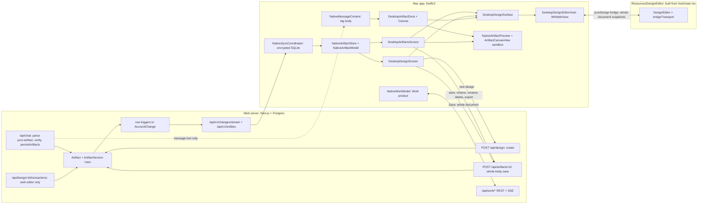

# Juno Artifacts & Design on macOS: audit

Branch `main` at `d0997af2`, 23 Sept 2026. This is a read-only audit. It synthesises eight verified audit reports: motion, Mac artifacts, Mac Design, Mac Work & parity, artifact lifecycle & data loss, scale & telemetry, public-link governance, and model-side generation quality. When this document was written, the working tree was clean apart from the untracked `docs/design/artifacts-design/`, so the findings were not affected by half-finished edits from another session.

**Status labels used below**

| Label | Meaning |
|---|---|
| confirmed | Found by an auditor, then independently re-checked by a verifier against the code. |
| found-by-verifier | Found during verification. It is evidenced from the code but was not re-checked by a second pass. |
| uncertain | Inferred or plausible, but not reproduced (no running app, no signed-in browser). |
| code-checked here | I read the code myself while synthesising, to settle a contradiction between reports. |

Paths are relative to the repo. Unless marked, Mac paths are under `native/macOS/JunoDesktop/App/` and native package paths are under `native/Packages/JunoNativeKit/Sources/`.

---

## 1. Summary

The Mac has three artifact surfaces, and none of them is aware of the others:

- The **chat dock**. It is a copy of the `<juno:artifact>` tag body carried on the message. It never looks up the stored row.
- The **Artifacts screen**. It reads synced `Artifact`/`ArtifactVersion` rows from the encrypted local store. It has versions, diff, restore, editing and Office export.
- The **Design screen**. It is a launcher plus a single document, built over the same model as the Artifacts screen but with its own draft and Save.

All three host designs through one `DesktopDesignSurface`. That surface decodes the stored JSON natively and then runs the **web design editor**, bundled into `Resources/DesignEditor` and loaded in a `WKWebView` behind a validated bridge. Work deliverables (`WorkArtifact`) are a fourth, unrelated system. On the Mac they live only inside the legacy Work product, at task › "Files & cost" › "Made".

**The foundation is sound. The shell around it is not.** What is sound:

- One editor implementation runs on web, Mac and iPhone.
- The `WKWebView` security boundary is strict: local-only load, non-persistent store, `connect-src 'none'`, navigation pinned to the bundle, and a nonce- and revision-checked bridge.
- The artifact preview sandbox fails closed.
- The version diff runs off the main thread.
- Artifacts can be read offline.

These are the right pieces for a merged surface. Everything around them is where the Mac falls down:

1. **Silent data loss is the dominant problem.**
   - Mac saves send whatever version sync last delivered as `baseVersion`, and the editor never takes in newer versions, so one ⌘S can revert Juno's or the web's changes (lost update).
   - Unsaved design and source drafts live only in SwiftUI `@State` and are dropped without a prompt on Back, on changing destination, on quit, and on remote deletion.
   - The Swift `DesignDocument` has no `cornerSmoothing` field, so every Mac or iPhone save removes it from every node.
   - On the server, editing an earlier web message, regenerating an answer, or deleting a conversation hard-deletes chat-made artifacts, their design checkpoints, comments and share links. The Mac then shows a different artifact in their place or falls back to the launcher.
2. **The chat dock is weak.**
   - A design made in chat cannot be opened in the Mac dock. The message keeps the compact authoring JSON, and the native codec requires `schemaVersion`.
   - The dock never follows a revision that reuses the same identifier.
   - HTML that loads Tailwind, fonts or images from a CDN renders unstyled on the Mac but fine on the web.
3. **The hosted editor that shipped in Mac 1.6.0 is stale and broken.**
   - It is 11 editor commits behind the web.
   - Its stylesheet lacks the shared UI primitives' classes: menus and tooltips have no surface, and buttons lose their size.
   - Its palette is indigo and zinc instead of warm coral.
   - It runs in the "embedded" layout, which hides the inspector below 1024 px. That is below the width left at the default window size.
   - Export, the Image tool, Ask Juno and rename do not work or are missing.
4. **One bad record blanks the native library.** A single artifact record with an unknown type or over 200,000 UTF-16 units makes the whole Artifacts screen show "Artifacts unavailable", and the Design screen show a false "No designs yet". This can happen today: chat-made designs are size-checked before a 5–6.5× expansion, not after it. It will also happen to every installed build once a typed Doc or Slides artifact ships.
5. **Work deliverables are close to invisible natively.** The live list drops every cloud-run deliverable because it reads the event payload without unwrapping its envelope. The durable index is read once per task open. The iPhone shows nothing. Tasks started on the Mac are unreachable on the merged web.
6. **Motion tokens are in good shape, but the Mac surfaces barely move.** The Mac surfaces have no press feedback, no hover on tiles and hard cuts between views. The canvas slides under Reduce Motion and enters on the curve the web dropped.

The **mac/liquid-glass-chat** branch fixes none of these. For these files it changes comments and icons, promotes Design to a top-level sidebar row next to Artifacts, and extends native regenerate to settled answers, which exposes the Mac to the server's artifact-deleting regenerate.

**For the merge.** The Mac is already structurally close to "Design is a typed artifact". Designs are ordinary `DESIGN` rows, and there is one design view. The blockers are also structural:

- artifact lifetime is tied to messages (server);
- the chat dock has no row behind it;
- the whole-document save goes through the generic route;
- the Swift schema is a hand-mirrored copy;
- the editor bundle is built by hand and not gated by CI;
- the store decodes all-or-nothing;
- there are no artifact share links and no comments.

---

## 2. What exists

### 2.1 Artifacts in chat

| Feature | What it does (read) | Maturity | Where |
|---|---|---|---|
| Inline artifact card | An opaque card with an icon tile, title, a mono kind/language line and an "Open" ghost button, with hover tint and `junoPress`. While streaming it shows "Writing" with a thinking matrix and cannot be opened until the closing tag arrives. It has no inline preview, unlike the web card. A DESIGN card shows the wire word "DESIGN". | solid (see defects) | `DesktopChatWorkspace.swift:1772-1860`, `:1588-1592` |
| Chat artifact dock | A trailing column beside the transcript, not a sheet. The width model is copied from the web: 46% default, 420 minimum, 82% maximum, 320 kept for the transcript, persisted in `juno.chat.canvasWidth`. It can be dragged to resize and double-clicked to reset. Below 900 pt it covers the transcript, which stays mounted so the composer and voice call survive. It closes on conversation switch and when a voice call starts. | solid | `DesktopArtifactCanvas.swift:252-511`; `DesktopChatWorkspace.swift:481-526, 635-660` |
| Dock content | Header: title, "… · From this conversation", a `ShareLink` of the **source text**, Copy Source, Save Source As…, Close. View bar: Preview / Source / Canvas. Body: read-only design, live canvas, markdown page, or a local "Edit source" `TextEditor` that is never saved. It has no versions, restore, Office export, share link or design editing, because it is built from the tag body with no row behind it. | partial | `DesktopArtifactCanvas.swift:522-880` |
| Component targeting (HTML/SVG) | A regex pulls up to 60 unique tags that carry an id or class into a "Select component" menu. "Edit" writes "Edit the <tag> element with id … Keep the rest unchanged." into the composer. The web instead lets you click the element in the live preview and has a text-selection Modify/Ask bar. | partial | `DesktopArtifactCanvas.swift:748-775, 882-951`; web `canvas-panel.tsx:1190, 1392-1411` |
| Designs in the dock | Read-only by design ("no stored row", `DesktopArtifactCanvas.swift:809-818`). For designs made in chat it fails outright; see defect H1. | broken | `DesktopArtifactCanvas.swift:817` |

### 2.2 The Artifacts screen

`DesktopArtifactsScreen.swift` is 2,121 lines. None of the Mac artifact files has changed since `db7022f5` (3 Sept), while the web canvas, library and sandbox kept changing through 23 Sept.

| Feature | What it does (read) | Maturity | Where |
|---|---|---|---|
| Grid | Header with a count. A plain `TextField` search over title, conversation, language and kind noun. A kind-filter menu listing only the kinds present. A `LazyVGrid` of 210–300 pt cards: a 4:3 live thumbnail (an inert `WKWebView` for HTML/SVG, text for others, a glyph plus "Design" for designs) and a meta line. Context menu: Copy Source, Open in New Window, Delete…. It has no list view, sort, share, rename-from-menu, New design, multi-select, keyboard navigation, hover, press or entrance motion. | partial | `DesktopArtifactsScreen.swift:366-605` |
| States | Loading; failed/offline ("Artifacts unavailable" plus Try Again); empty ("No artifacts yet"); no matches (Clear Filters); a floating glass status; "Version unavailable". | solid | `:464-486, 627-668, 720-755`; `DesktopArtifactStatus.swift:37-142` |
| Document command bar | Back ("All artifacts"); title and subtitle; Preview/Source/Canvas; Changes ⇧⌘D; Copy ⇧⌘C (source or unified diff); Reload preview; Save ⌘S; actions (Rename…, Discard, Open in New Window, Save Source As…, Export docx/xlsx/pptx, Delete…); History ⌥⌘I. All of it sits in an in-content strip. None of it is in the window toolbar or the menu bar. | solid | `:1148-1364` |
| Editing & save | Editing is not a mode. The latest version's source is bound to `draft`. Design edits come back from the editor as re-encoded JSON. Save posts `{content, baseVersion, origin}`. A 409 merges the latest version and keeps the draft. Older versions are read-only, with a glass "Viewing vN · read-only / Restore" badge. | partial | `:940-1009, 1400-1415`; `JunoChatKit/NativeArtifactStore.swift:321-355` |
| History, compare, restore | A fixed 300 pt pane, not an inspector, to avoid a documented AppKit crash. A 'Compare with' picker and a +/− summary. The diff runs off the main thread with a 1,500-line cap that matches the web, has accessible rows and scrolls on both axes. | solid | `:1016-1141, 1521-1881` |
| Detached windows | "Open in New Window" makes an 820×620 `NSWindow` holding an immutable snapshot of one version. It has no toolbar, actions, restoration or tab identity. | partial | `:1449-1473, 1921-1997` |
| Search integration | The toolbar search has an Artifacts scope. A hit opens only the conversation. iPhone selects the artifact instead. | partial | `DesktopSearchScreen.swift:399-419, 504-527`; iOS `JunoMobileRootView.swift:1328` |

### 2.3 Native previews, per type

| Type | Mac rendering (read) | Web equivalent |
|---|---|---|
| HTML | A `WKWebView` with a CSP of `default-src 'none'`, inline JS allowed, a compiled `WKContentRuleList` that blocks every `scheme://` URL, a non-persistent store, a nil base URL, and links handed to the system browser. It fails closed to "Preview unavailable". Thumbnails turn JS off and freeze motion. (`JunoChatKit/NativeArtifactPreview.swift:27-439`) | Opaque-origin iframe that **allows https scripts, styles, images and fonts** and loads Tailwind, React, Babel, Mermaid and Pyodide from CDNs (`sandbox-frame.tsx:7-12, 52-70`) |
| SVG | The same web view with JS off | ``/sandbox |
| Markdown | Native `JunoMarkdownText` on a card on every Mac surface. Thumbnails use a flattened `AttributedString`; iPhone probably does too (uncertain). | Prose at the reading measure |
| Code | Plain monospaced `Text`, or a `TextEditor` when editing. No syntax highlighting. | highlight.js; JS/Python run in a console |
| React | Source only, plus "this build does not bundle a React runtime". The injection plumbing (`ArtifactCanvasRuntime`) exists and is tested, but no runtime ships. (`ArtifactCanvasView.swift:95-122, 158-210`) | Runs (React + Babel from CDN) |
| Mermaid | Source only. `MermaidDiagramView` exists, but no engine is ever registered and no mermaid JS is bundled. (`JunoDesignSystem/MermaidDiagramView.swift:1-60`) | Renders |
| Design | The bundled editor through `DesktopDesignSurface` | The editor inside the canvas |
| Canvas mode (HTML/SVG/React) | `ArtifactCanvasView`: tabs or split layout, a read-only code pane, a sandboxed preview, and a console with a 500-line cap and error/warning badges. `inspect(path:)`, `readings` and `isBridgeConnected` are implemented and tested but not surfaced. | Console tab |

### 2.4 The Design screen and the hosted editor

| Feature | What it does (read) | Maturity | Where |
|---|---|---|---|
| Door | On main: a `DesktopSidebarDesignRow` footer row in Chat and in the legacy Work column. None in Code. The code draws `.pencil`, while the doc comment says `pencil.tip`. | partial | `DesktopDesignScreen.swift:840-892`; `DesktopChatSidebar.swift:284`; `DesktopWorkWorkspace.swift:332-347` |
| Launcher presets | Phone, Tablet, Desktop and Square tiles POST `/api/design`, then sync refresh and reload, then open the new design. A per-tile spinner and a double-click guard. Server errors are shown inline (plan 403, etc.). Wire values are pinned by tests. | solid | `:25-165, 344-369, 544-572`; `Tests/DesktopDesignLauncherTests.swift:24-60` |
| Recent list | Rows for DESIGN artifacts (title, vN, relative time), with a ⋯ Delete menu and a count. There is **no loading, offline or failed state**; the view checks only `designs.isEmpty`. | partial | `:372-403, 674-753` |
| Open document | A native command bar: All designs, title and subtitle (vN · Updated · Unsaved changes · model error), Discard, Save ⌘S, and a ⋯ menu with Delete. It has no rename, history, open-conversation, export or share. | partial | `:421-510` |
| Save | Explicit and manual: the whole document goes through `POST /api/artifacts/[id]`. There is no autosave, no offline queue and no server-side design validation. | broken (H5, H6) | `:577-582`; `NativeArtifactStore.swift:321-336`; `src/app/api/artifacts/[id]/route.ts:40-88` |
| `DesktopDesignSurface` | The one design view on the Mac. It decodes natively, refuses invalid or newer-schema documents with a stated reason, creates the host once per identity, overlays loading, unavailable and failed states, and shows a glass banner when an edit cannot be encoded. Used by the Design screen, the library (editable on the latest version), the torn-off window (read-only) and the chat dock (read-only). | solid | `DesktopArtifactCanvas.swift:972-1093` |
| `WKWebView` host | `loadFileURL` scoped to the `DesignEditor` folder, a `.nonPersistent()` store, no JS window opening, navigation pinned to the bundle, `createWebView` refused, a weak `MessageProxy`, and a transparent background via the private `drawsBackground` key. It has **no open panel, no download delegate, no content-process-termination handling, and is not inspectable** even in DEBUG. | partial | `DesktopDesignEditorHost.swift:86-123, 199-254` |
| Hosted editor | The same `DesignEditor` as the web, mounted by `host/main.tsx` with `bridgeTransport`. It includes tools, undo/redo, layers, inspector, prototype, the motion timeline and the context menu. The shipped build is stale and its CSS is incomplete (M5, H7). | partial | `src/components/design/host/main.tsx:34-75` |
| Export menu | Visible, with 9 formats plus the handoff bundle. Every item fails (M7). | broken | `design-editor.tsx:298-345, 656-682` |
| Image placement | Uses `<input type=file>`. No picker appears (M8). | broken | `design-canvas.tsx:1268-1276`; `inspector-panel.tsx:1245-1275` |
| Ask Juno / adjustments / proposal review | Not wired. The host passes no `onAskJuno`. The selection is reported over the bridge and never read. | absent | `host/main.tsx:65-71`; `DesktopDesignEditorHost.swift:53, 164-165` |
| Undo in the menu bar | Undo exists only inside the web view: ⌘Z works only while focus is in the editor root. There is no `NSUndoManager` and no Edit-menu wiring. | absent | `design-editor.tsx:410-431` |
| Bundle build | `scripts/build-design-editor.mjs`: esbuild IIFE plus a Tailwind scan, stamped with a source hash. `--check` exists. It is run by hand; only `release-ios.yml:76` checks it. The iOS app bundles the same folder. | partial | `scripts/build-design-editor.mjs:55-205` |
| Code's `.design` selection | The enum case exists but is treated as a retired destination. Nothing in Code sets it. | stub | `DesktopCodeStudio.swift:34-35`; `DesktopCodeWorkspace.swift:409-416` |
| iPhone host | A near-copy of the Mac host, 244 lines against 271. **The iPhone library edits the latest version**; the inline chat viewer defaults to read-only (code-checked here: `JunoMobileWorkspaceViews.swift:2062-2067` passes `readOnly: !isLatestVersion` with `onEdit`; `JunoMobileDesignArtifact.swift:408` defaults `readOnly: true`). The brief's "read-only on iPhone" is therefore only half right. | partial | `native/iOS/JunoMobile/App/JunoMobileDesignEditorHost.swift` |

### 2.5 Work deliverables on the Mac

| Feature | What it does (read) | Maturity | Where |
|---|---|---|---|
| "Made" durable list | Reads `GET /api/work/artifacts?sessionId=…`. Each row has a glyph, title, kind, vN and a Validated / Needs-checking chip. It lives only under the fourth thread segment, "Files & cost", below "Read and written". | partial | `DesktopWorkWorkspace.swift:3043-3121, 3315-3440` |
| Save a deliverable | Downloads bytes the server has hash-verified, then opens an `NSSavePanel`. An unvalidated file gets a confirmation first. After saving it reveals the file in Finder and shows a blocking "Artifact saved" alert. The name is generated on the Mac. | partial | `:2519-2549, 3123-3150, 3442-3458` |
| Version history | An on-demand disclosure showing bytes, origin, time, provenance and validation, with a Save per version and a 100-version truncation note. | solid | `:3382-3431`; `JunoWorkKit/NativeWorkModel.swift:702-721` |
| Event-derived "produced" rows | Reads the raw event payload. Cloud events wrap it under `artifact`, so every cloud row is dropped (H10). | broken | `DesktopWorkWorkspace.swift:4956-4977` |
| Live refresh | The index is fetched only in `loadOpenSession` (H11). | broken | `NativeWorkModel.swift:1022-1059` |
| Preview / Quick Look | Absent for every kind. `NativeFilePreview` (QuickLookThumbnailing) exists but is not wired to deliverables. | absent | `JunoChatKit/NativeFilePreview.swift:7-120` |
| Mac-hosted runs producing deliverables | Absent. `deliverablesAvailable` is never set. | absent | `native/Packages/JunoWork/Sources/JunoWorkCore/WorkCapabilityManifest.swift:76-95, 155` |
| Work ↔ conversation link | Absent. `WorkSessionSummary` has no conversation id. | absent | `JunoWorkKit/WorkContracts.swift:168-197` |

On the Mac, Work is still a third product (`DesktopProductMode.swift:4-11`), although `docs/design/TWO_PRODUCTS.md §2` merged it into Chat on the web only ("the Mac and the iPhone keep the product they have").

---

## 3. Architecture

### 3.1 Who owns what

| Layer | Implemented in | Notes |
|---|---|---|
| Artifact parsing in the transcript | Swift (`NativeMessageContent.swift:281-336`) | Mirrors the web regex parser, including its edge cases (`>` in an attribute, a literal close tag in the body). |
| Chat dock, library, Design screen, launcher, command bars, history and diff, save and conflict flow | SwiftUI | Three separate owners of draft state. |
| HTML/SVG/Code/Markdown previews, live canvas with console | Swift plus a `WKWebView` sandbox | Stricter network policy than the web (no CDNs). |
| Design editing: canvas, layers, inspector, motion, prototype, context menu, export UI | **Hosted web code** (React bundle in `WKWebView`) | Byte-for-byte the web editor as of 17 Sept. Runs in "embedded" layout. |
| Design document decoding and validation | Both. Swift `DesignDocumentCodec` decodes first, then every bridge transaction is decoded again into the Swift struct. | The Swift struct is hand-mirrored from the TS schema and has already drifted (H4). |
| Persistence of designs | Generic `POST /api/artifacts/[id]` (whole document) | The web uses `/api/design/[id]/transactions` (per-transaction validation, revisions, 30 s checkpoint folding). |
| Offline read | Encrypted SQLite projection of the `artifact` and `artifact_version` sync entities | Reads are all-or-nothing (H3). |
| Work deliverables | REST and SSE only (`NativeWorkModel`) | The 12 synced `work_*` entity types are stored but never read. |

### 3.2 Bridge protocol (v1)

- **Editor to host:** `ready {protocolVersion, editorVersion}`; `transaction {nonce, baseRevision, revision = base+1, transactionId, summary, document}`, which carries the **whole document** each time; `selection {nonce, revision, nodeIds}`; `save`, which is validated but never sent; `failure {message ≤ 2000}`.
- **Host to editor:** `window.__junoDesignHost.receive(JSON.parse('…'))` with `openDocument`, `adoptDocument`, `setSelection` and `setReadOnly`. The Mac never calls the last two.
- **Validation:** session nonce; strict `baseRevision == host revision` and `revision == base + 1`; a full Swift decode plus a hierarchy check; a protocol-version refusal. Commands are embedded as quoted JSON data, with U+2028/U+2029 and `<` escaped. When a transaction is stale or has a bad field, the host re-adopts its own copy and records the reason in `lastRefusal`, which nothing displays.
- **Missing:** theme or accent, undo state (for the Edit menu), export or save requests, an open-panel or asset request, AI proposals and comments.

Sources: `JunoDesignKit/DesignBridge.swift:23-251`, `src/components/design/host/bridge.ts:19-138`, `DesktopDesignEditorHost.swift:126-193`.

### 3.3 Sync

- **Server.** Row triggers on `Artifact`, `ArtifactVersion` and `Share` write `AccountChange` and `EntityRevision` rows (`prisma/migrations/20260716200000_account_change_log/migration.sql:116-123`). The UPDATE triggers have no WHEN clause. `/api/v1/changes/stream` polls every 2 s and closes after 55 s (`src/lib/sync-feed.ts:50-51, 118-137`). The `artifact_version` entity carries the full `content` but **no `origin`** (`src/lib/sync-entities.ts:244-258`).
- **Device.**
  1. `NativeChangeWakeupStream` receives a wake-up and calls `synchronizeWithRetry`.
  2. That pages through `/api/v1/changes`, deduplicating only within one page, and hydrates the changes through `/api/v1/entities` in batches of 100.
  3. `JunoDesktopRootView.swift:69-85` then fans out to six models. Each of them calls `repository.snapshot`, which decrypts every record in the account (`JunoStorage/SQLiteAccountRepository.swift:75-88, 546-570`).
  4. That comes to roughly 8 full decrypt passes per wake-up. A wake-up happens about once a minute even when idle (reconnect `.ready`), and up to once every 2 s while someone edits a design on the web.
  5. `NativeArtifactModel.reload` then publishes every version body of every artifact into memory (`NativeArtifactStore.swift:89-133, 252-288`).
- **Offline writes.** The `/api/v1/mutations` vocabulary has no artifact or design mutations (`src/lib/sync-mutations.ts:1-70`). Every native save needs the network.

### 3.4 Diagram



The dashed edge is the root cause of several defects (H1, H2, L16). The dock is fed only by message text and never touches `STORE`.

---

## 4. Parity with the web

W = web, M = Mac, i = iPhone. "n/a" means the audits did not cover that cell; it does not mean the feature is absent.

| Feature | Web | Mac | iPhone |
|---|---|---|---|
| Inline card in transcript | Live preview, view switch, streaming sweep. **A DESIGN card previews raw JSON with a "Live" status** (`artifact-inline-card.tsx:181`) | Compact chip, no preview, disabled while streaming | Inline sheet: view, source, share (`JunoMobileInlineArtifact.swift:1-25`) |
| Canvas or dock in the conversation | `CanvasPanel`: versions, diff, restore, fullscreen, console, Office export, share, editing, select-to-Modify | Dock from the tag body: Preview, Source, Canvas, Copy, Save Source As, ShareLink of the text. No versions, restore, export or saving of edits | Inline sheet |
| Follows a revision with the same identifier | Yes (`chat-view.tsx:871-873`) | **No** (H2) | n/a |
| Streams into the canvas | No auto-open; the card is the live view | No; the card is disabled while streaming | n/a |
| HTML runtime | https CDN scripts, styles, fonts and images allowed | **All network blocked** (H9) | Same package as the Mac, so blocked (inferred) |
| React | Runs (React + Babel from CDN) | Source plus "runtime not installed" | Same as the Mac |
| Mermaid | Renders | Source only | Source only |
| Python / JS console | Pyodide / JS console | No | No |
| Markdown | Prose | Native `JunoMarkdownText` | Flattened `AttributedString` (uncertain) |
| Code | Syntax highlighting | Plain monospaced, no highlighting | Plain source |
| Design made in chat, opened in chat | Editor in the canvas. **It breaks after the first new checkpoint** (X2) | Read-only, and **fails to decode** (H1) | Read-only inline, same decode failure |
| Artifacts library | `/artifacts`: list or grid, search, type filter, rename, delete, share, download, New design, open in conversation. **Capped at 200** | Grid only: search, kind filter, versions, diff, restore, edit, rename, delete, Office export, detached windows. No share, New design, list view or open-in-conversation | `JunoMobileArtifactsView`: search, kind filter, detail with version menu, restore, Edit |
| Versions and diff | Canvas | Library: history pane plus ⇧⌘D diff | Version menu and restore (diff n/a) |
| Edit source and save | Canvas; base version stamped at the first keystroke | Library; base version read **at Save time** (H5) | Detail "Edit" (same save model) |
| Office export | Markdown to docx/xlsx/pptx | Library | Via ShareLink |
| Public share link for an artifact | Yes (ARTIFACT kind). **A DESIGN share renders as JSON** | **None**; `NativeShareClient` is CHAT-only | None |
| Manage shared links | Settings list with an error state | `NativeSharedLinksView`; **a failure reads as "No shared links"** | Same view |
| Create a design | `/design` presets, chat, `/artifacts` New design | Design screen presets, chat | Chat only |
| Edit a design | Full editor, per-transaction autosave, Ask Juno, adjustments, proposal review | Stale bundled editor, manual whole-document Save, no Ask Juno, inspector hidden below 1024 px | Library latest version: same bundle and save model |
| Design export (SVG, PNG, PDF, HTML, React, SwiftUI, JSON, tokens, handoff) | 9 formats + handoff | **Every item fails** (M7) | Fails (same bundle) |
| Image insertion in a design | File picker | **Nothing happens** (M8) | n/a (same bundle; iOS open-panel path not audited) |
| Motion timeline / prototype authoring | Yes | Yes, in the stale bundle | n/a (open question whether it is exposed) |
| Comments on artifacts or designs | None | None | None |
| Offline | n/a | Read artifacts and designs; no edits; Work shows nothing | Same as the Mac |
| Search | Artifact content across versions; Work sessions | On-device index: titles and type only. A hit opens only the conversation | Same index; a hit selects the artifact |
| Work deliverables: view | Run panel stages only the newest site, report or spreadsheet | Work › task › Files & cost › Made, no preview | Event rows only, **always empty for cloud runs** |
| Work deliverables: download | Only the staged previewable file. **Office/PDF and older versions have no download** (X12) | Every kind and every version | None |
| Work ↔ chat | Run card in the chat | Separate Work product, no link | Separate Work tab |
| Editing an earlier message | **Destructive**: deletes later turns and their artifacts | Client-side branch; nothing is deleted | Client-side branch |
| Regenerate / Try again | Deletes the answer's artifacts and re-creates them under new ids | On main: **does nothing** on a completed answer (M16) | Same as the Mac |

---

## 5. UI/UX and native feel

**Structure**
- **Three doors to one object.** A design can be opened from the chat dock (read-only), the Artifacts library (editable, with history) and the Design screen (editable, no history). Each has its own draft and its own Save. The library cannot open the conversation that made an artifact: "in <conversation>" is plain text, and `DesktopArtifactsScreen` receives no `openConversation` (`DesktopAccountScreens.swift:98-103`). The dock cannot reach the stored copy either. The web library's primary action opens the artifact inside its conversation (`artifacts/page.tsx:529`). (confirmed)
- **Three naming tables.** The library says Page / Component / Document / Graphic / Diagram / Design (`DesktopArtifactKindName`). The chat card and dock say HTML / React / Markdown / SVG and the shouted wire word "DESIGN" (`DesktopArtifactKindLabel`), although that table's own doc comment says it exists so the two "cannot describe the same object differently". The iPhone uses a third table with different glyphs. (`DesktopArtifactsScreen.swift:2006-2037`; `DesktopArtifactCanvas.swift:153-194`; `JunoMobileInlineArtifact.swift:144-166`)
- **Stacked chrome in Design.** A native command bar sits over the web editor's own opaque toolbar, giving two full-width rows before the canvas (`DesktopDesignScreen.swift:421-438`; `design-editor.tsx:554-706`). (confirmed)
- **Stacked segmented controls in the dock.** In Canvas mode there can be three: Preview|Source|Canvas, then Tabs|Split, then Code|Preview|Console. "Preview" appears twice, in two segmented styles. (`DesktopArtifactCanvas.swift:727-733`; `ArtifactCanvasView.swift:905-933`)

**Editing semantics**
- **Explicit Save on the Mac, autosave on the web, for the same editor.** The host's own comment says "every transaction is already committed as it happens; an explicit save is a no-op" (`DesktopDesignEditorHost.swift:167-170`). The screen then needs a manual Save, and signals dirtiness only in a one-line caption. (confirmed)
- **"Edit source" in the dock invites edits that can never be written back.** It has no Save and no warning, and the draft is dropped on close, on conversation switch or on opening another artifact. The same file refuses design edits for exactly that reason (`DesktopArtifactCanvas.swift:810-816`). (confirmed)
- **Discard is one click, next to Save,** with no confirmation, and it wipes undo (M/L11).
- **Undo is not in the menu bar.** ⌘Z reaches the editor only while focus is inside its root. Edit › Undo, Cut, Copy and Paste never reflect design state. (confirmed)

**States and errors**
- **False empty states.**
  - The Design launcher shows "No designs yet" while loading or after a failed load.
  - Native Shared links shows "No shared links" on a failed load.
  - Work "Made" says "listed here as it is written" after a cloud run has produced files.
  - The Activity tab on the same Work screen says "Created <title>", so the page contradicts itself.
- **Errors on the wrong channel.** Per-action failures (save, rename, delete, export, validation) become a collection-level floating status whose "Try Again" reloads the collection. On the Design screen, the error from any model action is joined into a truncated one-line subtitle (`DesktopDesignScreen.swift:503-510`).
- **A refused bridge transaction snaps the canvas back with no explanation,** because `lastRefusal` is never shown (`DesktopDesignEditorHost.swift:185-188`).
- **Double spinner.** A native `ProgressView` is drawn over the web page's own "Opening design…" (`DesktopArtifactCanvas.swift:1049-1057`; `main.tsx:96-103`).

**Native affordances that are missing** (confirmed by grep across both screens and the dock):
- keyboard navigation of the grid, Return to open, Space for Quick Look, ⌫ to delete;
- ⌘F into the library search;
- Esc to close the dock;
- menu-bar commands for Save, Export, Rename, Delete and History, so their shortcuts are not discoverable through Help search;
- drag-out to Finder, Mail or Messages; print or PDF;
- state restoration: the library always reopens on the grid, and detached windows are not restorable;
- Handoff / `NSUserActivity`.

The dock's resize handle is hidden from VoiceOver and has no keyboard alternative; this is a documented choice.

**Layout and window management**
- The design lives only in Chat's detail column. The editor's "embedded" layout hides the inspector below 1024 px and the layers rail below 768 px, with no control to bring them back. The default window is 1240 pt and the sidebar's ideal width is 264 pt, which leaves about 975 pt (H8).
- Rail widths never persist, because they are stored in `localStorage` inside a `.nonPersistent()` store.
- Additional main windows can show two designs side by side, each with the full chrome.

**Visual design, judged against FLAT_UI and PREMIUM_AUDIT**
- **The editor looks foreign in both themes.**
  - The host palette is indigo on cold white, and its dark mode is hue-240 zinc. FLAT_UI §3.1 specifies hue-30 warm charcoal.
  - The user's accent (`JunoAccentSelection`) never reaches the editor.
  - `.text-destructive` resolves to an invalid value, because `--destructive-ink` is undefined.
  - The shared primitives' surfaces (`.surface-float`, `.overlay-glass`, `.control-primary`) are missing entirely (H7, M6).
- **The accent is used as furniture,** against FLAT_UI §2.4/§4 and against the web's own documented fix (`src/app/(app)/design/page.tsx:229-247`):
  - Design Recent rows get an accent icon tile and an accent hover stroke.
  - Preset tiles stroke in accent on hover.
  - Every Work "Made" row has a `.borderedProminent` coral Save, so N deliverables means N primary buttons.
- **Concentric radius is broken on library tiles.** The outer radius is 12 and the padding 8, so the inner radius should be 4, but it is clipped at 8 (FLAT_UI §6). The tile anatomy also differs from the web: only the thumbnail is carded.
- **HTML thumbnails are live `WKWebView`s at tile width.** A responsive page renders its mobile layout and a fixed-width page shows its corner. The web deliberately shows a source excerpt instead (`src/components/artifacts/artifact-preview.tsx:10-33`). (inferred)
- **Liquid Glass (`GlassEffectContainer` + `glassEffect`) is used appropriately,** only for transient floating status, the read-only badge and edit warnings. The command bar is an opaque in-content strip. That choice is documented and defensible, but under macOS 26 a toolbar with scroll-edge glass would feel more native.
- **Console colours are hard-coded system colours,** not Juno tokens, and the error and warning badges are bare numbers for VoiceOver (`ArtifactCanvasView.swift:938-945, 1070-1096`).

**Where the Mac already does better than the web.** In-library version history and diff with a patch-applicable unified-diff copy, Office export in the library, detached snapshot windows, offline reading, save for every kind and version of a Work deliverable, and humanised, tested error copy.

---

## 6. Liquid Glass branch (`mac/liquid-glass-chat`)

I ran `git diff --stat main mac/liquid-glass-chat` over the files audited here. The merge base is main HEAD.

| File | Change | Effect on this area |
|---|---|---|
| `DesktopArtifactsScreen.swift` | 4 lines, comments only | None |
| `DesktopArtifactCanvas.swift` | 14 lines, comments only (`366-373, 515-521`) | None. The dock still slides under Reduce Motion (`:435`). |
| `DesktopDesignScreen.swift` | 55 lines: doc comments, the icon becomes the JunoDesign `.design` mark | None of the Design defects fixed |
| `DesktopDesignEditorHost.swift` | Unchanged | — |
| `DesktopChatSidebar.swift` | Design promoted to a **top-level row next to Artifacts** (`sidebarCases [.library, .projects, .artifacts, .design]`) | Makes two separate doors to the same `DESIGN` rows more prominent |
| `DesktopChatWorkspace.swift` | Large rework. The dock now also wraps the draft and private-chat columns. `openArtifact` is still reset only on switch and close. | The dock is still built from the tag body, with the same identity bug (H2 is at `:981, 1162` on the branch) |
| `JunoDesignTokens.swift` | Timed rungs use the generated curves. New `base`/`slow`/`layout` rungs, `handoff(reduceMotion:)`, and `shift()` / `scaleFrom()`, which are the native `--motion-shift` and the correct fix for L17. | `canvasEnter` is **still** `outExpo(Duration.base)` (branch line 391), and the artifact surfaces do not call `shift()` |
| `NativeConversationStore.swift` | `regenerationContext(for:)` lets Try again / Switch model regenerate any settled last answer | Fixes M16, but sends native regenerate into the server's **artifact-deleting supersede** (X3) until the server rule changes |
| `DesktopWorkWorkspace.swift` | Settings routing, greeting type, comments. Work becomes `.legacyWork`. | Every deliverable defect survives |

The redesign document on that branch (`docs/native/MACOS_LIQUID_GLASS_REDESIGN.md`) is being edited by another session; it grew from 1,861 to 1,879 lines during the audits. It plans:

- Phase 5: a Work run card in the transcript, with deliverable tiles showing Quick Look thumbnails that open the canvas dock, and an Outputs popover.
- A canvas dock with server export, a versions popover with diff, and bundled React and Mermaid.
- Share and New design on the Artifacts page.
- Design as a navigation row, with its own redesign "out of scope".

Its Errata #14 says designs draw inline on the Mac. That is **unverified, and contradicted by H1** for designs made in chat. It probably holds only for row-backed opens from the library or Design screen. The plan does not address:

- how a text-only dock renders binary docx/pptx/xlsx deliverables;
- WorkArtifact and Artifact unification;
- native artifact share links;
- comments;
- the iPhone.

**Implication.** The branch is where a merged dock would naturally land. Shipping it as it stands would harden the three-door model (the Design row next to Artifacts) and widen exposure to X3. The dock rework is the right moment to make the dock row-backed.

---

## 7. Motion

### 7.1 Product motion on the Mac

| Observation | Where | Status |
|---|---|---|
| The token system is strong. One ladder (6 durations, 9 curves) in `globals.css:314-349` is generated into framer (`src/lib/motion.ts`) and Swift (`JunoGeneratedDuration`/`Easing` → `JunoMotion`). The editor host's hand-copied ladder is pinned by `tests/design-host-motion-tokens.test.ts`, which passes. | `JunoDesignTokens.swift:204-530` | confirmed |
| Dock: 16 pt offset plus fade in, fade out, driven by `withAnimation(canvasEnter/exit)`. Under Reduce Motion, `JunoMotion.reduced(.travel)` only swaps in a 160 ms ease-out and **cannot remove the offset**, so the pane still slides. One report said the dock "honours reduced motion"; the code says otherwise. | `DesktopArtifactCanvas.swift:433-439`; `JunoDesignTokens.swift:398-409` | confirmed; code-checked here |
| `canvasEnter = outExpo(Duration.base)`. The web replaced ease-out-expo with ease-drawer because it "read as a lurch that then hung". Its doc comment claims parity with the web. | `JunoDesignTokens.swift:343`; web `chat-view.tsx:2493-2496` | confirmed |
| Inline chat card: a hover tint cross-fade on `JunoMotion.fast` (tint tier) plus `.junoPress`. Correct. | `DesktopChatWorkspace.swift:1847-1853` | confirmed |
| Library, history pane, status control and read-only badge: **no hover, press, stagger or disclosure motion**. Library ↔ document is a hard cut (`if libraryVisible … else`). The only animation is `.animation(standard, value: showingChanges)`. | `DesktopArtifactsScreen.swift:226-233, 488-549, 699-704` | confirmed |
| 10 × `.buttonStyle(.plain)` across the artifacts, design and canvas files, and 0 × `.junoPress`. The token file's own doc says `.plain` on macOS gives no press feedback. ICONS_AND_MOTION §2.2 rules 1, 2 and 5 require a tonal hover, a tonal press on large surfaces, and lists that are "dealt, not dumped". | `DesktopArtifactsScreen.swift:413, 537, 998, 1156`; `DesktopDesignScreen.swift:449, 653, 716, 873`; `DesktopArtifactCanvas.swift:613, 657` | confirmed |
| Design screen: launcher ↔ document is a hard cut. The Recent list is dumped, not dealt. The error notice's `.transition(.opacity)` never plays, because there is no animation driver. The sidebar row hovers on a spring (`JunoMotion.standard`), where the law says a fast tonal cross-fade. | `DesktopDesignScreen.swift:250-257, 320-322, 389-393, 782, 875-876` | confirmed |
| Design surface: loading → editor pops in with no cross-fade; the edit-warning banner appears without a transition. | `DesktopArtifactCanvas.swift:1015-1058` | confirmed |
| Work "Made": rows appear with no entrance; History disclosure is instant; Save swaps label for spinner in one frame; segment switches cut. | `DesktopWorkWorkspace.swift:3055-3103, 3061-3069, 3354-3358, 2640-2665` | confirmed |
| Nothing loops while idle. | — | confirmed |
| No card→panel continuity (no shared-element morph from the card into the dock) on either the web or the Mac. | `DesktopArtifactCanvas.swift:433-439` | confirmed |
| **Editor-side motion on the Mac lags the web.** The shipped bundle has no `svg.icon[data-motion]` hover gestures and no rail-tab indicator growth, and because the recipe classes live in unscanned `src/components/ui`, it also lacks `animate-pop-in`, `animate-tooltip-in` and `animate-pop-out`. Menus and tooltips cut in and out on the Mac. | `Resources/DesignEditor/editor.css`; `host/editor.css:176-233`; `scripts/build-design-editor.mjs:171-172` | confirmed |
| Reduce Motion inside the editor: the host CSS carries the tiered overrides plus a `.pressable` reset. This is stricter than the web, where about 20 raw `.pressable` controls still scale (L22). | `host/editor.css:93-155` | confirmed |

### 7.2 Motion *inside* Design documents (web code that ships to the Mac through the bundle)

The keyframe timeline covers 13 absolute properties and linear, three named, cubic-bezier and spring easing, with closed-form solving. The preview is a pure derived document that is never committed. The Prototype tab authors 7 triggers, 10 actions and 5 transition kinds. **There is no prototype player.** Only the HTML export runs motion; the React and SwiftUI exports print a note instead.

On the Mac, the export itself fails (M7), so every export-side motion defect below is currently moot there. The preview-side defects apply fully. The editor-motion defects are listed in §8.3.

---

## 8. Defects

Defects are ranked by severity, then by how much they affect the Mac. The ID column gives the source report's ID for traceability. Where several reports found the same defect, the entries are merged and all IDs listed.

### 8.1 Mac and native: high

| # | Defect | Where | Status | ID |
|---|---|---|---|---|
| H1 | **Designs made in chat cannot be opened in the Mac dock or the iPhone inline viewer.** A valid compact design has no repairable problems, so the verifier leaves the message body in compact form (no `schemaVersion`). Only the stored version is expanded. `DesignDocumentCodec.decode` throws `.notADocument` without an Int `schemaVersion`. The dock shows "This design can't be opened", and its Save Source As writes a file the Mac itself cannot open. | `src/lib/chat-artifact-verification.ts:151-161`; `DesktopArtifactCanvas.swift:817`; `JunoDesignKit/DesignDocumentCodec.swift:44-50`; iOS `JunoMobileInlineArtifact.swift:62-65` | found-by-verifier; code-checked here (codec and verifier paths); not run in the app | mac-artifacts/missed-1 |
| H2 | **The dock keeps showing the previous revision** when a revision that reuses the identifier is opened. `openArtifact` gets a new value with the same `id`, so `.onChange(of: artifact.id)` never fires and `draftContent` still holds v1. Preview, Source, Canvas, Copy, Save As and Share all use v1, and a design stays on v1. A "Reset" button appears with nothing to explain it. | `DesktopArtifactCanvas.swift:552-565, 865-867, 409-413`; caller `DesktopChatWorkspace.swift:635-639` | confirmed | mac-artifacts-1 |
| H3 | **One out-of-contract record blanks the native Artifacts and Design destinations.** An unknown `type`, or content over 200,000 UTF-16 units, throws `corruptRecord` for the whole snapshot. Try Again re-reads the same rows. The Artifacts screen shows "Artifacts unavailable"; the Design screen shows a false "No designs yet". **This can happen today:** chat-made designs are size-checked on the compact body and then expanded with no second check. Measured expansion is 5.05–6.5×; a 39–41 KB compact design is stored at about 197–266 KB. It will certainly happen on installed builds once a typed Doc or Slides artifact ships. | `JunoChatKit/NativeArtifactStore.swift:102, 111-112, 144-147, 157, 283-287`; trigger `src/lib/artifacts-store.ts:16-25, 86`, `src/lib/chat-artifact-verification.ts:63` | confirmed (+ post-expansion trigger found-by-verifier, measured) | mac-artifacts-11, mac-work-parity-5, scale-6, mac-artifacts/missed-2 |
| H4 | **The Swift `DesignDocument` has no `cornerSmoothing` field,** so every Mac or iPhone save strips it from every node. The Mac never draws it either, because `openDocument` is re-encoded from the Swift struct. The round-trip fixture predates the field (6 Aug against 15 Aug). | `JunoDesignKit/DesignDocument.swift:478-537` (struct, keys), `:541-690` | confirmed | mac-design-1 |
| H5 | **Lost update on native saves.** `baseVersion` is read from the sync-updated model at Save time. The design surface reads `content` once and never adopts newer versions. A remote v6 lands while the canvas shows v5, and ⌘S then silently supersedes v6. The 409 copy says "The latest version has been loaded", but the canvas never shows it, which invites a second overwriting Save. Restore has the same problem. | `NativeArtifactStore.swift:321-355`; `DesktopArtifactCanvas.swift:972-980`; `DesktopDesignScreen.swift:425-435, 574-582`; `JunoChatKit/NativeArtifactAPIClient.swift:192-193` | confirmed (+ misleading copy found-by-verifier) | mac-design-2, lifecycle-7, mac-design/missed-2 |
| H6 | **Unsaved design edits are silently discarded** on All designs, on changing destination (the screen is one arm of a `switch`), on re-appear (`.onAppear { closeDesign() }`), on ⌘Q, and on remote deletion. There is no dirty guard, autosave or persisted draft. | `DesktopDesignScreen.swift:215, 258-264, 444-446, 520-523` | confirmed | mac-design-3, lifecycle-6, lifecycle/missed-3 |
| H7 | **The bundled editor stylesheet lacks the shared UI primitives' classes.** Tailwind scans only `src/components/design/**` plus `icon-swap.tsx`, and the host CSS defines no component classes. The shipped `editor.css` contains 0 matches each for `display:inline-flex`, `.size-8{`, `whitespace-nowrap`, `surface-float`, `overlay-glass`, `z-popper`, `animate-pop-in`, `control-primary` and `.bg-selected`. Inferred rendering: menus, tooltips, popovers, the Ask Juno bar and the zoom control have no fill, border or shadow; icon buttons collapse to glyph size; primary buttons have no fill. A rebuild alone does not fix this. | `scripts/build-design-editor.mjs:171-172`; `src/components/design/host/editor.css`; `src/components/ui/tooltip.tsx:59`; `menu-recipe.ts:68-71` | confirmed (rendering uncertain, inferred from missing rules) | mac-design-5, motion/missed-1, scale/missed-host-css |
| H8 | **The hosted editor runs in the "embedded" layout.** The inspector is hidden below 1024 px and the layers rail below 768 px, and their collapsed stubs and grips are hidden too, so there is no way back. The default 1240 pt window minus a 264 pt sidebar leaves about 975 pt, so the inspector is missing at the default size. | `src/components/design/host/main.tsx:65-71`; `design-editor.tsx:169, 549-550, 714-870` | confirmed (widths inferred from defaults) | mac-design-11 |
| H9 | **HTML artifacts that load CDN scripts, styles, fonts or images render broken on Mac and iPhone.** The web explicitly allows these, after finding that blocking them made sites "not load and not move". The system prompt does not tell models to avoid CDNs. This is a deliberate security choice, but it is a parity break for the most common artifact type. | `JunoChatKit/NativeArtifactPreview.swift:111-118, 163-176`; `ArtifactCanvasView.swift:1234-1249`; web `sandbox-frame.tsx:30-34, 52-70` | confirmed | mac-artifacts-2 |
| H10 | **Event-derived Work deliverables drop every cloud-run artifact.** The reader looks for `artifactId` on the raw payload, but the cloud runner nests it under `artifact`. The lifting helper `WorkEventPayload.fields` exists and is used by the same file's Activity tab. The iPhone has no other source, so its "Made" is always empty. | `DesktopWorkWorkspace.swift:4956-4977`; iOS `JunoMobileWorkView.swift:2237-2257`; runtime `runner/agent-core/src/work/session.ts:580-589` | confirmed | mac-work-parity-1 |
| H11 | **The durable deliverable index is read once per task open.** Nothing in the stream, the 30 s poll or `.done` re-reads it, and re-selecting the same task is a no-op. A watched run therefore ends on "No documents yet". | `JunoWorkKit/NativeWorkModel.swift:1038, 963, 1051-1059, 617` | confirmed | mac-work-parity-2 |
| H12 | **Tasks and deliverables started on Mac or iPhone are unreachable on the merged web.** They carry no `conversationId`. The web drops such sessions from recents, and `/work/<id>` and search hits redirect to an empty `/chat`. | `JunoWorkKit/NativeWorkClient.swift:361-405`; `src/lib/work/recents.ts:173-179`; `src/lib/work-url-migration.ts:185-187` | confirmed | mac-work-parity-3 |

### 8.2 Mac and native: medium

| # | Defect | Where | Status | ID |
|---|---|---|---|---|
| M1 | Unsaved library edits (source or design) are silently lost when you open another card or leave the destination. Going Back and reopening the same card keeps them. | `DesktopArtifactsScreen.swift:234-236, 514-517, 252-256` | confirmed | mac-artifacts-3 |
| M2 | Deleting the open artifact, or a remote deletion, lands the reader inside a **different** artifact's document with its editor active. There is no success feedback. | `NativeArtifactStore.swift:264-269, 364-365`; `DesktopArtifactsScreen.swift:234-261, 321-323` | confirmed | mac-artifacts-5, lifecycle-6 |
| M3 | The dock re-runs the component regex over the whole source twice per render and compiles two `NSRegularExpression`s per tag. Measured at about 99 ms per body evaluation on 150 KB of repetitive HTML (`swiftc -O`). Typing in "Edit source" lags (inferred). | `DesktopArtifactCanvas.swift:748-750, 877-879, 914-943` | confirmed | mac-artifacts-7 |
| M4 | An offline Save on the Design screen shows "Your changes are saved and will sync when you're back online" when nothing was saved. The draft is then lost on leaving. | `DesktopDesignScreen.swift:508`; `NativeFailureMessage.swift:52-55, 66-67` | found-by-verifier | mac-artifacts/missed-3 |
| M5 | **The shipped editor bundle is stale.** `node scripts/build-design-editor.mjs --check` exits 1 (expected `9cc1cfa8d4fe`, shipped `2b86e5baaf9d`). The bundle was last built in `2fa09d35` (17 Sept), and 11 editor commits (+1,161/−491) preceded the Mac 1.6.0 release commit `0a3087fe`, which changed only version files. Only `release-ios.yml:76` runs the check; `release-macos.sh`, `release-macos.yml` and `native.yml` do not. The hash covers only `src/lib/design`, `src/components/design` and `icon-swap.tsx`, while the bundle compiles 13 other sources. A HEAD rebuild is 1.66 MB against 0.95 MB (+75%), 577 KB of it Phosphor icons. | `scripts/build-design-editor.mjs:55-78, 190-202`; `Resources/DesignEditor/index.html:21` | confirmed (`--check` re-run by the verifier; hash coverage found-by-verifier) | mac-design-4, motion-14, scale-11, scale/missed-editor-hash |
| M6 | The host's colour tokens are indigo and zinc, not warm coral, although the file header claims "the same values". `--primary-ink`, `--destructive-ink` and `--shadow-soft` are used but undefined, so `.text-destructive` is invalid. The user's accent never reaches the editor. | `src/components/design/host/editor.css:4-6, 15-35, 67-85` | confirmed | mac-design-6 |
| M7 | **Every Export item fails in the Mac and iPhone editor.** A relative `fetch('/api/design/…/export')` from `file://` runs under `connect-src 'none'`, with the document id instead of the artifact id, and there is no download handling. The Design screen offers no other export. | `design-editor.tsx:299-305, 656-682`; `host/main.tsx:66`; `DesktopDesignEditorHost.swift:209-214` | confirmed | mac-design-7 |
| M8 | The Image tool and the inspector's image picker do nothing, because there is no `runOpenPanelWith` `WKUIDelegate` method. There is no drag-and-drop from Finder either. | `DesktopDesignEditorHost.swift:199-234`; `design-canvas.tsx:1268-1276` | confirmed | mac-design-8 |
| M9 | Native design saves bypass design validation. The generic `POST /api/artifacts/[id]` stores any string up to 200,000 characters. The transactions route calls itself "the only write path". A drifted native codec (see H4) is therefore accepted without complaint. | `src/app/api/artifacts/[id]/route.ts:7-16, 60-68`; `src/app/api/design/[artifactId]/transactions/route.ts:17-27` | found-by-verifier; related governance-12 confirmed (low) | mac-design/missed-1 |
| M10 | The Design launcher ignores `model.phase`. It says "No designs yet" before the model loads, on a fresh install, or when the load throws. If H3 applies, each preset press creates a server-side design whose "will appear here as soon as this Mac finishes syncing" never comes true, so repeated presses leave orphan designs. | `DesktopDesignScreen.swift:371-379, 553-563` | confirmed (low) + escalation found-by-verifier | mac-design-10, mac-work-parity/missed-1 |
| M11 | The suggested save file name replaces every "0" with "-". `"/\\:\\0"` is a backslash followed by the digit zero, not NUL, so "Q3 2026 forecast (v10)" becomes "Q3 2-26 forecast (v1-)". | `DesktopWorkWorkspace.swift:3142-3146` | confirmed | mac-work-parity-6 |
| M12 | Plan and citations are empty on Mac and iPhone for every cloud run, from the same raw-payload bug as H10. The doc comment at `:4712-4715` claims every reader unwraps the envelope. | `DesktopWorkWorkspace.swift:4666, 4850-4858`; iOS `JunoMobileWorkView.swift:2029, 2139-2148` | confirmed | mac-work-parity-7 |
| M13 | iPhone: an unsaved design draft is cleared silently whenever `currentVersion` changes remotely. | `native/iOS/JunoMobile/App/JunoMobileWorkspaceViews.swift:2165-2169` | confirmed | lifecycle-8 |
| M14 | **Sync cost grows with history, not with what changed.** Each wake-up runs about 8 full-store decrypt passes. An idle Mac reloads about once a minute. Every web checkpoint fold writes 2 change rows and makes every device re-download the full version body, which is estimated at 135–400 MB per device per hour of active web editing (inferred upper bound). | `JunoStorage/SQLiteAccountRepository.swift:75-88`; `JunoSync/NativeChangeWakeupStream.swift:228-229`; `migration.sql:116-117`; `src/lib/sync-entities.ts:244-258` | confirmed (+ idle reload found-by-verifier) | scale-4, scale-5, scale/missed-native-idle-full-reloads |
| M15 | Native Shared links shows "No shared links" when loading fails, including a nil client or account and one undecodable row. | `JunoChatKit/NativeShareClient.swift:82-94, 159-162`; `NativeSharedLinksView.swift:34-39, 109-111` | confirmed | governance-10 |
| M16 | On main, Mac and iPhone Try again / Switch model do nothing on a completed answer: the retry context is removed when the turn completes. The Liquid Glass branch fixes this, but see X3. | `JunoChatKit/NativeConversationStore.swift:1747-1751, 1928-1930` | found-by-verifier | lifecycle/missed-1 |
| M17 | A native branch edit sends no topology to the server. The model's context includes the abandoned branch, and both branches share one artifact row. | `NativeConversationStore.swift:2380-2393`; `src/app/api/chat/route.ts:1853-1861` | found-by-verifier | lifecycle/missed-4 |

### 8.3 Hosted-editor defects (shared web code, present on Mac and iPhone through the bundle)

| # | Defect | Where | Sev | Status | ID |
|---|---|---|---|---|---|
| E1 | Delete/Backspace with a keyframe selected deletes the selected **layers** and their tracks. In WKWebView, focus stays on the canvas, so the path is reached. | `design-editor.tsx:410-482`; `motion-panel.tsx:683-722` | medium | confirmed | motion-11 |
| E2 | The canvas preview ignores x/y tracks on auto-layout children, which the export moves (reproduced). | `motion-model.ts:365-374` | medium | confirmed | motion-6 |
| E3 | Keyframes beyond the duration play in the preview but are folded into 100% in the export, silently (reproduced). | `src/lib/design/export.ts:836` | medium | confirmed (moot on Mac while M7 stands) | motion-9 |
| E4 | Authored prototype transitions reach no runtime. Navigation is an instant `hidden` toggle, and nothing reports this. | `export.ts:1198-1201` | medium | confirmed (moot on Mac) | motion-2 |
| E5 | HTML prototype: "After a delay" timers start at page load for every frame; key triggers fire from hidden frames; "Play in reverse" sticks to the element. | `export.ts:1204-1233, 1187` | medium | confirmed (moot on Mac) | motion-3, motion-5 |
| E6 | Keyframe diamonds cannot be selected from the keyboard, and their labels omit the track. | `motion-panel.tsx:683-722` | medium (a11y) | confirmed | UX finding in motion report |
| E7 | Preview/export mismatches: scale origin depends on track order; scale does not scale text glyphs or radius; springs snap at the next keyframe. | `motion-model.ts:400-416, 485-500, 329-343` | low | confirmed (reproduced) | motion-7, -8, -10 |
| E8 | Playback re-renders the whole editor and re-serialises the page SVG every frame. The server caps documents at about 300–400 nodes (about 1 ms per frame in Node); WKWebView cost is unmeasured. | `design-canvas.tsx:177-193, 1078` | low | confirmed (jank uncertain) | motion-12 |
| E9 | Undoing "Animate <property>" leaves an empty track that the header + button then refuses to recreate. | `src/lib/design/operations.ts:1555-1559` | low | confirmed | motion-13 |

### 8.4 Mac and native: low

| # | Defect | Where | Status | ID |
|---|---|---|---|---|
| L1 | Action failures (save, rename, delete, export, validation) take over the collection-level phase, and "Try Again" reloads the collection. Pressing Return in Rename bypasses the empty-title guard. | `NativeArtifactStore.swift:447-459`; `DesktopArtifactsScreen.swift:645-657, 1372-1385` | confirmed | mac-artifacts-4 |
| L2 | Opening the library fetches the detail of the auto-selected first artifact. A 404 floats over the grid, and a successful fetch overrides an offline or failed phase. | `DesktopArtifactsScreen.swift:234-247`; `NativeArtifactStore.swift:269, 295-311` | confirmed | mac-artifacts-6 |
| L3 | "Open in New Window" uses a view mode leaked from the previously opened artifact, or the old selected version, and never the draft. | `DesktopArtifactsScreen.swift:1449-1473` | confirmed | mac-artifacts-8 |
| L4 | DESIGN appears as the shouted wire value "DESIGN" in the chat card, the dock header and VoiceOver. | `DesktopArtifactCanvas.swift:168-178` | confirmed | mac-artifacts-9 |
| L5 | Version origin badges (Edited, Restored, Generated) vanish on the next sync, because `origin` is not synced. | `src/lib/sync-entities.ts:244-258`; `NativeArtifactStore.swift:162-168, 265` | confirmed | mac-artifacts-10, mac-work-parity-11, scale-15 |
| L6 | Clearing the dock's source editor makes Preview, Copy, Save As and Share revert to the original content, and Reset disappears. | `DesktopArtifactCanvas.swift:865-871` | confirmed | mac-artifacts-12 |
| L7 | Edits made while a save is in flight drop out of the dirty state. | `DesktopDesignScreen.swift:577-582` | confirmed | mac-design-9 |
| L8 | Any non-fatal JS error (window `error`, `unhandledrejection`) permanently covers a working editor with "Design editor unavailable". | `host/main.tsx:126-133`; `DesktopDesignEditorHost.swift:172-173`; `DesktopArtifactCanvas.swift:1050-1054` | confirmed (trigger frequency uncertain) | mac-design-12 |
| L9 | A crashed WebContent process leaves a blank pane with status "ready", because `webViewWebContentProcessDidTerminate` is not handled. | `DesktopDesignEditorHost.swift:199-234` | confirmed | mac-design-13 |
| L10 | Discard throws away all unsaved work in one click, sits next to Save, and remounts the editor, losing undo. | `DesktopDesignScreen.swift:470-476` | found-by-verifier | mac-design/missed-3 |
| L11 | Work "Made" Retry clears a download or history error without retrying it, and a failed history load spins forever. | `DesktopWorkWorkspace.swift:3105-3118, 3425-3430` | confirmed | mac-work-parity-8 |
| L12 | Write failures in the save panel are swallowed and look like a cancel. | `DesktopWorkWorkspace.swift:3451-3456` | confirmed | mac-work-parity-9 |
| L13 | Concurrent deliverable downloads overwrite the single in-flight flag. | `NativeWorkModel.swift:50, 733-734` | confirmed | mac-work-parity-10 |
| L14 | iPhone downloads the durable deliverable index on every task open and never renders it. | iOS `JunoMobileWorkView.swift:913-947` | found-by-verifier | mac-work-parity/missed-3 |
| L15 | The dock is never reconciled against transcript deletions. | `DesktopChatWorkspace.swift:503-508, 634-639, 656-660` | confirmed | lifecycle-14 |
| L16 | The dock slides 16 pt under Reduce Motion. | `DesktopArtifactCanvas.swift:433-439` | confirmed; code-checked here | motion-17 |
| L17 | The dock enters on ease-out-expo, the curve the web dropped. | `JunoDesignTokens.swift:343` | confirmed | motion-18 |
| L18 | No press feedback (10 × `.plain`), and no hover on artifact tiles. | see §7.1 | confirmed | motion-20 |
| L19 | Design rows and preset tiles hover with an accent stroke. | `DesktopDesignScreen.swift:621-624, 735-742` | confirmed | motion-21 |
| L20 | The Design notice's opacity transition never runs. | `DesktopDesignScreen.swift:320-322, 782` | confirmed | motion-23 |
| L21 | The same editor buttons press differently under Reduce Motion on web and Mac: about 20 raw `.pressable` controls still scale on the web. The parity test compares only the first rule. | `src/app/globals.css:~1072-1074`; `host/editor.css:145-155`; `tests/design-host-motion-tokens.test.ts:100-104` | confirmed | motion-24 |
| L22 | Native Shared links copy and rows describe artifact shares as conversations ("Untitled conversation"), and a `''` title renders blank. | `NativeSharedLinksView.swift:38, 61` | found-by-verifier | governance/missed-3 |
| L23 | OpenAPI `ArtifactKind` has no DESIGN, and `/api/design`, `/api/share` and `/work/artifacts/{id}/preview` are undeclared. | `contracts/openapi/juno-native-v1.yaml:1866-1868` | confirmed | mac-work-parity-12 |

### 8.5 Server and web defects the Mac inherits, or that block the merge

| # | Defect | Where | Sev | Status | ID |
|---|---|---|---|---|---|
| X1 | **Editing an earlier web message hard-deletes every later chat-made artifact**, with its hand edits, `/design` checkpoints, design comments and public share links. There is no warning. The Mac receives tombstones and triggers H6 and M2. | `src/app/api/messages/[id]/route.ts:38-40` | critical | confirmed | lifecycle-1 |
| X2 | **The web chat Canvas design editor breaks after the first new checkpoint.** `onCommitted` appends a version with `content: ""`, the editor is keyed by `selectedVersion` and remounts on `""`, and it shows "Design document is not valid JSON". Code sessions are affected too. | `src/components/canvas/canvas-panel.tsx:1236-1253, 313-315, 369-370` | high | confirmed by code trace (not reproduced in a browser) | motion-1, lifecycle-10, scale-3 |
| X3 | Regenerate hard-deletes the last answer's artifacts. A re-emitted identifier becomes a **new row with a new id**, which breaks share links, `/design/<id>` and Mac selections and drafts. The branch sends native regenerate here. | `src/app/api/chat/route.ts:2566-2574`; `src/lib/artifacts-store.ts:48-50, 76-89` | high | confirmed | lifecycle-2 |
| X4 | Deleting a conversation, or all of them, cascades to hand-started designs and their share links. The dialogs mention only messages, and "Delete all" also removes Code sessions. | `src/app/api/design/route.ts:69-90`; `src/components/app/app-sidebar.tsx:2268-2273`; `data-privacy.tsx:106, 118-121` | high | confirmed (+ Code sessions found-by-verifier) | lifecycle-11, lifecycle/missed-5 |
| X5 | Chat revisions work from stale message history, never the current version, so manual Mac edits are silently reverted. A DESIGN revision rebuilds the document from the compact form, deleting components, variables, effects, motion, interactions and comments. | `src/app/api/chat/route.ts:1852-1861`; `src/lib/design/authoring.ts:161-203`; `src/lib/chat/system-prompt.ts:257, 291` | high | confirmed | model-3, model-4, model/missed-2 |
| X6 | The `image` node type the compact DESIGN form advertises always refuses the whole design. A fenced (```json) body and any non-hex colour are also refused. | `system-prompt.ts:286`; `src/lib/design/operations.ts:571-575`; `authoring.ts:33, 216-221` | high | confirmed (+ colours found-by-verifier) | model-2, model-6, model/missed-4 |
| X7 | A truncated artifact (length finish, Stop, budget halt) is saved as the current version. The receipt says "Artifact verified", and the stored message gets a synthetic closing tag. | `src/lib/message-content.ts:100-113, 139-150`; `chat-artifact-verification.ts:60-106` | high | confirmed | model-1, model/missed-1 |
| X8 | Every design transaction, and every artifact or design read, loads every version body, twice per commit. Version storage is unbounded and unmetered on every plan. Enough rows can push the single Node process past its PM2 1400M restart. | `src/lib/design/store.ts:33-39, 163-167, 193-197`; `deploy/ecosystem.config.js:127` | high | confirmed | scale-2, governance-3 |
| X9 | After the merge, the web chat has **no download for Office/PDF deliverables or older versions**. "N more files under Outputs" points at a popover that does not list them. | `src/components/work/detail/work-deliverable-stage.tsx:33-44, 74-77` | high | confirmed | mac-work-parity-4 |
| X10 | Public shares of a banned user keep serving. There is no admin takedown, and public artifact content is never moderated. | `src/lib/share.ts:135-139`; `src/app/api/artifacts/[id]/route.ts:40-90` | high | confirmed | governance-1, governance-2 |
| X11 | Model re-emission overwrites the title and type: user renames are lost, and a DESIGN can turn into HTML, after which `/design/<id>` 404s. | `src/lib/artifacts-store.ts:63-67` | medium | confirmed | lifecycle-9 |
| X12 | A DESIGN inline chat card, and a DESIGN share, render raw JSON. | `artifact-inline-card.tsx:181`; `src/components/share/shared-artifact-viewer.tsx:32` | medium | confirmed | motion-15, scale-8, governance-5 |
| X13 | The chat thread ships every artifact version body on every load and every recovery poll: 9–27 MB raw (0.3–0.7 MB gzipped) for a design edited for an hour. | `src/lib/queries.ts:117-121`; `src/lib/serializers.ts:207-223` | medium | confirmed | scale-1 |
| X14 | Share snapshots are not frozen. In-place message edits and design checkpoint folds within 30 s leak into public links. | `src/lib/share.ts:196-199, 257-260`; `store.ts:185-188` | medium | confirmed | governance-4, scale-7 |

### 8.6 Uncertain / unverified

| Item | Why it is uncertain |
|---|---|
| ⌥⌘I is bound both to Artifacts "Version history" (`DesktopArtifactsScreen.swift:1296`) and to Session › Toggle Side Panel (`DesktopCommands.swift:194`, disabled outside Code). A disabled menu item may swallow the key. | Needs a manual check |
| Whether ⌘S, ⇧⌘C and ⇧⌘D reach the SwiftUI buttons when the `WKWebView` is first responder, and whether ⌘G, ⌘D and ⌘A reach the page before any native menu equivalents. | Needs a manual check |
| WebKit may report "ResizeObserver loop completed…" as a window error, which would make L8 fire in normal use (`design-canvas.tsx:220-221`). | Not observed |
| The default WKWebView context menu may offer "Reload" over the editor chrome, which would reset undo and in-editor state. | Not observed |
| How many WebContent processes a `LazyVGrid` of about 200 HTML thumbnails keeps alive. | Not profiled |
| After Save, `refresh()` then `reload()` may briefly revert to the old version if the pull has not landed (`NativeArtifactStore.swift:417-421`). | Timing not traced |
| Liquid Glass Errata #14: "designs draw inline on the Mac". | A document claim only. Contradicted by H1 for designs made in chat. |
| Work approval card `.transition(.opacity)` probably pops in, because nothing supplies an animation (`DesktopWorkWorkspace.swift:2482-2501`). | Inferred |
| Playback stutter in WKWebView on real documents (E8). | Only Node timings measured |
| Whether the iPhone read-only host exposes the Motion toolbar and timeline. | Only grepped |

---

## 9. Gaps

1. **The chat dock has no row behind it.** `NativeArtifact` carries `conversationID` and `identifier` (`NativeArtifactStore.swift:8-21`), so the row is findable once it has synced. Without it the dock has no versions, compare, restore, save, rename, export, share link or editable design, and no fullscreen, click-to-select, Modify/Ask bar or "View last good version", all of which the web canvas has.
2. **Runtime parity with the web.** React needs a bundled runtime (the plumbing exists). Mermaid needs an engine (`JunoMermaidEngine.register` is never called). Python, CDN assets and syntax highlighting are also missing.
3. **Artifact share links on native.** The server supports `ARTIFACT` shares (`src/app/api/share/route.ts:18-22`), but `NativeShareClient` does not.
4. **Comments.** `DesignComment` exists in the type and schema, but no operation, UI, API or sync entity uses it, on any platform.
5. **AI on the Mac canvas.** No Ask Juno, adjustments or proposal review, and no bridge command for a proposal. The selection the editor already reports is ignored.
6. **Design-screen parity.** No rename, history, restore, open-conversation, share or export. No autosave or offline queue.
7. **Bridge channels.** No theme or accent, undo state, export or save request, open-panel or asset request, or comments.
8. **Native Mac affordances.** Quick Look, drag-out, keyboard grid navigation, menu-bar commands, print/PDF, document windows with a toolbar, state restoration, Handoff.
9. **Work deliverables.** No preview or Quick Look, no deliverables from Mac-hosted runs, no iPhone download, and no library, search or share for `WorkArtifact` on any platform. The 12 synced `work_*` entities go unused.
10. **Code door and handoff.** Code has no way into Design, and the handoff bundle cannot be produced on the Mac, although the launcher promises "hand to Juno Code" (`DesktopDesignScreen.swift:297-299`).
11. **Typed artifacts beyond DESIGN.** The host is hard-wired to one bundle, one message handler and one document type.
12. **Telemetry.** `src/lib/observability.ts` is imported by nothing. Bridge refusals (`lastRefusal`) and editor crashes stay local. 409/413 responses are not logged. Nobody can say which editor bundle version users run.
13. **Tests** for everything the Mac screens do: see §11.

---

## 10. Tech debt

| Debt | Where | Why it matters |
|---|---|---|
| The document contract is hand-written twice (TS and Swift). The generated JSON schema exists but is not used for Swift, and the round-trip fixture is frozen at 6 Aug. | `JunoDesignKit/DesignDocument.swift`; `contracts/design/design-document.v1.schema.json` | Has already caused H4. Generate the Swift, keep unknown fields as opaque JSON, or test against a fresh maximal document. |
| A generated 950 KB `editor.js` is committed and rebuilt by hand. The hash inputs are a hand-maintained list, and the "current" test never compares the hash. | `scripts/build-design-editor.mjs:55-88`; `tests/design-host-bridge.test.ts:77-98` | Causes M5. Needs an Xcode build phase or CI gate plus a size budget. |
| The host stylesheet is a hand-mirrored subset of `globals.css`, held together by a regex test that compares only the first rule. | `host/editor.css:1-233`; `tests/design-host-motion-tokens.test.ts:84-104` | Causes H7, M6 and L21. Build it from the token and component layers instead. |
| The Mac and iPhone editor hosts are near-duplicates that have already diverged (refusal handling, read-only guards, ready gating). | `DesktopDesignEditorHost.swift`; `JunoMobileDesignEditorHost.swift` | Move the core into `JunoDesignKit`. |
| Three owners of design draft state: library, Design screen and dock. | `DesktopArtifactsScreen.swift:940-947`; `DesktopDesignScreen.swift:207-240, 577-582` | Every conflict or dirty-state fix has to be made two or three times. |
| One error and phase channel for load, open, save, rename, delete and export. | `NativeArtifactStore.swift:201-206, 447-459` | Per-action recovery is impossible without splitting it (L1, L2). |
| Duplicated vocabulary: two Mac naming tables, one iOS table, three filename sanitisers, and two view-mode enums (Mac and iOS). | `DesktopArtifactsScreen.swift:2006-2121`; `DesktopArtifactCanvas.swift:70-111, 160-248`; `NativeArtifactAPIClient.swift:415-423`; iOS `JunoMobileDesignArtifact.swift:360-395` | The merge needs one kind registry in JunoChatKit. |
| Strict, all-or-nothing native decoding. | `NativeArtifactStore.swift:101-167` | Contradicts the sync allowlist's own forward-compatibility rule. Blocks new types (H3). |
| The only read API is a whole-store snapshot; no per-namespace or per-key query. | `JunoStorage/AccountScopedStorage.swift:160-161` | Causes M14. |
| Copy-paste twins of the Work log readers (Mac and iOS) and preview fixtures with payload shapes no executor writes. | `DesktopWorkWorkspace.swift:4956-4977`; `JunoPreviewSupport/PreviewWorkFixtures.swift:443-460` | This is how H10 and M12 escaped screenshots. |
| `DesktopWorkWorkspace.swift` is 5,297 lines. | — | Phase 5 must extract the thread subviews from it. |
| Dead or unwired code: the `save` bridge message, the `setSelection`/`setReadOnly` commands, `host.selection`, `lastRefusal`, `editorVersion`; `ArtifactCanvasModel.inspect`; `DesktopArtifactMetrics.tile`; `mode = .preview` set twice. | `DesignBridge.swift:43, 155-158`; `DesktopDesignEditorHost.swift:53, 59, 132-138`; `DesktopArtifactsScreen.swift:241-252, 1503-1507` | — |
| Stale comments: Design "reached from the brand menu"; "every navigation column (Chat, Code and Work)" with `pencil.tip`; the launcher test says Code has its own copy. | `DesktopCodeStudio.swift:34`; `DesktopDesignScreen.swift:810-852`; `Tests/DesktopDesignLauncherTests.swift:92-118` | — |
| The private KVC `drawsBackground`, and `isInspectable` not set even in DEBUG, although `main.tsx` documents weeks lost to "Script error.". | `DesktopDesignEditorHost.swift:106`; `host/main.tsx:113-127` | — |
| The navigation policy uses a bare `hasPrefix` with no trailing separator. | `DesktopDesignEditorHost.swift:212-214` | Low risk; compare path components instead. |
| `requireIdentifier` accepts `/ . : @` in ids that are interpolated into URL paths. | `NativeArtifactAPIClient.swift:387-396` | Low risk; ids come from the account's own synced data. |
| A `WKWebView` and ephemeral data store per preview or thumbnail. | `NativeArtifactPreview.swift:346-371` | Unbounded WebContent processes (inferred). |

---

## 11. Tests and health

**Commands run by the auditors (all pass unless noted):**

| Command | Result |
|---|---|
| `node scripts/build-design-editor.mjs --check` | **FAIL**, exit 1: "bundle is stale (expected 1.0.0+9cc1cfa8d4fe)". The verifier re-ran it with the same result. |
| `tests/design-host-bridge.test.ts`, `tests/design-host-motion-tokens.test.ts` | 10/10. They pass *despite* the stale bundle, because neither compares the hash or the colour and component classes. |
| design motion, motion-export and host-token tests | 48/48 |
| `design-export`, `design-canvas-interaction` | 62/62 |
| sync-work-entities, envelope, index, work-contract, native-work-contract, native-contract, artifact-export-verification, chat-artifact-verification | 49/49 |
| `chat-stages`, `bubble-editor` | 22/22 |
| design-operations, chat-artifact-verification, sync-entity-envelope, design-editing | 52/52 |
| field-encryption-coverage, chat-moderation, ownership-guard, artifact-edit, csp, sandbox-security, design-editing | 82/82 |
| design-authoring, chat-artifact-verification, design-ai, artifact-edit, system-prompt-sections, answer-completeness, provider-limits, auto-model | 68/68 |

`tests/chat-artifact-verification.test.ts:19-32` enshrines the unsafe SVG "repair" (X7).

**Swift tests exist but were not run** (building is forbidden in this audit):
- `DesktopArtifactComponentTests`: 2 tests.
- `DesktopArtifactStatusTests`: 7 tests.
- `DesktopDesignLauncherTests` and `DesktopDesignRoutingTests`.
- `JunoDesignKit` tests: `DesignBridgeTests` and `DesignRoundTripTests`. The round-trip fixture predates `cornerSmoothing`.
- `NativeArtifactStoreTests`: pins the fail-closed behaviour.
- `ArtifactCanvasTests`: 26 tests.
- `NativeMessageContentTests`.
- One UI smoke test: library → document → back (`UITests/JunoDesktopLaunchUITests.swift:377-411`).
- `JunoDesignTokensTests`.

**Not covered anywhere:**
- the dock, including reopening with the same identifier;
- view-mode availability;
- kind labels (DESIGN is missing);
- draft, save, restore, delete and navigation behaviour on either screen;
- data loss on navigating away;
- the host's navigation policy and adopt-on-refusal path;
- export and file-picker behaviour in the host;
- the bundle's CSS completeness;
- any end-to-end or offscreen snapshot test of the `WKWebView` editor (the project memory favours offscreen snapshot tests; none exist for this pane);
- decoding enveloped Work payloads;
- the Work refresh cadence;
- `artifactFileName`;
- store behaviour with one oversized or unknown record;
- the private diff engine (it is `private`, so it cannot be unit-tested).

**Health signals.**
- The Mac artifact files have not changed since 3 Sept, while the web kept changing, so drift is growing.
- The bundle in the shipped 1.6.0 was 11 commits stale.
- There is no telemetry to show whether any of this is hurting users.

---

## 12. Scorecard

| Dimension | Score | Justification |
|---|---|---|
| Capability | **4 / 10** | The library does more than the web library (history, diff, Office export, detached windows, offline read). Against that: designs made in chat don't open in the dock; React, Mermaid and CDN-based HTML don't render; there is no share link, design export, image insertion or Ask Juno; and Work deliverables have no preview. |
| UX | **3 / 10** | Three doors to one object with three draft models; silent loss of drafts; false empty states; two stacked toolbars; an inspector that disappears at the default window size; almost no keyboard or menu-bar integration. |
| Visual design | **4 / 10** | The native chrome is tidy and uses Liquid Glass with restraint. The hosted editor has the wrong palette, missing surfaces and collapsed buttons, and the Mac rows use the accent as furniture and break concentric radii. |
| Motion | **4 / 10** | A best-in-class generated token ladder with a parity test. The artifact and design surfaces are nearly static; the dock slides under Reduce Motion on the dropped expo curve; the stale bundle lacks the web's menu, tooltip and icon motion. |
| Reliability | **3 / 10** | Several high-severity silent data-loss paths (lost update, discarded drafts, `cornerSmoothing` stripped, server cascades), a store that fails closed on one record, and a stale editor that shipped. The sandbox and bridge fail safely. |
| Code health | **5 / 10** | The security boundary and bridge validator are excellent and tested. Against that: a hand-mirrored schema and CSS, duplicated hosts and vocabularies, dead bridge surface, a 5.3k-line Work file, and screens with no tests. |

---

## 13. What this means for merging Artifacts and Design on the Mac

The target is the model Anthropic shipped on 16 Sept 2026. Design, Docs, Slides and Design System become typed artifacts, living inside conversations, at one shareable link, editable on the phone, with comments. The Mac is structurally closer to that than it looks: designs are already ordinary `DESIGN` rows in the shared `NativeArtifactModel`, and every entry point already goes through one `DesktopDesignSurface`. What stands in the way is ownership, identity and plumbing, not the rendering. The recommended order:

**0. Server prerequisites (without these, a merged Mac surface would only multiply the damage).**
- Separate artifact lifetime from messages. Add a direct owner. Stop using `messageId` as a delete key in edit and regenerate. Keep one id when an identifier is re-emitted. Make title and type sticky. Use soft delete with a trash. Shares should pin a version id, not a time. Conversation delete should detach artifacts, not cascade (X1, X3, X4, X11, X14).
- Put the **current** stored version into the model's context, and route natural-language follow-ups through the existing patch and operation pipelines instead of full re-emits (X5).
- Enforce the size cap after normalisation, and drop the empty-content stub in the web canvas (H3 trigger, X2).
- Hold this until the server rule changes: do not ship the Liquid Glass branch's native regenerate change (see §6).

**1. Make native decoding forward-compatible, and ship that first.**
- Decode unknown kinds into a generic "unsupported" kind, and skip oversized or corrupt records instead of failing the snapshot (H3). This has to be in users' hands **before** the server emits a new type, because every installed build breaks otherwise.
- Sync `origin` (L5).

**2. Stop the drift machines.**
- Generate the Swift `DesignDocument` from the JSON schema, or carry unknown fields opaquely (H4).
- Gate `design:editor:check` in `native.yml` and the Mac release. Hash every compiled input. Add a size budget, which the Phosphor icons would already exceed.
- Build the host CSS from `globals.css`'s token and component layers (M5, H7, M6).
- Pass `surface="window"` to the hosted editor (H8).

**3. One save protocol and one editor host.**
- Move native design saves to `/api/design/[id]/transactions`: per-transaction base revision, server validation, checkpoint folding and autosave. Retire the whole-document generic POST for DESIGN (H5, M9).
- Have the host call `adoptDocument` when newer versions arrive. Persist drafts to disk, keyed by (artifact, base version), and never clear one silently (H6, M1, M13).
- Extend the bridge with host-mediated export and save (`NSSavePanel`), an open panel for images, theme and accent, undo state for the Edit menu, and proposal and comment channels (M7, M8).
- Move the host core into `JunoDesignKit` so the Mac and iPhone share it.

**4. Make the chat dock a view of the stored row.**
- Look up `model.artifacts` by (conversationID, identifier), and fall back to the tag body only until sync lands.
- This fixes H1 (it opens the expanded stored design) and H2 (it follows `currentVersion`). It also brings versions, save, export, share and design editing into the conversation, which is exactly what "Design works inside conversations" needs.
- The Liquid Glass dock rework is the natural place to do it.

**5. Collapse the doors.**
- Fold the Design screen into Artifacts: a type filter plus a "New design" action, as the web `/artifacts` already offers.
- The dock and the library document view become the same component at two widths.
- Add a two-way link between an artifact and its conversation.
- One kind registry and one view-mode enum in JunoChatKit, replacing three naming tables.
- Prefer this over keeping Design as a fourth sidebar row, which the branch currently promotes.

**6. One link, and comments.**
- Add `ARTIFACT` shares to `NativeShareClient`, and a public DESIGN renderer. The server's `exportSvg` can draw it; it also needs a capability-scoped asset path.
- Add a comment model outside the version body: rows keyed by artifact and anchored to a node or range.
- Add governance before links become first-class: ban → suspend, admin takedown, report intake, rate limits and quotas (X10, X8).

**7. Runtime parity, so "one link" looks the same everywhere.**
- Decide the Mac sandbox policy for https CDNs (H9).
- Ship the React and Mermaid runtimes the plumbing already expects.
- Use static thumbnails, not live web views.

**8. Work deliverables.**
- Fix the envelope readers and live refresh (H10–H12, M12).
- Give native Work sessions a conversation link.
- Decide between a unified "made things" index over `Artifact` and `WorkArtifact`, or folding deliverables into typed artifacts with binary-backed versions.
- Either way, the dock needs a Quick Look path for binary kinds that the Liquid Glass plan leaves unspecified.
- Restore Office downloads in the web chat (X9).

**Net.** The expensive-to-build parts are already right and shared: the editor, the bridge, the sandbox, the versioned row model and offline read. The merge is mainly a matter of making the artifact row, rather than the message, the unit of identity. Once that holds on the server and in the Mac dock, Artifacts and Design on the Mac become one surface almost by construction. Until it holds, every step toward "Design inside conversations" also widens the ways a user's work can disappear.
