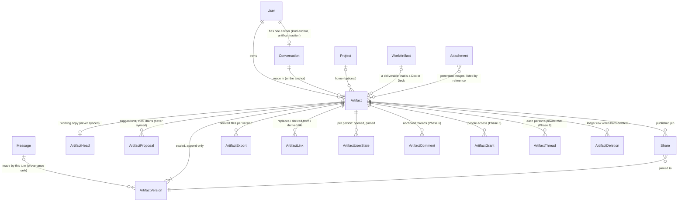
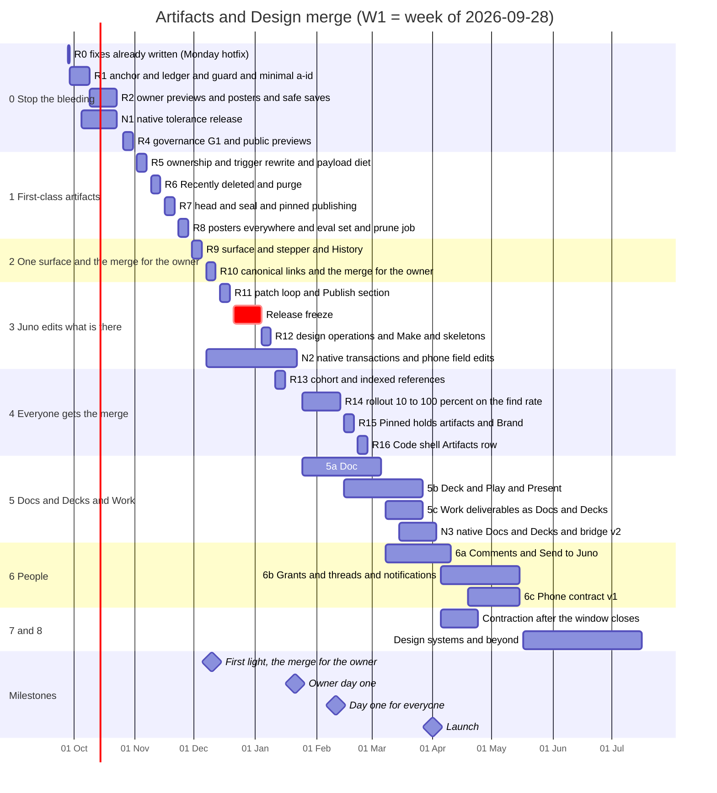

# Artifacts and Design, merged: the plan

September 2026. Juno makes things in two places that should be one: artifacts, which live and die with chat messages, and Juno Design, which is a destination with its own door, its own editor window and its own way of saving. The owner asked for them to merge "like Claude did recently". This document is the plan for that merge. It is written as the decision. The choices only the owner can make are collected in §14.2: eight product decisions, each a yes or no with a default and a week to decide by, then the engineering defaults the owner may override.

`FLAT_UI.md` stays the material law, `PREMIUM_AUDIT.md` §3 the composition law, `ICONS_AND_MOTION.md` the icon and motion law, and `TWO_PRODUCTS.md` the product-level decision this one sits beside. Where this plan amends one of them, it says so and records the amendment in `docs/OPEN_DECISIONS.md`.

**Basis.** `main` at `7f92324f`, read only. In flight elsewhere and assumed, not redone: the X-03/X-04 fix on `claude/agitated-elion-a15fe9` (`7243613f`, not merged or deployed); the Mac Liquid Glass branch `mac/liquid-glass-chat`, whose Phase 2 stage 3 (`2b1049c5`: row-backed card and dock through `ChatArtifactResolver`, designs drawn from the stored row, a closed Mac sandbox, a regenerate confirmation) is the commit N1 cherry-picks, and whose head has since moved to `ff906c12` (Stage 4 preparation); separate sessions that may land X-01 and X-02.

**Revision.** This version answers a red-team review of the first draft (engineering and design). The Review log at the end lists every issue and what changed.

**Evidence.** `00-AUDIT-OVERVIEW.md` (X-01…X-33, §4 fragmentation, §12 preconditions, §13 questions), `01-AUDIT-WEB.md` (D/M/L ids), `02-AUDIT-MAC.md` (H and Mac M/L ids), `03-COMPETITIVE-AUDIT.md` (patterns U/A/V/C/S/L/E/N, motion M1–M16, §8 what not to copy), `research/claude-primary-evidence.md`, the consolidated backlog R-001…R-101, three independent proposals and three judges' reports. Code facts marked **(checked)** were re-read for this plan.

**Id conventions.** `X-nn` cross-cutting defects (00 §7). `Dn`, `Mnn`, `Lnn` web defects (01 §6). `Hn` and "Mac `Mn`" Mac defects (02 §8). `R-nnn` backlog items. `Wn` is a calendar week: **W1 is the week of Monday 2026-09-28.**

---

## 0. How this plan was built

Three proposals were written independently and scored by three judges (product design, engineering risk, strategy and scope). None was right on its own.

- **The spine is the risk-first plan.** It scored highest overall (133 of 180 across the three lenses) and won two of them. It is the only plan with dates, and the only one that gets real losses stopped inside two weeks without breaking an installed Mac or iPhone build. From it this plan keeps the dated release train, the protections for installed clients (§3.7), the deletion ledger, the X-01 split into an owner half and a public half, the field-preserving save that protects Mac 1.6.0 users with no native release, capability-projected sync, `canAccess` shadow-compare, and the rule of at most one navigational change per release.
- **The product shape is the Claude-faithful plan.** It won the product-design lens. From it this plan keeps Claude's order (data, then surface, then the AI loop, then the new types, with the Design door removed last), the type charter, the AI editing loop, the "deliberately not copied" list, Work deliverables split by shape, 307 redirects until launch, and a non-overshooting curve for the one motion the user causes (now a snapshot morph, §10.2).
- **The surface and the Mac are the object-first plan.** It drew the best artifact view and the best native plan. From it this plan keeps the full window as a stage with one leading and one trailing pane, the panel running the editor's compact band, one layout for `/a/{id}` whatever the door, the composer that keeps its draft and focus across sizes, the change-capture trigger rewrite, persisted proposals, the Phase 0 re-emit guard, the Mac document window built from plain panes, the account-level client gate for new kinds, per-person threads for collaborators, and the `/dev/artifacts` gallery.

Every must-fix the judges raised is answered; Appendix A maps each one to the section that answers it. Where the proposals disagreed, this plan chose as follows.

| Question | This plan | Why it beat the alternative |
|---|---|---|
| Base structure | Risk-first release train, with the Claude-faithful phase order inside it | The Claude-faithful plan had no calendar and would have failed at its own N2/N3 steps (a missed sync trigger, an impossible backfill order). The risk-first plan pushed everything Juno leads on into one overloaded late phase. Its train carries the product order well once that phase is split (§13). |
| Doc, Deck and Design System | **New `ArtifactType` values** (`DOC`, `DECK`, later `DESIGN_SYSTEM`), created only for accounts whose every recent device can read them, hidden from older builds, and refused as write targets from them | Profiles on old types (risk-first) capped fidelity for the whole programme: a Doc with no block ids can only be commented on by quote, and speaker notes became a hidden text node. Down-converting on read (Claude-faithful) let an old Mac write Markdown back over a typed Deck. A write-side gate cannot corrupt anything. |
| Where a detached artifact lives until old builds are gone | **One hidden "Your artifacts" conversation per account** (`kind: "anchor"`), plus the sync-trigger rewrite in Phase 1 regardless | A null `conversationId` now blanks every installed native library (X-09 class). Omitting such rows for old builds (Claude-faithful) makes a design vanish from the Mac the moment its chat is deleted on the web. One anchor per chat (risk-first) needed a conversion contract and an undefined "flip" rule. One anchor per account needs neither: it never has messages, never becomes a chat, and the first Ask moves the one artifact into a new chat (§3.5). |
| X-01 and governance | **Split.** Owner-only previews on the separate origin in W4 (R2), every preview response sandboxed by its own CSP header (§9.5); scripted public pages only with governance and a screening pass over legacy shares | The Claude-faithful plan held the largest outage behind quotas, a legal contact and view counts. Owner-only previews are no more exposed than a local file, provided a preview URL opened on its own cannot run as a page. |
| What "day one" means | Three named moments with dates: **First light** (the merge for the owner: the new surface and the Artifacts home with no Design door, W11), **Day one** (Juno editing what is there, for the owner W17, for everyone by W20), **Launch** (Docs and Decks, W27) | Two of the proposals contradicted themselves about when the owner's day one was. Naming the moments ends that, and the owner sees the merge they asked for eight weeks sooner. |
| Where Juno's unaccepted work lives before the loop | **Outside the version list**: a minimal `ArtifactProposal` table from M0 (R1) holds the R1 guard's suggestions and R2's stopped drafts; a version is appended only when a person applies or keeps one | Every write path, including the one Mac 1.6.0 and the iPhone use, numbers the next version `currentVersion + 1`, and share snapshots resolve by time. A non-current version breaks both (§2.7). |
| The Design row on Day one | **None.** `/design` redirects, the Artifacts row carries a one-time line, ⌘K keeps "Design" as an alias | A pointer row is 03 §8 #7 shipped for ten weeks, it splits selection between two rows, and removing it later is a second forced change (§4.1). |
| Redirects | **307** until 30 days after Launch, then 308 | Browsers cache 308s, so the risk-first "flag off restores the old page" rollback would not have worked for anyone who had already been redirected. |
| Panel to full window motion | **A snapshot morph** (View Transitions) on `duration-slow`, `ease-drawer`, the shape of Claude's one morph; live content takes its size at the first frame behind a cross-fade; the transcript fades; the composer cross-fades and keeps its draft and focus. **No morph from card to panel** | framer `layout` animates by scale, which stretches the sandbox iframe, the canvas and the textarea (ICONS_AND_MOTION §2.2 rule 8), and `layoutId` leaves a hole in the transcript. A card-to-panel morph crosses a scroller, which PREMIUM §2d forbids in the other direction too. Text re-wrapping through a width tween is jank. |
| The send circle while Juno is writing | **Stays send ⇄ stop** (FLAT_UI §4). The placeholder reads "Steer this design…", Enter queues the steer, and only the button's accessible name changes, as `work-thread-composer.tsx` already does **(checked)** | All three proposals turned Send into a "Steer" button, which gives the circle a third verb. |
| Full window layout | **Stage plus one leading tabbed pane plus one trailing pane**, one layout at `/a/{id}` whatever the entry point; the app sidebar hides. Recorded as an editor amendment to PREMIUM rule 2 (§6.2, P8), not read into it | The Claude-faithful drawing had four columns (against PREMIUM rule 2) and two layouts for one URL, so a reload changed what the reader saw. |
| Panel layout | **The editor's compact band**: the canvas plus a bottom tool row that turns into the selection's controls, with nothing floating over the canvas, and a one-time "Open full window for layers and inspector ⌘⇧↩" hint | Full rails need about 464 px in a 449 px panel (M17, R-017). A bar that pops over the selection is what U8 and 03 §8 #16 rule out. |
| The Mac Design row | **Drop it from the glass plan before the glass release**; the pre-glass Mac keeps its Design screen until then | Shipping the row, repointing it and removing it (risk-first) is three navigation changes for one outcome, and 03 §8 #7 says not to ship it at all. The glass release has not reached users, so dropping the row costs nothing. |
| Mac Grid/List shortcut | **View menu, no ⌘1/⌘2** | ⌘1/⌘2 are Chat and Code in the glass plan (glass §1.4). |
| Where a collaborator's Ask runs | **In their own private thread** (Phase 6) | Routing it into the owner's chat runs a collaborator's request with the owner's private context and shows them the reply (R-073). |
| Transcript references instead of stored bodies | **Rejected as a storage migration.** Context assembly elides old bodies instead, and new messages are saved in the legacy tag form until the compatibility window closes (§3.7 E) | Rewriting encrypted `Message.content` is a destructive migration of user data, and old Mac builds draw their dock from the tag body. |
| Oversized version bodies | **Stay in the row.** Images move to an asset store; the 200k cap stays per document | Blanking `content` for big rows (object-first) changes the meaning of a column old clients decode. |
| Holder chats made by `/api/design` | Move the design into the account anchor, delete the empty holder row, keep a restorable log. The predicate matches what `/api/design` writes: `titleSource "manual"`, zero messages, exactly one DESIGN **(checked)** | The object-first predicate (title "Untitled design") matched almost nothing and then deleted conversations. |
| The version stepper, compare and restore | **Ship with the surface** (Phase 2) | They were in the risk-first "parity" phase, which would have made day one parity-minus with Claude on the one thing Juno already leads. |
| iPhone design editing | **Text and colour field edits kept from N1 (W4)**, on N1's base-version fix and the server's field-preserving save; everything else read-only until N2 (W17), with no month in the copy (P7) | Thirteen weeks read-only gives up the one lead neither Claude nor Figma has (03 §1 #10), and the two reasons for it (X-14, X-15) are already fixed by R2 and N1. |
| When Docs and Decks arrive | After the Design door closes (the owner at R10, everyone through R14), with Markdown upgraded to Doc in one pass at their launch | This is Claude's order: one home first, then the new types, with no two generations of a type left side by side (03 §8 #3). |
| The Make picker's mark | **A mark at the start of the field**, the way Deep research is armed today (PREMIUM_AUDIT §2d; `composer.tsx` draws armed marks over the start of the field **(checked)**) | The proposals put it "beside `+`", citing FLAT_UI §4, which §2d superseded. |

---

## 1. Thesis, principles and day one

### 1.1 Thesis

**The conversation is where things are made. The artifact is what you keep. Design is a type, not a place.**

Juno already did the hard part of this merge at the storage layer, by accident: a design is an `Artifact` row with `type DESIGN`, sharing versions, share tokens, the library and sync with pages, code and diagrams (00 §1.1; `prisma/schema.prisma` **(checked)**). What Juno lacks is the lifecycle and the surface. Its made things behave like attachments of chat messages:

- they die when a message is edited or regenerated, or a chat is deleted (X-03, X-04, X-22);
- the model rewrites them from its memory of old message text, not from their current state (X-05, X-06);
- a stopped or cut-off revision becomes current and is labelled "verified" (X-07);
- a design shows as raw JSON everywhere outside an editor (X-20);
- one design has four editors with two save semantics (00 §4.4), and the Mac draws a different copy (the tag) from the library (the row) (X-11, X-12);
- deliverables live in a parallel universe (X-25 to X-29).

The merge therefore makes three moves, in this order:

1. **The artifact becomes the unit of identity.** It has an owner, a home, a stable id, immutable versions, a working copy and a trash. No chat gesture deletes it.
2. **It gets one surface in several sizes.** A card in the reply, a panel beside the conversation, a full window, a public page and a phone sheet are one component keyed by the artifact's id. Design is a type in that surface, not a destination with its own door.
3. **The conversation becomes the only way Juno changes it.** Juno reads what is actually there and proposes targeted changes that a person can review, apply and undo.

Anthropic staged its own merge the same way: one home for projects and artifacts (2026-07-07), account-owned versioned artifacts (08-19), and only then the merge, with Docs and Slides, and the mode toggle removed last (09-16) (03 §2.3).

### 1.2 Principles

1. **Nothing made is destroyed as a side effect.** Editing, regenerating, forking or deleting a chat never deletes an artifact. A hard delete happens only through "Delete now" in Recently deleted, the 30-day purge, or account deletion, and a database ledger records the reason for every one (§3.4).
2. **One object, one id, one surface.** Card, panel, full window, public page and phone are one `ArtifactSurface` mounted by artifact id. A version is data, never a React key or a SwiftUI identity. That sentence is the root fix for X-02, X-11 and X-12.
3. **Types, not places.** A new type exists only when its document root or the way people consume it differs: a canvas of frames, a flow of blocks, a sequence you present, a running page, a token set. Design, Prototype, Motion, Inspect and Present are modes, never types or destinations (R-008; Figma's rule, 03 §3.3).
4. **Juno edits what is there, not what it remembers.** Every turn reads the current version and writes a targeted change against it. A field a person changes while Juno works keeps the person's value, and Juno says so; what the person asks for in the turn overrides their own earlier edits to the fields it names (§8.3, R-009).
5. **Every made thing has a picture.** A server-rendered poster on every card, tile, row, share page, unfurl and Quick Look. JSON never appears by default (R-014).
6. **Every type ships whole.** No type ships without versions and the stepper, the trash, a poster, a phone line, native decoding and, once comments exist, a comment-only role. This is Claude's most-cited gap turned into a release gate (03 §8 #1).
7. **Public is a deliberate act and ships with its safeguards.** Sharing with people and publishing to the web are separate. A published link is a pinned version. No scripted public page exists without takedown, report and egress control (R-011, R-012, R-015).
8. **Old clients see old shapes, and every step is measured and reversible.** A shape an installed build cannot decode never reaches it. Every behaviour sits behind a flag with an owner, a deciding metric and a removal date. Each release changes at most one thing a person can see in navigation.

### 1.3 Three moments, with dates

| Moment | When | Who | What is on |
|---|---|---|---|
| **The bleeding stops** | R0–R2, W1–W4 (R0 on Monday 2026-09-28; all of it by 2026-10-22) | Everyone | Losses stop; previews run again for their owners; designs are pictures, not JSON (§1.4) |
| **First light: the merge, for you** | R9–R10, W10–W11 (2026-12-10) | The owner, then the internal cohort at R13 | `/a/{id}`, the new panel and full window, posters everywhere, the version stepper and History, and the Artifacts home with no Design door (`ia.merged` for the owner). Nothing is announced |
| **Day one** | Owner W17 (2027-01-21); everyone by W20 (2027-02-11), gated on the find rate | The owner first, then 10 → 50 → 100% | The merged product with Juno editing the current version and the Make choice in the composer. A Brand for new designs follows in February (R15) |
| **Launch** | W27 (2027-04-01) | Everyone | Docs and Decks, Play and Present, deliverables as Docs and Decks, Markdown upgraded to Docs. Redirects become permanent 30 days later |

**Why the owner sees the merge at R10, not W17.** The Artifacts home and the `/design` redirect need only `/a/{id}`, posters, X-24 and the X-02 fix, all done by R9. Nothing ties them to the editing loop, so the owner gets the thing they asked for (no Design door, design as a type, one home) eight weeks before the loop, and the cohort rollout still waits for the find rate (P5).

### 1.4 The first four weeks (R0–R2)

The owner notices little on screen, and the obvious losses stop:
- A hand-edited design survives fixing a typo two messages up, and a regenerate keeps the same artifact and its public link (`7243613f`, deployed in R0 on the first Monday).
- A chat follow-up that would throw away a hand edit, or drop a design's components, animations or interactions, arrives as "Juno's suggestion is waiting · Compare · Apply" instead of replacing the work, and the design stays editable from every device while it waits (X-05, X-06 containment).
- Deleting an old chat, from any device, says "3 artifacts made here stay in Artifacts" and keeps them, with their project and their images; each still opens.
- A Tailwind or React page in the owner's own chat previews live again (X-01, owner half).
- A design made in chat appears in the transcript, on library tiles and on its share page as a picture (X-20).
- A cut-off revision never becomes current (X-07 core).
- A Mac 1.6.0 save no longer strips `cornerSmoothing`, with no Mac update needed (X-14).

### 1.5 Day one, as the owner will see it (W17)

1. **Sidebar.** Chat reads New chat · Search · Library · Projects · **Artifacts** · More. There is no Design row. The old `/design` bookmark lands on Artifacts filtered to Designs, with the four presets pinned above the grid, and the Artifacts row carries a one-time line, "Designs are here now". ⌘K still answers "Design". (The owner has had this since First light.)
2. **Artifacts.** A grid of real pictures: design covers, app captures, diagram drawings. Type chips with counts, a search that finds text inside things, "Last edited" sort, **New ▾** with Design ▸ Phone, Tablet, Desktop, Square, Portrait, Custom, and App. Recently deleted in the header.
3. **Asking.** "Design a sign-in screen for the Juno iPhone app. Warm, quiet." The reply opens with one line. A card reads **Design · Sign-in screen** and "Making a design · 1 of 2 screens". The panel docks beside the transcript without taking focus. Hairline frame outlines at 390×844 appear after half a second and fill in as operations land. There is no JSON anywhere. By the end of the exchange the design is at v3.
4. **Editing by hand.** The owner selects the button in the panel. The panel's bottom tool row turns into the button's controls (Fill · Radius · Ask · ⋯), and nothing pops over the canvas; the owner sets the radius to 12. The stepper now reads "‹ v3 · edited ›": the change is saved in the working copy, not as a rewritten version.
5. **Following up.** "Make the title bigger and the CTA quieter." Before Juno reads anything, the owner's edits seal as **v4, "Your edits"**, and Juno reads v4. Because the design has hand edits, the change arrives as a **suggestion**: "Quieter CTA, larger title · 4 layers · v4 → v5 · Apply · Discard". The canvas draws the four layers with the suggestion's dashed outline and its "Juno · suggestion" tag; pressing and holding **Before** (or B) shows v4. Apply makes **v5, "Juno: quieter CTA, larger title"**, as one entry on the owner's ⌘Z, and Juno's one sentence says it kept the owner's 12 px radius. The CTA's colours did change, although the owner had touched that button, because the request named them; the radius did not, because it did not (§8.3). Every exchange after a hand edit therefore adds two versions, yours and then Juno's.
6. **Expanding.** ⌘⇧↩ grows the panel into the full window at `/a/{id}`. The app sidebar and the transcript fade out as the surface grows, the composer fades back in at the foot of the leading pane with its draft and focus, Layers is one tab away, the inspector sits on the right. Undo, selection and zoom survive, because it is the same mount. ⤡ Collapse, or Esc once nothing is selected, returns to the chat where it was.
7. **Versions.** "‹ v5 ›" opens History: every version with a thumbnail, who made it (You, Juno, a restore) and where it was asked (this chat, another chat), with "From this message". Viewing v2 is read-only in the same renderer. Compare shows v2 and v5 side by side in the full window (in the panel, as an onion overlay). Restore as v6 never loses v5.
8. **Sharing.** Opening Share writes nothing. **Publish v5** shows exactly what becomes public, then the header's Share reads **Published** with a filled globe. Copy link gives `/a/{id}`, which now opens the published v5 for anyone. After another edit the dialog says "Published v5 · v6 has changes · Update to v6".
9. **Phone.** The link opens the Juno iPhone app on a sheet. The design pinches and pans; text and colour edit through fields; Ask takes voice or text with the selection.
10. **Mac.** Since N1 the chat card and the dock draw from the stored row, so they never disagree with the library. On the glass release the dock gains the same one-row header as the web, and ⌘-click opens the design in its own restorable window.
11. **Tidying.** Deleting the chat keeps the design. Deleting the design moves it to Recently deleted; its public link answers "This page isn't shared any more" until it is restored, with the same URL.
12. **Tasks.** A delegated "pricing spreadsheet and a one-page brief" finishes; its files appear in the run card and under Artifacts › Files.

**Not there yet on day one, and said so in one line rather than shown as disabled controls:** a Brand for new designs (February); Docs and Decks, Play and Present (Launch, 2027-04-01); comments and sharing with people (spring 2027); full design systems (after that).

---

## 2. The object model

### 2.1 What an artifact is after the merge

> **An artifact is an account-owned, typed, versioned object that Juno or a person made.** It has one stable id, one owner, a type fixed for life, an optional made-in conversation, an optional project, a mutable working copy (the head), immutable sealed versions, an optional published version, and, as they ship, comments, access grants and derived exports. It lives at `/a/{id}` and is removed only through a 30-day trash.

What is **not** an artifact, and why:
- **An uploaded file** is Library material: you brought it, Juno did not make it.
- **A generated image** is a Library file that Artifacts also lists by reference (D23). It is the same object in both places and opens in the same viewer.
- **A Work binary** (a spreadsheet, PDF, archive, site zip) stays a `WorkArtifact` and is listed by reference under Files (§11).
- **An inline visual** (`juno-visual`, inline Mermaid) is an ephemeral explanation in the transcript. "Keep as artifact" promotes it (R-077). This is Claude's rule too: inline visuals are "not artifacts".
- **A pull request or diff** belongs to Code. **A Pyodide download** is a sandbox by-product.

The ten made-thing systems of 00 §4.1 therefore collapse to one object (Artifact), two references (generated images, Work binaries), and three things that stay where they are (uploads, inline visuals, Code outputs).

### 2.2 The object model in one diagram



### 2.3 The type registry

One source, `src/lib/artifact-kinds.ts`, generated into Swift (`JunoArtifactKinds.swift`, the way the design tokens are) and into the OpenAPI `ArtifactKind` enum, which gains `DESIGN` now and the new kinds as `x-extensible-enum` (fixes L23 mac). A test binds the registry to the Prisma enum and the OpenAPI enum. A lint fails any other file that maps a type to a glyph or a label, which retires the four web glyph maps and the three Swift naming tables (00 §5; `artifacts/page.tsx:41-60`, `artifact-preview.tsx:36`, `artifact-inline-card.tsx:49`, `session-outputs.tsx:53-61`, `DesktopArtifactCanvas.swift:153-194`, `JunoMobileInlineArtifact.swift:144-166`). The charter goes to a new `docs/design/ARTIFACT_TYPES.md`.

Each registry entry records: the noun, plural and filter chip; the glyph (an `AppIcons` key) and its one `data-motion` gesture; the lazy editor and viewer imports (so an App never loads the design editor, §12); the runtime; the streaming renderer; the poster strategy; exporters; Juno's edit verb; the comment-anchor codec; share roles; the phone contract line; the `newLabel`; and **the kind's authoring section of the system prompt**, Juno's equivalent of a Claude type's `SKILL.md`. An authoring section loads only when its kind is armed or in play, which retires the monolithic Canvas block at `system-prompt.ts:238-300`.

**Eight nouns reach people:** Design, Deck, Doc, App, Code, Diagram, Image and File (Design system joins in Phase 7). Two storage kinds share a noun, and the header always shows that noun: SVG is an Image, and legacy Markdown is a Doc until Launch upgrades it in one pass (§11.4). "Page" is not a type name, because a design's own pages keep that word; "App" names what must run.

**What each type is, and how it is made and edited**

| Type (noun · chip) | Storage | Body | Editor and modes | Runtime and preview | Juno's edit verb | Ships |
|---|---|---|---|---|---|---|
| **Design** · Designs | `DESIGN` | `DesignDocument` v1: pages of frames and scene nodes, variables, components, motion, interactions. Images move to the asset store (R-064) | The one `DesignEditor` bundle: Edit · Prototype · Motion · Inspect in one segmented control (R-026), sized by its container (R-017) | `renderPageSvg`; the one motion runtime for Play (R-019) | Design operations (the 37 validated, invertible operations plus `query`, `tree`, `setMany`) | exists; merged surface in Phase 2 |
| **Deck** · Decks | `DECK` (new) | `DesignDocument` with a typed `deck` block: ordered 1920×1080 slide frames, sections, `speakerNotes`, per-slide transition and build-ins | The same editor in its deck profile: slide strip, Slide and Animate panels; ⇧D reveals the full design rails (R-059) | `renderPageSvg` per slide; Present runs on the Play runtime | Design operations plus `addSlide`, `reorderSlides`, `setNotes`, `setTransition` | Launch (Phase 5b) |
| **Doc** · Docs | `DOC` (new) | A block document: tabs of blocks, each with a **stable id** (heading, paragraph, list, task, table, chart, Mermaid, callout, image, divider), with a Markdown projection | Doc editor at the reading measure: Read · Edit, `/` to insert a block, tabs as a menu in the panel and an outline in the window (R-058) | Juno prose, reusing the Markdown renderer | Block operations (insert, update, move, delete, setTab) with an exact-anchor patch inside a block | Launch (Phase 5a) |
| **App** · Apps (registry key `page`) | `HTML`, `REACT` (the meta line says which) | One HTML or TSX file | Preview · Source, with Console as a disclosure; visual property editing later (R-044) | The sandbox on the preview origin (R-012) | Patch: at most 12 exact, unique anchors (`artifact-edit.ts`) | exists |
| **Code** · Code | `CODE` | Source plus a language | Code surface; Console for JS, TS and Python | JS console, Pyodide, only on click | Patch | exists |
| **Diagram** · Diagrams | `MERMAID` | Mermaid source | Preview · Source | Mermaid, pinned by version (bundled on the Mac by glass stage 3) | Patch | exists |
| **Image** (drawn) · Images | `SVG` | SVG source | Preview · Source | Sanitised image; scripts off | Patch | exists; the word "Graphic" retires |
| **Doc** (legacy Markdown) · Docs | `MARKDOWN` | Markdown | Opens in the Doc reader; the header says Doc | Prose | Patch | exists; new docs are `DOC` from Launch, and each account's Markdown becomes `DOC` in one pass once it passes the kinds gate: same id, one `upgrade` version (§11.4) |
| **Design system** · Design systems | `DESIGN_SYSTEM` (new) | Tokens (DTCG 1.0, including timing and easing with modes), text, effect and motion styles, components as scene nodes, a README, assets | A review screen; components open in the Design editor (R-051) | Specimens | Token and component operations | Phase 7 |
| **Image** · Images | reference: `Attachment` with `origin: generated` | Bytes | Image viewer and the region-edit overlay | — | An image-edit turn | indexed from Day one (R-092) |
| **File** · Files | reference: `WorkArtifact` (spreadsheet, PDF, bundle, archive, image, site zip; legacy document and presentation files with no spec) | Bytes in object storage, hash-verified | A viewer: spreadsheet grid, site preview on the preview origin, first-page poster plus Download | — | A new task produces a new version | indexed from Day one |
| **Unsupported** | any kind a build does not know | — | Poster plus "Open on the web" | — | — | N1 |

**How each type is shown, shared and used on a phone**

| Type | Poster (R-014) | Exports | Comment anchor (Phase 6) | Roles | Phone (v1) |
|---|---|---|---|---|---|
| Design | The cover frame's SVG at `posterTimeMs` ("Set as thumbnail" picks the frame) | PNG @1–3×, SVG, PDF, HTML prototype, React, SwiftUI, tokens, JSON, handoff bundle, "Build it with Juno Code" | `{pageId, frameId, nodeId, dx, dy}` or `{animationId, timeMs}` | View · Comment · Edit | View, pinch, step versions, Play (Launch), Ask, text and colour fields, tweaks |
| Deck | Slide 1 | .pptx with native text boxes and shapes, .pdf, PNG per slide | `{slideId, nodeId, x, y}` | View · Comment · Edit | View, Present with notes, reorder and hide slides, text edits |
| Doc | The title plus about eight typeset lines | .docx and .pdf through one OOXML renderer, .md | `{tabId, blockId, quote, prefix, suffix}` | View · Comment · Edit | View, edit text in place |
| App | A headless 1280×800 capture on the preview origin; a typed placeholder with an excerpt until then | Source, .zip, "Build it with Juno Code" | `{cssPath, xpath, textQuote, point%}` | View · Comment · Edit | View and interact |
| Code | A highlighted excerpt | Source file | `{startLine, endLine, contentHash}` | View · Comment · Edit | View |
| Diagram | The drawing, rendered on the server | SVG, PNG, .mmd | region | View · Comment · Edit | View |
| Image (drawn, SVG) | The drawing | SVG, PNG | region | View · Comment · Edit | View |
| Doc (legacy Markdown, until Launch) | Title plus typeset lines | .md, .docx, .pdf, .xlsx, .pptx as today, through the one renderer | quote | View · Comment · Edit | View |
| Design system | A palette and type specimen card | DTCG JSON, CSS variables, Tailwind and Swift token files, DESIGN.md | token or component | View · Edit, with an owner lock | View |
| Image | The image | Download | point | Follows the Library | View |
| File | First sheet or page, or the Quick Look thumbnail on the Mac | The validated file, any version | none in v1 | Owner only in v1 | View, download |

**Two refusals.** Spreadsheets are a File in v1, not a type: a grid of typed cells needs its own editor, Claude has none, and the Work spreadsheet spec is persisted from R2 so a Sheet type can come later without losing data (D22). A site zip stays a File; "Open as App" imports its `index.html`.

### 2.4 Capabilities: Claude's model, Juno's names

Claude's typed artifacts declare runtime capabilities (`artifact`, `assets`, `comments`, `db`, `downloads`, `room`, `user`, `mcp`, `sample`; primary evidence). Juno's registry declares its own per kind, and **the surface draws a control only when its capability exists**. That enforces `MACOS_PRODUCT_SPEC.md:40-42`, which 00 §3.2 row 14 found broken (a Mac "Edit source" that can never save).

| Capability | Meaning | Kinds | When |
|---|---|---|---|
| `versions` | Sealed versions, the stepper, compare, restore | all Artifact kinds | Phase 2 |
| `head` | An autosaved working copy that seals into versions | Design, Deck, Doc, Design system | Phase 1 |
| `assets` | A content-addressed asset store with capability-scoped URLs | Design, Deck, Doc | Phase 1 |
| `exports` | Derived files, validated before they are served | all | exists; one export sheet in Phase 5 (R-066) |
| `play` | Runs in the one Play runtime | Design (Play), Deck (Present), App (Interact) | Launch, after the conformance suite |
| `tweaks` | Lasting controls bound to variables or CSS properties, with no model call | Design, Deck; App later | Phase 6 (R-043) |
| `inspect` | Code, tokens and measurements for handoff | Design, Deck | Phase 7 (R-082) |
| `comments` | Anchored threads in their own table | all except Image and File | Phase 6 |
| `ask`, `data`, `connectors` | The app can call Juno, keep per-artifact data, read viewer-scoped connector data | App | Owner-only `data` first, in Phase 7 (R-076); named as a gap against Claude in §16; never on public links |

### 2.5 One noun per concept

Settled now, so the old words do not carry into the new surface (R-008; 00 §5).

| Concept | The word | Retired |
|---|---|---|
| Everything made | **Artifacts** (the place), **artifact** (the thing) | "Outputs" as a place, "Canvas library", "Designs" as a place |
| The side surface | **panel**; the full-size view is the **full window**, and the pane beside its stage that holds the conversation is **Chat** on every platform | "Canvas" for the panel or for a public viewer mode (Canvas now means only the design drawing surface), "dock" in web copy, "Juno" as a pane name |
| The editor family | **Juno Design** stays the name of the editor behind Design, Deck and Design system, in help and ⌘K | — |
| Types | Design · Deck · Doc · App · Code · Diagram · Image · File (Design system in Phase 7) | the wire words `DESIGN`, `MARKDOWN`, `SVG`; "Page" and "Graphic" as types; "Sites", "Components", "Documents" |
| Modes | **Edit** · Prototype · Motion · Inspect (Design); **Read** · Edit (Doc); **Preview** · Source (App, Code, Diagram) | "Design" as a mode |
| With people | **Share** | — |
| To the public web | **Publish**, **Update**, **Unpublish**; the state is **Published**, with the filled globe | "Share link" for public; "Shared" for a published artifact |
| The link | **Copy link**, which reads **Copy private link** ("Only you can open this") while nobody else can open it | — |
| Juno's pending change | a **suggestion**: **Apply** · **Discard** while it waits, **Before** to see what it started from, then **Undo** · **Compare** | "revision", "proposal", "edit card", "Use it" in copy. `ArtifactProposal` stays the internal name |
| Another try of the same artifact | **Try 2**, **Use this**, **Keep both**, **Discard** | branch, merge, PR |
| Unfinished work | **Stopped** or **cut off**: **Continue** · **Keep what's here** · **Discard** | "Draft, incomplete", "Keep v4" |
| Kept in the sidebar | **Pin** | Star, Starred |
| What one conversation made | **Made here** | "Outputs" |
| Every change, with who and where | **History** (the stepper's list, which is also the activity view) | "Activity view" as a separate place |

**One copy table.** Every state's words (card, bar and native) come from Appendix C, and WF-4, §6.4, §7.4 and §8.8 quote it verbatim. A new state adds a row there before it ships.

### 2.6 Identity, ownership and lifetime

**Identity.**
- `Artifact.id` (a cuid) never changes. `/a/{id}`, shares, grants, comments, search and native deep links all use it.
- `identifier` stays, unique per `(conversationId, identifier)`, so the model can say "sign-in-screen" inside one conversation. It is a per-conversation handle, not an identity: across chats the model addresses an artifact by id.
- **The type is immutable per id.** If the model re-emits an identifier with a different type, the result is a **new** artifact, and the card says "Made an app instead of updating the design". `persistArtifacts` still writes `type: a.type` even in `7243613f` **(checked)**, so this is explicit server work in R0 (fixes M11). Because `(conversationId, identifier)` is unique (`schema.prisma:1152`), it runs in one transaction: the old row's identifier is retired to `{identifier}~{last six characters of its id}`, the new row takes the original identifier (so the model's next tag reaches the new type), and the new row records `derivedFromId` and `derivedFromVersion` (M0a, R0); B13 turns those into `ArtifactLink(kind: "replaces")` at R5. Resolvers keyed by `(conversation, identifier)`, the web's `artifactsByIdentifier` and glass's `ChatArtifactResolver`, resolve a tag in a message written **before** the change to the row that has a version made by that message, and any later tag to the new row; a test covers both resolvers. The Markdown-to-Doc upgrade at Launch is the one sanctioned type change (§11.4).
- **The title is sticky** once a person renames it (`titleSource = "user"`).

**Ownership and home.**
- `userId` is the owner. Only the owner publishes, deletes or changes access. Every artifact route authorises through one helper, `canAccess(artifact, user, action)`, which reads `userId` and, from Phase 6, grants. `Artifact` joins the Prisma ownership guard (`src/lib/db.ts:22-25`).
- `conversationId` means **made in**. Until the compatibility window closes (§3.9) it is never null: an artifact without a chat points at the account's hidden anchor conversation (§3.5). After contraction it becomes nullable with `SetNull`.
- `projectId` is inherited from the made-in chat, or from the project New was pressed in, and changed with "Move to project". It is the artifact's own column from R1 (M0), written on every create and on every move into the anchor from the conversation being left, so a detached artifact keeps its project.
- `messageId` is provenance only. A lint forbids it in any delete `where`.

**What happens when…**

| Gesture | Today | After the merge |
|---|---|---|
| The model re-emits an identifier | Appends a version, overwrites title **and type** (M11) | Appends a version to the same id. The title is kept if a person renamed it. A new type makes a new artifact that takes the identifier, linked to the old one, which keeps its id under a retired handle |
| A person edited it since Juno last wrote, and a chat follow-up re-emits it | The re-emit silently becomes current (X-05, X-06) | R1: kept out of the version list as a waiting **suggestion**, with Compare and Apply. Phase 3: Juno suggests a targeted change against the current version |
| An earlier message is edited | Hard delete (X-03) | Untouched (`7243613f`, R0). From Phase 3, versions made on the abandoned branch read "From an earlier reply" (R-029) |
| An answer is regenerated | Hard delete; the re-emit gets a new id (X-04) | The same id gains a version (`7243613f`). From Phase 3 the output is a **try**, "Try 2", outside the version list until "Use this" makes it current |
| A revision is stopped or cut off | Becomes current, labelled "verified" (X-07) | From R2 a draft outside the version list: "Stopped before v5 finished · Continue · Keep what's here · Discard" |
| A conversation is deleted | Cascades artifacts, designs, files and links (X-22) | By any of its three routes or with the account: artifacts move to the account anchor with their project and the files they use. The dialog says "3 artifacts made here stay in Artifacts"; from Phase 1 it offers an unchecked "Also move them to Recently deleted" |
| A project is deleted | — | `projectId` becomes null; the artifacts stay, outside any project |
| The artifact is deleted | Hard delete of versions and links | From Phase 1: Recently deleted for 30 days. Public links answer 410 "This page isn't shared any more", grants are suspended, comments hidden. Restore brings all of it back, including the same link |
| The account is deleted | Deliverable objects stay in the bucket (X-26) | Immediate purge of rows and storage objects, posters and exports included |
| A conversation is forked | Artifacts dropped (`fork/route.ts:17-27`) | Nothing is copied: the fork's turns see the source chat's artifacts in their digest and address them by id (Phase 3) |
| New is pressed | An empty holder chat is created, non-atomically (M29) | One atomic create into the anchor. The first Ask creates the chat and moves this artifact into it (R-027) |
| A private chat asks for one | Canvas off (`route.ts:958-990`) | Unchanged in v1 (D8) |
| The plan is downgraded | — | Above quota, artifacts become read-only. They are never hidden and never unexportable (R-067). Links already published stay live; only new publishes above the quota are blocked |

### 2.7 Versions: head, sealed versions, published pin, and what is not a version

Juno has two versioning semantics in one table today: append-only for most kinds, and fold-in-place for designs (`store.ts:179-203`). Folding breaks the append-only rule (`JUNO.md:2522`), leaks later edits into shares that resolve by timestamp (M31), and re-sends a full body to every device on every fold (M35). One model replaces it.

```
            hand edits (design transactions, doc blocks, autosave)
                           │
 v7 ────▶  ArtifactHead { baseVersion 7, revision 41 }      mutable · never change-captured · never public
                           │ seals on: 90 s idle · last editor closes · before any Juno turn reads it ·
                           │           Share or Publish · Restore · a bulk change (> 60 operations) · Name version
                           ▼
                    v8  authorKind user · "Your edits"         immutable · synced · pinnable
                           │
 Juno reads v8 ── suggestion (ArtifactProposal) ── Apply ──────────▶ v9   authorKind model · messageId m123
 Try again ────── try "Try 2" (ArtifactProposal) ── Use this ──────▶ v10  (Keep both: a linked copy)
 Stop mid-revision ─ draft (ArtifactProposal) ── Keep what's here ─▶ v11  (Continue patches the draft first)
 Share.versionId ──────────────────────────────────────────────────▶ v9   "Published v9 · v11 has changes · Update to v11"
```

The rules:
- **Only accepted work is a version.** Suggestions, tries and stopped or cut-off drafts are `ArtifactProposal` rows (a minimal table from M0 in R1, never synced, never shared, never pinned). A version is appended only on Apply, Use this or Keep what's here, through the normal write path. So `currentVersion` is always the highest version, and every write path's `currentVersion + 1` stays right: `artifacts-store.ts:56`, `design/store.ts:157` (`appendVersion`), and `api/artifacts/[id]/route.ts:58`, which Mac 1.6.0 and the iPhone use. Share snapshots that resolve by time (`share.ts:257-261`) and B4's pins can only land on accepted work, and installed builds decode nothing new. A test asserts `currentVersion = max(version)` after every write path, and R1's exit runs the three checks in §8.10.
- **Sealed versions are immutable.** `rewriteVersion` goes, `store.ts` folds into the head (R7), and from R8, one release after the folding code is deleted, a database trigger raises on any `UPDATE` of `ArtifactVersion.content` (§3.2 M5). Rolling back `versions.head` makes transactions append versions; it never restores folding.
- **Current** is the newest version. A draft can be viewed ("Stopped before v5 finished"), continued or kept; it never becomes current until a person keeps it.
- **Two versions per exchange after a hand edit.** Your edits seal as a version of their own ("Your edits") before Juno reads; Juno's applied change is the next one. While the head holds unsealed edits, the stepper reads "‹ v7 · edited ›" and History's top row reads "Current edits": the stepper is the one save signal on every platform.
- **Restore** seals the head, then appends a copy with `authorKind: restore`. It never rewinds the revision counter (fixes M10).
- **Viewing** a version is a read-only state of the same mount ("Viewing v5 · Restore as v12 · Compare · Back to latest"), never a remount (R-013).
- **Links carry a version.** `?v=` is honoured everywhere (M28), and a chat card links the version its turn made (L9).
- **Retention.** Named, published, commented, model-made and restore versions are kept for ever. Unnamed hand-edit seals fold under "12 autosaves" in the list and are pruned per plan (D18) by a job that ships in R8 with its version tombstones. This bounds X-33.

### 2.8 Provenance

Every version records `authorKind` (model, user, restore, agent for a Work run, import, upgrade), `authorUserId`, `model`, `messageId` (the turn), `runId`, `branchId` (the message branch it was made on) and `parentVersion`, `label`, `note` (the change summary on suggestion cards and in History), `contentHash`, `byteSize`, and `provenance` (sources, files and connectors read, tools run, in `WorkArtifactVersion.provenance`'s shape). A version made in a turn that read untrusted web or connector content carries `taint: "untrusted-input"`: it opens as its poster with **Run page** until the reader clicks, and needs a screening pass before it can be published (§9.4, §9.5). `messageId` and `taint` are written from R1 (M0), because scripted owner previews return in R2; the rest arrives with M2.

The version popover shows this as "How this was made", with "View in conversation", which scrolls to the turn. **Sharing an artifact never shares its conversation.** From Phase 6 an off-by-default switch lets people with access read the made-in chat (R-073; C5).

### 2.9 Trash and purge

- `Artifact.deletedAt` and `deletedReason` (`user`, `conversation`, `project`), from Phase 1. **Recently deleted** sits in the Artifacts header, on the web and the Mac alike, and reuses the Library's deleted view (`library-browser.tsx:59`; `api/library/route.ts:37-171`).
- "Delete now" is the only permanent action, behind a destructive confirmation. The Mac uses ⌘⌫ with `NSUndoManager`; the iPhone uses swipe with an Undo snackbar (R-006).
- A nightly purge job deletes each expired artifact's versions **before** the artifact, in one transaction, so every version tombstone can still find its owner. That closes the audit's open question on cascaded tombstones (00 §7.2). A lint forbids `artifact.delete` or `deleteMany` outside the purge job and account deletion.

---

## 3. Data model and migrations

### 3.1 Prisma changes

Illustrative. `Mn` is the migration that adds the field (§3.2). Every column arrives nullable or defaulted; nothing changes meaning in place.

```prisma
enum ArtifactType {            // append only; ordinals untouched
  HTML  REACT  CODE  MARKDOWN  SVG  MERMAID  DESIGN
  DOC             // M6 (Phase 5a). No row exists for an account until its devices pass the kinds gate (§3.7)
  DECK            // M6 (Phase 5b)
  DESIGN_SYSTEM   // M6 (Phase 7)
}

model Artifact {
  // unchanged: id, conversationId (required until M10), messageId, identifier, title, type,
  //            language, currentVersion, createdAt, updatedAt
  titleSource        String    @default("model")  // M0  "model" | "user"
  userId             String?                      // M0  owner; written on every create and move from R1; B1 fills the rest; NOT NULL in M9
  projectId          String?                      // M0  written on every create and every move into the anchor from R1; SetNull on project delete
  derivedFromId      String?                      // M0a (R0) a type change (§2.6); later Duplicate and Turn into
  derivedFromVersion Int?                         // M0a
  status             String    @default("ready")  // M2  "draft" (being made) | "ready"
  coverNodeId        String?                      // M2  "Set as thumbnail"
  posterTimeMs       Int?                         // M2  poster after on-enter motion settles
  posterVersion      Int?                         // M2
  deletedAt          DateTime?                    // M2  Recently deleted
  deletedReason      String?                      // M2  "user" | "conversation" | "project"
  @@index([userId, deletedAt, updatedAt])
  @@index([projectId, deletedAt])
}

model ArtifactVersion {          // `content` stays NON-NULL for ever: old builds decode it as String.
                                 // Only accepted work is a version (§2.7): no draft, try or suggestion is ever a row here
  messageId     String?          // M0, written from R1: the turn that made it (L9; the Run page gate)
  taint         String?          // M0, written from R1: "untrusted-input" → Run page, and screening before Publish
  userId        String?          // M0: the owner, denormalised so a cascaded tombstone resolves (00 §7.2); B1 fills the rest
  authorKind    String?          // M2  model | user | restore | agent | import | upgrade (until then, `origin`)
  authorUserId  String?          // M2
  model         String?          // M2
  runId         String?          // M2  Work
  label         String?          // M2  "Draft to legal"
  note          String?          // M2  change summary for suggestion cards and History
  branchId      String?          // M2  the message branch the turn was on; null = main (R-029)
  parentVersion Int?             // M2
  contentHash   String?          // M2  sha256: poster cache key, anchor re-resolution
  byteSize      Int?             // M2
  provenance    Json?            // M2  sources, files, connectors, tools
}

model ArtifactFileRef {          // M0: which files each version body uses, written with the version (B12 for old rows)
  artifactId String; version Int; fileKey String   // an /api/files/<key> path or an asset id
  @@id([artifactId, version, fileKey]); @@index([fileKey])
}

model ArtifactHead {             // M4. The working copy. No change-capture trigger, never public
  artifactId  String   @id
  baseVersion Int                // the sealed version it started from
  revision    Int      @default(0)  // compare-and-swap counter (the bridge's baseRevision)
  content     String   @db.Text
  dirtySince  DateTime?
  updatedById String?
  updatedAt   DateTime @updatedAt
}

model ArtifactProposal {         // M0 (R1), minimal; M4 adds the rest. Never synced, never shared, never pinned.
                                 // Fetched with the thread and pushed over SSE (then the bridge, R-060)
  id String @id; artifactId String; baseVersion Int        // M0
  role String                    // M0  suggestion | try | draft  (people see "suggestion", "Try 2", "Stopped")
  kind String                    // M0  REWRITE (R1–R2: the full body) | PATCH | OPS | BLOCKS
  payload Json; summary String   // M0
  messageId String?; taint String?                         // M0
  status String @default("PENDING")   // M0  PENDING | APPLIED | DISCARDED | STALE | FAILED | KEPT
  createdAt DateTime @default(now()); resolvedAt DateTime? // M0
  baseRevision Int?              // M4
  authorKind String?             // M4  model | commenter-suggestion
  authorUserId String?           // M4
  stats Json?                    // M4  "+12 −3 lines", "4 layers"
  hunks Json?                    // M4  accepted and rejected hunks, so the next turn knows
  tryIndex Int?; producedVersion Int?                      // M4
}

model ArtifactLink      { id String @id; fromId String; toId String; kind String /* replaces | derived-from | derived-file | uses-system | embeds */; toVersion Int? } // M2
model ArtifactUserState { artifactId String; userId String; lastOpenedAt DateTime?; pinnedAt DateTime?; pinPosition Int?; @@id([artifactId, userId]) } // M5
model ArtifactExport    { artifactId String; version Int; format String; storageKey String; byteSize Int; contentHash String; validation Json?; @@unique([artifactId, version, format]) } // M5
model ArtifactAsset     { id String @id; userId String; contentHash String; mime String; bytes Int; width Int?; height Int?; storageKey String; @@unique([userId, contentHash]) } // M5 (R-064)
model ArtifactDeletion  { id String @id; artifactId String?; userId String?; conversationId String?; type String; reason String; deletedAt DateTime @default(now()) } // M0, written only by a trigger; ids nulled 30 days after an account is erased (§3.4)

model Share {                    // existing fields unchanged
  versionId     String?          // M2  the published pin (B4 backfill from snapshotAt)
  unpublishedAt DateTime?        // M2  token reserved, so republishing restores the URL
  expiresAt     DateTime?        // M2  on every plan
  opensIn       String  @default("view")    // M2  view | play (copy: "Opens in View | Play")
  mayHaveLeaked Boolean @default(false)     // M2  fold-era DESIGN snapshots (M31)
  suspendedAt   DateTime?        // M1  ban or takedown; reversible
  suspendReason String?          // M1
  // `views` stops being written: it fires the owner's sync trigger on every anonymous view (M33)
}
model ShareViewDaily   { shareId String; day DateTime @db.Date; views Int; visitors Int; @@id([shareId, day]) } // M1, no trigger, no IPs
model ModerationReport { id String @id; shareId String?; artifactId String?; reason String; detail String?; reporterHash String; status String @default("open"); createdAt DateTime @default(now()) } // M1
model ModerationFlag   { /* userId → nullable, SetNull, so a flag survives account deletion (X-31) */ subjectKey String?; artifactId String?; shareId String? } // M1
model SyncClient       { userId String; deviceId String; platform String; build String; caps String[]; lastSeenAt DateTime; @@id([userId, deviceId]) } // M1. From the headers, or, for a header-less bearer request, the DeviceID bound to its auth token with platform "n0" (§3.7 B)
model FeatureFlag      { name String @id; percent Int @default(0); allowUserIds String[]; killed Boolean @default(false); owner String; metric String; removeBy DateTime } // M0
model HolderChatLog    { conversationId String @id; userId String; artifactId String; title String; projectId String?; folderId String?; pinned Boolean; createdAt DateTime; movedAt DateTime @default(now()) } // M0: B3 can recreate any holder chat it removed

model ArtifactComment {          // M7 (Phase 6a), R-040
  id String @id; artifactId String; threadId String; parentId String?
  authorId String?               // null = Juno
  body String @db.Text           // ≤ 4 KB Markdown
  images Json @default("[]")
  anchor Json                    // per-kind anchor from the registry
  anchorState String @default("exact")   // exact | moved | lost
  createdOnVersion Int; snapshotKey String?    // crop at comment time
  toJuno Boolean @default(false); sentAt DateTime?; junoTurnMessageId String?; producedVersion Int?
  answered Boolean @default(false)       // a second session never answers twice
  resolvedAt DateTime?; resolvedById String?; deletedAt DateTime?
  createdAt DateTime @default(now()); updatedAt DateTime @updatedAt
}
model ArtifactGrant  { id String @id; artifactId String; userId String?; email String?; projectId String?; role ArtifactRole; grantedById String; acceptedAt DateTime?; expiresAt DateTime?; suspendedAt DateTime? } // M8
model ArtifactThread { artifactId String; userId String; conversationId String; @@id([artifactId, userId]) }  // M8, with Message.artifactScopeId
enum  ArtifactRole   { VIEWER COMMENTER EDITOR }       // M8; ProjectMember.role becomes a validated enum too (L71)

model WorkArtifact        { /* + */ artifactId String?; conversationId String? }   // M2: the Doc or Deck behind a deliverable; the index key
model WorkArtifactVersion { /* + */ spec Json?; specVersion Int? }                  // M0: the typed spec, no longer thrown away (M72)
```

`Conversation.kind` gains the value `"anchor"`. It is a value, not a column, and a partial unique index (`… ON "Conversation"("userId") WHERE kind = 'anchor'`) allows one per account (M0).

### 3.2 Migrations, in order

| M | Release | What | Safe for installed builds? | Rollback |
|---|---|---|---|---|
| M0a | R0 | `Artifact.derivedFromId`, `derivedFromVersion` (type immutability, §2.6) | Yes: optional keys Swift ignores | Drop |
| M0 | R1 | `FeatureFlag`; the deletion ledger table and trigger (§3.4); `HolderChatLog`; `Artifact.titleSource`, `userId`, `projectId`; `ArtifactVersion.messageId`, `taint`, `userId`; the minimal `ArtifactProposal`; `ArtifactFileRef`; `WorkArtifactVersion.spec`; the anchor index | Yes: additive; the new tables are not change-captured, and the new columns are optional keys Swift ignores | Drop |
| M1 | R4 | Moderation tables and `Share.suspendedAt`; `SyncClient`; `ShareViewDaily` | Yes | Columns unused |
| M2 | R5 | Status, poster and trash columns; the rest of version provenance; `ArtifactLink` (B13 fills it from `derivedFromId`); `Share.versionId` and friends; `WorkArtifact.artifactId` | Yes: optional keys are ignored by Swift decoders | Columns unused |
| M3 | R5 | **The change-capture trigger rewrite** and the `userId` sync loaders (§3.6), with a staging parity test | Yes: same rows, same parents | Re-create the old function (parity-tested in both directions) |
| M4 | R7 | `ArtifactHead`; the rest of `ArtifactProposal` | Yes: heads and proposals are never synced | `versions.head` off makes transactions append versions (more versions, all correct). Folding never returns, whatever is rolled back |
| M5 | R8 | `ArtifactUserState`, `ArtifactExport`, `ArtifactAsset` (posters, exports and the asset store); **the trigger that raises on `UPDATE` of `ArtifactVersion.content`**, one release after the folding code was deleted | Yes: user state is a caps-gated namespace; the others are never synced | Tables unused; the trigger can be dropped, and nothing that could trip it can come back (M4's rollback never restores folding) |
| M6 | Phase 5 | `DOC`, `DECK` (then `DESIGN_SYSTEM`) appended to the enum | Yes: no row of either exists for an account until the kinds gate passes | Enum values stay; no rows |
| M7 | Phase 6a | `ArtifactComment` | New namespace, caps-gated | Table unused |
| M8 | Phase 6b | `ArtifactGrant`, `ArtifactThread`, `Message.artifactScopeId`, `ProjectRole` | Same | Unused |
| M9 | Phase 8 | `Artifact.userId` NOT NULL | Only after two clean releases | Restore from the pre-contract snapshot |
| M10 | Phase 8 | `conversationId` nullable with `SetNull`; anchored artifacts set to NULL; anchor rows deleted | Only after the compatibility window closes (§3.9) and two releases. The N0 projection stays and sends N0 those rows as tombstones | Restore from the snapshot. Expand-only undo is impossible past this point, which is why it is gated |

### 3.3 Backfills

All idempotent, batched at 5,000 rows, resumable by cursor, and run off the request path.

| # | When | Backfill | Verification |
|---|---|---|---|
| B0 | W1 | **Read-only production counts** (owner Q9, on R1's checklist): `ArtifactVersion` rows over 200,000 UTF-16 units (measured as JavaScript `length` and Swift `utf16.count` measure it, not bytes or code points); `Share` rows pointing at a DESIGN; **ARTIFACT shares of HTML or REACT** (the legacy scripted shares B11 must screen); holder chats; versions with a null `origin` | The numbers decide whether X-09 is live today, how many public links show JSON, and how big B11 is |
| B1 | R5 | `Artifact.userId ← conversation.userId`, `projectId ← conversation.projectId`, and `ArtifactVersion.userId` from its artifact, **skipping every row already set** (anything created or moved since R1, including detached and B3 rows, whose conversation is now the anchor) | `canAccess` runs in shadow for 7 days, logging old-rule and new-rule mismatches. It enforces only after 0 mismatches |
| B2 | R5 | `authorKind` from `origin` (generated → model, edit → user, restore → restore). Version 1 of a DESIGN created by `/api/design` → user | Counts per origin before and after |
| B3 | R2 | **Holder chats** made by `/api/design`: `kind "chat"`, `titleSource "manual"`, zero `Message` rows, exactly one artifact, of type DESIGN, whose version 1 has `origin "generated"` and no `messageId` (`api/design/route.ts:69-90` **(checked)**), **and no CHAT share, memory, voice session or other child row**. The design's `projectId` is written from the chat (M0), then it moves into the account anchor; the chat's title, project, folder and pin are written to a `HolderChatLog` row so it can be recreated; then the empty chat is deleted through the detaching helper (§3.5) | Recents drops by exactly the number of logged rows; every moved design is still on its project page. A chat that has ever had a message or a child row is never touched: it is that design's made-in chat |
| B4 | R7 | `Share.versionId ←` the highest version with `createdAt ≤ snapshotAt` (only accepted work is a version, §2.7, so the pin can never be a suggestion or a draft). A DESIGN share whose chosen version is an `edit` inside the 30 s fold window gets `mayHaveLeaked`, and its owner sees "This link may show edits made after you shared it · Review" in the app (D26) | Every ARTIFACT share has a pin |
| B5 | R5 | `contentHash` and `byteSize` for every version | Row counts |
| B6 | R7 | A DESIGN whose newest version is a recent `edit` fold gets an `ArtifactHead` holding that body; folds go to the head from then on | Head count equals recently folded designs |
| B7 | R5 | Oversized rows are flagged. Installed builds receive them as tombstones (§3.7); the web shows "Large design · 164k of 200k · Move images to asset storage · Split page" | 0 "Artifacts unavailable" events on N1 |
| B8 | R8 | Posters for every current version, newest first, rate-limited | ≥ 99% of current versions have a poster |
| B9 | R13 | `WorkArtifact.conversationId ←` its session's conversation, for the index | Count |
| B10 | Phase 6a | `DesignDocument.comments` → `ArtifactComment` (expected zero: no operation writes them, `types.ts:738-752`) | Row count equals array lengths |
| B11 | R4, before `preview.origin.public` flips | **Screen the legacy scripted shares.** Every existing ARTIFACT share of HTML or REACT was created before screening existed (X-32). Run `moderation.ts` and the deterministic HTML checks (§9.4 item 4) over each share's snapshot version. Until a share passes, or its owner re-publishes, it is served as its poster plus "Open source" | Every scripted public share has a screening verdict before the flip (a Phase 0B exit) |
| B12 | R1 | `ArtifactFileRef` for every existing version body (`/api/files/<key>` paths and asset ids) | Reference count; the attachment lifecycle test (§3.5) |
| B13 | R5 | `ArtifactLink(kind "replaces")` for every `derivedFromId` written before R5 (all are type changes: Duplicate and Turn into come later) | Row count equals set `derivedFromId`s |

### 3.4 The deletion ledger

A Postgres trigger records every hard delete of an artifact, with the reason the application gave for it:

```sql
CREATE FUNCTION juno_artifact_deleted() RETURNS trigger AS $$
BEGIN
  INSERT INTO "ArtifactDeletion" (id, "artifactId", "userId", "conversationId", type, reason, "deletedAt")
  SELECT gen_random_uuid()::text, OLD.id,
         COALESCE(OLD."userId",                                              -- written from R1 (M0)
                  NULLIF(current_setting('juno.delete_user', true), ''),     -- set beside the reason
                  (SELECT "userId" FROM "Conversation" WHERE id = OLD."conversationId")),
         OLD."conversationId", OLD.type::text,
         COALESCE(NULLIF(current_setting('juno.delete_reason', true), ''), 'unset'),
         now();
  RETURN NULL;
END $$ LANGUAGE plpgsql;
CREATE TRIGGER juno_artifact_deletion_ledger AFTER DELETE ON "Artifact"
  FOR EACH ROW EXECUTE FUNCTION juno_artifact_deleted();
```

- Every code path that may hard-delete an artifact runs inside one Prisma interactive transaction and sets the reason and the owner first: `await tx.$executeRaw\`SELECT set_config('juno.delete_reason', ${reason}, true), set_config('juno.delete_user', ${userId}, true)\``. The third argument makes each transaction-local (`SET LOCAL`), which is correct under a transaction-mode pooler, because the setting lives exactly as long as the transaction that needs it. R1's exit includes proving it under the production connection mode.
- **Why the owner is set, not looked up.** In a cascade the `Conversation` row is already gone when the artifact's trigger fires (the mechanism 00 §7.2 flags for tombstones), so a lookup returns NULL for exactly the `conversation-cascade` and `account` rows the ledger exists to attribute. From R1 `Artifact.userId` is written on every create, and `juno.delete_user` covers older rows. Cascaded `ArtifactVersion` tombstones resolve through the denormalised `ArtifactVersion.userId` (M0), not a join to a deleted parent.
- The reasons are `purge`, `delete-now`, `account`, `user-legacy` for the existing library delete until the trash ships in R6, and `conversation-cascade` for a conversation delete while `lifecycle.detachOnDelete` is off. Account deletion sets `account` and the user before the user row is deleted, so its cascade does not alert.
- `unset` raises an alert. **The target is zero per week.** "Nothing the owner made before the switch is missing, and the ledger proves it" is an exit criterion for Day one.
- **Retention.** Thirty days after an account is erased, the account-deletion job nulls `userId`, `artifactId` and `conversationId` on its ledger rows, keeping type, reason and date for the counts. Other rows are kept for 400 days.

### 3.5 The account anchor

Until installed builds can decode a null `conversationId`, an artifact with no chat points at one hidden conversation per account. The contract, in full:

- **One per account**, created lazily inside the transaction that first needs it (`ensureArtifactHome(tx, userId)`), protected by the partial unique index. `kind "anchor"`, title "Your artifacts", `titleSource "system"`, no project, no folder, never pinned or archived.
- **It never holds a message.** The chat, append and fork routes refuse an anchor id with 409. No CHAT share of it can be created. It never becomes a chat.
- **What moves in:** the artifacts of a deleted conversation; B3's holder-chat designs; everything created by New before its first Ask. On the way in, `identifier` becomes `{identifier}~{last six characters of the id}`, because `(conversationId, identifier)` is unique and nothing addresses an artifact by identifier inside the anchor, and `userId` and `projectId` are written from the conversation being left (M0), so the artifact keeps its owner and its project.
- **Every delete route detaches.** A conversation is deleted in three places: `DELETE /api/conversations/[id]`, the bulk `deleteMany` in `/api/conversations` (`route.ts:76`), and the native sync mutation `conversation.delete` (`api/v1/mutations/route.ts:134-136`), which every installed Mac and iPhone uses. With account deletion, all four go through one helper, `deleteConversationsKeepingArtifacts(tx, ids, reason)`, and a source-reading test fails any `conversation.delete` or `conversation.deleteMany` outside it.
- **What moves out:** the first Ask on an anchored artifact, in one transaction, creates a chat (titled after the artifact, `titleSource "artifact"`, in the artifact's project), moves that one artifact into it with its identifier restored to a slug of its title, and posts the turn. The URL stays `/a/{id}`. No other anchored artifact is touched, so the flip problem of per-chat anchors never arises.
- **Attachments.** An artifact's use of a file counts as a use everywhere a file can be removed, from R1. Each version's file references are indexed when it is written (`ArtifactFileRef`; B12 for existing rows), and every removal path reads the index: `tombstoneAttachment`; the Library delete, which on `7f92324f` keeps a file only if a message or a project still uses it; and edit truncation, which now tombstones later messages' Library-removed files in the same transaction. Deleting a conversation re-parents to the anchor every `Attachment` of that conversation that a surviving artifact references, with `messageId` cleared. Then the conversation is deleted, and its messages, message versions, memory, CHAT shares, voice sessions and unreferenced attachments go with it, as the person asked. **A lifecycle test:** a design that uses a Library image survives an edit two messages up and a Library delete of that image, and still renders. From R8 the asset store copies referenced images into `ArtifactAsset` at seal, which removes the dependency.
- **Hidden everywhere a person looks.**
  - *Web.* One helper, `visibleConversationWhere()`, adds `kind: { not: "anchor" }`. The code has 33 `prisma.conversation` read sites **(checked)**, and today `listConversations` filters no kind (`queries.ts:33-47`) and `/api/recents` maps every non-code kind to "chat" **(checked)**. A source-reading test fails any conversation list, count, `findFirst`, `groupBy` or `$queryRaw` (including `src/lib/search/sql.ts`) that neither uses the helper nor carries an `// anchor-safe: <reason>` comment.
  - *Every client, through sync.* **The anchor row is never synced.** The conversation loader, the changes feed, the entity index and `/api/v1/entities` all omit `kind "anchor"`, consistently (§3.7), so no client is told about an id it cannot fetch. This matters because N0 would otherwise show it: `NativeConversationStore` keeps only `chat` and `code` (`:268` **(checked)**), but `NativeSearchStore` indexes every conversation except `code` (`NativeSearchStore.swift:145-158`), so Mac 1.6.0 and iPhone search would list "Your artifacts" as a chat that opens nowhere. With the row never sent, N0's `NativeArtifactStore` labels an anchored artifact's chat with its fallback, "Conversation", which is accepted. **N1** labels anchored artifacts "Not in a chat" from `bootstrap.anchorId`, filters native search to `kind chat`, and hides "Open Conversation" when the chat is unknown (the Mac library's dead end today). The old-client fixture test includes a search fixture. Project stores never see the anchor (it has no project).
  - *Electron.* The client in `native/desktop-electron` is unsigned and not distributed (its README). It lists conversations through `/api/conversations`, which the helper covers, so R1 does not wait for it; it gains the client headers alongside N1 (§3.7 B).
  - *Data paths.* Account export lists anchored artifacts under "Your artifacts", not as a chat. "Delete all conversations" detaches first and skips the anchor. Account deletion removes it with the user (ledger reason `account`).
- **Opening an anchored artifact, from R1.** Every web door opens an artifact through `/chat/{conversationId}?artifact={identifier}` today (`artifacts/page.tsx:529,596`; search hits too), and the chat routes refuse the anchor. So R1 ships a **minimal, read-only `/a/{id}`**: `CanvasPanel` standalone, with no composer, the version history, export and Share; a DESIGN goes on to `/design/{id}`, which already works by id. `/artifacts`, search and project Sources link anchored rows there from R1, and R9 replaces the page with the full window at the same URL. The Mac library opens anchored artifacts in its own viewer, as it does any artifact. **Exit (Phase 0A):** every anchored artifact opens on the web and the Mac.
- **Contraction.** In M10 anchored artifacts get `conversationId NULL` and the anchor rows are deleted. The trigger rewrite (§3.6) has by then resolved owners from `userId` for months.

This adds a `Conversation.kind`, which `TWO_PRODUCTS.md` §5 says not to do. That rule's reason was that "the phone drops kinds it does not know, and a run is not a different kind of conversation". An anchor *is* a different kind of thing, and no client ever receives it. The exception is recorded in `OPEN_DECISIONS.md` and ends at contraction (D13).

### 3.6 The change-capture trigger rewrite (M3, R5)

Today `juno_change_artifact` resolves the owner through the conversation (`'conversation'` resolver, `20260716200000_account_change_log/migration.sql:116`), and the version branch joins Artifact to Conversation (`20260815180000_restore_account_delete_guard/migration.sql:54`) **(checked)**. The moment any artifact's conversation is null, its changes and its versions' changes resolve no account and **are never written**: the artifact silently stops syncing on every Mac and iPhone. Anchors avoid that until M10, but the rewrite ships in Phase 1 anyway, so the time bomb is gone long before contraction.

```sql
-- inside juno_record_account_change(), two branches change:
ELSIF TG_ARGV[1] = 'artifact_row' THEN            -- new: used by "Artifact"
  parent_entity_id := row_data."conversationId"::text;   -- the parent stays the made-in chat
  account_id := row_data."userId"::text;
  IF account_id IS NULL THEN                        -- rows written before B1 completes
    SELECT "userId" INTO account_id FROM "Conversation" WHERE id = row_data."conversationId";
  END IF;
ELSIF TG_ARGV[1] = 'artifact' THEN                  -- used by "ArtifactVersion"
  parent_entity_id := row_data."artifactId"::text;
  SELECT COALESCE(a."userId", c."userId") INTO account_id
    FROM "Artifact" a LEFT JOIN "Conversation" c ON c.id = a."conversationId"
   WHERE a.id = row_data."artifactId";
-- and the trigger is re-created:
-- CREATE TRIGGER juno_change_artifact … EXECUTE FUNCTION juno_record_account_change('artifact', 'artifact_row');
```

The function is the shared one every entity routes through, so the change keeps its restored account-delete guard and its tombstone fallback verbatim, and it ships as its own migration (the lesson of `20260815180000`). In the same deploy, `sync-entities.ts:227-262` authorises `artifact` and `artifact_version` by `userId` (falling back to the conversation owner until B1 completes) **(checked: today it filters `conversation: { userId }`)**. **Verification:** replay a day of production writes on a staging copy with the old and the new function, and require identical `AccountChange` rows per account.

### 3.7 Installed clients: what they break on, and the five protections

"N0" is Mac 1.6.0 and every current iPhone build. Re-reading the native code, they break on exactly six things **(checked)**:
1. `NativeArtifactStore.decodeArtifact` throws `corruptRecord`, failing the **whole** artifact snapshot, on an empty `conversationId` or an unknown `type`; `decodeVersion` does the same on a body over 200,000 UTF-16 units.
2. `NativeSyncAPIClient.entityTypes` throws on an entity type it does not know, which stops syncing for the whole account on that device.
3. The client aborts if the changes feed announces an id that `/api/v1/entities` does not return (`missingEntity`).
4. A save through the generic `POST /api/artifacts/[id]` re-encodes the design through a hand-written Swift struct that silently drops fields it does not know (X-14).
5. **REST decodes through the same checks.** `NativeArtifactAPIClient.decodeArtifact` (`NativeArtifactAPIClient.swift:334-361`) rejects a whole response if any version exceeds 200k UTF-16 units, the kind is unknown, or `currentVersion` is missing from `versions`, and the generic GET, POST and 409 responses carry every version (`api/artifacts/[id]/route.ts:20-25, 70`). An N0 save of an artifact with one oversized old version would succeed on the server and report "malformed": the person retries and duplicate versions pile up, or the draft is lost.
6. **Message content.** N0 takes a `<juno:artifact>` tag's body as the artifact's content and its `type` as its kind (`NativeMessageContent.swift`, `artifactMatches`), and the main-branch Mac dock is built from the tag (X-12). A patch or operations body in a saved message would show as the artifact itself.

Unknown JSON keys are ignored, so adding optional fields is harmless.

| Protection | What it is | What it prevents |
|---|---|---|
| **A. The anchor** | §3.5, and the anchor conversation itself is never synced | A null `conversationId` never reaches the wire before contraction, and no client lists "Your artifacts" as a chat |
| **B. The kinds gate** | A row of a new kind (`DOC`, `DECK`, `DESIGN_SYSTEM`) is created for an account only when **every device seen for that account in 30 days** declares `kinds.v2`. `SyncClient` records header-less devices too: from R4 every header-less bearer request is recorded under the `DeviceID` bound to its auth token (JunoAuth), with platform `n0`, so an account whose only native device is N0 has a row, and **any N0 device seen in 30 days fails the gate**. Otherwise New › Doc and the Make choice say, in one line, "Update Juno on MacBook Air to make Docs here", and the model makes Markdown as it does today. The Electron client counts as N0 until it sends the headers, which it gains alongside N1; since it is not distributed, this affects development accounts only. Two more nets: the sync projection (C) turns new-kind rows into tombstones for any request without `kinds.v2`, and every write route refuses (409, "Open this on the web") a write to a kind the caller does not declare | An unknown kind never blanks a library, and an old build can never write an old shape over a new row |
| **C. Capability-projected sync and REST** | Every native request from N1 on sends `X-Juno-Client: macos/1.6.1 (91)` and `X-Juno-Caps: …`. A bearer request with no header is N0; a session-cookie request is the web; the server tells them apart explicitly, never by the header alone. For N0, **one projection** runs identically in `/api/v1/changes`, the entity index, `/api/v1/entities` **and every `/api/artifacts/*` and `/api/design*` response**: entity types outside its caps never appear; the anchor conversation never appears; an upsert of a row it cannot decode (a draft artifact, a body over 200k units, a kind outside its caps, a trashed artifact) is sent as a **tombstone**, never simply omitted, and is not hydrated; when the row becomes decodable, the next upsert delivers it. On REST, oversized versions are omitted, `currentVersion` is always included, and an artifact whose current version is itself undecodable answers 409 "Open this on the web". N0 keeps receiving every other version body, and the payload diet (§12.1) never applies to it. When a client's caps grow on upgrade, `bootstrap` returns `resyncNamespaces` and the client re-reads them from cursor 0 | New tables can exist from day one without stopping any device; an N0 save never reports "malformed"; the header measures adoption, which is how the compatibility window closes |
| **D. The field-preserving save** | §3.8 | Mac 1.6.0 stops stripping `cornerSmoothing` and every future field, with no Mac release |
| **E. The saved tag grammar** | The model may write `<juno:artifact op="patch\|ops\|blocks" …>` or call a tool (§7.5), but **what is saved in `Message.content` stays the legacy form until the compatibility window closes**: `identifier`, `type` and `title` attributes with the full body of the version the turn produced. A tool-call artifact, which writes no tag, gets a legacy tag written for it. A suggestion not yet applied is saved as a closed, empty-body legacy tag, which N0 drops without a card, carrying `ref` attributes the server parser reads. Public CHAT share transcripts are rendered on the server, resolving any ref to its version, so they never show a patch or operation body whatever the saved form. The saved grammar is a versioned contract (`contracts/message-artifact-tag.v1`) | Installed builds never show patch text or operation JSON as the artifact, and never lose Juno's edits from their transcript |

**What each capability promises.** A client declares a capability only when it meets its whole contract:

| Capability | The client promises | The server then sends | First declared by |
|---|---|---|---|
| `kinds.v2` | It decodes an unknown kind as Unsupported (poster plus "Open on the web") | Rows of new kinds, as rows | N1 |
| `entities.<type>` (`artifact_user_state`, `artifact_comment`, `artifact_grant`) | It knows that entity type | That namespace | N1 |
| `artifacts.v2` | Versions may arrive without bodies and history is fetched on demand (`GET /api/artifacts/{id}/versions/{n}`); rows with `deletedAt` are filtered locally | The current body only, version metadata, and trashed rows as rows | N2 at the earliest, once `decodeVersion` accepts a missing body, history loads on demand (and caches for offline) and the store filters `deletedAt` |

N1 declares `kinds.v2` and the entity types only, so it keeps full bodies, offline history, diff and restore, and receives trashed artifacts as tombstones.

**The old-client fixture test** replays a recorded N0 snapshot, changes page, REST responses (GET, POST and a 409), a search fixture and messages in the saved tag grammar through the projection and N0's own decoders and tag parser, and requires no `corruptRecord`, no `missingEntity`, no "malformed" and no card built from a non-legacy tag. It also asserts that N0 accepts a tombstone for an id it never had; if it does not, that case becomes a consistent omission across all three sync endpoints instead.

### 3.8 The field-preserving save (R2)

`POST /api/artifacts/[id]` with a DESIGN body, which every Mac and iPhone build in the field uses:
1. Decode and validate the body against the design schema. For a build that declares itself (N1 and later), an invalid body is refused with its reason (fixes Mac M9). **For a header-less (N0) request, an invalid body is accepted, stored, flagged in telemetry (`fps.invalid_n0`) and repaired by the web loader on open**, until N1 passes the adoption line of §3.9 step 4: a quirk of the 1.6.0 encoder must never turn into a lost Mac save (X-16) that no update can fix.
2. Take the base: the version the client says it started from, else the current one. If the head holds unsealed edits made after that base, answer 409 with the latest, as today.
3. For every node present in both documents (**matched by node id**), copy back each field the incoming node lacks entirely (absent, not null) **if and only if that field is outside the key set of the build that sent it**. Key sets are per build: header-less requests use a **frozen 1.6.0 key set** checked into the repo (`contracts/design/swift-keys/1.6.0.json`, taken from the installed encoder); a declared build uses its own set, generated from its Swift `DesignDocument` coding keys at each native release; the server keeps every set still in the compatibility window. So when N1 teaches Swift `cornerSmoothing`, 1.6.0 saves still get it restored. Document-level fields are restored the same way.
4. **Nested arrays merge structurally by stable id**: animations, tracks, keyframes and interactions are matched by their ids and restored field by field like nodes; an id-less array (fills, effects) that the build cannot represent is restored whole when the client sent none.
5. A node the client deleted stays deleted; a node the client added stays; a field the build knows is never restored, so a deliberate removal is never undone.
6. Check the size after the merge (X-08), append a version with `origin: "edit"` (`authorKind` arrives with M2, and B2 maps `edit` to `user`), and count "fields restored" in telemetry.

Fixture tests run it against real output from the installed 1.6.0 Swift encoder and from N1's, including a design with animations and interactions. Flag: `design.fieldPreservingSave`.

### 3.9 Ship order and the compatibility window

1. **R0–R2 (server).** R0 is fixes that need nothing new (§13.3). R1–R2 are the rest of Phase 0A, all safe for N0: M0, the anchor (never synced), the ledger, the guard (outside the version list), the minimal `/a/{id}`, the field-preserving save, B3.
2. **N1 (Mac 1.6.x and iPhone, W3–W4), cut from `main`, not tied to the glass release.** The glass branch ships only when all its phases are done, so compatibility cannot wait for it. **N1 cherry-picks from glass, pinned to `2b1049c5`**, into `JunoChatKit` on `main`, so there is one implementation: `ChatArtifactResolver` (each tag resolved to its stored row), designs opened only from the stored row (`NativeDesignPreviewLoader`), and `NativeArtifactStore`'s skip of unknown kinds and over-long versions. Any later glass commit that touches those files (glass is at `ff906c12`) is listed and taken at cherry-pick time. The iPhone inline viewer (`JunoMobileInlineArtifact.swift:62-65`) uses the same resolver. So **N1 closes X-11 and X-12 for Mac and iPhone users who update**, not the glass release. The glass branch merges N1 back; the files that will conflict each have one named owner in the request to the glass session (§13.6), and the owner names one releaser. N1 contains:
   - a tolerant `NativeArtifactStore`. **Unknown kinds are represented additively**: `kindRaw: String` plus an optional known `NativeArtifactKind`, so the enum keeps its raw-value initialiser (`NativeArtifactKind(rawValue:)` in the store and the API client) and every exhaustive `switch` on both branches compiles unchanged; an unknown kind renders as Unsupported (poster plus "Open on the web"). Oversized or corrupt rows are skipped and reported; `conversationId`, `projectId`, `deletedAt` and every new version field are optional;
   - entity type strings for `artifact_user_state`, `artifact_comment` and `artifact_grant`, and the `X-Juno-Client` and `X-Juno-Caps` headers, declaring `kinds.v2` and those entity types only (§3.7);
   - `bootstrap.featureFlags` read into a `NativeFeatureFlags` store (the field exists and is `{}` today, `api/v1/bootstrap/route.ts:41` **(checked)**), and `bootstrap.anchorId`, so anchored artifacts read "Not in a chat"; native search filtered to `kind chat`; "Open Conversation" hidden when the chat is unknown;
   - `DesignNode.cornerSmoothing` (from glass) plus opaque carriage of unknown design fields;
   - the rebuilt editor bundle with a CI and release gate (**N1 owns the `native.yml` bundle gate**; glass Phase 6 drops its copy), a Tailwind scan that covers the shared primitives, and `surface="window"` (X-17, X-18, X-19);
   - on the Mac **and the iPhone**, the design save base taken from the version the edit started from (X-15) and a draft-loss prompt (X-16). **The iPhone keeps text and colour field edits** on that base and the server's field-preserving save, which answers 409 on a newer head; everything else in the iPhone editor is read-only, with the line "Resize and layout are on the web and your Mac" and no month (R-002, P7);
   - the Work envelope reader (X-27, H10) and a re-read of the deliverable index on stream events (X-28, H11);
   - `.design` destinations kept decodable.
3. **R4: the N0 projection (§3.7 C) ships, on sync and on REST**, and `SyncClient` starts recording header-less devices. Every native client today sends no header, so from R4 each is treated as N0, and the projection at once hides today's oversized versions from installed builds instead of letting one of them blank the whole library (X-09 is live today, B0 says how widely). New tables and namespaces from here on are each caps-gated.
4. **The compatibility window** opens when N1 ships (W4) and closes when N1 or later is at least 95% of active Mac devices **and** at least 90% of active iPhone devices over a trailing 14 days, **and** at least 45 days have passed (earliest 2026-12-06). Adoption is computed from `SyncClient`, which counts every device by the `DeviceID` of its auth token, header or not, so N0 devices are in the denominator. The window gates two things only: a null `conversationId` on the wire, and contraction (M9, M10). It does **not** gate Phase 1, whose migrations are all N0-safe, and it does not gate new kinds, which are gated per account instead. N1 adoption is not an exit criterion of any phase; it only starts this clock.
5. **Contraction** (Phase 8) ships two releases after the window closes, after a snapshot of `Artifact`, `ArtifactVersion`, `Share` and the anchor conversations.
6. **N0 support never ends by blanking a library.** The N0 projection is permanent: it is cheap, and 5–10% of devices may still be N0 when the window closes. After M10 it sends null-`conversationId` rows and new kinds to N0 as tombstones, so a straggler loses those rows, never the whole library. After contraction, `bootstrap` tells header-less clients that an update is required. Phase 8's gate and D15 say the same thing.

---

## 4. Information architecture and navigation

### 4.1 Web sidebar

```
Chat sidebar today (TWO_PRODUCTS §3)       First light (owner, R10) and Day one    Launch (W27)
─────────────────────────────────────      ─────────────────────────────────────   ─────────────────────────────
Juno                              ◧        Juno                              ◧     Juno                        ◧
[ Chat | Code ]                            [ Chat | Code ]                         [ Chat | Code ]
+ New chat                                 + New chat                              + New chat
Search                                     Search                                  Search
Library                                    Library                                 Library
Projects                                   Projects                                Projects
Artifacts                                  Artifacts        ← the one index;       Artifacts
Design                                     More               a one-time line,     More
More                                                          "Designs are here now"
Needs you (when non-empty)                 Needs you                               Needs you
Pinned projects                            Pinned projects                         Pinned projects
Pinned chats                               Pinned  ← chats and artifacts (R15)     Pinned
Recent                                     Recent                                  Recent
```

- **Design is a type, not a destination, and there is no pointer row.** The Design row goes when `ia.merged` turns on: for the owner at R10, the internal cohort at R13, everyone through R14. `/design` redirects to `/artifacts?type=design` with the presets pinned above the grid for 60 days; the Artifacts row carries a one-time line, "Designs are here now"; ⌘K keeps "Design" as an alias. A row that only points into Artifacts would be 03 §8 #7 shipped to everyone for ten weeks, it would make Design and Artifacts fight over the selected fill while the filter is on, and removing it later would be a second forced change (03 §8 #17). The find rate still gates every rollout step (§12.3).
- **Why not keep Design as a sibling of Artifacts.** A design is already an artifact row. Keeping a door per type is the clutter users named in Claude's merge (HN 49729412; 03 §8 #7), it is how one design came to have four editors (00 §4.4), and Figma's rule, adopted here, gives a new place only to a different document root (03 §3.3).
- The amendment to TWO_PRODUCTS §3 is recorded in `docs/OPEN_DECISIONS.md` (P1), and REWORK_PLAN's open question Q6, "Does design survive?", is answered: yes, as a type, with its editor, operations and exports intact.
- **Code.** The Code sidebar's Artifacts row opens `/artifacts` inside the Code shell instead of flipping the product (fixes M27, in R16 as that release's one navigational change; `tests/shell-product-column.test.ts:43-62`, which locks the defect in, is updated).
- **Pinned artifacts** (R15) are text rows with no leading glyph (PREMIUM rule 4: glyphs mark destinations, not documents); the type noun is the row's one trailing signal (rule 6). The fold is renamed "Pinned" in the same release, which is that release's one navigational change.
- **At most one navigational change per release.** R10 (for the owner) and R13–R14 (for everyone else) fold Design into Artifacts. R15 lets Pinned hold artifacts. R16 fixes Code's Artifacts row. Launch changes no navigation.

### 4.2 The Artifacts home (`/artifacts`, R-018)

Built on the `/library` machinery (server search, sort, cursor paging, bulk select, trash; `api/library/route.ts`), which is the best-built list in the product (00 §8 #10).

- **Header:** "Artifacts" with its total (the page opens with its name, rule 15), a server search field (200 ms debounce, over titles and the current text of every kind, and for designs the layer names and text content, never JSON keys; fixes L36 and M26's 200-row cap), **Recently deleted (n)** as a quiet text button shown when it is not empty (from R6; the Mac puts it in the same place), **+ New ▾** (the page's one primary action), and a List/Grid `IconSwap`.
- **Type chips with counts:** Designs · Docs · Decks · Apps · Diagrams · Code · Images · Files. There is no All chip: with no chip on, every type shows, and the header carries the total. A chip shows only when its count is above zero (L31), except Designs, which always shows because `/design` redirects to it. Docs and Decks appear at Launch. Images holds generated images and drawn (SVG) images; Files holds task binaries.
- **Scope menu:** All · Pinned · Published · In project ▸ · Shared with me (Phase 6). There is no Recents scope: sorting by Last opened does that.
- **Sort:** Last edited (the default) · Last opened · Created · Name, remembered per scope on the server.
- **Tiles:** a 4:3 poster, the title and one meta line, with no type glyph beside the poster (PREMIUM rules 4 and 16). The type word appears only when no chip is on; a 12 px globe marks Published; a quiet Play glyph marks an interactive design. Never colour alone.
- **Rows:** a 40×28 poster, the title and one trailing signal: the updated time, or "Published".
- **Row menu:** Open · Open in conversation · Pin · Rename · Duplicate · Share… · Unpublish (when published) · Move to project ▸ · Move to Recently deleted.
- **New ▾:** Design ▸ (Phone 390×844 · Tablet 834×1194 · Desktop 1440×900 · Square 1080×1080 · Portrait 1080×1350 · Custom…) · App, then at Launch Doc · Deck · From a template…. Choosing one creates the artifact at once and lands on `/a/{id}` (§7.1).
- **Paging and bulk:** cursor pages of 50; bulk select and move to Recently deleted.
- **Empty state:** one muted glyph, one sentence ("Everything you make with Juno lands here"), New, and a row of six starters.
- **Where a made thing can be found: eight places on the web, and no more.** The transcript card or its receipt; Made here (§4.5); Artifacts; sidebar Pinned; the project page's Artifacts section; ⌘K; unified search; the composer's Library › Made tab. `/a/{id}` is the thing itself, not a place to find it. The Design row, a separate panel switcher, a Recents scope and Settings › Shared links are gone because each duplicated one of these.
- **The index query.** Three sources, each read with the same keyset `(sortKey, id)` at a limit of N+1 and merged, with a composite cursor holding one position per source: `Artifact` rows; `WorkArtifact` rows with no `artifactId` (binaries and spec-less legacy documents); `Attachment` rows with `origin: generated`. No new index table. If p95 exceeds 300 ms, a materialised view replaces the merge.

### 4.3 Library and Artifacts are siblings

**Library holds what you brought; Artifacts holds what Juno and you made.** Generated images appear in both (the same object, the same viewer), which is the ChatGPT Library shape (03 §4 #5) and avoids hiding images from a Library people already use (D23). REWORK_PLAN's "fold Artifacts into Library as a filter" (`REWORK_PLAN.md:153-154`) is withdrawn in `OPEN_DECISIONS.md`: it would put two list semantics behind one page (files under the Library's removal policy, against versioned objects with a trash, publishing and grants), and it would churn the Library while it is being reused as the engine. Both pages share the `LibraryBrowser` primitives, so they look and behave alike. The composer's "Add from Library" gains a **Made** tab that attaches an artifact as a reference chip pinned to its version (R-075).

### 4.4 Projects

- An artifact inherits `projectId` from its made-in chat, and New inside a project inherits it too. "Move to project ▸" works on any artifact.
- The project page gets an **Artifacts** section drawn by the same list component with `?projectId=`, reading `Artifact.projectId` (falling back to the conversation's until B1). That fixes X-21, where the page read `res.artifacts` while the API returns `items`, and the fetch was unscoped. Sources rows link to `/a/{id}` (L27), which works for anchored artifacts from R1.
- From Phase 6 project members inherit access: "Inherited: people in Growth can open it" (R-039).

### 4.5 Inside a conversation: Made here

The Outputs popover (`session-outputs.tsx:97-106`) becomes **Made here** (R-079): what this chat made, grouped by type, including its tasks' files and its images, which fixes the dead "N more files under Outputs" pointer (X-25). It is **one control, in one place at a time**: in the chat header while the panel is closed, and the panel's title menu ("Design · Sign-in screen ▾") while it is open; there is no separate artifact switcher. It has **no create tiles**: making something is the composer's job (Make, §7.1) and New's, and a list that also creates breaks PREMIUM rule 1. R-079 lands in parts: the list in Phase 2, tries in Phase 3 (R-029), Turn into in its row menu at Launch (R-078).

### 4.6 ⌘K and search

⌘K lists artifact titles and New design, New app (then New doc, New deck), keeps "Design" as an alias for Artifacts › Designs, and drops "canvas" as a keyword for two places (fixes L34). Unified search gets an Artifacts scope; a hit opens `/a/{id}?v=` (M28; `tests/unified-search.test.ts:530-534` updated).

### 4.7 Mac, on the Liquid Glass navigation

The glass plan's shell stands: one `NavigationSplitView`, the system glass sidebar, a toolbar declared once, `TrailingDock`, `JunoPage` pages, glass in exactly five custom places, content opaque on the warm canvas. The merge changes four things, and asks the glass session for them through the owner rather than by touching its worktree.

1. **No Design row.** Glass §2.1 adds `Label("Design", image: .junoDesign)`. The request is to drop it before the glass release; since glass ships only when all its phases are done, no user will ever see it. `Destination.design` stays decodable for state restoration and routes to `.artifacts(filter: .design)`; Code's retired `.design` (`DesktopCodeStudio.swift:34-35`) keeps falling back as today. Until the glass release, the pre-glass Mac on `main` keeps its Design screen: it is the only place a Mac user can start a design from a preset, and it writes the same rows.
2. **The Artifacts page** (glass Phase 4, on `JunoPage`) becomes the unified home: header "Artifacts" with **New ▾** (`.bordered`; Design ▸ presets, App, then Doc and Deck) and **Recently deleted** as a header toggle, the way Library does it and the web does too; controls row with search, a type `Menu` with counts (instead of glass §9's `JunoSegmented` type filter: there are too many types for a segmented control), a sort `Menu`, and Grid/List as a `JunoSegmented`, mirrored in **View › as Grid / as List with no shortcut** (⌘1 and ⌘2 are Chat and Code, glass §1.4). Tiles use the server poster, never live `WKWebView` thumbnails. Arrows move and Return opens. **Space (Quick Look), ⌘⌫ (move to Recently deleted, with Undo) and ⌘I (Info) are handled on the focused grid** (`onKeyPress`, `onDeleteCommand`), **not as menu key equivalents**: a menu equivalent fires before a focused text field, and ⌘⌫ is delete-to-line-start in the page's search field, which is why glass §7.8 gives Delete no shortcut. ⌘F focuses this page's search field here and stays glass's Find in Conversation in a chat; the generated registry titles and targets it by focus. A tile drags out as a promised file (PNG or SVG for a design, HTML for an app, .docx for a doc, .pptx for a deck). Opening an artifact whose made-in chat exists routes to that chat and slides in the dock, as glass §9 says; **an anchored artifact never routes to a chat**: it opens in a document window, as ⌥-double-click and ⌘-click do.
3. **The dock is the `ArtifactSurface` at panel size.** From N1 the main-branch card and dock read the stored row through the cherry-picked `ChatArtifactResolver` and save on top of the edit's starting version; glass stage 3 does the same. **All dock UI work lands in the glass branch**, not in N2, so there is one implementation: the glass dock gains the same one-row header as the web (§6.1: "Design · Sign-in screen ▾", `‹ v4 ›`, Share, ⋯, Open in window, Close), with the stepper as its one save signal ("v4 · edited"; no separate tick), one view control (Preview | Source, with Console as a disclosure, instead of glass's three segments), autosave through transactions from N2 (⌘S becomes "Save now" and is never required), `surface="window"`, and the bridge's `setChrome native`, so the editor shows one tool row, not two (02 §5).
4. **Document windows** (R-068): `WindowGroup(id: "artifact", for: ArtifactRef.self)`, restorable through `NSUserActivity("com.juno.artifact")` carrying id, version and mode, with `webpageURL = /a/{id}` for Handoff. The content is **plain `HStack` panes**, never a second `NavigationSplitView` and never `.inspector` (glass §0.5 crash rules; `DesktopArtifactCanvas.swift:20-29`): a leading pane with a segmented [Chat | Layers] (Chat is the native transcript with the glass composer cluster; Layers is the bundle's rail through the bridge), the stage, and a trailing inspector. **The dock's ⤢ is "Open in window"** (instead of glass's "Fullscreen over the chat column"): the dock closes and hands its selection, zoom and undo to the window, so one head never has two live editing sessions in one app. The web's Expand grows the same view; the Mac's opens a window, and its name says so. **View › Show Chat Pane** toggles the leading pane on ⌃⌘\ (⌘⌥C is Copy Style in Mac apps and Copy properties in Figma; the generated registry checks the chord is unused). Closing with edits not yet synced asks "Close and keep edits on this Mac · Discard · Cancel" (R-065). These replace the read-only snapshot windows (`DesktopArtifactsScreen.swift:1449-1473`).

**Menu bar** (added to glass §7.8's generated registry): File › New ▸ Design ⌥⌘N · Doc · Deck · App (⇧⌘N stays New Private Chat); Open in Conversation; Share…; Publish…; Export ▸; Rename; Move to Project ▸. Edit › Undo, Redo, Cut, Copy, Paste routed to bridge commands when an editor has focus. View › Previous Version ⌥⌘[ · Next Version ⌥⌘] (⌥[ and ⌥] type “ and ‘ on US layouts, and ⌘[ and ⌘] are layer order in the editor, `design-editor.tsx:461-466`) · Play ⌥⌘↩ · Show Chat Pane ⌃⌘\ · as Grid · as List.

**Toolbar and popovers.** Glass's Outputs button becomes **Made here** (glass §7.5). **The toolbar's Share is "Share Chat" and shares the chat only**; an artifact is shared only from its own header, so a window never shows two Share buttons for two things. The artifact's Share popover opens without creating a link, leads with People and Publish, and does not make Copy Link its primary action (glass §7.3 draws a link field and a `.borderedProminent` Copy Link; that is replaced). Both are system popovers, so the merge adds **no custom glass site**.

**Where the merge's Mac work lands**, in glass's execution order (1 → 2 → 5 → 3 → 4 → 6):

| Glass phase | Merge work it carries |
|---|---|
| Phase 2 stage 3 (built, `2b1049c5`) | Row-backed card and dock, designs inline from the stored row, `cornerSmoothing` (X-14), the store's skip of unknown and oversized rows. **Cherry-picked into N1**, which is what closes X-11 and X-12 for users |
| Phase 5 (Work into Chat) | Run cards whose files are artifact references; `conversationID` on `WorkSessionSummary` (X-29); **no "Do This as a Task"** (Make ▸ takes its place, §7.1) |
| Phase 3 (popovers) | Made here; Share Chat and the artifact Share popover; the regenerate confirmation retired by `native.regenerateKeeps` once `7243613f` is deployed (R0) |
| Phase 4 (pages) | The Artifacts page as above, with no Design page; the dock's one-row header and Open in window |
| Phase 6 (sync tooling) | Nothing from the merge: `JunoArtifactKinds.swift` is generated by N2 only and the editor bundle gate is N1's, so glass drops both from its list |

N1 and N2 are cut from `main`, not from the glass worktree (§3.9, §13.6).

### 4.8 iPhone

- `JunoMobileSection` already has `.artifacts` and no Design section (`JunoMobileSection.swift:6-16` **(checked)**), so nothing is removed. The Artifacts screen gains the same chips, scopes, sort, posters and search, a List by default, swipe to Recently deleted with an Undo snackbar, and **+** offering Design (then Doc and Deck).
- From a chat card an artifact opens as a **sheet** with medium and large detents, on the standard sheet rise; from Artifacts it opens as a full-screen push with the zoom transition from its tile. Both use the same header. **Inside the canvas, the canvas owns pan and pinch**; only the grabber and the header drag the sheet between detents or dismiss it.
- From N1 the inline viewer resolves each card through the same `ChatArtifactResolver` as the Mac, so a design opens from its stored row, not the tag (X-11 on the iPhone, `JunoMobileInlineArtifact.swift:62-65`).
- **Universal links in N2**: `apple-app-site-association` for `/a/*` and `/share/*` and the associated-domains entitlement, which no target has today; `JunoMobileIntents.openArtifact(id, version, node, comment)`; Spotlight indexes artifact titles.
- The Work tab stays until the iPhone's own Work-into-Chat pass (TWO_PRODUCTS §2 keeps the phone's product until then).

---

## 5. Routes and redirects

### 5.1 URL grammar

| URL | What it is |
|---|---|
| `/a/{id}` | **Canonical, and the one link to hand out (P3).** People with access get the full window (§6). Anyone else gets the published version if there is one (a 307 to its `/share/{token}` page, no sign-in needed); otherwise, signed in, "Only the owner can open this · Ask them to publish it" (from Phase 6, "You need access · Request access", R-039), and signed out, the sign-in page first. A minimal read-only page from R1 (§3.5), the full window from R9 |
| `/a/{id}?v=7` | Version 7, read-only in the same renderer ("Viewing v7 · Restore as v12 · Back to latest") |
| `…&mode=edit\|prototype\|motion\|inspect\|preview\|source\|read` | The mode, remembered per artifact |
| `…&page=…&node=…&slide=…&comment=…&branch=…` | Deep link to a page, frame, slide, comment thread or try |
| `…&c={conversationId}` | The chat the reader expanded from; the leading pane shows it if the reader can read it |
| `/a/{id}/play[?flow=&frame=]` | Play (prototype), Present (deck) or Interact (page), full screen. Launch, after the conformance suite (R-019) |
| `/chat/{c}?a={id}[&v=]` | The conversation with the panel open on artifact `id` |
| `/a/file/{workArtifactId}`, `/a/image/{attachmentId}` | A File or Image reference, in the same shell with a reduced header |
| `/new/design?preset=phone\|tablet\|desktop\|square\|portrait`, `/new/app`, `/new/doc`, `/new/deck` | Quick create: makes the artifact, then 303 to `/a/{id}` (R-025, R-027) |
| `/artifacts?type=&scope=&project=&q=&sort=` | The home, filtered; `type` values are the registry nouns |
| `/share/{token}` | A published snapshot pinned to `Share.versionId`, and where `/a/{id}` sends people without access. Every existing token stays valid. Trashed: 410 "This page isn't shared any more". Suspended: "This page isn't available" |
| `https://{HMAC(k, artifactId‖version)}.{preview-domain}/r?t={token}` (owner) · `https://{HMAC(k, shareId‖versionId)}.{preview-domain}/r?t=…` (public) · `https://{HMAC(k, contentHash)}.{preview-domain}/r?t=…` (content with no artifact id) | The preview origin. A sandbox document loaded only by `src` from Juno's own pages, with a signed token of at most 5 minutes (§9.5). Every subdomain is a keyed hash under a server secret `k`, because hostnames travel to every DNS resolver on the path, into passive-DNS datasets and in the TLS SNI: no hostname carries a share token or an artifact id, and the token travels only in the query, over TLS |

**Why `/a/{id}`.** It is short, it carries no type (so a type change or a "Turn into" never breaks a link), it survives renames, one `apple-app-site-association` pattern covers it, and it belongs to the object rather than the chat. `/design/{id}` would keep a door per type; `/chat/{c}?artifact={identifier}` breaks when an identifier is re-created. **Why one link, with a public page behind it.** Claude's hallmark is one link you can open on your phone; a person who pastes the link they see should never send a dead one. `/share/{token}` stays the public page because a token can be reset and expired and an id cannot; Reset link rotates the token, and while the artifact is published `/a/{id}` follows the new one, so cutting every link is Unpublish.

### 5.2 Panel and full window are one mount, and one layout

- **Inside a conversation** the panel is `ArtifactSurface size="panel"` inside `chat-view`, at `/chat/{c}?a={id}`. `CanvasPanel` becomes a thin docking host that keeps chat-view's width and resize rules (the `@container/split` rule: docked from 50rem of split, 46% wide by default, at least 420 px; `chat-view.tsx:1149-1151, 1978-2507` **(checked)**).
- **Expand** (⌘⇧↩ or ⤢) switches `chat-view` into its window layout on the **same React tree** and calls `history.pushState(null, "", "/a/{id}?c={c}")`. **The full window hides the app sidebar**: it collapses with its own motion, in parallel with the expand, and comes back with the chat. Back, ⤡ Collapse, the header's "‹ Sign-in flow" chat link, or Esc once nothing is selected (§6.1's Esc ladder) pops it, and the layout collapses to the panel with undo, selection and zoom intact (R-016).
- **Loading `/a/{id}` directly** (a reload, a link, a search hit, a notification) renders `app/(app)/a/[id]/page.tsx`: the same `ArtifactSurface size="window"` and the same leading pane, whose Chat tab is a `ThreadPane` showing the reader's thread: for the owner, the made-in chat (or, for an anchored artifact, an empty "Ask Juno about this design…" composer whose first send creates the chat); for a collaborator (Phase 6), their own private thread. **A reload never changes what the reader sees.**
- Closing a directly loaded full window goes to the thread (`/chat/{thread}?a={id}`) if there is one, else back to `/artifacts`.
- Every "Copy link" yields `/a/{id}`, plus `v`, `node` or `comment` when copied from a version row, a frame or a thread. **While nobody else can open it** (unpublished, and before grants), the header and menus read **Copy private link**, with the tooltip "Only you can open this", and the Share dialog steers to Publish. Once the artifact is published the same link opens the published version for anyone (§5.1), and the item reads Copy link.
- **Risk, retired in W1.** Next 15's handling of `pushState` (scroll restoration, prefetch, `useSearchParams` races) is spiked in week 1. The named fallback: the full window as a chat-route layout mode at `/chat/{c}?a={id}&view=full`, while Copy link still yields `/a/{id}`.

### 5.3 Redirects

All redirects are **307 while their flag is in rollout, and become 308 thirty days after Launch**, so a rollback is never stuck in a browser's cache.

| From | To | Behind | Notes |
|---|---|---|---|
| `/design` | `/artifacts?type=design` | `ia.merged` | Presets pinned above the grid for 60 days |
| `/design/{artifactId}` | `/a/{artifactId}?mode=edit` | `route.canonical` | The page keeps working until the flag flips. Ask Juno is now the composer |
| `/chat/{c}?artifact={identifier}[&v=]` | `/chat/{c}?a={id}[&v=]` | `route.canonical` | Resolved on the server by `(c, identifier)` in `chat/[id]/page.tsx`; a missing row shows "no longer here", never a ghost (M21). Kept for ever; hits counted |
| `/artifacts?id={id}` (project Sources, L27) | `/a/{id}` | — | — |
| Search hits with `?v=` (M28) | `/a/{id}?v=` | — | — |
| Code-session artifact links (L28) | `/a/{id}` | — | — |
| `/work/*` | unchanged (`work-url-migration.ts`) | — | Native-created sessions gain a conversation target through glass Phase 5 (X-29) |

### 5.4 API surface

Kept, because builds in the field call them, and routed through one write service (`src/lib/artifacts/write.ts`, the only module that writes `Artifact`, `ArtifactHead` or `ArtifactVersion`, replacing five write paths, 00 §4.6): `/api/artifacts`, `/api/artifacts/[id]` (now validating and field-preserving, §3.8), `/api/artifacts/[id]/export`, `/api/design` (now creating into the anchor, not a holder chat), `/api/design/[id]/transactions` (now folding into the head, with `author` set by the server, §9.4), `/api/design/[id]/export`, `/api/share`. Every one of them numbers a new version from the highest existing one, and answers header-less bearer requests through the N0 projection (§3.7 C). `/api/design/[id]/edit` loses its UI in Phase 3 and is removed in Phase 8; its validation lives on as the server's operation validator.

New: `POST /api/artifacts` (create: kind, preset, project); `GET /api/artifacts?type=&scope=&q=&sort=&cursor=` (the index); `GET /api/artifacts/{id}?include=head`; `GET …/versions?cursor=` (metadata) and `…/versions/{n}` (a body); `POST …/head` (operations or a patch against a head revision); `POST …/seal`, `/restore`, `/duplicate`, `/move`; `DELETE /api/artifacts/{id}` (to the trash) and `POST …/untrash`; `GET …/render?v=&frame=&w=&fmt=svg|png|webp` (posters); `…/exports/{format}`; `GET|POST|DELETE …/publish`; `POST …/proposals/{pid}/apply|discard|keep|continue` (suggestions, tries and drafts alike); `…/comments` and `…/grants` (Phase 6); `/api/admin/shares` (lookup, suspend, restore) and `POST /api/report`.

### 5.5 Mac and iPhone destinations, and restoration

| Platform | Entry | Mapping |
|---|---|---|
| Mac | `.design` destination (the main footer row today; the glass nav row if it ships) | Decodes and routes to `.artifacts(filter: .design)` |
| Mac | `.artifacts` scene storage | The page restores its filter, scope, sort and view |
| Mac | Document windows | Restore id, version and mode from `NSUserActivity`; a trashed artifact falls back to the Artifacts page with "This artifact is in Recently deleted · Restore" |
| Mac | Handoff | `webpageURL = https://…/a/{id}` |
| Mac | Work › Made; the old detached windows | Point at the artifact or file reference |
| Mac | A link to `/a/*` | Opens in the dock when that artifact's chat is frontmost, otherwise in a document window |
| iPhone | Artifacts section; universal links; the intent | `openArtifact(id, version, node, comment)`; an unknown kind shows the poster and "Open on the web" |
| Both | Code's retired `.design` | Stays decodable; falls back to the landing, as today |

---

## 6. The unified artifact view

### 6.1 Anatomy

`ArtifactSurface` (web: `src/components/artifact/artifact-surface.tsx`; native: `ArtifactSurfaceView` in JunoChatKit) takes `{ id, size, version?, mode? }`. It is **mounted by artifact id and sized by its container**, never the viewport (PREMIUM rule 11). Nothing inside it is keyed by version.

- **Header: one 44 px row with 16 px gutters** (rules 8 and 12), the same controls at every size and on every platform, in this order:
  - **the name**: the type word in muted ink, then the title with inline rename ("Design · Sign-in screen"), one control whose ▾ is Made here when the chat made more than one (§4.5);
  - **the stepper**, `‹ v4 ›` (⌥⌘[ ⌥⌘]), which reads `‹ v4 · edited ›` while the working copy holds unsealed edits. It is the header's one save signal on every platform; there is no separate "Saved" word or tick, and native shows "Not synced" in the same place when offline;
  - **the mode control** from the registry (Edit · Prototype · Motion · Inspect for a design); **Play** when the type can play (Launch); **Comments** with its count (Phase 6);
  - **Share**, which reads **Published** with a filled globe while published; **⋯** (View in conversation · History · How this was made · Duplicate · Turn into ▸ · Export ▸ · Move to project ▸ · Move to Recently deleted; there is no "Open in full window" item, because ⤢ is that); **⤢ Expand** in the panel, **⤡ Collapse** in the full window; **✕**, which closes the panel, and in the full window returns to the chat the reader came from (or the thread, or `/artifacts`, §5.2).
- **The collapse ladder.** The header never wraps, and the title never gets less than 120 px. By container width: at 860 px and wider, everything shows, with the modes as a segmented control; under 860 the modes become a menu ("Edit ▾"); under 620, Play and Comments move into ⋯; under 580 the type word moves into ⋯ (it stays in the title's tooltip); under 530 Share becomes its icon; under 500 the mode menu moves into ⋯. The name, the stepper, Share, ⋯, ⤢ or ⤡, and ✕ never move. At the 420 px minimum panel that is 120 + 92 + 4 × 32 plus five 8 px gaps = 380 of the 388 px inside the gutters. At the default 46% panel of a 1440 px window (about 535 px) the header reads "Sign-in screen ▾ ‹ v4 › Edit ▾ Share ⋯ ⤢ ✕".
- **Body:** the type's renderer or editor, from the registry, lazily loaded.
- **Bars:** at most one at a time, under the header, in the words of Appendix C: Viewing an older version · Juno's suggestion is waiting · Stopped or cut off · Didn't render · This changed while you were editing.
- **Floating layers** (`overlay-glass` on the web; system popovers on the Mac): the Tweaks card (Phase 6) and Juno's presence chip, nothing else. **Selection controls never float over the canvas**: in the panel they live in the bottom tool row (§6.2), in the full window in the inspector.
- **The Esc ladder.** Esc ends a text edit, then leaves the current tool, then clears the selection, and only then closes the panel or collapses the full window, returning focus to the card or the composer. **Esc never discards a suggestion**: the editor's Escape calls `state.rejectPending()` today (`design-editor.tsx:474-477`), and that goes; Discard is always a deliberate click.

### 6.2 The sizes

| Size | Where | Contract |
|---|---|---|
| **Card** | The transcript | A poster at the artifact's own aspect ratio, capped at 320–360 px in an `@container` box; under it the type word first and the title ("Design · Sign-in screen"), then "v4 · Updated 2 min ago"; **no glyph beside the poster** (PREMIUM rules 4 and 16: a type glyph appears only on a "Preview unavailable" tile and in the Unsupported state); **one Open and at most one more verb** (Play from Launch, Copy or Download), both in the footer, never Open in a header as well; no "Live" label. A live sandbox mounts only when the card is the latest version of its artifact, at least 50% visible, and the panel is closed (M24). **One card per artifact in view**: the latest turn that touched the artifact carries its card (a poster card for a creation, a suggestion card for a change); earlier turns fold into receipts, "Updated Sign-in screen · v3 · latest is v5 · Open v3" (R-023, R-024) |
| **Panel** | Beside the conversation, when the split is at least 50rem | The full header, on its collapse ladder. The design editor runs in its **container bands** (R-017): at 1040 px and wider both rails dock; from 640 to 1039 px the inspector docks and Layers is a drawer; under 640 px (the typical panel) it is the canvas with **the bottom tool row** (V ▢ ○ T Img … Fit 100%), which cross-fades into the selection's controls (Fill · Radius · Ask · ⋯) while something is selected and back when the selection clears. Nothing floats over the canvas or covers the nodes above the selection (U8; 03 §8 #16); Ask puts the selection in the composer as its chip; ⋯ on that row opens the inspector as a bottom sheet. A one-time row offers "Open full window for layers and inspector ⌘⇧↩". Compare in the panel is Before (hold) or an onion overlay; side by side is full-window only. Auto-opens on the first artifact of a turn when there is room and the reader has not closed it in the last three turns; never takes focus (R-033). Esc follows the ladder in §6.1 (U7) |
| **Full window** | `/a/{id}` or Expand | **The app sidebar hides; the stage plus one leading tabbed pane plus one trailing pane.** Leading: Chat · Layers · Assets (Design), Chat · Slides (Deck), Chat · Outline (Doc), Chat (App, Code, Diagram). Trailing: the Inspector for Design and Deck, or Comments when C is pressed (Phase 6); **Doc, App, Code and Diagram default to the stage plus the leading pane only**. **The composer stays pinned at the bottom of the leading pane on every tab**, so asking never needs a tab switch; at the pane's 320 px default it follows PREMIUM §2d's under-30rem rule (armed marks show their glyph and count, not their words) and keeps +, the model chip and send. ⌘\ collapses both panes; the composer then floats bottom-centre (at most 680 px) with the last reply as a two-line snippet (the MCP Apps rule, 03 §4 #6). The same container bands apply inside. The focus trap fixes M23 |
| **Public page** | `/share/{token}`, which `/a/{id}` serves to people without access | The pinned version (WF-9). Design and Deck as server-rendered SVG with a page or slide switcher and Play (Launch); an App from the preview origin; a Doc typeset at the reading measure. Footer: "Made by a Juno user · not verified by Juno · Report", plus legal links. Opens in View or Play. No comments, no conversation, no editor link without a grant |
| **Phone** | iPhone sheet; web under 50rem | Full-bleed, pinch and pan, a 44 pt bottom bar that shows only what exists (Ask · Share on Day one). On phone-width web the composer docks at the foot of the stage (the ⌘\ floating form), and Chat, Layers and the Inspector open as sheets (WF-10), so asking never needs a drawer. The contract is §6.5 |
| **Picture-in-picture** | — | Deferred to P2: it is the sixth size and nothing on day one needs it |

**An amendment to PREMIUM rule 2, for editors (P8).** Rule 2 says "two panes maximum; the narrow one is a rail of marks". The full window is an editor and needs more, so the rule is amended for editors, not read around: the stage plus **at most one pane on each side**, each a tab set and never a third column; Motion's docked timeline is part of the stage; the app sidebar hides, so the window never shows four columns. Doc, App, Code and Diagram default to the stage plus one pane. ⌘\ returns it to a single plane. The amendment is recorded in `docs/OPEN_DECISIONS.md` before R9 ships.

### 6.3 Wireframes

Every wireframe names its phase, and a Day-one frame draws only Day-one controls; what arrives later is said in the notes, in one line.

**WF-1. A conversation with the panel open (web, 1440 wide). Day one.** The owner hand-edited the button's radius, then asked for a change; the edits sealed as v4 and Juno's suggestion waits. The creation turn has folded into a receipt, the panel runs its compact band, and the selection travels to the composer as a chip.

```
┌─ sidebar ────┬─ chat column ─────────────────────────────┬─ panel · 46% of the split, min 420 px ──────────────────┐
│ Juno       ◧ │ Sign-in flow ▾                            │ Sign-in screen ▾  ‹ v4 ›  Edit ▾  Share  ⋯  ⤢  ✕        │  one 44 px row; the title's ▾ is Made here
│ Chat | Code  │                                           │─────────────────────────────────────────────────────────│
│ + New chat   │           Design a sign-in screen for the │ Juno's suggestion is waiting · Compare · Apply          │  the one bar (Appendix C)
│ Search    ⌘K │           iPhone app. Warm, quiet.   You  │─────────────────────────────────────────────────────────│
│ Library      │                                           │                                                         │
│ Projects     │ One screen, with the CTA in the secondary │         ┌────────── 390 × 844 ──────────┐               │
│ Artifacts    │ style.                                    │         │ ┌╌ Juno · suggestion ╌╌╌╌╌╌╌┐ │               │  Juno · suggestion: 1 px dashed ink/60,
│ More         │ Made Sign-in screen · v1 · latest is v4 · │         │ ╎ Welcome back              ╎ │               │  a name tag, no fill (§10.2)
│              │ Open v1                                   │         │ └╌╌╌╌╌╌╌╌╌╌╌╌╌╌╌╌╌╌╌╌╌╌╌╌╌╌╌┘ │               │
│ Pinned       │                                           │         │  [ email                   ]  │               │
│ Recent       │        Make the title bigger and the CTA  │         │  [ password                ]  │               │
│  Sign-in fl… │        quieter.                      You  │         │ ┌╌ Juno · suggestion ╌╌╌╌╌╌╌┐ │               │
│  Q3 memo     │                                           │         │ ╎ [        Continue        ]╎ │               │
│              │ This keeps your 12 px radius.             │         │ └╌╌╌╌╌╌╌╌╌╌╌╌╌╌╌╌╌╌╌╌╌╌╌╌╌╌╌┘ │               │
│              │ ┌─ Juno's suggestion ──────────────────┐  │         └───────────────────────────────┘               │
│              │ │ Quieter CTA, larger title            │  │                                                         │
│              │ │ 4 layers · v4 → v5                   │  │ (tools paused while the suggestion waits)  Fit 100% ▾   │
│              │ │ ◐ Before          Discard     Apply  │  │─────────────────────────────────────────────────────────│  the bottom tool row
│              │ └──────────────────────────────────────┘  │ Open full window for layers and inspector  ⌘⇧↩   ×      │
│              │ ╭──────────────────────────────────────╮  │                                                         │  shown once
│              │ │ Sign-in screen · v4 · Button       × │  │                                                         │  selection chip
│              │ │ Ask about this, or select layers…    │  │                                                         │
│              │ │ +                    Auto   mic   ⬆  │  │                                                         │
│              │ ╰──────────────────────────────────────╯  │                                                         │
│              │                                           │                                                         │
│ Liam · Pro ◎ │                                           │                                                         │
└──────────────┴───────────────────────────────────────────┴─────────────────────────────────────────────────────────┘
  The bottom tool row has two states and cross-fades between them on transition.fast:
    nothing selected      V  ▢  ○  T  Img                      Fit  100% ▾
    a button selected     Fill ●   Radius 12   Ask   ⋯          Fit  100% ▾
  While a suggestion waits the canvas is read-only (M46), so the row keeps only Fit and zoom. Nothing pops over the
  canvas on selection. Before is press-and-hold (B is its accelerator; aria-pressed). Made here sits in the panel's
  title while the panel is open, so the chat header does not repeat it. Not on Day one: Play on the card (Launch),
  the comment tool (Phase 6).
```

**WF-2. The full-window design at `/a/{id}`. Day one.** The owner applied the suggestion. The app sidebar is hidden; the stage, one leading tabbed pane with the full composer pinned under every tab, one trailing inspector. The same layout whether the reader expanded from the panel or loaded the URL.

```
┌──────────────────────────────────────────────────────────────────────────────────────────────────────────────────┐
│ ‹ Sign-in flow   Design · Sign-in screen ▾  ‹ v5 ›   [ Edit | Prototype | Motion | Inspect ]   Share  ⋯  ⤡  ✕    │  one 44 px row; no app sidebar
├─ leading 320 (240–440) ───┬─ stage ──────────────────────────────────────────────────┬─ trailing 280 (200–400) ──┤
│ [ Chat | Layers | Assets ]│                                                          │ Button · Continue         │
│ ───────────────────────── │      ┌─ 390 × 844 ──┐       ┌─ 390 × 844 ──┐             │ W Fill   H Hug            │
│ You  make the title bigger│      │ Welcome back │       │ Signed in    │             │ Fill   surface.card  ◉    │
│      and the CTA quieter  │      │ [ email    ] │  ──▶  │              │             │ Radius  radius.lg · 12    │
│                           │      │ [ password ] │       │              │             │ Layout  ↔ fill · 16 · 24  │
│ Juno  This keeps your 12  │      │ [ Continue ] │       │              │             │ Effects                +  │
│       px radius.          │      └──────────────┘       └──────────────┘             │ Animate                +  │
│ ┌───────────────────────┐ │                                                          │   Rise · in · base · soft │
│ │ Juno changed          │ │                                                          │ Component                 │
│ │ Quieter CTA, bigger…  │ │                                                          │   Button · Used 3×        │
│ │ 4 layers · v4 → v5    │ │                                                          │   Go to main   Detach     │
│ │ Compare          Undo │ │                                                          │                           │
│ └───────────────────────┘ │                                                          │                           │
│                           │                                                          │                           │
│ ┌ Button · v5         × ┐ │                                                          │                           │
│ ╭───────────────────────╮ │                                                          │                           │
│ │ Ask Juno…             │ │   V  ▢  ○  ╱  T  Img                  Fit   100% ▾       │                           │
│ │ +         Auto       ⬆│ │                                                          │                           │
│ ╰───────────────────────╯ │                                                          │                           │
└───────────────────────────┴──────────────────────────────────────────────────────────┴───────────────────────────┘
  Day one. The app sidebar is hidden; "‹ Sign-in flow", ⤡ or Esc (once nothing is selected) returns to the chat.
  Widths are saved to account preferences, not localStorage (the Mac's .nonPersistent() store loses it).
  1040 px and wider: both panes docked. 640–1039: trailing docked, leading becomes an overlay drawer.
  Under 640: the stage alone with its tool row; a rail never opens on selection (03 §8 #16).
  In Layers, the four rows Juno changed carry "Juno · v5" until someone edits them. The composer is the full one
  (+, model, send) under PREMIUM §2d's narrow rule: armed marks show their glyph and count, not their words.
  Motion (⇧M) docks the timeline under the stage, as part of the stage. A Doc reads Chat · Outline and an App reads
  Chat, each with no trailing pane. Later: Play in the header (Launch); C swaps the trailing pane to Comments (Phase 6).
```

**WF-3. The Artifacts home, with New open. Day one (the owner from R10).**

```
┌─ sidebar ───┬─ /artifacts ───────────────────────────────────────────────────────────────────────────────────────┐
│ …           │ Artifacts  142                          Recently deleted 3    [ + New ▾ ]   [ ≡ | ▦ ]              │
│ Library     │ [ Search artifacts                  ]    All ▾     Last edited ▾                                   │
│ Projects    │ Designs 18 · Apps 40 · Diagrams 22 · Code 19 · Images 31 · Files 12                                │
│ Artifacts   │                                                                                                    │
│ More        │ ┌───────────┐ ┌───────────┐ ┌───────────┐ ┌───────────┐          ┌ New ─────────────────┐          │
│             │ │  poster   │ │  poster   │ │  capture  │ │  diagram  │          │ Design             ▸ ├──┐       │
│             │ │    4:3  ▶ │ │    4:3  ⊕ │ │           │ │           │          │ App                  │  │       │
│             │ └───────────┘ └───────────┘ └───────────┘ └───────────┘          └──────────────────────┘  │       │
│             │ Sign-in       Pricing       Landing page  Auth flow                                        │       │
│             │ Design · 2 h  Design · 1 d  App · 3 h     Diagram · Mon                                    │       │
│             │                                                                                            │       │
│             │ ┌───────────┐ ┌───────────┐ ┌───────────┐                ┌ Design ───────────────────┐     │       │
│             │ │ xlsx grid │ │  image    │ │  excerpt  │                │ Phone         390 × 844   │◂────┘       │
│             │ └───────────┘ └───────────┘ └───────────┘                │ Tablet        834 × 1194  │             │
│             │ pricing.xlsx  Hero photo    retry.ts                     │ Desktop      1440 × 900   │             │
│             │ File · Task   Image · Tue   Code · Sep 19                │ Square       1080 × 1080  │             │
│             │                                                          │ Portrait     1080 × 1350  │             │
│             │                                                          │ Custom…                   │             │
│             │                                                          └───────────────────────────┘             │
└─────────────┴────────────────────────────────────────────────────────────────────────────────────────────────────┘
  No All chip: with no chip on, every type shows, the tiles carry the type word, and the header carries the total.
  ▶ = an interactive design; ⊕ = the 12 px globe (Published). No glyph beside a poster. At Launch, New gains Doc,
  Deck and From a template…, and the chips gain Docs and Decks.
```

**WF-4. The transcript card and its states. Day one.** One state machine drives the card, the panel's bar and native (R-007). The words are Appendix C's card column, verbatim.

```
┌──────────────────────────────────────────────────┐
│                                                  │
│      poster at the artifact's own aspect ratio,  │
│      at most 320–360 px tall (@container)        │
│                                                  │
│──────────────────────────────────────────────────│
│ Design · Sign-in screen                          │
│ v4 · Updated 2 min ago                     Open  │
└──────────────────────────────────────────────────┘

Making         Making a design · 1 of 2 screens
Still making   Still making · 1 of 2 screens
Writing        Writing v5, showing v4
Checking       Checking…
Suggestion     Juno's suggestion · Quieter CTA, larger title · 4 layers · v4 → v5     Before · Discard · Apply
Applied        Juno changed Sign-in screen · Quieter CTA, larger title · v4 → v5      Compare · Undo
Discarded      Discarded: Quieter CTA, larger title
A try          Try 2 · <summary>                                                      Use this · Keep both · Discard
Stopped        Stopped before v5 finished                                             Continue · Keep what's here · Discard
Cut off        v5 was cut off                                                         Continue · Keep what's here · Discard
Refused        That diagram type (quadrantChart) isn't supported yet                  Try again
Didn't render  v5 didn't render                                                       Fix with Juno · Details
Unavailable    <the reason>                                                           Open source
Earlier turn   Updated Sign-in screen · v3 · latest is v5 · Open v3
```

**WF-5. The Share dialog.** Opening it writes nothing (fixes L5). The first frame is Phase 3 (R11, the Publish section); the second adds People in Phase 6.

```
┌─ Share "Sign-in screen" ───────────────────────────────────────────────┐
│ People                                                                 │
│   Only you can open this. Sharing with people comes in spring 2027.    │
├────────────────────────────────────────────────────────────────────────┤
│ Publish to the web                                                     │
│   ○ Not published                                                      │
│   Anyone with the link will see v5 exactly as it is now,               │
│   with no sign-in. 2 Library images in it become visible too.          │
│                                                       [ Publish v5 ]   │
└────────────────────────────────────────────────────────────────────────┘

┌─ Share "Sign-in screen" ───────────────────────────────────────────────┐
│ People                                                                 │
│   [ Add people or emails             ] [ Can comment ▾ ] [ Invite ]    │
│   Liam Magnier (you)                                         Owner     │
│   › From Growth · 4 people                               Can edit ▾    │
│   ana@studio.fr · invited 2 d                         Can comment ▾    │
│   Let people with access read the conversation that made this   ○      │
├────────────────────────────────────────────────────────────────────────┤
│ Publish to the web                                                     │
│   ● Published · v9 · 2 days ago                      v11 has changes   │
│   [ Copy link ]                                    [ Update to v11 ]   │
│   Opens in  ( View | Play )                                            │
│   Visitors see: Made by a Juno user · not verified by Juno · Report    │
│   ⋯  Unpublish · Link expires ▸ · View as a visitor · Reset link       │
└────────────────────────────────────────────────────────────────────────┘
  Screening shows only when it refuses, with its reason in one sentence; views live in Info, not here.
  Copy link gives /a/{id}: people with access see the live artifact, everyone else the published v9 (§5.1).
  Reset link issues a new public token; to cut every link, Unpublish. After a downgrade, links already published stay
  live; only new publishes above the quota are blocked. Play in "Opens in" arrives at Launch.
```

**WF-6. The Mac on the Liquid Glass shell: a chat with the dock, then a document window. The glass release.** System glass for chrome, opaque content on the warm canvas, no new custom glass site. The card and the header follow the web's anatomy.

```
┌────────────────────────────────────────────────────────────────────────────────────────────────────────────────┐
│  ● ● ●   ◧    [Chat|Code]      Sign-in flow ▾                             [ Share Chat | Private ]             │  system glass toolbar
├─ sidebar (glass) ──────┬─ chat (opaque, warm canvas) ───────────┬─ TrailingDock · 400–60%, opens at 480 ───────┤
│ [⌕ Search        ⌘K ]  │                                        │ Sign-in screen ▾   ‹ v4 ›     ⤴  ⋯  ⤢  ✕     │  one row
│ + New chat             │ You  Design a sign-in screen…          │──────────────────────────────────────────────│
│ Library                │                                        │   hosted editor · surface=window · bundle    │
│ Projects               │ One screen, the CTA in the secondary   │   hash-gated · setChrome native · row-backed │
│ Artifacts              │ style.                                 │   (ChatArtifactResolver, in N1 and glass);   │
│ More                   │  ┌──────────────────────────────────┐  │   autosaves through transactions (N2);       │
│                        │  │ [ poster from the stored row ]   │  │   ⌘S is "Save now", never required           │
│ Pinned ›               │  │ Design · Sign-in screen          │  │                                              │
│ Recent ›               │  │ v4 · Updated 2 min ago     Open  │  │                                              │
│   Sign-in flow         │  └──────────────────────────────────┘  │                                              │
│                        │  ╭──── composer (glass cluster) ────╮  │                                              │
│ Liam · Pro       ◎     │  ╰──────────────────────────────────╯  │                                              │
└────────────────────────┴────────────────────────────────────────┴──────────────────────────────────────────────┘

┌────────────────────────────────────────────────────────────────────────────────────────────────────────────────┐
│ ● ● ●  Design · Sign-in screen ▾  ‹ v4 ›   [ Edit | Prototype | Motion | Inspect ]    Share    Chat            │  unified NSToolbar
├─ leading: [ Chat | Layers ] ─┬─ stage (opaque) ─────────────────────────────────┬─ inspector (bundle rail) ────┤
│ native SwiftUI transcript    │                                                  │ Button · Continue            │
│ (the made-in chat) or the    │      WKWebView design editor                     │ Fill · Radius · Layout       │
│ bundle's Layers rail         │                                                  │ Effects · Animate            │
│ (bridge setRails leading)    │                                                  │ docked at ≥ 1040 pt,         │
│                              │                                                  │ a drawer below               │
│ ╭─ composer (glass) ─────╮   │                                                  │                              │
│ ╰────────────────────────╯   │                                                  │                              │
└──────────────────────────────┴──────────────────────────────────────────────────┴──────────────────────────────┘
  The dock at its 480 pt opening width: the ladder has moved the type word and the mode menu into ⋯, and ⤴ is Share
  as an icon. The dock's title ▾ is Made here, so the toolbar drops its Made here button while the dock is open; the
  toolbar's Share is Share Chat. ⤢ is Open in window: the dock closes and hands its selection, zoom and undo to the
  window. The pane and its toolbar button are named Chat; View › Show Chat Pane (⌃⌘\) toggles it. Plain HStack
  panes: no second NavigationSplitView and no .inspector (glass §0.5). Restorable through
  NSUserActivity("com.juno.artifact"). Close with unsynced edits asks "Close and keep edits on this Mac · Discard ·
  Cancel". Play (Launch) and Comments (Phase 6) join the toolbar when they exist. Before the glass release the
  main-branch Mac already draws this card and its dock from the stored row (N1).
```

**WF-7. The iPhone: a card opens a sheet. Day one (N2).** Medium detent from the card; the large detent is the phone's full window. The bar shows only what exists: Ask and Share.

```
┌───────────────────────────┐   ┌───────────────────────────┐   ┌───────────────────────────┐
│ ‹  Sign-in flow        ⋯  │   │ ‹  Sign-in flow        ⋯  │   │           ───             │
│                           │   │ …transcript (dimmed)…     │   │ Sign-in screen  ‹v5›  ⋯ ✕ │
│ …transcript…              │   │ ══════════════════════════│   │ Design · Published        │
│ ┌───────────────────────┐ │   │            ───            │   │ ┌───────────────────────┐ │
│ │ [ poster ]            │ │   │ Sign-in screen  ‹v5›  ⋯ ✕ │   │ │                       │ │
│ │                       │ │   │ Design · Published        │   │ │  canvas               │ │
│ │ Design · Sign-in scr… │ │   │ ┌───────────────────────┐ │   │ │  double-tap text      │ │
│ │ v5 · 2 min       Open │ │   │ │                       │ │   │ │  to edit              │ │
│ └───────────────────────┘ │   │ │   canvas: pinch, pan  │ │   │ └───────────────────────┘ │
│                           │   │ │                       │ │   │ Selected: Title           │
│                           │   │ └───────────────────────┘ │   │  [Aa  Newsreader 32] [■]  │
│                           │   │                           │   │ ┌─ Title · v5 ──────────┐ │
│                           │   │      Ask        Share     │   │ │ Ask Juno…           ⬆ │ │
│ ╭───────────────────────╮ │   │    (44 pt targets)        │   │ └───────────────────────┘ │
│ │ Message Juno…       ⬆ │ │   │                           │   │      Ask        Share     │
│ ╰───────────────────────╯ │   │                           │   │                           │
└───────────────────────────┘   └───────────────────────────┘   └───────────────────────────┘
  chat, card tapped                 medium detent (50%)               large detent (92%)
  Day one. Share opens WF-11. Inside the canvas, the canvas owns pan and pinch; only the grabber and the header drag
  the sheet. The inspector and layers are bottom sheets. One line says where the phone stops: "Resize, auto layout and
  keyframes are on the web and Mac." Later: Play joins the bar at Launch; Comment, Tweaks and long-press (0.4 s,
  medium haptic) "Comment here" in Phase 6. Between N1 and N2 the same sheet edits text and colour fields only.
```

**WF-8. History, which is also the activity view. Phase 2 (R9).** It opens from the stepper; on the Mac and the iPhone it is a system popover or sheet with the same rows.

```
┌─ History · Sign-in screen ───────────────────────────────────────────────────┐
│ Current edits                            You · just now · not yet a version  │
├──────────────────────────────────────────────────────────────────────────────┤
│ ▭  v5  Juno: quieter CTA, larger title          Juno for you · 10:42         │
│         This chat · From this message                                        │
│ ▭  v4  Your edits                               You · 10:41                  │
│ ▭  v3  Juno: added a password field             Juno for you · Mon           │
│         "Onboarding" chat · Open that chat                                   │
│ ▭  v2  Restored v1                              You · restore · Mon          │
│ ▭  v1  Juno made this                           Juno for you · Mon           │
│         This chat · From this message                                        │
│     ⋯ 12 autosaves                                                           │
├──────────────────────────────────────────────────────────────────────────────┤
│ Compare…                                              Name this version…     │
└──────────────────────────────────────────────────────────────────────────────┘
  Every version with who made it (You, Juno for a person, a task, a restore) and where it was asked (this chat, another
  chat, a task; a comment from Phase 6), each linked. "Current edits" shows only while the stepper reads "v5 · edited".
  An edit made from another conversation also drops a one-line receipt into the made-in chat:
  Changed from "Onboarding" · v3 · Open. Selecting a row views it read-only in the same mount (R-013).
```

**WF-9. The public page, desktop and 390 px. Phase 3 (R11); Play at Launch.** What `/a/{id}` shows anyone without access once the artifact is published, served from `/share/{token}`.

```
┌─ /share/k3F…q · 1280 wide ───────────────────────────────────────────────────────────┐
│ Sign-in screen                                               Page 1 of 2  ‹ ›   Play │
├──────────────────────────────────────────────────────────────────────────────────────┤
│                                                                                      │
│                          ┌─ 390 × 844 ──┐   ┌─ 390 × 844 ──┐                         │
│                          │ Welcome back │   │ Signed in    │                         │
│                          │ [ email    ] │   │              │                         │
│                          │ [ Continue ] │   │              │                         │
│                          └──────────────┘   └──────────────┘                         │
│                                                                                      │
├──────────────────────────────────────────────────────────────────────────────────────┤
│ v5 · Published 2 days ago       Made by a Juno user · not verified by Juno · Report  │
│                                                                     Terms · Privacy  │
└──────────────────────────────────────────────────────────────────────────────────────┘

┌─ 390 wide ────────────────┐
│ Sign-in screen      1/2 › │
├───────────────────────────┤
│ ┌───────────────────────┐ │
│ │ frame, fit to width;  │ │
│ │ pinch to zoom         │ │
│ └───────────────────────┘ │
│                           │
│ Play                      │
├───────────────────────────┤
│ Made by a Juno user ·     │
│ not verified · Report     │
└───────────────────────────┘
  The pinned version only. A design or deck is server-rendered SVG with a page or slide switcher; an App runs in a
  sandboxed frame from the preview origin; a Doc is typeset at the reading measure. No comments, no conversation, no
  editor link. In the Juno iPhone app the same link opens the artifact's sheet instead (universal links, N2).
```

**WF-10. `/a/{id}` on phone-width web (390 px). Day one.** The full window's one-column form: the stage, the composer docked at its foot, Chat, Layers and the Inspector as sheets, so asking never needs a drawer.

```
┌─ /a/{id} · 390 wide ────────┐
│ ‹ Sign-in screen ▾ ‹v5› ⤴ ⋯ │  the header ladder at its narrowest; ‹ returns to the chat
├─────────────────────────────┤
│ ┌─────────────────────────┐ │
│ │                         │ │
│ │   stage: pinch, pan     │ │
│ │                         │ │
│ └─────────────────────────┘ │
│    Chat   Layers  Inspector │  each opens a sheet
│ ╭─────────────────────────╮ │
│ │ Ask about Sign-in…    ⬆ │ │  the composer, docked
│ ╰─────────────────────────╯ │
└─────────────────────────────┘
```

**WF-11. iPhone Share. Day one (N2).** A sheet, before and after publishing.

```
┌───────────────────────────┐   ┌───────────────────────────┐
│           ───             │   │           ───             │
│ Share "Sign-in screen"  ✕ │   │ Share "Sign-in screen"  ✕ │
├───────────────────────────┤   ├───────────────────────────┤
│ People                    │   │ People                    │
│ Only you can open this.   │   │ Only you can open this.   │
├───────────────────────────┤   ├───────────────────────────┤
│ Publish to the web        │   │ ● Published · v5          │
│ Anyone with the link sees │   │ v6 has changes            │
│ v5 as it is now, with no  │   │                           │
│ sign-in.                  │   │ [ Copy link ] [Update v6] │
│                           │   │                           │
│ [       Publish v5      ] │   │ Unpublish      Reset link │
└───────────────────────────┘   └───────────────────────────┘
  Opening it writes nothing. The phone can publish, update, unpublish and reset, which Claude's apps cannot.
```

### 6.4 States

The bar's words, verbatim from Appendix C.

| State | Shown as |
|---|---|
| Loading | A skeleton shaped like the content (frame outlines at the artboard sizes, block lines, a 16:9 slide), revealed only after 500 ms |
| Making | The object filling in place (§7.4); "Making a design · 1 of 2 screens"; after 20 s "Still making · 1 of 2 screens", never a percentage that is not real |
| Writing a new version | "Writing v5, showing v4", v4 at 60% |
| A suggestion waits | "Juno's suggestion is waiting · Compare · Apply" (§8.4); the canvas is read-only until Apply or Discard |
| A try | "Viewing Try 2 · Use this · Keep both · Discard" |
| Stopped | "Stopped before v5 finished · Continue · Keep what's here · Discard"; the stepper stays on v4, because a draft is not a version |
| Cut off | "v5 was cut off · Continue · Keep what's here · Discard" |
| Refused | The reason in one sentence, then "Try again" (M4) |
| Didn't render | "v5 didn't render · Fix with Juno · Details"; the last good render stays (R-035) |
| Unavailable | The reason and "Open source". Never JSON by default (X-20) |
| Viewing an older version | "Viewing v2 · Restore as v6 · Compare · Back to latest" |
| A newer version arrived | Adopted in place (R-013); with local edits, "This changed while you were editing · Review changes" |
| Working copy | The stepper reads "‹ v4 · edited ›"; History's top row reads "Current edits" |
| Offline (native) | "Not synced" in the stepper's place; edits queue to disk by `(artifactId, baseRevision)` (R-065) |
| Unsupported kind (native) | The poster and "Open on the web" |
| Trashed | "This artifact is in Recently deleted · Restore" |

### 6.5 The phone contract (R-069)

One contract for the iPhone and phone-width web, written into help and in-app copy, and shown in App Store screenshots only as far as it is true.

- **From N1 to N2 (W4 to W17).** The iPhone keeps **text and colour field edits**. The two reasons its editor was unsafe are fixed underneath it: from R2 the server's field-preserving save stops any build stripping fields (X-14), and N1 takes the save base from the version the edit started from, so a save over a newer head answers 409 instead of overwriting it (X-15). Everything else in the iPhone editor is read-only until N2's transactions, and the copy names no month: "Resize and layout are on the web and your Mac." (P7)
- **v1-lite, N2 (W17).** Open any artifact from its link (universal links), full-bleed, with pinch and pan; step through versions; select, then Ask by voice or text with the selection chip; edit text and colour through fields; publish, update, unpublish and reset links from the phone (WF-11). Saves go through transactions with autosave; drafts are kept per `(artifact, base version)` and never cleared silently: "Updated to v8 · Keep my edits on top · Keep as a copy".
- **v1, Launch and Phase 6.** Play prototypes and Present decks (Launch); comment by long-press, tweaks, reorder and hide slides and layers, replace an image from Photos, notifications when Juno finishes (Phase 6).
- **v1.1**, once touch pan and pinch land in the editor (M57): tap to select, drag to move, colour from tokens.
- **Desktop and iPad only, said in one line rather than drawn as disabled controls:** drawing, resizing, auto layout and keyframe tracks. The full editor appears only when the container is at least 768 pt wide.

---

## 7. Creation and routing

### 7.1 Three ways in, one object

1. **Ask.** The model decides whether a reply is plain text, a task or a typed artifact, as it has since `22059f90`. The registry's per-kind "when to make" rules replace the single Canvas block in `system-prompt.ts:238-300`:
   - **Design:** a visual composition (screens, UI, mockups, posters, social visuals) that does not need to run.
   - **App:** something that must run: an app, a calculator, a game, an interactive demo, a working page.
   - **Diagram:** a flow or architecture meant to be kept. A one-off explanation stays an inline visual (R-077).
   - **Code:** a self-contained file of roughly 20 lines or more, to take away. Shorter code stays fenced in the reply.
   - **Doc** (Launch): a doc-shaped ask (plan, memo, brief, spec, report) meant to be kept, shared or edited, typically over ~300 words. The reply is one line plus the card, which is Claude's Docs rule.
   - **Deck** (Launch): slides, a deck, a presentation, a pitch.
   - **Ambiguous** ("a landing page"): "design" or "mock" makes a Design, "build" or "working" makes an App, and ⋯ on the card offers "Make this an App instead".
2. **Make, the Output choice** (R-028). `+ › Make ▸` (the + menu's third group) lists, with registry glyphs, Design ▸ (Auto · Phone · Tablet · Desktop · Square), App and Diagram, then Doc and Deck at Launch. Picking one arms **a neutral mark at the start of the field**, "Design · Phone ×", exactly the way Deep research is armed today (PREMIUM_AUDIT §2d: the field states two marks and counts the rest; on the Mac, glass §5.5's armed mark). `/design`, `/app` and `/diagram` (then `/doc`, `/deck`) arm the same mark. The request carries `outputKind` and `preset`; the server forces the kind, loads only that kind's authoring section and routes to the kind's model tier. The mark clears after send. It is absent by default; with no mark, the model decides.
   - **Precedence in the composer.** The marks sit in one order at the start of the field: Make · Skill · Deep research · the rest (glass §5.5's order is amended to match). **Make and Deep research are mutually exclusive**: arming one clears the other. **Make and a selection are too**: arming Make clears the selection chip, and selecting layers clears Make, each with a one-line note ("Make starts something new, so the selection was cleared"). So a message never means both "make a new design" and "edit this one". Queued-ask chips (R-038) and the "What Juno sees" disclosure only appear while a selection chip is present.
3. **New** (Artifacts, ⌘K, `/new/*`, Mac File › New, iPhone **+**) (R-027). One atomic `POST /api/artifacts {kind, preset, projectId?}` creates the artifact in the account anchor (§3.5), with no holder chat (fixes M29), and lands on `/a/{id}` in the full window. The leading pane's Chat tab holds an empty composer, "Ask Juno about this design…". The first send creates the chat, titled after the artifact and in its project, moves the artifact into it, and posts the turn; the URL stays `/a/{id}`.
4. **Turn into…** (Launch, R-078), from ⋯ or Made here: a Doc becomes a Deck, a Design becomes an App, and so on. The result is a new artifact with `derivedFrom {id, version}` whose header reads "From Q3 plan · v4"; "Source updated · Review" offers the update as a proposal.

**The Make choice and TWO_PRODUCTS §2.2.** That decision removed "Do this as a task" because it asked the reader to classify *which capability* their sentence needed, which the model reading it is better placed to decide. Make asks something else: **which format the reader wants to keep** ("I need slides for Monday"), which the reader is better placed to decide. It is optional, absent by default, and the default path stays model-decided. Claude drew the same line on 16 September: it removed the Chat/Cowork toggle and added Output. The amendment is recorded in `OPEN_DECISIONS.md` before `ai.makePicker` ships (P6). For the same reason the glass plan's "Do This as a Task" (glass §5.4 and Phase 5), which TWO_PRODUCTS §2.2 removed on the web and which this argument relies on staying removed, is dropped on the Mac, and Make ▸ takes its place in the + menu (§13.6).

### 7.2 Model tier and budget

- Design, Deck and React turns, and Doc turns planning over 2,000 words, never route to the cheapest tier. Auto today classes "build a SaaS dashboard" as simple (M7; `auto-model.ts:61-66`).
- Design work never runs on `qwen3.8-flash`, today's Ask Juno default (M41).
- **The output budget becomes a plan, not a cap.** FREE's 8,192 output tokens (L87) can no longer truncate a large artifact into a current version: for Doc, Deck and Design the turn plans sections, slides or frames, then fills them across calls. A turn that still runs out leaves a non-current draft with Continue, which patches the draft rather than starting again. Refused, truncated and invalid generations are refunded (R-036).

### 7.3 Routing the reader can see

- The card and the panel always lead with the type word ("Deck · Q3 pipeline"), and the status reads "Making a deck…". The prose never narrates the mechanism (Claude's craft rule: say what happens on the canvas, never how).
- ⋯ on a card offers "Make this a … instead".
- **Settings › Capabilities** has **one** switch, **Make things: Automatically | Only when I choose Make**, for people who want plain chat answers. With "Only when I choose Make", the model never makes an artifact unless the Make mark is armed. This answers the two loudest complaints about Claude's merge, opaque routing and no chat-only mode (03 §2.3), with one path instead of a switch per type.
- The Mac's Canvas toggle, which does nothing, is removed (00 §3.2 row 8; glass removes it too).
- **A taste form before a first design** when the ask is underspecified (R-045, Phase 3): at most six questions (visual options drawn by `render.ts` from tiny operation documents, swatches, fidelity, density, a reference image), each skippable, with "Decide for me". It collapses to one line: "Phone · High fidelity · Warm editorial".

### 7.4 Skeleton first: streaming into the object (R-033)

1. **Birth.** On the first artifact tag or tool call of a turn the server creates the row with `status "draft"` and sends `artifact.birth {id, kind, title, intent}`. The card and the panel can open `/a/{id}` at once. Installed builds receive a draft as a tombstone and see nothing until it is ready (§3.7).
2. **Plan.** For Design, Doc, Deck and long Markdown the model first emits the title plus sections, slides or frames, each with a one-line intent. The server sends `artifact.skeleton`. Pending blocks show their intent in muted ink over a skeleton shaped like the content, revealed only after 500 ms.
3. **Fill, by kind:**

   | Kind | How it streams |
   |---|---|
   | Design | Operations as NDJSON, validated in batches of at most 10 operations or 250 ms, into a preview layer. Frames appear first as hairline outlines at their final size, then their children. **The camera fits once**, when the first frame lands, and never chases the stream |
   | Deck | Slide outlines titled first, then each slide filled in order; the strip thumbnail updates when its slide completes |
   | Doc | Tokens stream into the active block, batched per animation frame, inside a skeleton whose height is reserved and grows in steps, when a line wraps; each finished block commits as a block operation, in reading order, and only then do the blocks below move (§10.2) |
   | App, drawn Image | Re-rendered in a hidden second iframe at structural checkpoints (a closed top-level element, at most every 600 ms) and cross-faded in only when the render succeeds; scripts are held to the end |
   | Code | Under the existing `.stream-tail` mask. Old content is never shown under "Writing" (M15) |

4. **Done.** `artifact.done` appends the version, triggers the poster, and only then flips the card to Ready. The red "Source unavailable" between the closing tag and done goes (M14).
5. **Stop, or cut off.** What was written stays as a draft outside the version list (an `ArtifactProposal` with role `draft`, §2.7), with the words of Appendix C: "Stopped before v5 finished · Continue · Keep what's here · Discard", or "v5 was cut off · Continue · Keep what's here · Discard". It never becomes current unless a person keeps it (X-07).
6. **Steering.** While a turn is making something, the placeholder reads "Steer this design…", Enter queues the steer in the composer's existing steering slot (`composer.tsx:155-198`), and it applies at the next section boundary. **The send circle keeps its one verb, send ⇄ stop** (FLAT_UI §4); only its accessible name changes to "Add this to the design", as `work-thread-composer.tsx` does for a task (`sendLabel`, **checked**).
7. **Auto-open.** On the first artifact of a turn, when the split is at least 50rem, no other panel is open, and the reader has not closed the panel in this conversation in the last three turns. It never takes focus and announces "Juno opened Sign-in screen". Below 50rem the card is the live view.

### 7.5 The wire

- **Tags stay the model-side transport for every provider**, because Juno routes to many labs without uniform tool calling. The grammar the model writes becomes `<juno:artifact op="create|patch|ops|blocks|rewrite" id="…" base="7">`, and `<juno:design-ops>` merges into it. **This is the model's grammar, not the stored one**: until the compatibility window closes, the server saves each message in the legacy tag form with the resolved body, and writes a legacy tag for a tool-call artifact too (§3.7 E), because installed builds parse saved tags.
- **Tool calls** (`artifact_create`, `artifact_read`, `artifact_propose`, `artifact_render`, `artifact_search`) are offered to tool-capable models. The same contract is exposed to Juno Code and an external MCP server (R-032). `DESIGN_TOOLS` (`ai.ts:256-270`, dead code today) becomes its first draft.
- **One server parser** emits structured SSE events (`artifact.birth`, `skeleton`, `ops`, `block`, `chunk`, `proposal`, `done`). Clients stop parsing tags for live turns; from N2 the Swift twin of the tag parser (`NativeMessageContent.swift:281-336`), which carries the same edge-case bugs, is retired on N2 and later. N0 keeps parsing saved tags, which is why the saved form stays legacy.
- **Stored messages are not rewritten.** Replacing artifact bodies in encrypted `Message.content` with references would be a destructive migration of user data, and old Mac builds draw their dock from the tag body. Instead, **context assembly** replaces every superseded artifact body in history with a `<juno:artifact ref id version/>` stub, and the current version reaches the model through the digest (§8.1). That removes the stale-text source of X-05 without touching storage.
- **The compact DESIGN grammar becomes creation-only**: operations against an empty document, so images, effects, components, tokens and motion become expressible (X-10 fully). Until then (R2), `image` is removed from the prompt's grammar so it stops refusing whole designs.

---

## 8. The AI editing loop

Chat re-emit and Ask Juno become one channel. Juno reads the current state and changes it with the smallest verb that works.

### 8.1 Juno reads the current version

Every turn in a conversation assembles an **artifact context** for each artifact that is open in the panel, named in the message, or touched in the last N turns. Heads are sealed first (§2.7). The context holds:
- the id, kind, current version, its author, and whether a person has edited it since Juno last wrote;
- **the body when it fits**; otherwise an id-bearing digest: the design node tree with node, variable and component ids (`selection-context.ts`, extended beyond top-level nodes, M40), Doc block ids and headings, Deck slide titles and ids, or App and Code source with line numbers;
- a **motion and interaction digest** (animations, tracks, interaction edges), so a revision cannot drop them without knowing (X-06);
- a poster image for multimodal models;
- the reader's **view context** (§8.6).

The 24–31 message window (`route.ts:1852-1861`) stays for conversation text; the artifact context sits outside it.

### 8.2 Verbs, per kind

| Verb | Kinds | Contract |
|---|---|---|
| `create` | all | Skeleton first (§7.4); a design is operations against an empty document |
| `patch` | App, Code, Diagram, Image (SVG), Markdown | At most 12 exact, unique anchors; coverage and growth limits; compare-and-swap. This is `artifact-edit.ts:96-139`, today's one path that works, promoted to the default. Half a patch is never saved |
| `blocks` | Doc | Insert, update, move, delete, setTab, with an exact-anchor patch inside a block. Block ids are stable; blocks a person wrote are hash-guarded ("their words win", the Claude Docs connector rule) |
| `ops` | Design, Deck, Design system | The 37 validated, invertible operations (`operations.ts`), plus `query {selector}`, `tree {nodeId, depth}` and `setMany {selector, patch}`, which the server expands into `updateNode` operations. Never model-written JavaScript. Validated on a clone and scope-checked, with an inverse recorded per operation. `deleteNodes` also removes tracks and interactions pointing at deleted nodes (M42) |
| `rewrite` | any | Only when the reader asks, or the limits above are exceeded. It always lands on a branch with Compare, and is never streamed as delete-then-retype (03 §8 #10) |

### 8.3 Commit: the contract between a person's edits and Juno's

This is the one statement of the rule; §1.2, §1.5 and §8.4 defer to it.

- **Edits made while Juno works win, field by field.** An edit a person makes **after Juno read the version** (while the turn runs, or on another device) wins over Juno's change to the same field. A field is a node id plus a property path (`node_42/fills/0/color`), a block id plus a text range for a Doc, and an anchor for a patch. Juno's other changes, including other fields of the same node, still apply. Juno says so in one sentence: "You changed the title's size while I worked, so I kept yours and applied the rest."
- **What the turn asks for wins over earlier edits.** Edits made **before** the read were sealed into their own version ("Your edits", §2.7) and are Juno's input, not a lock. A field the request names may change even though a person set it earlier ("make the CTA quieter" names the CTA's fill and text colour); a field it does not name keeps the person's value, and Juno says which it kept ("I kept your 12 px radius"). Under Ask first (§8.4) such a change arrives as a suggestion, so the person sees it before it lands.
- Every model write is a compare-and-swap on the version or head revision the turn read. On a 409 Juno re-reads, rebases through the operation layer (ids are stable) and retries once.
- **The structure guard:** a change that would remove animations, tracks or interactions the request did not mention shows "Also removes 2 animations and 3 interactions", with **Keep them** selected (R-009).
- **Golden tests, one per case:** a concurrent edit to a field Juno also changes is kept; an earlier edit to a field the request names is changed; an earlier edit to a field the request does not name survives; and a design with 3 animations and 5 interactions, revised with "make the title bigger", keeps all 8.

### 8.4 Suggestions in the transcript

Every Juno change is an `ArtifactProposal` internally (§3.1); people see a **suggestion**. It survives a reload and reaches the Mac and the iPhone (over SSE, then the bridge's `proposal` channel, R-060). The transcript shows it as a **suggestion card** in Appendix C's words: a summary ("Tightened the intro, added Risks"), a size ("+12 −3 lines" or "4 layers"), `v4 → v5`, then **Before** (press and hold, or B; `aria-pressed`, so it works by touch and by screen reader), **Discard** and **Apply** while it waits, and **Compare** and **Undo** once applied. Each applied change is one version (`authorKind: model`).

**Who owns undo.**
- **Apply is the person's action**, so it goes on their ⌘Z stack as one entry, "Undo Juno: <summary>".
- **A change Juno applied directly (with no review) is never on anyone's ⌘Z stack.** ⌘Z after a few hand edits never silently reverts Juno's work. It is undone from its card or from History, and that undo appends a restore version attributed to the person who pressed it.
- **⌘Z is per person**, as in Figma: from Phase 6, collaborator B's ⌘Z never undoes a change A applied or asked for.
- An undo applies the operation inverses when the head still matches; otherwise it appends a restore version.
- Phase 3's component tests cover the four cases.

**Juno's edits: Ask first | Apply.** A per-account control in the composer's model menu, the mirror of Claude's Manual / Auto. **Ask first** is the default (P2) and is the policy below. **Apply** applies every change directly, except rewrites and changes over 60 operations, which still land as tries. People-win (§8.3) and Undo hold either way.

**Under Ask first, when Juno applies directly and when it waits:**
- It **applies directly** while it drafts a new artifact, and whenever no person has edited the artifact since Juno last wrote.
- It **waits for review** once the artifact has person-made versions since Juno's last write, with a one-time note: "You've edited this, so Juno will suggest changes for you to review". Docs default to review (R-030).
- It **waits** when a change exceeds 60 operations, touches more than one frame or section, or is a rewrite.
- **Big changes land on a try** ("Juno: <summary>") and open in Compare, with Use this · Keep both · Discard (R-029). Keep both makes the try its own artifact, linked by `derivedFrom`. Hunk-by-hunk review is R-030; rejected hunks are recorded so the next turn knows.
- While a suggestion waits, the committed document is read-only for the canvas, layers and shortcuts (fixes M46), and Esc never discards it (§6.1). Before shows the version it started from. Apply reports failure honestly (fixes M47).
- **One Juno write per artifact at a time** in v1. An ask made while one runs queues as a chip above the composer (R-038) and sends, in order, when the running one lands, so one transcript never holds concurrent replies about one artifact. Writes are serialised per artifact, so there is no storm of 409s (03 §8 anti-pattern).

### 8.5 One channel

- **Ask Juno folds into the conversation.** Ask on the selection's tool row, or ⌘↵, puts the selection in the composer as its chip and focuses the field; nothing pops over the canvas. The turn **posts into the artifact's conversation**, creating it on the first ask. `/api/design/[id]/edit` stops being a separate experience; its validation becomes the server's operation validator.
- **Queued asks** stack as chips above the composer, each naming its anchor ("Hero · CTA button"), and send in order, one at a time, as the running write lands (R-038).
- Ask Juno on the Mac and in the Canvas host comes free, because the conversation is the channel.
- **History is also the activity view** (WF-8, Phase 2 with the stepper). An artifact can change from its made-in chat, from another chat that addresses it by id (§2.6), from a task, and from Phase 6 from a comment or a collaborator's private thread. History lists every version with who made it (You, Juno for a named person, a task, a restore) and where it was asked (this chat, another chat, a comment, a task), each linked, without exposing another person's chat. An edit made from another conversation drops a one-line receipt into the made-in chat: "Changed from "Onboarding" · v6 · Open".
- Actions that leave Juno (connectors, tasks) keep the existing risk-classed approval card. Review versus apply applies only to artifact edits.

### 8.6 Selection context in the composer (R-031)

Every send from a conversation with the panel open attaches a view context:

```
{ artifactId, version, view (preview | code | design | play), tab | page | slide,
  selection (node ids | text range | element path), visibleRect, dirty, pendingDraftVersion }
```

- The server resolves "this", "here" and "the button" against it and scopes the patch or operation targets.
- **Juno shows it, where Claude hides it:** one removable chip above the field ("Sign-in screen · v4 · Button ×"). With nothing selected the placeholder reads "Ask about Sign-in screen, or select layers". A "What Juno sees" disclosure lists exactly what is sent.
- App selections carry the CSS path or XPath, role and aria-label, the rect, a subset of computed styles, the React display name and props (at most 2 KB) and a crop of at most 1024 px. Design selections carry node ids and names, post-layout boxes and styles, and a `renderPageSvg` crop.
- The budget is 6 KB of JSON and one image per element, for at most four elements. **Form field values are never included.**
- The chip and the tool row's Ask are reachable by keyboard (fixes M22).

### 8.7 Comments sent to Juno (Phase 6)

- Editors choose **Ask Juno** in a thread footer or write `@Juno`; commenters get **Suggest to owner**, which creates a suggestion only an editor can apply.
- "Send 3 to Juno" batches threads into one turn **in the sender's own thread** (§9.1), carrying `{artifactId, version, anchor, quote or node ids, crop}`. The transcript shows a quoted chip that links back: "On Hero · v11: Make the CTA quieter".
- Juno answers as a suggestion. On Apply it replies **in the comment thread**, "Done in v12 · View change · Undo this", and sets `answered`, so a second session never answers twice.
- A turn run for someone who is not the owner only ever proposes; it never applies.
- Juno leaves its own comment when it makes a judgment call or lacks a fact. Its replies are rate-limited per artifact per hour; writing a comment is free.

### 8.8 Render check and Fix with Juno (R-035)

After every generation or revision the sandbox (or `WKWebView`) reports status, uncaught errors, failed loads and blank renders. On failure Juno gets **one free, visible repair turn**, which lands only if its result renders. Otherwise the bar reads "v5 didn't render · Fix with Juno · Details" (Appendix C), over the last good render; Fix with Juno queues an ask carrying the errors, the last 20 console lines and the failing line, on the patch path.

### 8.9 Metering (R-036)

- **Never metered:** hand editing, tweaks, comments, restore, compare, switching tries, Play, publishing.
- **Metered like a message:** Send, Ask, Suggest, Turn into.
- **Refunded:** refused, truncated or invalid generations, and the automatic repair turn.
- The copy uses numbers, never meters: "Your 5-hour limit frees up at 14:00" (TWO_PRODUCTS §4).

### 8.10 Containment now, the loop later, one kind at a time

- **R1, the re-emit guard (`ai.reemitGuard`).** Until the loop ships, a chat re-emit that would drop a design's components, variables, motion, interactions or comments, **or** that would replace a version a person made since Juno's last write (any kind), is **kept out of the version list** as a waiting suggestion: an `ArtifactProposal` row (M0; role `suggestion`, kind `REWRITE`, the full body, the turn's `messageId` and `taint`), never synced and never shared. No version is appended and `currentVersion` does not move, so the next save from any client still numbers correctly, and a public link never shows it. The card and the bar read "Juno's suggestion is waiting · Compare · Apply" (Appendix C). **Apply** appends the body as the next version through the normal write path; **Discard** resolves the row. Native clients see no card for it until N2 (§3.7 E). This contains X-05 and X-06 from week 2, three months before the loop.
- **R1's exit tests, with a suggestion waiting:** an N0 generic `POST /api/artifacts/[id]` with `baseVersion = currentVersion` succeeds; a design transaction succeeds; `/share/{token}` shows the current version, not the suggestion. The same three run with a stopped draft present from R2.
- **The loop ships per kind** behind `ai.editLoop.<kind>`: App, Code, Markdown and Diagram patches first (R11, W12), then design operations (R12, W15), then Doc blocks and Deck operations with their types (Launch), then Design system (Phase 7). A kind goes above 10% only after the golden evaluation (R-047, built in Phase 1) passes for it.
- With a kind's flag off, the legacy full re-emit stays, but it still appends to the same id and still passes through the guard, so it can no longer destroy anything.

---

## 9. Collaboration, sharing, publishing and governance

### 9.1 Share and Publish are two concepts (answers owner Q3)

| | **Share: people** | **Publish: the public web** |
|---|---|---|
| Audience | Named people, pending emails, project members | Anyone with the link, **no sign-in** |
| Version | **Live**: always the latest | **Pinned** to `Share.versionId`, with an explicit **Update to vN** |
| Roles | Viewer · **Commenter** · Editor, on **every** type | View only; opens in View or Play |
| Comments | Yes | Never. The snapshot carries none, and comments are never deleted to go public |
| The made-in conversation | Private by default; an off-by-default switch lets people with access read it | Never |
| The link | `/a/{id}`, live | The same `/a/{id}` sends anyone without access to the published page, `/share/{token}` (§5.1, P3) |
| Revoke | Remove the person | **Unpublish** reserves the token, so republishing restores the URL, and stops `/a/{id}` leading anywhere public; **Reset link** issues a new token, which `/a/{id}` then follows; link expiry on every plan |
| When | Phase 6 (R-039) | The dialog that writes nothing on open, R4; version pins, R7; the full Publish section, R11 (R-015) |

- **Roles against Claude's.** Claude gives Docs only View and Edit; Juno gives **Commenter to every type**, because comments are a channel to Juno (C1, C2).
- **Enforcement.** One `canAccess(artifact, user, action)` in every artifact, design, comment, proposal and export route. Only the owner publishes, deletes or changes access. No seat gates; plan limits are quotas on the owner. Concurrency in v1 is per-revision compare-and-swap plus a soft lease ("Maya is editing Hero"); live cursors are later (R-074).
- **Access.** "Inherited: people in Growth can open it", or "Limited: only people added here" (Figma's wording). Up to 50 invites per artifact; pending invites expire after 30 days. Request access puts a dot on Share and a row in **Needs you**: "Ana asked to comment · Allow as commenter · Deny".
- **Each person's own thread** (Phase 6b). The owner's thread is the made-in chat. A collaborator's first Ask creates **their own private chat** about the artifact, an ordinary chat in their Recents, billed to their plan, with `Message.artifactScopeId` so the artifact's History (WF-8, which is also its activity view) can list the turn's summary and version link, "Juno for Ana · her chat", without exposing either chat. A privacy test asserts that a collaborator never receives text from the owner's thread (R-073).
- **Before publishing**, a sheet states exactly what goes public: "Anyone with the link will see v9 exactly as it is now, with no sign-in. 2 Library images in it become visible too." Screening is never narrated: it shows only when it refuses, with its reason in one sentence. View counts live in Info, not in the dialog.
- **Public is visible:** the header's Share reads "Published" with a filled globe, the meta line adds "· Published", tiles carry a 12 px globe, and **Artifacts › Published** lists every published artifact, with Unpublish in the row menu. There is no Settings › Shared links: one list, not two.
- **After a downgrade**, links already published stay live; only new publishes above the plan's quota are blocked (D19), so made things never depend on plan state (03 §8 #13).
- **Native.** `NativeShareClient` gains ARTIFACT publish, update, unpublish and revoke (N2), and a failed load no longer reads "No shared links" (Mac M15). The phone can change sharing and revoke, which Claude's apps cannot.

### 9.2 Comments (Phase 6a, R-040)

- In `ArtifactComment` (§3.1), anchored per kind from the registry and re-resolved on every version: an exact match shows nothing; a fuzzy one shows "Moved"; an unresolved one shows **Lost**, with Re-attach or Make general. A deleted node's pin moves to its parent frame, marked "(element removed)".
- **C** enters comment mode (click drops a pin, drag draws a region); **⇧C** hides pins. The rail is the full window's trailing pane (a sheet when narrow, a bottom sheet on the phone), with filters This version / All · Open / Resolved / Lost · Mine.
- Writes are optimistic, with a persisted local draft, so a comment is never lost (the known Claude Design bug, 03 §2.2). Delete is soft, with a 10 s Undo for the author and restore for the owner. 100 comments per hour. Guest comments on public links stay off.
- **Comments ship to the owner first**, before grants: commenting on your own design and sending three threads to Juno is useful alone, and it proves anchors before other people depend on them.

### 9.3 Notifications (Phase 6b, R-042)

Stored in the existing `Notification` table (`schema.prisma:612-630`): a mention, a reply, a new thread on my artifact, an access request or grant, Juno finished a comment request, a run finished an artifact. On the web and the Mac they are rows in the **Needs you** fold, not a bell or an inbox (TWO_PRODUCTS §2.2). On the iPhone, APNs with Reply and, for editors, Ask Juno. By email, a 30-minute digest per artifact. Per artifact: All · Mentions and replies · Off.

### 9.4 Governance (G1, R-011): ships in R4, before any scripted public page

1. **Suspension.** `Share.suspendedAt`, set by a ban or a takedown, reversible. `ModerationFlag` can reference an artifact or a share, and **survives account deletion** (fixes X-31). A suspended page reads "This page isn't available", without the owner's name.
2. **Admin lookup and takedown** by token, artifact or user, with Suspend and Restore, in the existing admin panel.
3. **A Report link** in every public footer: a reason and optional detail, no sign-in, creating a `ModerationReport`. Past a threshold the page suspends pending review.
4. **Screening at Publish and at Update** (fixes X-32): the `moderation.ts` classifiers over the text, plus deterministic HTML checks (a password `input`, a cross-origin `form action`, `window.location` to an external host, brand-impersonation terms against the title). A version with `taint: untrusted-input` must pass before it can be published. A refusal names its reason in one sentence. (Claude refuses impersonation and credential phishing at publish, primary evidence.) **Legacy shares are screened too**: every ARTIFACT share of HTML or REACT made before screening existed goes through the same checks (B11) before `preview.origin.public` flips, and until one passes, or its owner re-publishes, it is served as its poster plus "Open source". Otherwise the flip would start running every never-screened scripted link at once.
5. **Rate limits**, through the existing atomic limiter (`rate-limit.ts:17-38`):

   | Action | Limit |
   |---|---|
   | Publish and Update | 30 per hour per account |
   | Generic `POST /api/artifacts/[id]` | 600 per hour per account |
   | Head commits (design transactions, doc autosave) | 120 per minute per artifact, 3,000 per hour per account |
   | Sealed versions, including versions started by design transactions from R4 | 60 per hour per artifact |
   | Design and artifact export | 60 per hour per account |
   | Comments (Phase 6) | 100 per hour per account |
   | Invites (Phase 6) | 50 per day per account |
   | Juno replies to comments (Phase 6) | 60 per artifact per hour |
   | A client-chosen `origin: "restore"` | Ignored; it can no longer force a checkpoint |
   | A client-chosen transaction `author` | Ignored from R4: **the server sets `author`**. `commitTransaction` starts a new version for every call whose author is not `user` (`operations.ts:535-536`), and today the client picks it (`z.enum(["user","juno"])`, `operations.ts:310`), so a script could force a version per call. `juno` is accepted only when the server applies a suggestion it issued, named by a recorded `ArtifactProposal` id. With the restore row above, this closes the X-33 lever |

6. **The legal notice-and-action contact** replaces `[adresse e-mail de contact]` (`legal/mentions-legales/page.tsx:41`) before R4 (D7). The privacy policy's claim about encryption is corrected in R1 (`legal/confidentialite/page.tsx:46-48`; artifact bodies are plaintext at rest, 00 §12.1; D20).

**Arriving after G1, and blocking nothing:** link expiry and "Unpublish all" on every plan; owner-visible activity in Info ("Published v9 · Updated to v11 · Suspended by Juno · Appeal"); views moved into `ShareViewDaily`, bot-filtered, owner excluded, with no IP addresses (fixes M33; GDPR), and shown in Info only; quotas per plan (D19), which only ever limit creating, never reading or exporting (R-067).

### 9.5 X-01, in two halves (R-012)

| Step | What | Ships | Why it is safe |
|---|---|---|---|
| **X-01a, owner previews** | Every preview a signed-in owner sees in their own chat, panel or window is served **by `src`, never `srcdoc`**, from a **separate registrable domain**, one subdomain per artifact version named by a keyed hash, `HMAC(k, artifactId‖version)`, with a signed token `{artifactId, version, userId, exp ≤ 5 min}` in the query, re-checked on every load, so revoking is refusing. **Content with no artifact id** (inline Mermaid in Markdown, `learning/mermaid-block.tsx`; Work site previews, `work-site-preview.tsx`; the JS and Python console; learning blocks) gets a content-addressed preview document: subdomain `HMAC(k, contentHash)`, token bound to the owner and the message. The app's nonce and `strict-dynamic` policy (`csp.ts:31`) can never be inherited again (`middleware.ts:55-77`; `sandbox-frame.tsx:918-929`). **A tainted version** (M0 `taint`, written from R1), or one written before R1 whose turn cannot be shown to have made no web or connector tool calls, opens as its poster with **Run page** until the reader clicks (D6), because `img-src https:` would let an injected page beacon out its own, possibly private, content. `/share/*` stays static: designs as server SVG, apps as the poster plus "Open source". **Public CHAT shares never mount `SandboxFrame`** (`shared-chat-transcript.tsx:7` renders Markdown, and so `MermaidBlock`): inline Mermaid shows its source until server rendering lands with posters (R8), then a server SVG. Flag `preview.origin.owner` | **R2, W4** | Only the owner, looking at their own artifact, in an isolated and opaque origin. No more exposed than a local file; public pages are unchanged |
| **X-01b, public pages** | `/share/{token}` App content from `HMAC(k, shareId‖versionId).{preview-domain}`, the token only in the query; Play on public designs after the conformance suite. Flag `preview.origin.public` | **R4, W5**, with G1 items 1–6 and after B11, never before | The takedown, report, screening and egress controls are live, and every legacy scripted share has a verdict |
| **Mac and iPhone parity** | The `WKContentRuleList` mirrors the same allowlist, and `ArtifactRuntimeNetwork` flips from closed to allowlist (fixes X-13 and H9 without widening exfiltration) | After X-01b, with the owner's sign-off (D6), in N2 or the glass release | One link looks the same everywhere. Until then the Mac keeps its closed runtime and says so, as glass stage 3 does |

**Acceptance conditions for every preview response**, stopgap or separate domain, owner or public. None ships without all three:
1. **`Content-Security-Policy: sandbox allow-scripts allow-popups`** on the response, in addition to the policy below, and never `allow-same-origin`, `allow-top-navigation` or `allow-forms`. The iframe's `sandbox` attribute protects the document only inside the frame; the header makes its origin opaque even when the `src` URL is opened on its own.
2. **Refuse any request whose `Sec-Fetch-Dest` is not `iframe`.** A public page's preview URL redirects to its `/share/{token}` page instead; an owner's to `/a/{id}`. `frame-ancestors` does not stop top-level navigation, so this does.
3. **`X-Content-Type-Options: nosniff`.**

Without them, a direct visit to a preview URL runs model- or attacker-written HTML as a top-level page: on the app's origin (a same-origin stopgap) that is stored XSS with the session cookie, reachable by any link; on the preview domain it makes every published page a top-level, unsandboxed page at a trusted address, the phishing shape of the ClickFix campaign (03 §2.1). **R2's exit includes a CI test** that navigates top-level to a preview URL and asserts an opaque origin (`document.cookie` inaccessible) and no script execution.

**The preview origin's policy**, which the Mac and iPhone rule list mirror:

```
script-src   https://cdnjs.cloudflare.com https://cdn.jsdelivr.net/npm/ https://unpkg.com https://cdn.tailwindcss.com
             'unsafe-inline' 'unsafe-eval' 'wasm-unsafe-eval'      (Babel and Pyodide need them, PREMIUM_AUDIT §2e–§2f)
style-src    'self' 'unsafe-inline' https://fonts.googleapis.com + the CDNs above
font-src     https://fonts.gstatic.com data: + the CDNs above
img-src      https: data: blob:                                     (kept: previews without photos read as broken, §2e)
connect-src  'self'                                                 (the anti-exfiltration line)
form-action 'none'; base-uri 'none'; object-src 'none'; frame-ancestors <app origin>
```

- Runtimes are **pinned by version**: no development UMD builds and no unpinned Babel (`sandbox-frame.tsx:7-12`). Apps are capped at 16 MiB per version. The iframe keeps `sandbox` without `allow-same-origin`, and every guarantee the `postMessage` bridge relies on today stays.
- **Untrusted turns.** An App made in a turn that read web or connector content opens as its poster with "Run page" until the reader clicks (D6). This is part of X-01a's exit, not a later step, because scripted owner previews return in R2.
- **Tests.** A Chromium CI test renders, under the production headers, a React artifact, an inline Mermaid block in a Markdown reply, a Work site preview and the JS and Python console; the top-level-navigation test above runs beside it. Firefox and Safari are checked by hand and recorded (the audit tested Chromium only).
- **Hostnames carry no secrets.** Every preview subdomain is a keyed HMAC under a server secret, so passive DNS and TLS SNI never reveal a share token or an artifact id (§5.1). The preview domain is submitted to the Public Suffix List, so sibling preview subdomains are not same-site to one another; until it is listed, the per-response sandbox keeps each document's origin opaque anyway.
- **Prerequisite, on R1's checklist** (was D10): the owner buys the preview domain and sets up wildcard TLS and DNS in W1. **If the domain is not live for R2, X-01a ships as a same-origin `src` route with the three acceptance conditions**, and moves to the domain when it is live; `preview.origin.public` never ships on the fallback.
- **Coordination with the session that may be fixing X-01: tell it now.** A same-origin stopgap (a `src` route excluded from the middleware CSP) is acceptable as X-01a only with the three acceptance conditions; without the CSP sandbox header it is stored XSS on the app origin. The releaser's gate keeps `/share/*` static and `preview.origin.public` off until G1 and B11 are live. The separate domain is still required before publishing is promoted, because a preview on the app's own origin cannot be revoked per token or carry its own policy, and the ClickFix campaign abused exactly a trusted first-party domain (03 §2.1).

---

## 10. Motion and visual design

### 10.1 Visual rules for every new surface

- **Flat, one accent used for state** (FLAT_UI §2.4: the primary action, the selected mark, focus). The surface is opaque on the warm canvas. Selected rows, layer rows, pages, tools and the Ask scope chip move from the `bg-primary/10` tint to `bg-selected` with foreground ink (fixes the drift in 01 §4.9). The accent marks the primary action, the selected mark, focus and the published globe's filled state, and nothing else. **It never means "Juno acting"**: Juno's suggestions, changes and work are drawn in neutral ink with a name tag (the canvas legend, §10.2), so the accent never becomes an AI colour (03 §8 #9), and a pending suggestion never reads as a warning on the coral accent (PREMIUM §2d).
- **Picture first, and no glyph beside a picture.** Posters on every card, tile, 40×28 row, Made-here row, share page, `og:image`, search hit and Quick Look; skeletons at the exact aspect ratio; a failure is a glyph tile reading "Preview unavailable", with Open. A type glyph sits in an artifact's own chrome only there and in the Unsupported state (PREMIUM rules 4 and 16). Never colour alone.
- **Radii** from the ladder only (`rounded-card` for cards, `rounded-control` inside), concentric per FLAT_UI §6, which fixes the inline card's off-ladder `rounded-md`. **Stacking** from the four named rungs only. **Hit targets** 32 px on fine pointers and 44 px on coarse; 28 pt pointer controls on the Mac (glass §0.6). Sentence case, no caps eyebrows (rule 13).
- **The hosted editor** is built from `globals.css`'s token and component layers: warm hue-30 charcoal instead of indigo and zinc, the shared primitives' surfaces, and the user's accent through the bridge's `appearance` command (X-17, Mac M6).

### 10.2 Product motion, in Juno's tokens

Every value is an existing token (`globals.css:314-349`, `src/lib/motion.ts` **(checked)**, `JunoMotion` on native). **Two tokens are added:** `--delay-reveal: 500ms` (with `JunoMotion.revealDelay`), for skeletons (03 §7.1 names it as the one missing piece), and `--hold-reveal: 800ms` (`JunoMotion.revealHold`), how long the outline of Juno's applied change holds before it fades. Only transform and opacity travel; hover is tonal; nothing lifts; loops are for live state only. Reduced-motion cross-fades use `transition.fast` everywhere (ICONS_AND_MOTION rule 10: fades keep their timing); on native, `JunoMotion.reduced` maps every row to an opacity-only change.

**The canvas legend.** Four states can sit on one canvas, and a reader must tell "I selected these" from "Juno changed these" at a glance. None relies on colour alone, and none uses the accent.

| State | Drawn as | Also |
|---|---|---|
| **Your selection** | A solid `--canvas-selection` outline with handles, unchanged (`globals.css:471`; `design-canvas.tsx:1068-1175`) | — |
| **Juno's suggestion, waiting** | A 1 px dashed outline in ink at 60% and a small "Juno · suggestion" name tag on its frame; no fill. Added nodes rise in; deleted nodes are dashed ghosts at 40% | Hovering the suggestion card outlines them again |
| **Juno's change, applied** | The tonal reveal: a neutral outline on changed nodes and a tonal fill on changed text blocks, held for `--hold-reveal`, then faded. It plays **the first time the reader sees the change**: when it lands if the panel is open, otherwise when they next open it. In Layers, the changed rows carry a persistent "Juno · v5" mark until a person next edits them | An `aria-live` announcement: "Juno changed 4 layers: Title, CTA, CTA label, Stack". Hovering the change's card outlines the layers again |
| **Juno working** | A neutral-ink outline that breathes in brightness (.92 ↔ 1.0) | "Juno is working on 2 frames" in the status words |

| Moment | Web | Tokens | Reduced motion (web · native) | Mac | iPhone |
|---|---|---|---|---|---|
| **Card → panel** | **No morph.** Nothing travels across the transcript's scroller, in either direction (PREMIUM §2d). The panel enters as in the next row, and the source card takes a tonal flash (`bg-selected`, fading out) so the eye links the two. **The transcript does not tween its width**: it takes its new width at the first frame while its content fades back in from 0.6, so lines re-wrap once, inside a fade | Panel as below; flash and fade `transition.fast` | Fade only · opacity only | The dock's entrance and the same tonal flash on the card | The standard sheet rise to the medium detent. The zoom transition is kept for the full-screen push from an Artifacts tile only |
| **Panel opens**, whatever opened it (a card, a link, the library, Made here, Juno) | 16 px `x` plus a fade, the dock's current entrance; the header fades in `STAGGER.loose` after the panel. **One curve for the panel whatever opened it** | `duration-slow`, `ease-drawer`; header delay `STAGGER.loose` (60 ms) | Fade (`transition.fast`), fixes L16 · opacity only | `TrailingDock` on the drawer curve at `JunoMotion.base`, replacing `canvasEnter`'s outExpo (`JunoDesignTokens.swift:343`, L17 mac); `shift()` removes the offset under Reduce Motion (L16 mac) | The sheet follows the finger with transitions off, then settles at 50% or 92%. Inside the canvas, the canvas owns pan and pinch; only the grabber and the header drag the sheet |
| **Auto-open** (Juno opened it; the reader did not) | The same entrance; no focus; `aria-live` "Juno opened Sign-in screen" | `duration-slow`, `ease-drawer`, 16 px | Fade · opacity only | Same | Never auto-opens a sheet; the card is the live view |
| **Panel closes** | Exits to its edge. **No fly-back into the card.** Scroll position restored; focus returns to the card | `duration-exit`, `ease-in` | Fade · opacity only | Same | Swipe down on the grabber, or ✕ |
| **Resizing the split** | Every transition off while dragging, so the panel tracks the pointer 1:1; the entrance never replays afterwards (fixes L15) | — | — | `disablesAnimations` during the divider drag | — |
| **Panel → full window** (⌘⇧↩) | **A snapshot morph with the View Transitions API**, the way Claude's one morph works: the old and new surface frames are snapshots, so no iframe, canvas or textarea is ever scaled. Live content takes its final size at the first frame behind a cross-fade, and the canvas keeps its centre fixed while it resizes. The app sidebar collapses with its own motion and the transcript fades out, **in parallel** with the morph. **The composer does not travel**: it fades out and fades back in at the foot of the leading pane, keeping its draft and focus as state. The leading pane's Chat content and the trailing inspector fade in in parallel. Collapsing reverses it and restores the transcript's scroll | Morph `duration-slow` (350 ms) on `ease-drawer` (`.32,.72,0,1`); fades `transition.fast` | A cross-fade of the region (`transition.fast`) · opacity only | ⤢ Open in window: the dock closes and the window opens with the system animation, carrying selection, zoom and undo | Medium → large detent |
| **A new version lands** | **Adopt, never remount** (R-013). Design: `editor.adoptDocument(next)`, keeping selection, viewport and undo. App: a hidden second iframe cross-fades in when it reports ready. Text: replaced in place, anchored to the nearest heading. The stepper's number swaps with `IconSwap`; it never rolls (PREMIUM rule 10: chrome does not count) | `duration-fast`, `ease-out-soft` | An instant swap with the `transition.fast` fade · opacity only | The bridge's `adopt` message; `.opacity` on `JunoMotion.fast` | Same |
| **Juno's change lands** (the legend's applied state) | The reveal outline on changed nodes and a tonal fill on changed text blocks; deleted ghosts fade out. Off-screen changes get an edge chip, "4 changes ↓", which frames them with the camera (below), cancelled by any wheel or drag | Hold `--hold-reveal`, then fade on `duration-emphasis` (560) with `ease-out-expo`, the rung for a change the reader did not cause; ghosts `transition.exit` | A static outline held until the next interaction · same | Same CSS in the hosted editor | Same |
| **A suggestion waits** (the legend's waiting state) | Dashed outline and name tag; added nodes rise; deleted nodes are dashed ghosts at 40%. Before (hold, or B) cross-fades to the version it started from | Rise `variants.fadeUp`; Before `transition.fast` | No rise · opacity only | Same | Same; Before is a press-and-hold button |
| **Streaming into the object** | Nothing for `--delay-reveal`, then a skeleton shaped like the content fades in (one per surface, never a skeleton then a spinner, R-071). Blocks and nodes enter with opacity and a 6 px rise, staggered and capped at 10; no blur, no scale. **The active block's height is reserved inside its skeleton** and grows in steps, when a line wraps; the blocks below move with framer `layout` **only when a block commits**, never per token, so nothing jitters for the length of the stream. Auto-scroll only at the live edge; otherwise a "Writing: Risks ↓" chip | `--delay-reveal`; `variants.fadeUp` on `transition.fast`; `STAGGER.tight` (30 ms), capped at `STAGGER_CAP` (10, `motion.ts:249`); commits on `spring.standard` | Opacity only · opacity only | `JunoMotion` equivalents | Same |
| **Juno is working** (a node, a tile, a comment, a card) | **One live-state animation product-wide**: the legend's neutral outline, or a dot, breathes in brightness and stops the moment the work lands. It replaces `animate-pulse` and the sweep band (L17; rule 14) | `ease-breathe`, at the live glyph's rhythm | A static outline · same | `JunoStatusDot`'s live tone | Same |
| **Status words** | "Making a design…", then after 20 s "Still making · 1 of 2 screens", keyed to real progress. Never a percentage that is not real | — | — | Same | Same |
| **Compare** | A wipe slider that follows the pointer 1:1 with no easing (apps); side by side (full window only) or onion-skin with linked cameras (designs; the panel uses onion or Before) | Before flips on `transition.fast` | Cut · same | Same | Onion or Before |
| **The camera** (fit, selection, a comment, a search hit, the edge chip) | **One move for every camera change.** Zoom interpolates in log space and pan linearly. Beyond three viewport widths it zooms out, pans and zooms in within the same duration. Any wheel, pinch or drag cancels it (R-070) | `duration-slow`, `ease-drawer` (03 M15) | A cut with a `transition.fast` cross-fade · same | Same | Same |
| **The Artifacts grid** | Tiles deal in on first load only. Posters cross-fade over their placeholders. Filter changes cross-fade. List ⇄ grid swaps with `IconSwap` and never replays the stagger. A trashed tile folds with `Collapse` and fades out; Undo re-inserts it with `rise-in` | `staggerDelay(i, "base")` (45 ms), capped at 10; posters `transition.fast`; `transition.exit` | Fades · opacity only | `.junoPress`, a tonal hover on `JunoMotion.fast`, the same capped stagger (fixes the "dumped" grid, 02 §7.1) | Same |
| **Suggestion cards and receipts** | A new suggestion card rises. A resolved one folds into its receipt with `Collapse` | `variants.rise` | Rows snap; the fade stays · opacity only | Same | Same |
| **Every exit** (save bar, conflict bar, suggestion card, full window, deleted rows) | The `exit` variant under `AnimatePresence`, or `Collapse` (retires the missing exits of 01 §5.1) | `transition.exit` | Fade · opacity only | Same | Same |
| **Dragging a tweak or an inspector field** | No transition while dragging, so the canvas tracks the pointer; release settles | `spring.interactive` | Unchanged (direct manipulation) | Same | Same |
| **Comment pins** (Phase 6) | A new pin pops; choosing a thread moves the camera as above; resolving exits and collapses. A Lost pin is a static dashed ring with no motion | `variants.pop` | No travel · opacity only | Same | Same |

**The Motion setting** ships with the surface (Phase 2), not at the end: Settings › Appearance › **Motion: System | Reduced**, "Reduce animation in streaming replies, the panel and made things". It sets `html[data-motion=reduced]` in the pre-hydration script, which the existing tiered rules read alongside the OS query, and maps to `JunoMotion.reduced` on native (R-072). It also stops authored motion autoplaying in cards and posters; an explicit Play still plays. A guard test beside `tests/design-host-motion-tokens.test.ts` asserts that every panel exit has a reduced branch and that no artifact surface travels on `ease-out-expo` (R-021).

### 10.3 Motion inside documents

Play, share pages and HTML export run **one runtime**: `compileMotion` to a motion IR, then `sample()`, then `emitWebAnimations` (R-019). A Playwright conformance suite proves preview equals export at 0, 25, 50, 75 and 100% **before Play or Present ships anywhere**; the five reproduced mismatches (M64, M65, L20, L21, L22) become its fixtures. **Motion model v2** (relative transforms with anchor points, incoming easing, holds, duration-and-bounce springs; R-049) **comes after that suite, not before it**, as the backlog's R-019 resolution says: build the runtime and its conformance suite on today's schema, then move to v2. v2 changes what existing fields mean, which no field restoring can protect (§3.8), and a `schemaVersion` bump would make installed builds refuse the design. So it ships in Phase 7 at the earliest, behind a per-account `design.schema.v2` gate that works like the kinds gate (every device seen in 30 days must declare it), and only once N3's generated Swift `DesignDocument` is in the field. It is not editor-track work. Deck transitions use Claude's small vocabulary with Juno's timings (03 §7.4): **fade** on `duration-slow`, `ease-in-out`; **push** on `duration-slow`, `ease-drawer` (not `ease-out-expo`); **magic** with matched nodes on `spring.layout` and the rest fading on `duration-fast`; build-ins `fade`, `rise`, `pop` grouped at `STAGGER.base`; under reduced motion every transition is a `duration-fast` cross-fade.

### 10.4 Liquid Glass on the Mac

Glass stays on chrome: the system draws the sidebar, toolbar, menus, popovers and sheets, and Juno keeps exactly its five custom glass sites (glass §0.1). The dock header and body, cards, posters, tiles, the stage and the hosted editor are **opaque on the warm canvas**; floating layers that are `overlay-glass` on the web (the Tweaks card, the version list, the Share and comment composers) become **system popovers**, so the merge adds no sixth custom site and no glass on glass. Icons do not articulate on hover (glass §0.8 #8); state swaps use `.contentTransition(.symbolEffect(.replace))`. Offscreen snapshot tests guard the dock, card, document window and Artifacts page in light and dark with the system accent set to Blue (the project's visual-verification rule).

---

## 11. Work deliverables

### 11.1 The decision: split by shape (owner Q1)

The schema records why `WorkArtifact` was built apart: a deliverable "can be a 4 MB workbook in object storage", and one table would mean `content String` holding a base64 xlsx (`schema.prisma:2613-2618`). **That reasoning is right for binaries and wrong for documents.** A .docx or .pptx is a rendering of a typed spec; the spec is thrown away today (M72), so nothing made by a task can be edited, versioned with its conversation, shared or commented on. Claude's merge made Docs and Slides typed artifacts and made files their exports. Juno does the same, by shape:

| Work kind | Day one (indexed by reference) | Launch (Phase 5c) |
|---|---|---|
| `document` (.docx) | Listed under **Files**; opens a viewer with the validated file and every version. Its spec is persisted from R2 | `create_deliverable` writes a **Doc** from the spec (which maps onto Doc blocks); the .docx and .pdf become `ArtifactExport` rows of that version, validated by `validate.ts`; `WorkArtifact.artifactId` points at the Doc |
| `report` (.md) | Files | A **Doc** |
| `presentation` (.pptx) | Files | A **Deck**: the five fixed layouts (`presentation.ts:30-39`) become frame templates with auto layout and an overflow lint (fixes M73); PPTX is exported from the Deck |
| `spreadsheet` (.xlsx) | Files | Stays a File, with its spec persisted for a future Sheet type (D22) |
| `pdf`, `bundle`, `archive`, `image` | Files | Stay Files |
| `site` (.zip) | Files; its preview runs on the preview origin | Stays a File; "Open as App" imports `index.html` |

There is no "From tasks" chip: a task's output is filed by what it is, like everything else. The run card and Made here still say which task made it.

### 11.2 What changes in a run

- A run's terminal card lists **everything** it made, not only the newest previewable file (`work-deliverable-stage.tsx:33-44`): in R2 by remounting the unmounted `work-documents.tsx` kit, so every kind downloads with its verdict (fixes X-25, M70); from Launch as artifact rows with poster, type and Open.
- Task-made versions record `authorKind: agent`, `runId` and provenance, which is now written (fixes M72, `work-runner.ts:1826`). Artifact identity is per conversation, so a deck revised by a later task is the same artifact, where `WorkArtifactVersion` today cannot span turns.
- Deliverable reachability, fixed independently of the merge: X-26 (account deletion purges objects) in R2; X-27 and X-28 (the native envelope reader and the index re-read) in N1; X-29 (native-started tasks get a conversation) through glass Phase 5 and a web target in R13; M69, M71 and M74 (stale staging, earlier tasks vanishing, the list not reset on a switch) with the index in R13.

### 11.3 Office export: one renderer

`office-export.ts:450-611` and `work/deliverables/document.ts:173-358` are near-identical OOXML renderers (00 §4.5). **Keep the Work one**, which has typed specs, caps and the validator, behind `exports.docx(doc)` in the registry. A Markdown artifact's docx, xlsx and pptx export calls the same renderer. Decks export PPTX from the scene with native text boxes and shapes, since the design exporter already positions absolutely (`export.ts:505-516`); fade and push map to PPTX transitions, and magic is listed as unsupported in the export sheet, which lists every loss before download (R-066).

### 11.4 Research reports and legacy rows

- Research reports stop colliding on the fixed identifier `research-report` (M1) in R2 (`research-report-{runId}`), and become one Doc per run at Launch; `ResearchReportRevision` rows become that Doc's versions.
- Existing `document` and `presentation` deliverables have no spec to convert. They stay Files, read-only, labelled "From a task · file only". "Ask Juno to rebuild as a Doc" makes a new artifact with `derivedFrom` pointing at the file. **Nothing is converted silently.** This is the one named exception to migrating a type in one pass (§15).
- **Markdown becomes Doc at Launch, in one pass.** For each account that passes the kinds gate, every `MARKDOWN` artifact becomes a `DOC`: the same id, the old versions kept, and one new version with `authorKind: upgrade` holding the lossless Markdown-to-blocks projection. It is the one sanctioned type change (§2.6). Until an account passes the gate its Markdown stays Markdown on the wire and shows as a Doc. There is no "Turn into Doc" for Markdown and no second generation of Docs left beside the first (03 §8 #3).

---

## 12. Performance and telemetry

### 12.1 The payload diet (X-30, X-33, R-064)

| Path | Today | After | Budget |
|---|---|---|---|
| A thread read (`queries.ts:117-121`, `serializers.ts:207-223`) | Every version body of every artifact: 9–27 MB raw after an hour of design editing (M12) | Metadata plus the **current body only**; versions paged as metadata, bodies on demand. This diet applies to web (session) requests and to clients declaring `artifacts.v2`; a header-less bearer request gets the N0 projection and every decodable body, never the diet (§3.7 C) | p95 ≤ 1.5 MB raw |
| The SSE `done` frame and its stream log | Every version of each touched artifact (M13) | The touched version's metadata and body | ≤ 1.2× the version body |
| A design transaction (`store.ts:33-39`) | Reads every version two or three times (X-30) | Reads the head row and the current version's metadata | p95 ≤ 150 ms server time |
| Sync of `artifact_version` | Every fold writes two changes and re-sends a full body to every device (M35) | The head is never change-captured; a seal happens at most once per 90 s of idle; v2 clients receive the current body only | No fold-driven wake-ups |
| Inline cards | Every card mounts a sandbox at once (M24) | Static posters; one live mount for the latest card in view while the panel is closed | — |
| The Canvas chunk (about 449 KB, half design code, `canvas-panel.tsx:44`) | Loaded for every artifact | Split by registry kind; an App never loads the design editor | — |
| Search (`search/sql.ts:329-355`) | `to_tsvector` over every version body, no index | A GIN-indexed `tsvector` over the current body; history through "Search history" | p95 ≤ 150 ms |
| Large designs | 413s lock the document (X-08) | Size checked after expansion; images to the asset store; at 80% "Large design · 164k of 200k · Move images to asset storage · Split page"; only the save that would exceed the cap is refused | 413s ≤ 0.1% of saves |
| Native store reads | The whole account decrypted about 8 times per wake-up (Mac M14) | Per-namespace reads in `AccountScopedStorage`, a prerequisite for thousands of artifacts (native lane, Phase 1) | One decrypt of the artifact namespace per wake-up |

### 12.2 Posters (R-014)

`GET /api/artifacts/{id}/render?v=&frame=&w=&fmt=svg|png|webp`, cached in object storage by `(artifactId, version, frame, width, contentHash)` behind the CDN, and **generated when a version seals, never on each fold**. Design and Deck render with `renderPageSvg` after X-24 (container opacity and rotation) is fixed in R2, the release that first shows design posters, so no poster is ever wrong (R-014); an App renders a headless 1280×800 capture on the preview origin in a small worker pool (5 s cap, queued, CPU-bounded), with a typed placeholder and excerpt until then; Doc renders typeset lines; Diagram renders Mermaid on the server. Assets in a public render use capability-scoped URLs, so an owner-only Library image never becomes a hole or a leak (`api/files/[...key]/route.ts:19-36`). Native caches posters per version under `Caches/<bundle>/Posters/<account>/`, purged on sign-out, as glass does for design previews.

### 12.3 Telemetry (R-020)

X-01 went unnoticed for about four weeks because `src/lib/observability.ts` is imported by nothing. It is wired in R1 to a first-party `MetricEvent` rollup table (D21), with client beacons to `/api/telemetry` (rate-limited, no content, no personal data), an internal `/admin/metrics/artifacts` page, and the `/dev/artifacts` gallery (every kind × every size × every state, light and dark; the project's rule is to verify web UI in `/dev` galleries). Every flag names the metric that decides it.

| Signal | Why | Target |
|---|---|---|
| **Deletion ledger: `unset` reasons** | Principle 1 | 0 per week |
| Preview render success per runtime and platform (`juno:status` ready vs error vs an 8 s timeout) | X-01 | ≥ 99% HTML, React, Mermaid for owners; alert below 95% |
| Poster success and latency after seal | R-014 | ≥ 99%; p95 ≤ 3 s |
| Thread payload p95; head commit p95 | X-30 | ≤ 1.5 MB; ≤ 150 ms |
| Completion states (complete, stopped, truncated, refused, with reasons); truncated-as-current | X-07, M4 | Truncated-as-current = 0; truncation < 2% for Design |
| Fields restored by the field-preserving save; bridge refusals (`lastRefusal`, now reported); 409 rate | X-14, X-15 | Refusals < 0.5% of transactions |
| Native build and bundle versions in the field; `unsupported_kind_seen`; skipped rows | X-09, X-19, the window | Skipped rows ≤ 0.1% |
| Legacy route hits (`?artifact=`, `/design`, `/design/{id}`, `?id=`) | When a redirect can go | Trending down |
| **Find rate**: Artifacts opened, then an item opened within 30 s; search zero-result rate; "can't find my designs" reports | The IA merge's real metric. **The baseline is captured from R1**: nine weeks before the owner's switch at R10 and fourteen before the cohort's at R13 | Not worse than baseline at every rollout step, then better; < 3 reports per 1,000 weekly active users |
| Proposals shown, applied, discarded, stale, failed; hunks accepted; people-win drops; eval pass rate | The AI loop | Apply success ≥ 98%; failed ≤ 1% |
| Time to first skeleton and to first content, per kind | Streaming | First skeleton ≤ 1.5 s p75 |
| **Artifacts reopened within 7 days** | Is the thing worth keeping | Rising after Day one |
| **Juno edits applied and not reverted by a person within 24 h** | Does the loop do what was asked | ≥ 90% |
| **Designs opened on a phone; phone field edits** | Juno's lead on phones | Rising after N2 |
| **Publish-to-Update ratio**; unpublishes; reports; suspensions; time from report to takedown | Governance, and whether pinned publishing is understood | Takedown ≤ 5 min p95 once reviewed |
| Make choices used; "Make this a … instead"; the "Make things" switch; "Juno's edits: Apply" chosen | Routing quality; whether Ask first is the right default | Reported |

---

## 13. The roadmap

### 13.1 Rules of the train

- **W1 is the week of 2026-09-28.** A release goes out every one or two weeks, on Thursdays, from `main`, through **one releaser per train** who gates the exact tree committed (other sessions commit on `main` concurrently). R0, on Monday of W1, is the one release off the train.
- **At most one navigational change per release** (§4.1).
- **No releases from 2026-12-21 to 2027-01-03.**
- Every behaviour change is behind a flag with an owner, a deciding metric and a removal date two releases after it reaches 100%, enforced by a CI check. Flags live in a `FeatureFlag` table read by `src/lib/flags.ts` (30 s cache; order: environment override, owner allowlist, a stable hash of the user id against the percentage; `killed` wins), passed to the client from the app layout and to native through `bootstrap.featureFlags`. **The owner is first in every cohort.**
- **Capacity assumed:** three lanes in parallel, each a Claude Code session (A: server, data and governance; B: web surface and the AI loop; C: Mac and iPhone), with the owner as releaser and reviewer; the glass session continues on its own. That is about 1.5 to 2 engineer-equivalents. **Phase 0A is dated for one lane**: R0 is only fixes that are already written, and R1 (the anchor, a guard test over 33 read sites and raw SQL, three delete routes, the ledger proven under the pooler, the telemetry spine) and R2 (the preview origin, posters, safe saves) get two weeks each, because any of that could otherwise delay X-03 and X-04. Everything after R2 assumes three lanes and roughly doubles with one. The cut list is in §13.6.

### 13.2 The plan on a calendar



An editor-craft track runs in lane B from W6 and gates nothing. It holds only changes that do not touch the design format: R-003 (in Phase 0), then R-062 with the M37 layout fixes, R-090, R-096 and R-037, each checked not to change what a field means. R-061 waits for bridge v2 (R-060, N3), and R-049, motion model v2, is Phase 7 behind `design.schema.v2` (§10.3).

### 13.3 The phases

#### Phase 0A. Stop the bleeding (W1–W4, server and web)

**R0 (Monday 2026-09-28, the one release off the train).** Fixes that are already written or need nothing new, so the two critical data-loss fixes wait on nothing else: merge and deploy `7243613f` (X-03, X-04; `native.regenerateKeeps` is set the same day); X-08 (size checked after expansion); the X-02 fix, mounting the embedded editor by artifact id and using the returned row, never a synthetic `""` version (another session may own it; this plan requires only R-013's rule); type immutability and sticky titles (M11), with M0a. Only detach-on-delete waits for the anchor.

**R1 (2026-10-08).** M0 and **the deletion ledger**, with the owner set beside the reason. The account anchor, never synced to any client; `visibleConversationWhere()` and its guard test; **conversation delete detaches** on all three routes and account deletion (X-22; `lifecycle.detachOnDelete`), with the delete-route test; the minimal read-only `/a/{id}`, where `/artifacts`, search and project Sources send anchored rows. `ArtifactFileRef` and B12, with every file-removal path counting artifact references. **The re-emit guard**, its suggestions kept out of the version list (X-05, X-06 containment; `ai.reemitGuard`). `userId`, `projectId`, `messageId` and `taint` written from here on. The telemetry spine, including the preview success metric and the find-rate baseline (R-020). The privacy-policy correction. The `pushState` spike. **R1's checklist** (was D9 and D10): run B0's read-only counts (Q9); buy the preview domain and set up wildcard TLS and DNS in W1; name the notice-and-action contact before R4 (D7).

**R2 (2026-10-22).** **X-01a**, owner previews on the separate origin with the three acceptance conditions, content-addressed documents for inline Mermaid, Work site previews and the console, and Run page for tainted versions (`preview.origin.owner`); if the domain is not live, the same-origin fallback of §9.5. **X-24** in `render.ts`, then design posters from the server SVG in the card, library tiles and the share page (X-20 static; M16, L30). X-07 core: an unclosed tag or a Stop leaves a draft outside the version list, and the card says "Stopped before v5 finished". **The field-preserving save**, keyed by client build (X-14 for every installed build; `design.fieldPreservingSave`). `/api/design` creates into the anchor, and B3 moves holder chats with their project (M29). `image` out of the compact grammar (X-10 part). X-21, X-23, X-25 (the deliverable kit remounted), X-26 (account deletion purges objects). R-003 (Delete removes keyframes, not layers). `research-report-{runId}` (M1). Work specs persisted.

| | |
|---|---|
| **Closes** | X-02 (fix), X-03, X-04, X-05 and X-06 (contained), X-07 (core), X-08, X-10 (part), X-14 (server), X-20 (static), X-21, X-22 (detach), X-23, X-24, X-25 (kit), X-26, X-01 (owner half); M1, M11, M16, M29, L30 |
| **Backlog** | R-003, R-004 (lifecycle half), R-007 (core), R-012 (owner half), R-020 |
| **Exit** | Ledger `unset` = 0 for 7 days, with `set_config` proven under the production connection mode; **every anchored artifact opens on the web and the Mac**; **with a suggestion waiting, and with a stopped draft present, an N0 generic POST at `baseVersion = currentVersion` succeeds, a design transaction succeeds, and `/share` shows the current version**; `currentVersion = max(version)` after every write path; owner preview success ≥ 99% for HTML, React and Mermaid in Chromium CI under production headers, inline Mermaid, a Work site preview and the console included, with Firefox and Safari checked by hand; **a preview URL opened top-level has an opaque origin and runs no script** (CI); tainted versions open as Run page; the attachment lifecycle test; the X-02 regression test (10 checkpoints, no remount) and `tests/artifact-lifecycle.test.ts` green on `main`; the anchor guard test and the delete-route test green; no JSON visible for any design on any surface (`/dev/artifacts`); Q9 answered |
| **Rollback** | Flags off (`lifecycle.detachOnDelete`, `ai.reemitGuard`, `preview.origin.owner`, `design.fieldPreservingSave`); bug fixes are plain reverts |

#### Phase 0B. Installed clients and governance (W3–W5)

**N1 (Mac 1.6.x and iPhone, shipped 2026-10-22).** Its contents are in §3.9, including the resolver cherry-picked from glass at `2b1049c5`. **R4 (2026-10-29).** G1 governance (§9.4 items 1–6); B11 screens the legacy scripted shares; then **X-01b**, public scripted pages (`preview.origin.public`); the Share dialog writes nothing on open (L5) and stops promising "as it is now" (M30); M1, `SyncClient` fed from the new headers and from auth-token devices; **the N0 projection on sync and on REST**, which stops an oversized version blanking an installed library; the server sets transaction `author`, and the sealed-version limit covers transactions.

| | |
|---|---|
| **Closes** | X-09, X-11 (Mac and iPhone, through N1), X-12 (Mac, through N1), X-15 (base, Mac and iPhone), X-16 (prompt), X-17, X-18, X-19, X-27, X-28, X-31, X-32, X-33 (the lever), X-01 (public half), X-13 (decision only); L5, M30, M32 |
| **Backlog** | R-001, R-002, R-011, R-012, R-015 (part) |
| **Exit** | N1 published (this **starts** the compatibility window; adoption is not an exit criterion); 0 "Artifacts unavailable" events on N1 in its first 7 days; **every scripted public share has a screening verdict before the flip** (B11); a takedown drill completes in ≤ 5 minutes; a ban suspends every share within 1 minute; a public scripted page cannot fetch off-origin (CI); Report works signed out; the old-client fixtures pass for sync, REST, search and the saved tag grammar; `design:editor:check` runs in `native.yml` (N1 owns it) and the Mac release |
| **Rollback** | `preview.origin.public` off makes public pages static again. N1 is forward-compatible and needs no rollback |

#### Phase 1. First-class artifacts (W6–W9)

**R5 (2026-11-05).** M2, **M3 (the trigger rewrite, parity-tested)**, B1 (skipping rows already set), B2, B5, B7, B13; `canAccess` in shadow; the registry (R-008) with its lint and generated OpenAPI; the REST payload diet, for web and `artifacts.v2` requests only; `origin` synced (L6). **R6 (11-12).** Recently deleted, in the Artifacts header; the purge job (versions first); the delete lint; conversation delete offers "Also move them to Recently deleted"; a trashed artifact's link answers 410 and comes back on restore. **R7 (11-19).** M4: **the head and seal replace fold-in-place** (`versions.head`); the rest of `ArtifactProposal`; `Share.versionId` pins and B4 ("Published v9"); B6. **R8 (11-26).** M5, with **the trigger that forbids rewriting a version**, one release after folding was deleted; **posters everywhere** and B8 (`thumbs.v1`), including server-rendered Mermaid for Diagrams and for public CHAT shares; the asset store (R-064 part); **the D18 prune job** with its version tombstones; account export includes artifacts (R-067); **the golden evaluation set** (R-047: about 40 prompts × a model matrix, measuring validity, render success, a visual rubric and structure preservation) with its baseline; `canAccess` enforces after 7 clean days.

| | |
|---|---|
| **Closes** | X-22 (complete), X-30, X-33; M9, M10, M12, M13, M31, M33, M35, M60, L6, L9 (data) |
| **Backlog** | R-004, R-005, R-006, R-007, R-008, R-014, R-015 (pins), R-047 (built), R-064 (part), R-067; D18's prune job |
| **Exit** | 0 `canAccess` mismatches for 7 days, then enforced; identical `AccountChange` rows per account on staging before and after M3; p95 thread payload ≤ 1.5 MB; trash drills restore versions and the same link in 100% of cases; the version-rewrite trigger is live (R8) and nothing trips it; the M31 share-leak test passes; posters for ≥ 99% of sealed versions within 10 s; the eval baseline recorded; the old-client fixtures pass (no `corruptRecord`, no `missingEntity`, no "malformed") |
| **Flags** | `auth.artifactOwner`, `payload.diet`, `artifacts.trash`, `versions.head`, `share.pinned`, `thumbs.v1` |
| **Rollback** | Flags off; the columns stay unused. With `versions.head` off, transactions append versions and never fold in place again, so the R8 trigger stays safe |

#### Phase 2. One surface, and the merge for the owner (W10–W11): First light

The owner first (P5), then the internal cohort at R13. For everyone else nothing in navigation changes yet.

**R9 (2026-12-03).** `/a/{id}` in full; `ArtifactSurface` as the panel (the editor's container bands, R-017, with the bottom tool row) and as the full window (stage plus panes, the app sidebar hidden, the PREMIUM rule 2 amendment recorded, P8), one mount between them; the header with its collapse ladder and one mode control (R-026); card v2 and receipts (R-023, R-024); **the stepper, compare, restore and History as the activity view** (R-022, WF-8); adopt, not remount (R-013); the state machine in Appendix C's words; the Esc ladder and focus (M23); the canvas legend; the motion spec and hygiene (R-070, R-021, R-071) and **the Motion setting** (R-072). **R10 (12-10), First light.** Every entry point emits `/a/{id}`: search, library, share, projects, Made here, native links (R-025; M28, L27, L28); the `?artifact=` and `/design/{id}` redirects at 307 (`route.canonical`); **`ia.merged` for the owner**: the Artifacts home over `Artifact` rows (R-018; references join at R13), New creates first (R-027), `/design` redirects, and the Design row goes; Made here as one control (R-079, the list); the surface's keyboard and screen-reader contract (R-063, the surface part; the editor part follows R-061 after bridge v2).

| | |
|---|---|
| **Closes** | X-02 (structural), X-11 and X-12 (web), X-20; M14, M15, M17, M19, M20, M21, M22, M23, M24, M28, M58, L8, L15, L16, L17, L18, L27, L28, L37 |
| **Backlog** | R-013, R-016, R-017, R-018, R-021, R-022, R-023, R-024, R-025, R-026, R-027, R-063 (surface), R-070, R-071, R-072, R-079 (list) |
| **Exit** | 100% of entry points emit `/a/{id}`; redirect failures < 0.1%; 0 editor remounts per version change (instrumented); panel open to interactive p75 ≤ 400 ms; the panel ⇄ window round trip keeps undo, selection and zoom (a component test; adds testing-library and jsdom, which Juno lacks, 01 §9); the header never wraps and keeps the title ≥ 120 px from 420 to 1440 px (a component test); a DOM test that no surface renders `"schemaVersion"`; the type-to-glyph lint; the `/dev/artifacts` gallery green in light and dark; the owner's find rate at or above the baseline for 14 days before R13 widens `ia.merged` |
| **Flags** | `surface.v2`, `route.canonical`, `motion.setting`, `ia.merged` (the owner) |
| **Rollback** | `surface.v2` off returns the old `CanvasPanel`; `route.canonical` off stops the redirects; `ia.merged` off restores the Design row and the old `/artifacts`; `/a/{id}` stays reachable |

#### Phase 3. Juno edits what is there (W12–W17)

**R11 (2026-12-17).** The artifact context and view context with the selection chip (R-031); context-assembly elision; **the patch loop for App, Code, Markdown and Diagram** (`ai.editLoop.page|code|markdown|diagram`); suggestion cards on `ArtifactProposal`, the review policy (R-010), **undo ownership** and **Juno's edits: Ask first | Apply** (`ai.applyMode`); one Juno write per artifact, with queued asks; Fix with Juno (R-035); refunds (R-036); the tool contract for tool-capable models (R-032); **the Publish section of the Share dialog** (R-015), with Copy private link until published and `/a/{id}` leading visitors to the published page (P3). **R12 (2027-01-07).** **Design operations** (`ai.editLoop.design`), with the compact grammar creation-only (X-10) and the field-level people-win contract (§8.3); Ask Juno folded into the conversation, with nothing popping over the canvas (M41, M46, M47, M59); **skeleton-first streaming** (`stream.skeleton`, R-033); **the Make choice** (`ai.makePicker`: Design, App, Diagram) with its precedence rules, once P6 is recorded; tries, Use this and Compare (R-029), which join Made here; queued asks (R-038); presence and the change reveal (R-034); the taste form (R-045). Each kind ramps on its eval result over W15–W17.

**N2 (Mac and iPhone, shipped 2027-01-21).** Design saves through transactions with adopt and drafts on disk (R-065; X-15, X-16 structural, M13 mac); autosave and `setChrome native` for the main-branch dock, whose header stays as it is until the glass release (all dock UI is glass's, §4.7); **iPhone v1-lite**: field edits through transactions, Ask with the selection, and publish, update, unpublish and reset from the Share sheet (R-069 part); `NativeShareClient` ARTIFACT; structured SSE events; **universal links** (`apple-app-site-association` for `/a/*` and `/share/*`, and the associated-domains entitlement); generated `JunoArtifactKinds.swift` (N2 is its one vehicle).

| | |
|---|---|
| **Closes** | X-05, X-06, X-07 (complete), X-10, X-15, X-16; M4, M7, M40, M41, M42, M46, M47, M59, L1, L3, L87, L89 |
| **Backlog** | R-009, R-010, R-015, R-028, R-029, R-031, R-032, R-033, R-034, R-035, R-036, R-038, R-045, R-065, R-068 (part), R-069 (part), R-079 (tries) |
| **Exit** | On the golden set: human-edit preservation 100%; each of the three people-win cases of §8.3 passes; the "3 animations and 5 interactions, make the title bigger" family keeps all 8; validity ≥ 97%; render success ≥ 98%. Proposal apply success ≥ 98%, failures ≤ 1%. The four undo cases of §8.4 pass as component tests. Truncated-as-current = 0. `/api/design/[id]/edit` has no UI caller. The hand-edit-survives-a-follow-up test is green |
| **Flags** | `ai.editLoop.<kind>`, `ai.makePicker`, `ai.applyMode`, `stream.skeleton` (`ai.reemitGuard` stays on the legacy path) |
| **Rollback** | A kind's flag off returns the legacy re-emit, which still appends to the same id and still passes the guard |

#### Phase 4. Everyone gets the merge (W16–W21): Day one

**R13 (2027-01-14).** `ia.merged` for the internal cohort; generated images and task files indexed by reference (R-092; §11), with B9; ⌘K New design and New app, with "Design" as an alias (L34); the project page's Artifacts section (X-21 complete); M69, M71, M74. **The owner's day one is 2027-01-21**, when `surface.v2`, `ai.editLoop.design` and `ia.merged` are all on for the owner's account. **R14 (01-28, 02-04, 02-11).** `ia.merged` to 10%, 50% and 100%, each step gated on the find rate; for each step's cohort the Design row goes and `/design` redirects, which is that step's one navigational change. **R15 (02-18).** Pinned holds artifacts (R-075, the pin part), that release's one navigational change; **Brand** (`brand.v1`, P4): colours, type and radius kept as document variables, applied to every new Design (and every new Deck from Launch), set once in Settings › Brand or from any design with "Save as my brand". **R16 (02-25).** Code's Artifacts row opens `/artifacts` inside the Code shell (M27), that release's one navigational change.

**The Mac.** If the glass release is ready, it ships the Artifacts page with no Design row, document windows (R-068), Made here, Share Chat and the artifact Share popover. If it is not, the main-branch Mac keeps its Design screen and has N1's and N2's fixes; the Mac's Design door closes with the glass release.

| | |
|---|---|
| **Closes** | X-21 (complete), X-25 (index), X-29 (web target); M26, M27, M69, M71, M74, L31, L32, L33, L34, L36, L38; 02 §5's "three doors" (with glass) |
| **Backlog** | R-068 (with the glass release), R-075 (pin), R-092; Brand (no backlog id) |
| **Exit (each step, and Day one for everyone)** | Find rate ≥ the baseline; the zero-result search rate no worse; fewer than 3 "can't find my designs" reports per 1,000 weekly active users; 0 404s on `/design/*`; deliverable download success ≥ 99%; preview success ≥ 98% on every platform; **ledger `unset` = 0 throughout: nothing the owner made before the switch is missing, and the ledger proves it** |
| **Flags** | `ia.merged`, `index.references`, `brand.v1` |
| **Rollback** | `ia.merged` off restores the Design row and the old `/artifacts`; the 307s stop |

#### Phase 5. Docs, Decks and Work (W18–W27): Launch

- **5a Doc (W18–W23).** M6 (`DOC`); the kinds gate live; the Doc editor with block ids and tabs (R-058); skeleton streaming for Docs; `ai.editLoop.doc`; exports through the one renderer; research reports as Docs; the Markdown-to-Doc upgrade built and rehearsed on staging (§11.4).
- **5b Deck, Play and Present (W21–W26).** The one motion runtime and its conformance suite (R-019), on today's design schema, transitions (R-055), prototype behaviour (R-056), **Play and Present** at `/a/{id}/play` and on share links (R-057, `play.v1`), then `DECK` on the design engine (R-059) with the slide strip, typed speaker notes and transitions; PPTX export; `ai.editLoop.deck`.
- **5c Work (W24–W26).** `create_deliverable` writes Docs and Decks (`work.deliverablesAsArtifacts`); the export sheet with honest losses and "Build it with Juno Code" (R-066); Turn into (R-078), which joins Made here's row menu (R-079, the rest); templates; inline visuals kept as artifacts (R-077).
- **N3 (Mac and iPhone, W25–W27).** Doc and Deck viewers with text edits; Present with notes, and a presenter window on a second display on the Mac; bridge v2 (R-060: proposals, comments, export through `NSSavePanel`, an open panel for images, appearance); the Swift `DesignDocument` generated from the JSON Schema (X-14 for good); then R-061 and the editor half of R-063 on top of bridge v2; the asset store's remaining parts for Docs and Decks (R-064, the rest).
- **Launch (2027-04-01).** New and Make gain Doc and Deck; each account past the kinds gate has its Markdown upgraded to Docs in one pass; the redirects become 308 thirty days later. No navigation changes.

| | |
|---|---|
| **Closes** | X-14 (for good), X-25 (artifact rows), X-29; M61, M62, M63, M64, M65, M70, M72, M73; L20, L21, L22, L24, L25, L26 |
| **Backlog** | R-019, R-030 (Docs review by default), R-052, R-055, R-056, R-057, R-058, R-059, R-060, R-061, R-063 (editor), R-064 (rest), R-066, R-077, R-078, R-079 (Turn into) |
| **Exit** | Each new kind **ships whole**: versions and the stepper, trash, a poster, its phone line, native decoding (N1's strings, N3's viewers), eval coverage, export losses listed, a `/dev/artifacts` entry. PPTX and DOCX pass `validate.ts` and open in Keynote, Word and PowerPoint (a manual matrix). The conformance suite is green before `play.v1` goes anywhere. `unsupported_kind_seen` stays near zero for 14 days. The old-client fixtures show Docs and Decks as tombstones, never a blank library. After the Markdown upgrade every account's Doc count equals its Markdown count before it, with the ledger at zero |
| **Flags** | `kinds.doc`, `kinds.deck`, `play.v1`, `work.deliverablesAsArtifacts` |
| **Rollback** | A kind's flag off stops creating it; existing Docs and Decks stay readable and exportable, and are never deleted |

#### Phase 6. People (W24–W33)

- **6a Comments (W24–W28).** M7; comments for the owner first (R-040), Send to Juno (R-041), Juno's own comments; `comments.v1`.
- **6b Grants, threads and notifications (W28–W33).** M8; grants with project inheritance and Request access (R-039); each person's private thread (R-073); notifications in Needs you, APNs and a digest (R-042); presence, first part (R-074: soft leases, "Maya is editing Hero"). The encryption-at-rest decision (D20) is made before this ships.
- **6c The phone contract v1 (W30–W33).** Comment by long-press, tweaks (R-043), reorder and hide slides, replace an image from Photos (R-069 complete); v1.1 after touch pan and pinch (M57).

| | |
|---|---|
| **Closes** | 03 §5 matrix rows 42, 43, 46, 50, 64 and 65; L71 |
| **Backlog** | R-039, R-040, R-041, R-042, R-043, R-069, R-073, R-074 (part) |
| **Exit** | An invite can view, comment, request and be approved, end to end; no comment is lost across 1,000 randomized version changes; a collaborator never receives text from the owner's thread (a privacy test); a collaborator's ⌘Z never undoes another person's change; Send to Juno round-trips and replies in the thread; a commenter's "Suggest to owner" on the iPhone is applied by the owner on the Mac |
| **Flags** | `comments.v1`, `grants.v1`, `phone.edit.v1` |

#### Phase 7. Design systems and beyond (from W34, continuous)

R-051 (the Design system type, installed into every kind, growing out of Brand), R-048 (live components), R-050 (variables everywhere), R-049 (motion model v2, behind `design.schema.v2` once N3's generated mirror is in the field, §10.3), R-074 (the rest: live cursors), R-076 (owner-only `data` for Apps first), R-053, R-054, R-044, R-046, R-080, R-081, R-082, R-083, R-084, R-085, R-086, R-087, R-088, R-089, R-091, R-093 to R-101. Each new kind passes the same "ships whole" exit.

#### Phase 8. Contraction (two releases after the window closes; planned W28–W30)

A snapshot of `Artifact`, `ArtifactVersion`, `Share` and the anchor conversations; M9 (`userId` NOT NULL); M10 (`conversationId` nullable, anchored artifacts to NULL, anchor rows deleted); flags past their removal date deleted; `/api/design/[id]/edit` removed. **The N0 projection stays** (§3.9 step 6): from M10 it sends N0 the null-`conversationId` rows as tombstones, and `bootstrap` tells header-less clients that an update is required. **Gate:** the compatibility window closed (§3.9 step 4, the same test as D15) and two releases since; no count of remaining N0 devices is required, because none of them can lose more than the rows they cannot decode. **Exit:** `AccountChange` parity after M10 on staging; the old-client fixtures still show tombstones, never a blank library. **Rollback:** restore from the snapshot, which is why it is gated.

### 13.4 Flags

| Flag | Phase | Lane | Deciding metric |
|---|---|---|---|
| `lifecycle.detachOnDelete` | 0A | A | Ledger `unset` = 0 |
| `ai.reemitGuard` | 0A | B | Suggestions shown vs kept; no structure lost |
| `preview.origin.owner`, `preview.origin.public` | 0A, 0B | A | Preview success; takedown drill |
| `design.fieldPreservingSave` | 0A | A | Fields restored; 0 refusals of valid saves |
| `auth.artifactOwner` | 1 | A | Shadow mismatches = 0 |
| `payload.diet`, `versions.head`, `artifacts.trash`, `share.pinned`, `thumbs.v1` | 1 | A | Payload p95; seal and 409 rates; restore drills; poster success |
| `surface.v2`, `route.canonical`, `motion.setting` | 2 | B | Remounts = 0; open p75; redirect failures |
| `ai.editLoop.{page,code,markdown,diagram,design,doc,deck,system}` | 3, 5, 7 | B | Golden eval per kind; apply success |
| `ai.makePicker`, `ai.applyMode`, `stream.skeleton` | 3 | B | Make use; Apply chosen and reverted; time to first skeleton |
| `ia.merged` | 2 (the owner), 4 (everyone) | B | Find rate |
| `index.references`, `brand.v1` | 4 | B | Find rate; Brand applied to new designs |
| `kinds.doc`, `kinds.deck`, `play.v1`, `work.deliverablesAsArtifacts` | 5 | B | Ships-whole checklist; conformance suite; `unsupported_kind_seen` |
| `comments.v1`, `grants.v1`, `phone.edit.v1` | 6 | B, C | Comment loss < 0.1%; the privacy test |
| `native.regenerateKeeps` (native only) | 0A (R0) | C | Set once `7243613f` is deployed; the glass build then skips "Regenerate this answer?", because nothing is replaced any more |

Each flag's removal date is two releases after it reaches 100%; a CI check fails on any flag past its date.

### 13.5 What must not ship before what

| Must not ship… | …before | Why |
|---|---|---|
| The glass branch's regenerate on settled answers | `7243613f` deployed | It widens X-04 (00 §11) |
| Any preview response, owner or public, stopgap or domain | The three acceptance conditions (§9.5) | Without them a preview URL opened on its own runs as a top-level page; on the app origin that is stored XSS |
| Scripted public pages (X-01b) | G1 governance live (§9.4) and B11's verdict on every legacy scripted share | Moving previews off the app origin re-enables scripted public pages (00 §12.8), including every share never screened |
| Scripted owner previews (X-01a) | `messageId` and `taint` written (M0, R1) and Run page for tainted versions | An injected page would run and beacon out its own content through `img-src https:` |
| The Mac's network allowlist | X-01b, and the owner's sign-off (D6) | One policy everywhere, and not before the public half is governed |
| Any new sync namespace (`artifact_user_state`, comments, grants) | Its string in N1 and its caps projection | An unknown entity stops that device syncing entirely |
| Any row of a new kind for an account | The kinds gate for that account (§3.7) | One unknown kind blanks an installed library (X-09) |
| Any `DesignDocument` field addition in a `DESIGN` body | N1's opaque carriage in the window, and the field-preserving save's per-build key sets updated (the frozen 1.6.0 set never changes) | Old builds strip fields they do not know (X-14). Fields in `DECK` or `DESIGN_SYSTEM` bodies reach only builds that passed the gate |
| A change to what an existing design field means (motion model v2, R-049) | R-019's conformance suite, N3's generated Swift mirror in the field, and a per-account `design.schema.v2` gate | Restoring fields cannot protect meaning, and a `schemaVersion` bump makes installed builds refuse the design |
| Saving the new tag grammar in `Message.content` | The compatibility window closed | N0 takes a saved tag's body as the artifact's content (§3.7 E) |
| Any version that is not accepted work (a suggestion, a try, a draft) | Never, in `ArtifactVersion` | Every write path numbers from `currentVersion + 1`, and share snapshots resolve by time (§2.7) |
| A null `conversationId` on the wire; M9; M10 | The trigger rewrite (M3), the compatibility window closed, two releases | Otherwise detached artifacts vanish from every device, or old builds fail |
| Detach-on-delete | The anchor (never synced), `visibleConversationWhere()` and its guard test, the minimal `/a/{id}`, `Artifact.projectId`, and file references counted as uses | Otherwise an anchor appears as a chat in Recents or in native search, a detached artifact opens nowhere, loses its project, or loses its images |
| The version-rewrite trigger (M5) | The folding code deleted one release earlier (R7) | A fold under the trigger raises, and hand edits fail |
| The purge job | Versions-before-artifact deletion, and the ledger | Cascaded tombstones are uncertain (00 §7.2) |
| Juno editing the current version (R-009) | The head and seal (R-005), and drafts kept out of the version list | Compare-and-swap needs an immutable base |
| Any `ai.editLoop.<kind>` above 10% | The golden evaluation passing for that kind | Weaker models misfire on patches and operations |
| Direct apply of Juno's changes to hand-edited work | Compare-and-swap with people-win | X-05 |
| Publish and Update | The `Share.versionId` backfill | Pinning needs a version to pin |
| Any design poster on a card, tile or share page | X-24 fixed (R2) | A container's opacity and rotation would not reach its children, so the picture would be wrong (R-014) |
| Posters in the index; removing the Design row | Posters ≥ 99%, the X-02 fix | Otherwise the merge makes JSON and a broken editor the front door |
| `/design` redirects | `/a/{id}` and the Artifacts home | A redirect needs a target |
| Play, Present, prototype links, anywhere | The R-019 conformance suite | Figma's Motion flashed its end state for 12 weeks (03 §3.2) |
| Docs and Decks | Versions, stepper, trash, poster, phone line, native decode | Claude's most-cited gap (03 §8 #1) |
| iPhone edits beyond text and colour fields | Transactions, adopt and drafts on disk (N2) | X-14, X-15, M13 mac |
| Grants and comments by other people | The full comment schema, per-person threads, and the encryption decision (D20) | R-073, and the privacy policy |
| Doc block operations or Doc comments | Stable block ids (the `DOC` body) | Anchors by quote alone go Lost too often |
| 308 redirects | 30 days after Launch | Browsers cache 308s; a rollback would strand people |

### 13.6 Cut list and coordination

**If a phase slips by more than two weeks, cut in this order:** (1) templates, (2) Turn into…, (3) presence, (4) the Deck "magic" transition (ship fade and push), (5) Doc tabs (one tab in v1), (6) the taste form, (7) email digests, (8) App visual property editing, (9) move Design systems a quarter. **Never cut:** anything in Phase 0; N1; the trigger rewrite; the ledger; governance before public scripts; the preview acceptance conditions; the N0 projection; versions, the stepper and the trash with every kind; the eval gate; the kinds gate.

**Coordination.**
- One releaser per train, named by the owner; the releaser gates the exact tree committed (project memory: concurrent sessions share `main`).
- Phase 2 starts after the X-02 fix lands (R0), because it touches the same files (`canvas-panel.tsx`, `chat-view.tsx`).
- **Tell the session that may be fixing X-01, now:** a same-origin stopgap is acceptable only with §9.5's three acceptance conditions (the CSP `sandbox` header, the `Sec-Fetch-Dest` refusal, `nosniff`); without them it is stored XSS on the app origin.
- N1 and N2 are cut from `main`. **N1 cherry-picks glass at `2b1049c5`** (`ChatArtifactResolver`, the stored-row path of `NativeDesignPreviewLoader`, `NativeArtifactStore`'s skip logic) plus any later glass commit to those files, listed when it is taken (glass is at `ff906c12`); the glass branch merges N1 back. Nobody releases from the glass worktree except its own session.
- **Files that will conflict when glass merges N1, each with one owner:** `NativeArtifactStore.swift` and `ChatArtifactResolver.swift` (N1 owns them on `main`; glass takes N1's version and re-applies its later changes); `NativeArtifactKind` (N1's additive `kindRaw` plus optional known kind, which keeps the raw-value API and every exhaustive switch compiling on both branches; glass adopts it); `DesktopWorkWorkspace.swift` (N1 fixes X-27 at `:4956-4977`; glass Phase 5 deletes the file, so the glass session carries the fix into its replacement); `DesktopDesignScreen.swift` (N1 fixes X-15 and X-16; glass Phase 4 moves the screen onto `JunoPage` and carries the fix); `native.yml`'s bundle gate (N1 owns it; glass Phase 6 drops its copy); `JunoArtifactKinds.swift` (generated by N2 only; glass Phase 6 does not generate it).
- **Requests to the glass session, made through the owner:**
  - drop the Design row (glass §2.1, the §9 Design page row, the file ledger);
  - the Artifacts page: New ▾ instead of "New design"; a type `Menu` with counts instead of §9's `JunoSegmented` type filter; Recently deleted as a header toggle; server-poster tiles, never live `WKWebView` thumbnails; Space, ⌘⌫ and ⌘I on the focused grid (`onKeyPress`, `onDeleteCommand`), not as menu key equivalents; ⌘F titled and targeted by focus in the generated registry;
  - anchored artifacts never route to a chat; they open in a document window;
  - the dock's Expand becomes **Open in window** (a document window that takes over the dock's selection, zoom and undo) instead of "Fullscreen over the chat column";
  - the dock header as the web's one row (§6.1), with the stepper as its only save signal; one view control, Preview | Source with Console as a disclosure, instead of three segments; all dock UI work stays in glass, and N2 adds none;
  - Made here as one control (the dock's title menu while the dock is open, the toolbar button otherwise);
  - the toolbar's Share becomes **Share Chat**; the artifact's Share popover opens without creating a link, leads with People and Publish, and does not make Copy Link its primary action (replacing glass §7.3's link field and `.borderedProminent` Copy Link);
  - drop **"Do This as a Task"** (glass §5.4, Phase 5) in favour of **Make ▸** in the + menu's third group; the armed-mark order Make · Skill · Deep research …; Make and Deep research mutually exclusive, and Make and a selection chip too (§7.1);
  - View › Previous Version and Next Version on ⌥⌘[ and ⌥⌘]; View › Show Chat Pane on ⌃⌘\; the pane is named Chat everywhere;
  - dock autosave through transactions; honour `native.regenerateKeeps`;
  - take N1's additive `kindRaw` and the file ownership above when merging N1.

---

## 14. Risks and decisions

### 14.1 Risks

| # | Risk | Likelihood · impact | Mitigation |
|---|---|---|---|
| 1 | Detached artifacts stop syncing because the change trigger resolves owners through the conversation | Certain if missed · severe | M3 in Phase 1 with a staging parity test (§3.6); anchors keep `conversationId` non-null until then |
| 2 | Installed builds break on a new shape | Certain without ordering · severe | The five protections (§3.7), on sync, REST and saved messages; N1 first; the kinds gate; fixtures and a manual check on an installed 1.6.0 build at every phase exit |
| 3 | The anchor leaks into a list, a count, search or an export | Medium · low | One helper and a source-reading test over every conversation query; the anchor row is never synced to any client; one anchor per account keeps any leak to a single "Your artifacts" row |
| 4 | A backfill gives an artifact the wrong owner | Low · critical | `userId` comes only from `conversation.userId`; `canAccess` in shadow for 7 days; enforce at 0 mismatches |
| 5 | The field-preserving save revives a field someone removed on purpose | Low · low | It restores only fields outside the sending build's key set, never fields that build knows |
| 6 | The session fixing X-01 ships scripted public pages before governance, or a same-origin stopgap without the sandbox header | Medium · critical | `/share/*` has its own flag; the releaser's gate checks it and the acceptance conditions; the session is told now (§9.5) |
| 7 | The glass branch and this plan collide (both touch the dock and the Artifacts page) | High · medium | The merge's Mac work lands inside glass phases; N1 cherry-picks glass's store logic; requests go through the owner; nobody edits the glass worktree |
| 8 | "Where did Design go?" | Medium · medium | The owner lives with it from R10 before anyone else; `/design` redirects with the presets pinned for 60 days; a one-time line on the Artifacts row; ⌘K keeps "Design" as an alias, and `/new/design`; the find rate gates every rollout step; `ia.merged` is a kill switch |
| 9 | The AI loop lowers quality on weaker models | Medium · high | The golden eval per kind; tier routing; the legacy fallback, now non-destructive; refusals name the layer |
| 10 | People are confused by the working copy ("where did my edit go?") | Medium · medium | The stepper reads "v4 · edited"; History's top row reads "Current edits"; seal on Share, Publish, Juno turns and Restore, and your edits get a version of their own ("Your edits") |
| 11 | `pushState` continuity is fragile in the Next 15 router | Medium · medium | The W1 spike and the named fallback (§5.2) |
| 12 | The Doc and Deck editors grow without bound | High · high | Doc v1 is a minimal block set; Deck reuses the design editor; Sheet is refused; the cut list |
| 13 | Storage grows because nothing is hard-deleted | High · low | Head writes are not versions; unnamed autosaves pruned per plan (D18); the purge job; quotas limit creating, never reading |
| 14 | Timestamp shares already leaked fold edits (M31) | Known · medium | `mayHaveLeaked` and an in-app note (D26); pins from R7 |
| 15 | Artifact bodies are plaintext at rest while the privacy policy implies otherwise | Certain · legal | The policy corrected in R1; encryption decided before grants (D20) |
| 16 | The editor bundle drifts again | Medium · high | `design:editor:check` in `native.yml` and the Mac release; the hash covers every compiled input and the shared CSS (X-19) |
| 17 | Capacity is lower than assumed | Medium · medium | Phase 0A is dated for one lane and R0 carries the critical fixes alone; the cut list; the calendar is re-dated at each phase exit, not silently |
| 18 | A preview URL opened on its own runs as a top-level page | Medium · critical | The CSP `sandbox` header, the `Sec-Fetch-Dest` refusal and `nosniff` on every preview response, and a CI test (§9.5) |
| 19 | Juno's unaccepted work collides with a save or leaks into a share | Certain if stored as versions · severe | Suggestions, tries and drafts live in `ArtifactProposal`, never in `ArtifactVersion` (§2.7); R1's exit tests |
| 20 | The glass merge-back of N1 breaks the glass build | High · medium | Pinned cherry-pick commit; additive `kindRaw`; one owner per conflicting file (§13.6) |

### 14.2 Decisions only the owner can make

**Eight product decisions.** Each is a yes or no. The plan is written as if the answer is the default; a "no" changes the sections named.

| # | Decision | Default | Decide by | A "no" changes |
|---|---|---|---|---|
| P1 | **Design becomes a type in one Artifacts home, beside Library, with no Design row at any point** (not even a pointer)? (was D2; Q2) | Yes | W9, before R10 | §4.1, §4.2, R10, R13–R14 |
| P2 | **Juno's edits default to Ask first**: once you have edited something, Juno's changes arrive as suggestions to apply, with "Apply" one click away in the composer as the mirror of Claude's Manual / Auto? | Yes | W11, before R11 | §8.4, R11 |
| P3 | **One link to hand out**: `/a/{id}` opens the live artifact for people with access and the published version for everyone else, with "Copy private link" until then? | Yes | W11, before R11's Publish section | §5.1, §5.2, §9.1, WF-5 |
| P4 | **The line-up**: eight nouns (Design, Deck, Doc, App, Code, Diagram, Image, File), "Deck" rather than Claude's "Slides", "App" rather than "Page"; a Brand for new designs in Phase 4 (R15) and full design systems in Phase 7? | Yes | W9 | §2.3, §2.5, §11.4, R15 |
| P5 | **See the merge first**: the Artifacts home and no Design door for you at R10 (2026-12-10), with Juno's editing loop following at R12? | Yes | W9 | §1.3, Phase 2, Phase 4 |
| P6 | **The Make choice in the composer**, optional and absent by default, recorded as a scoped amendment to TWO_PRODUCTS §2.2 (choosing a format is not choosing a capability), and "Do This as a Task" dropped from the Mac? (was D11) | Yes | W13, before R12 | §7.1, R12, §13.6 |
| P7 | **The iPhone keeps text and colour edits from N1**, instead of going read-only until N2? (was D17) | Yes | W2, for N1's scope | §3.9, §6.5, N1 |
| P8 | **The full window hides the app sidebar** and holds the stage plus at most one pane on each side, recorded as an editor amendment to PREMIUM rule 2? | Yes | W9, before R9 | §5.2, §6.2, WF-2 |

**Engineering defaults (the owner may override).** D2, D11 and D17 are now P1, P6 and P7. D9 (run the production counts) and D10 (buy the preview domain) were actions, not choices; they are on R1's checklist (§13.3).

| # | Question | Default |
|---|---|---|
| D1 | WorkArtifact: unify or index? (Q1) | **Split by shape.** Index everything from Day one; from Launch, document, report and presentation become Docs and Decks with their Office files as exports; binaries stay files. Persist every spec from R2 |
| D3 | A public link: frozen, live, or both? (Q3) | **Both, as two concepts.** Publish is a pinned snapshot with Update and an Unpublish that keeps the URL; people get live access through grants; one link to hand out (P3) |
| D4 | Should regenerate ever delete an artifact? (Q4) | **Never.** Deploy `7243613f` in R0; tries in Phase 3 |
| D5 | Where do comments live? (Q5) | **Their own table**, anchored per kind, aware of versions. Guest comments off on public links |
| D6 | Preview egress, untrusted turns, and the Mac network (Q6) | A pinned CDN script allowlist, https images, `connect-src 'self'`, and the CSP `sandbox` header on every preview response; **Run page** for turns that read web or connector content, from R2; the Mac and iPhone mirror the allowlist after X-01b, which reverses the glass addendum's closed network |
| D7 | Legal contact; reversible suspension (Q7) | **Name the notice-and-action contact before R4. Suspension is reversible**, and deleting an account never erases a flag |
| D8 | Artifacts in private chats (Q8) | **Not in v1.** Later, an ephemeral card with an explicit "Save to Artifacts" that leaves private mode |
| D12 | New kinds as enum values or as profiles of old ones | **Enum values** (`DOC`, `DECK`, `DESIGN_SYSTEM`) behind the per-account kinds gate |
| D13 | The account anchor, an exception to TWO_PRODUCTS §5 | **Accept it until contraction** (Phase 8), never synced to any client, recorded in `OPEN_DECISIONS.md` |
| D14 | What deleting a conversation does to its artifacts | **Keeps them** in Artifacts, with their project and files, on every delete route; an opt-in "Also move them to Recently deleted" |
| D15 | The compatibility window | ≥ 95% of active Mac devices and ≥ 90% of active iPhones on N1 or later over 14 days, counted by auth-token device so N0 devices are included, and ≥ 45 days after N1. It gates a null `conversationId` on the wire and contraction, not Phase 1. The N0 projection stays for good; after contraction header-less clients are told to update |
| D16 | The glass Design row, and the N1 release vehicle | **Drop the row before the glass release. Cut N1 and N2 from `main`** as 1.6.x and 1.7 releases; N1 cherry-picks glass at `2b1049c5`; the glass branch merges them back with one owner per conflicting file (§13.6). Name one releaser |
| D18 | Version retention | Keep named, published, commented, model and restore versions for ever. Prune unnamed autosaves (the job ships in R8): Free 30 days, Pro 90 days, Max 1 year, always keeping one per hour for the last 30 days |
| D19 | Quotas per plan | Active public links 3 / 100 / 1,000; stored artifact bytes 1 GB / 20 GB / 100 GB (Free / Pro / Max). Never limit reading or export. After a downgrade, links already published stay live; only new publishes are blocked |
| D20 | Encrypting artifact bodies at rest | **Correct the policy now; decide before grants ship (Phase 6b).** If encrypted, search moves to a per-account index or titles only |
| D21 | Telemetry sink | **A first-party `MetricEvent` table with daily rollups**, no content and no IP addresses, and a vendor error sink only if already listed in `docs/SUBPROCESSORS.md` |
| D22 | A Sheet type | **No.** Spreadsheets stay files with their spec persisted |
| D23 | Generated images: files or made things? | **Both.** Library files, listed by reference under Artifacts › Images |
| D24 | Capacity and the cut list | **Approve three lanes after Phase 0A and the cut order in §13.6**, or re-date the calendar now |
| D25 | Where a collaborator's Ask runs | **In their own private thread** (Phase 6b) |
| D26 | Tell owners of possibly leaked fold-era shares? | **Yes, in the app** ("This link may show edits made after you shared it · Review"), not by email |

---

## 15. What we will not copy

From Claude:
- **A type shipped without versions, a trash or a comment-only role** (Claude Docs and Design). Every Juno type ships whole.
- **Unpublish that destroys data; deletion with no trash.** Unpublish keeps the URL and the data; Recently deleted keeps everything for 30 days.
- **A full-width mode that hides the conversation.** The full window keeps the composer and the chat one tab away.
- **Opaque routing and no chat-only path.** The type word leads every card, "Make this a … instead" is one click, and one switch, "Make things: Only when I choose Make", gives plain chat.
- **The card lift, light sweep, under-sheet fan and tilt on hover, and a second colour reserved for the AI.** Hover is tonal, and there is one accent (ICONS_AND_MOTION §2.2 rule 1; FLAT_UI §2.4).
- **Superseded cards hidden at opacity 0.** They fold into version receipts that still link their version.
- **A standalone design app beside the integrated one, and a Design row beside Artifacts.** One place, one editor.
- **An irreversible per-account switch, and dropping branching in the merge.** Every flag is reversible; tries replace destructive regenerate.
- **Phones that cannot change sharing, and launch copy that promises phone editing the apps do not have.** A written phone contract, then more than it promises.
- **A blanket block on external images in previews.** Egress is controlled at `connect-src`, not by breaking every honest page (PREMIUM_AUDIT §2e).
- **A fake asymptotic progress bar.** Real progress, in words.
- **Two generations of a type side by side** (03 §8 #3). Markdown becomes Doc in one pass at Launch, and a drawn SVG is simply an Image. **One named exception:** task-made documents and presentations from before Launch have no spec to convert, so they stay Files, "From a task · file only", with "Ask Juno to rebuild as a Doc" (§11.4).

From Figma:
- **Panels that float over the canvas, or open themselves on selection; a permanent rail that cannot be hidden.** Fixed, resizable panes sized by their container, and at most one on each side of the stage.
- **AI chats visible to collaborators by default.** The making conversation is private by default.
- **Four animation systems, two spring forms, and Smart Animate matched by layer name.** One runtime, duration-and-bounce springs, matching by stable id.
- **Library tiles without pictures; colour-only differentiation.** A picture first, never colour alone.
- **Seat gates on top of permissions, and safety features only on higher plans.** One permission model; safety on every plan.
- **Clipboard bridges between types that lose the link.** Turn into makes a linked sibling.
- **A hard lock at a memory or size limit.** Degrade and explain before refusing, and refuse only the one save that would cross it.

---

## 16. How this compares with Claude and Figma

| | Claude (16 Sept 2026) | Figma (Sept 2026) | Juno after this plan | Where Juno stands |
|---|---|---|---|---|
| Identity and ownership | Account-owned since 08-19 | Files in Drafts or folders | Account-owned; one id; made-in chat is provenance only; a chat gesture never deletes | Parity, plus a deletion ledger that proves it |
| Types | Design, Design System, Docs, Slides, plus pages | Design, FigJam, Slides, Sites, Make, Buzz | Design, Deck, Doc, App, Code, Diagram, Image, File (eight nouns); Design system in Phase 7 | Parity with Claude; one engine for Design and Deck |
| Ways in | The model decides; Output; New artifact; templates | + Create; the agent on request | The model decides; Make; New; Turn into | Parity, and the type is always named |
| Directions | About three by default in Claude Design (A8) | — | One, with Try again and Keep both; three on request ("show me three") | Behind by default, on purpose: three full generations per ask triple the cost |
| Edit control | Manual / Auto in the message box | — | "Juno's edits: Ask first \| Apply" in the composer | Level |
| Links | One link per artifact, latest or a chosen version | Share and Publish links | One link to hand out (`/a/{id}`), with a pinned public page behind it | Level |
| Apps with data | Apps with a per-artifact database, multiplayer and ask-Claude | — | Not in v1; owner-only `data` for Apps in Phase 7 | **A named gap** |
| One view in several sizes | Card, panel, full screen, link | Modes of one file | Card, panel, full window with the chat kept, public page, phone sheet | Ahead of Claude: the full window never hides the chat |
| How the AI edits | Re-reads the files; string replacement in HTML | The agent edits the live file | Patches, block operations and 37 validated, invertible design operations, with compare-and-swap and people-win | Ahead: operations and people-win are stronger than string replacement |
| Review before apply | Applies directly | Make stages direct edits | Suggestion cards with Apply, Undo, Compare and Before, the structure guard; review once a person has edited, or always, or never, by choice | Ahead of both |
| Versions | Generic artifacts only; none in Docs and Design | Autosaves under named versions | Every type: stepper, compare, restore, tries, pinned links | Ahead of Claude, level with Figma |
| Trash | None in Docs | Trash | Recently deleted, 30 days, same link on restore | Level with Figma |
| Share and Publish | Audience plus latest-or-specific version | Share, and Publish/Update/Unpublish for Make and Sites | Share for people (live) and Publish to the web (pinned), separate and visible | Level with Figma, clearer than Claude |
| Roles | Docs view/edit; Design and Slides view/comment/edit | View, edit, seats | Viewer, Commenter, Editor on every type, no seats | Ahead |
| Comments to the AI | Send to Claude; Claude replies in the thread | None | Send to Juno from any type; reply and version in the thread; orphan states | Level with Claude, ahead of Figma |
| Design precision | Contextual inspector over HTML; no layers | Full inspector, auto layout, grid, components, variables | Full inspector and layers kept; live components and variables in the editor track | Behind Figma on components and variables until Phase 7 |
| Motion and Play | Slides fade/push/magic; Play for links | Motion (beta), Smart Animate, Present | One runtime proven by conformance; Play, Present, triggerable animations | Ahead on triggerable motion once it ships; behind on the timeline until R-049 (Phase 7) |
| Phone | View-only apps; sharing cannot change | View, comment, play; no editing | Field edits and Ask from N2; comment, tweaks and sharing changes in Phase 6 | Ahead of both |
| Mac | Desktop app with split view | Desktop app | Restorable document windows, Quick Look, drag-out, a native menu bar, Liquid Glass chrome | Ahead |
| Governance | Refusals at publish; "unverified" label; admin toggles | Link controls, activity logs | Takedown, reversible suspension, report link, screening, rate limits, a separate preview origin | Level |
| Design systems | A Design System type applied by default; the Theme menu shows named tokens | Libraries, Check designs | A Brand (colours, type, radius) applied to every new design from R15; the Design system type in Phase 7 | Behind until Phase 7, with the visible part from February |

---

## Appendix A. The judges' must-fix items, and where this plan answers them

| Must-fix | Raised by | Answered in |
|---|---|---|
| The change-capture trigger resolves artifact owners through the conversation; rewrite it before any detach, with a staging parity test | All three | §3.6 (M3, Phase 1), §13.5 |
| The four-column full window and full rails in the side panel break PREMIUM rule 2 and R-017 | Product | §6.2 (stage plus one leading and one trailing pane; container bands), WF-1, WF-2 |
| One layout for `/a/{id}` whatever the door; drop the `?from=chat` split | Product | §5.2 (`ThreadPane`), WF-2 |
| Owner previews must not wait for quotas, activity and view counts | Product, strategy | §9.5 (X-01a in R2), §9.4 ("blocking nothing") |
| The send circle stays send or stop; steering through the placeholder and the steering slot | Product | §7.4 step 6 |
| Mac Grid/List off ⌘1/⌘2 | Product | §4.7 (View menu) |
| One Open on the card, at most two actions; a single 44 px header; the mode control collapses under ~560 px | Product | §6.1 (the full collapse ladder), §6.2, WF-1, WF-4 |
| The transcript fades instead of re-wrapping; the composer travels as one view | Product | §10.2: the transcript fades; the composer now cross-fades and keeps its draft and focus as state, because a travelling textarea under framer `layout` squashes |
| Contain X-05 and X-06 in Phase 0; the field-preserving generic save for installed builds | Product, engineering, strategy | §8.10 (the R1 guard, kept out of the version list), §3.8 (R2, keyed by client build) |
| Resolve the day-one contradiction; week estimates per phase; an internal cohort behind the find rate | Product | §1.3, §13.2, §13.3 (Phase 2 cohort, Phase 4 gates) |
| Gate the Design row's removal on the find rate and the ledger; defer picture-in-picture | Product | §4.1, §13.3 Phase 4 and Launch, §6.2 |
| Specify the N0 projection exactly: tombstones or consistent filtering across changes, index and entities; UTF-16 length, not bytes | Engineering | §3.7 (C), §3.3 (B0) |
| A full anchor-conversion contract: cascade children, content columns, the ledger, export and deletion | Engineering, strategy | §3.5 (one anchor per account; the conversation is deleted normally after its artifacts and referenced files move) |
| Protect assets referenced by detached artifacts | Engineering | §3.5 (attachments re-parented; the asset store from R8) |
| Define the anchor flip rule | Engineering | §3.5 (the anchor never flips; the first Ask moves one artifact into a new chat) |
| Make `visibleConversationWhere` coverage provable, including `$queryRaw` search and native stores | Engineering, strategy | §3.5 |
| Type immutability is explicit server work (`7243613f` still writes the type) | Engineering | §2.6, R0 |
| The ledger's `SET LOCAL` in the same transaction, proven under the production pooler; account deletion sets its reason | Engineering | §3.4 |
| The full comment schema and per-person threads before grants or comments by others | Engineering | §3.1, §9.1, §9.2, §13.5 |
| Doc blocks need stable ids; speaker notes need a typed field | Engineering | §2.3 (`DOC` and `DECK` bodies), §13.5 |
| The X-01a prerequisites decided in W1; the releaser keeps `/share/*` static until governance | Engineering, strategy | §9.5, R1's checklist |
| The N1 adoption gate must not block Phase 1 | Strategy | §3.9 step 4, Phase 0B exit |
| Split the late "parity" phase into dated sub-phases; the stepper and compare with the surface | Strategy | §13.3 Phases 2, 5 and 6 |
| A shorter, dated phone-editing path | Strategy | §6.5, N1 and N2, P7 |
| Record the Make choice as a scoped amendment | Strategy | §7.1, P6 |
| Contraction's trigger rewrite | Strategy | §3.6 (done in Phase 1, long before M10) |
| What an old client does with a Deck | Strategy | §3.7 (the kinds gate, projection and write refusal: old builds never see or write a Deck) |
| State capacity and a cut list | Strategy | §13.1, §13.6, D24 |
| Outcome metrics for differentiation; a find-rate baseline from R1 | Strategy | §12.3 |
| One releaser and the N1 sequence with the glass branch | Strategy | §3.9, §13.6, D16 |
| 307 redirects until launch (not 308 behind flags) | Product, engineering | §5.3 |

## Appendix B. Audit defects and backlog items by phase

A defect is listed where it closes **for the people who have it**, naming the build. N1 closes X-11 and X-12 on the Mac and the iPhone for anyone who updates; the glass release changes how the dock looks, not what it shows.

**Cross-cutting defects (X-ids).**

| Phase | Closes |
|---|---|
| 0A (R0–R2) | X-01 (owner half), X-02 (fix), X-03, X-04, X-05 and X-06 (contained), X-07 (core), X-08, X-10 (part), X-14 (server), X-20 (static), X-21, X-22 (detach), X-23, X-24, X-25 (kit), X-26 |
| 0B (N1, R4) | X-01 (public half), X-09, X-11 (Mac and iPhone, N1), X-12 (Mac, N1), X-13 (decision), X-15 (base, Mac and iPhone), X-16 (prompt), X-17, X-18, X-19, X-27, X-28, X-31, X-32, X-33 (lever) |
| 1 | X-22 (trash), X-30, X-33 |
| 2 | X-02 (structural), X-11 and X-12 (web), X-20 |
| 3 and N2 | X-05, X-06, X-07, X-10, X-15, X-16 |
| 4 | X-21 (complete), X-25 (index), X-29 (web) |
| 5 and N3 | X-14 (generated mirror), X-25 (artifact rows), X-29 |
| After X-01b | X-13 (the Mac allowlist, with sign-off) |

**Backlog (R-ids).** Where an item depends on a later one, it is split and each part is placed after what it needs.

| Phase | R-ids |
|---|---|
| 0A | R-003, R-004 (lifecycle), R-007 (core), R-012 (owner half), R-020 |
| 0B | R-001, R-002, R-011, R-012, R-015 (part) |
| 1 | R-004, R-005, R-006, R-007, R-008, R-014, R-015 (pins), R-047, R-064 (part), R-067; D18's prune job (R8) |
| 2 | R-013, R-016, R-017, R-018, R-021, R-022, R-023, R-024, R-025, R-026, R-027, R-063 (surface), R-070, R-071, R-072, R-079 (the list) |
| 3 and N2 | R-009, R-010, R-015, R-028, R-029, R-031, R-032, R-033, R-034, R-035, R-036, R-038, R-045, R-065, R-068 (part), R-069 (part), R-079 (tries) |
| 4 | R-068 (with the glass release), R-075 (pin), R-092; Brand (no backlog id) |
| 5 and N3 | R-019, R-030, R-052, R-055, R-056, R-057, R-058, R-059, R-060, R-061, R-063 (editor), R-064 (rest), R-066, R-077, R-078, R-079 (Turn into) |
| 6 | R-039, R-040, R-041, R-042, R-043, R-069, R-073, R-074 (part: soft leases and presence), R-075 (rest) |
| 7 | R-044, R-046, R-048, R-049 (behind `design.schema.v2`), R-050, R-051, R-053, R-054, R-074 (rest: live cursors), R-076 (owner-only `data` first), R-080 to R-089, R-091, R-093 to R-101 |
| Editor track (gates nothing, never touches the format) | R-037, R-062, R-090, R-096 |

## Appendix C. The copy table

Every state's words, once. Cards, bars and native surfaces quote this table verbatim (WF-4, §6.4, §7.4, §8.8); a new state adds a row here before it ships. In the card column, "—" separates the words from the card's buttons. "<summary>" and "<the reason>" are filled per case; version numbers are examples.

| State | Card (transcript) | Bar (panel and full window) | Native (Mac dock and window, iPhone sheet) |
|---|---|---|---|
| Making | Making a design · 1 of 2 screens | Making a design · 1 of 2 screens | As the bar |
| Still making (after 20 s) | Still making · 1 of 2 screens | Still making · 1 of 2 screens | As the bar |
| Writing a new version | Writing v5, showing v4 | Writing v5, showing v4 | As the bar |
| Checking (after 500 ms) | Checking… | — | Checking… |
| A suggestion waits | Juno's suggestion · Quieter CTA, larger title · 4 layers · v4 → v5 — Before · Discard · Apply | Juno's suggestion is waiting · Compare · Apply | As the bar |
| The first suggestion after a hand edit (once) | You've edited this, so Juno will suggest changes for you to review | — | As the card |
| A suggestion applied | Juno changed Sign-in screen · Quieter CTA, larger title · v4 → v5 — Compare · Undo | — | As the card |
| A suggestion discarded | Discarded: Quieter CTA, larger title | — | As the card |
| A try | Try 2 · <summary> — Use this · Keep both · Discard | Viewing Try 2 · Use this · Keep both · Discard | As the bar |
| Stopped | Stopped before v5 finished — Continue · Keep what's here · Discard | Stopped before v5 finished · Continue · Keep what's here · Discard | As the bar |
| Cut off | v5 was cut off — Continue · Keep what's here · Discard | v5 was cut off · Continue · Keep what's here · Discard | As the bar |
| Refused | <the reason, in one sentence> — Try again | <the reason, in one sentence> · Try again | As the bar |
| Didn't render | v5 didn't render — Fix with Juno · Details | v5 didn't render · Fix with Juno · Details | As the bar |
| Unavailable | <the reason> — Open source | <the reason> · Open source | As the bar |
| An earlier turn | Updated Sign-in screen · v3 · latest is v5 · Open v3 | — | As the card |
| Edited from another chat (in the made-in chat) | Changed from "Onboarding" · v6 · Open | — | As the card |
| Viewing an older version | — | Viewing v2 · Restore as v6 · Compare · Back to latest | As the bar |
| Changed while you were editing | — | This changed while you were editing · Review changes | As the bar |
| The working copy | — | The stepper: ‹ v4 · edited ›; History's top row: Current edits | As the bar; offline, "Not synced" in the stepper's place |
| Published | The meta line adds "· Published" | Share reads "Published" | As the bar |
| Published, and behind | — | (Share dialog) Published v5 · v6 has changes · Update to v6 | As the bar |
| Nobody else can open it | — | Copy private link (tooltip: Only you can open this) | As the bar |
| Someone without access, not published | — | (at `/a/{id}`) Only the owner can open this · Ask them to publish it | — |
| Trashed | In Recently deleted — Restore | This artifact is in Recently deleted · Restore | As the bar |
| Trashed, at its public link | — | (public page) This page isn't shared any more | — |
| Suspended, at its public link | — | (public page) This page isn't available | — |
| Unsupported kind | — | — | The poster and "Open on the web" |
| Juno opened the panel | — | (aria-live) Juno opened Sign-in screen | — |
| Juno's change, announced | — | (aria-live) Juno changed 4 layers: Title, CTA, CTA label, Stack | As the bar (VoiceOver) |
| The R1 guard, before the loop | Juno's suggestion is waiting · Compare · Apply | Juno's suggestion is waiting · Compare · Apply | Web only until N2; N0 shows no card (§3.7 E) |

## Review log

This revision answers a red-team review of the first draft: 29 engineering issues (2 blockers) and 28 design issues (1 blocker). Every blocker and major is fixed; every minor is fixed too. Where the fix took one of two offered routes, or went a little differently from the suggestion, the row says so.

**Engineering.**

| # | Severity | Issue | Resolution |
|---|---|---|---|
| Eng-1 | Blocker | R1 suggestions and R2 drafts stored as non-current `ArtifactVersion` rows break every `currentVersion + 1` write path (including the one Mac 1.6.0 and the iPhone use) and leak into time-resolved shares | Took route (b): only accepted work is a version. A minimal `ArtifactProposal` (role suggestion, try or draft; never synced or shared) moves into M0; a version is appended only on Apply, Use this or Keep what's here. `complete` is dropped from `ArtifactVersion`; tries became proposals too, and Keep both makes a linked copy. R1 exit tests added (N0 POST, transaction and `/share` with a suggestion waiting, and with a draft from R2), plus a `currentVersion = max(version)` invariant test (§2.7, §3.1, §8.10, Phase 0A) |
| Eng-2 | Blocker | A same-origin `src` stopgap is stored XSS on a top-level visit; public preview pages become top-level unsandboxed pages | Three acceptance conditions for every preview response (CSP `sandbox allow-scripts allow-popups`, refusing non-iframe `Sec-Fetch-Dest`, `nosniff`); a CI test of top-level navigation in R2's exit; the stopgap is acceptable only with them and is the named fallback if the domain is late; "tell the X-01 session now" is in §9.5 and §13.6 (§9.5, §13.5). This document cannot message that session; the owner or releaser must relay it |
| Eng-3 | Major | Share tokens and artifact ids in preview hostnames leak through DNS, passive DNS and SNI | Every subdomain is a keyed HMAC (owner, public and content-addressed); the token travels only in the query; the preview domain goes to the Public Suffix List (§5.1, §9.5) |
| Eng-4 | Major | Flipping `preview.origin.public` runs every never-screened legacy scripted share | B11 screens every HTML/REACT share before the flip; legacy shares show poster plus "Open source" until they pass or are re-published; B0 counts them; "every scripted public share has a verdict" is a Phase 0B exit (§3.3, §9.4) |
| Eng-5 | Major | Run page for tainted turns needs `taint` and `messageId`, which arrived only in M2, after scripted owner previews return | Both move to M0 and are written from R1; click-to-run is part of X-01a's exit; pre-R1 versions default to Run page unless their turn can be shown to have made no web or connector calls (§2.8, §3.1, §9.5) |
| Eng-6 | Major | Id-less script previews (inline Mermaid, Work site, console, learning blocks) had no preview document; public CHAT shares would get scripts before G1 | A content-addressed preview document (`HMAC(contentHash)`, token bound to owner and message); all three are in X-01a's Chromium CI. Public CHAT shares never mount `SandboxFrame`, permanently rather than "until R4": Mermaid shows its source until server rendering lands with posters (R8), then an SVG (§9.5, R8) |
| Eng-7 | Major | The anchor conversation reaches N0 search and the Mac library's "Open Conversation" | The anchor row is never synced (loader, changes feed, index and entities alike); N0's "Conversation" label fallback is accepted; N1 labels from `bootstrap.anchorId`, filters search to `kind chat` and hides the dead Open Conversation; a search fixture joins the old-client test (§3.5, §3.9) |
| Eng-8 | Major | Detached artifacts open nowhere for eight weeks, because every web door goes through `/chat/{anchor}` | A minimal read-only `/a/{id}` ships in R1 (CanvasPanel standalone, versions, export, share; designs go to `/design/{id}`); `/artifacts`, search and project Sources link anchored rows there; "every anchored artifact opens on web and Mac" is a Phase 0A exit (§3.5, §5.1) |
| Eng-9 | Major | Artifacts detached before M2 lose their project for good; B3 designs drop off the project page | `Artifact.userId` and `projectId` move to M0 and are written on every create and move; B3 writes the holder chat's project; B1 skips rows already set; the project page reads `Artifact.projectId` (§2.6, §3.1, §3.3, §4.4) |
| Eng-10 | Major | A type change collides with `@@unique([conversationId, identifier])`, and resolvers would bind the new tag to the old row | One transaction retires the old handle, gives the new row the identifier and records `derivedFromId` (M0a, R0); B13 backfills `ArtifactLink` at R5; resolvers bind pre-change tags by message; a test covers the web resolver and `ChatArtifactResolver` (§2.6) |
| Eng-11 | Major | New tag grammar and tag-less tool calls would show patch text or operation JSON as the artifact on N0 and in CHAT shares | Protection E: saved messages stay in the legacy form with the resolved body until the window closes (tool calls get a legacy tag; unapplied suggestions an empty-body tag); CHAT shares render server-side; the saved grammar is a versioned contract with N0 parser fixtures (§3.7, §7.5, §13.5) |
| Eng-12 | Major | N0's REST decoder rejects whole responses with an oversized version, so saves report "malformed" | The N0 projection runs on `/api/artifacts/*` and `/api/design*` for header-less bearer requests (oversized versions omitted, `currentVersion` always present, never dieted); web and native told apart explicitly; REST joins the fixture test (§3.7, §12.1) |
| Eng-13 | Major | The field-preserving allowlist forgets `cornerSmoothing` once N1 knows it; nested arrays aren't merged; invalid N0 bodies are refused; `authorKind` doesn't exist yet | Key sets per client build (a frozen 1.6.0 set for header-less saves); structural merge by id for animations, tracks, keyframes and interactions; N0 invalid bodies accepted, flagged and repaired until N1 adoption; `origin: "edit"` until M2 (§3.8) |
| Eng-14 | Major | R-049 (motion model v2) sat in an ungated editor track before R-019 | Moved to Phase 7, after the conformance suite, behind a per-account `design.schema.v2` gate once N3's generated mirror is in the field; the editor track keeps only format-neutral work (§10.3, §13.2, §13.5) |
| Eng-15 | Major | X-11/X-12 "closed on the Mac through glass", which has no date; N2 duplicated the dock header; the iPhone inline viewer was never fixed | N1 cherry-picks `ChatArtifactResolver` and the stored-row path at `2b1049c5`, and the iPhone inline viewer uses it; all dock UI stays in glass and N2 adds none; Appendix B and §1.5 name the build (§3.9, §4.7, Appendix B) |
| Eng-16 | Major | N1's merge back into glass was unplanned (raw-value enum, files glass deletes or moves, duplicate bundle gate and kinds file; glass has moved on) | Unknown kinds as an additive `kindRaw` plus optional known kind; the cherry-pick pinned to `2b1049c5` (glass head `ff906c12` noted); one owner per conflicting file; the bundle gate is N1's, the kinds file N2's (§3.9, §4.7, §13.6) |
| Eng-17 | Major | N0 devices send no headers, so the kinds gate and the adoption window could not see them | Header-less bearer requests are recorded in `SyncClient` by the auth token's `DeviceID` with platform `n0`; any N0 device in 30 days fails the kinds gate; adoption counts them. The Electron client is undistributed; it gains headers alongside N1 (§3.1, §3.7, §3.9) |
| Eng-18 | Major | Contradictory end to N0 support; removing the projection would blank stragglers' libraries | The N0 projection is permanent; after M10 it sends tombstones; after contraction bootstrap asks header-less clients to update; Phase 8's gate matches D15 and no longer needs zero N0 devices (§3.9, Phase 8, D15) |
| Eng-19 | Major | A v2 client gets current bodies only, which N1 cannot handle (history, diff, restore, offline, trash) | A capability contract table; N1 declares only `kinds.v2` and the entity types and keeps full bodies and trash tombstones; `artifacts.v2` waits for a client that meets it, N2 at the earliest (§3.7) |
| Eng-20 | Major | Library delete and edit truncation on `7f92324f` do not count artifact references, so a design's images can be tombstoned | `ArtifactFileRef` from R1 (B12 backfill), read by `tombstoneAttachment`, Library delete and edit truncation; the lifecycle test is in Phase 0A's exit (§3.1, §3.5) |
| Eng-21 | Major | A client-chosen `author: "juno"` still forces a version per transaction | The server sets `author`; `juno` only when applying a recorded suggestion; the sealed-version limit covers transactions from R4 (§9.4) |
| Eng-22 | Major | R1 bundled critical fixes with a lot of new work, and the one-lane claim was not credible | R0 (Monday of W1) ships `7243613f`, X-08, X-02 and type immutability alone; R1 and R2 re-dated for one lane (10-08 and 10-22); R4 to R10 move a week, absorbed by Phase 2; the domain fallback is named (§1.3, §13.1, §13.2, §13.3) |
| Eng-23 | Minor | The ledger's owner lookup is NULL in cascades; version tombstones unresolved; ids of erased accounts kept for ever | `juno.delete_user` set beside the reason, `OLD.userId` first; `ArtifactVersion.userId` denormalised; ledger ids nulled 30 days after erasure, other rows kept 400 days (§3.4) |
| Eng-24 | Minor | Only the dialogs detached; the bulk route and the native `conversation.delete` mutation did not | All three routes and account deletion go through one helper, with a source-reading test (§3.5) |
| Eng-25 | Minor | The version-rewrite trigger landed with the head, where a rollback could revive folding | The trigger moves to M5 (R8), one release after folding is deleted; rollback of `versions.head` never restores folding (§2.7, §3.2) |
| Eng-26 | Minor | R2 shipped design posters before X-24 | X-24 moves into R2 (§12.2, §13.5, Phase 0A) |
| Eng-27 | Minor | Mac shortcuts conflicted with text fields, US layouts and glass's ⌘F | ⌘⌫, Space and ⌘I on the focused grid; versions on ⌥⌘[ and ⌥⌘]; ⌘F titled by focus; the pane toggle moved off ⌘⌥C (§4.7) |
| Eng-28 | Minor | The request list to the glass session missed several behaviour changes | Every item is now on the list: type Menu, Recently deleted toggle, poster tiles, Open in window, Preview/Source, anchored routing, the Share popover, "Do This as a Task" replaced by Make ▸ with its mark order and exclusivity, plus the design review's Share Chat, one-row header and pane name (§13.6) |
| Eng-29 | Minor | Smaller inconsistencies | Prune job in R8; R-064 rest in Phase 5 and R-074 split across Phases 6 and 7; R-079, R-061 and R-063 split so no part precedes what it needs; universal links in N2; the find-rate week count corrected (nine and fourteen weeks); M27 moved to its own release, R16; B3's predicate excludes chats with a CHAT share or other child rows (§3.3, §12.3, §13.3, Appendix B) |

**Design.**

| # | Severity | Issue | Resolution |
|---|---|---|---|
| Des-1 | Blocker | The headline editing example broke the plan's own seal and people-win rules | §8.3 now states the contract once: concurrent edits win field by field; what the turn asks for overrides earlier edits to the fields it names. §1.5 step 5 rewritten (v4 "Your edits", v5 "Juno: quieter CTA, larger title", the kept radius), WF-1 and WF-2 show v4 → v5, the stepper reads "v4 · edited", two versions per exchange is stated, and a golden test covers each case (§1.5, §2.7, §8.3) |
| Des-2 | Major | Selection, suggestion, applied change and Juno working shared one visual language; the accent became an AI colour | A four-state canvas legend with no state carried by colour, none in the accent; a persistent "Juno · v5" mark in Layers; the reveal plays on first view; reduced motion holds a static outline; an `aria-live` announcement; §10.1 takes "Juno acting" out of the accent (§10.1, §10.2) |
| Des-3 | Major | No single noun or verb set for Juno's pending change, tries, drafts or failures | §2.5 adds suggestion (Apply · Discard, then Undo · Compare), tries, unfinished work, Published, modes and the link; "revision", "proposal", "Use it" retire from copy; Appendix C is the one copy table, quoted verbatim by WF-4, §6.4, §7.4 and §8.8 |
| Des-4 | Major | Undo ownership undefined | Apply is on the person's ⌘Z; a direct Juno change is never on anyone's ⌘Z and is undone from its card or History as a restore attributed to the person; ⌘Z per person; four component tests (§8.4) |
| Des-5 | Major | Three parallel asks had nowhere to reply; edits from other chats were invisible; the Activity view was never designed | One Juno write per artifact in v1, extra asks queue as chips; History is the activity view (WF-8, Phase 2) with author and channel; edits from another chat leave a receipt in the made-in chat (§8.4, §8.5) |
| Des-6 | Major | Copy link produced a URL that 404s for everyone else; two links with different content | "Copy private link" until anyone else can open it; the Share dialog steers to Publish; a non-owner sees "Only the owner can open this · Ask them to publish it"; P3 makes `/a/{id}` the one link to hand out. Went slightly differently from the suggestion: `/a/{id}` sends visitors to `/share/{token}` rather than the reverse, because a token can be reset and expired and an id cannot (§5.1, §5.2, §9.1) |
| Des-7 | Major | The 44 px header could not fit a 420 px panel | A priority collapse ladder with a 120 px title floor and the arithmetic; "Open in full window" gone from ⋯; ⤡ Collapse and ✕ defined in the full window; side-by-side compare full-window only (§6.1, §6.2) |
| Des-8 | Major | A contextual bar and an Ask pill popped over the canvas on selection, against U8 and 03 §8 #16 | The panel's bottom tool row cross-fades into the selection's controls; nothing floats over the canvas; Ask puts the selection in the composer (§6.1, §6.2, §8.5, WF-1) |
| Des-9 | Major | The full window was read into PREMIUM rule 2 instead of amending it; the app sidebar was never mentioned | An explicit editor amendment (P8, recorded in `OPEN_DECISIONS.md`): stage plus at most one pane per side, the timeline part of the stage; one pane by default for Doc, App, Code and Diagram; the sidebar hides with its own motion and returns with the chat (§5.2, §6.2) |
| Des-10 | Major | The two signature motions could not be built with framer `layout` and `layoutId` | Panel → window is a View Transitions snapshot morph (350 ms, `ease-drawer`), live content resized behind a cross-fade, the canvas centre fixed, fades in parallel; the composer cross-fades with its draft and focus. For card → panel, took the "drop the morph both ways" route: the dock entrance plus a tonal flash on the card (§0, §10.2) |
| Des-11 | Major | No wireframes of the public page, phone-width `/a/{id}` or iPhone Share; WF-7's bar was wrong | WF-9 (public page, desktop and 390), WF-10 (`/a/{id}` at 390 with the docked composer and sheets), WF-11 (iPhone Share), WF-7 redrawn with Ask · Share (§6.3) |
| Des-12 | Major | Wireframes mixed phases and disagreed with the card and header contracts | Every wireframe names its phase and Day-one frames show only Day-one controls; WF-1's transcript fixed; one card anatomy (type word first) and one header; WF-6 redrawn. "Saved" is shown on no platform as a separate label: the stepper ("v4 · edited") is the one save signal everywhere (§6.1, §6.3) |
| Des-13 | Major | "Design", "Page", "Shared" and "Canvas" each meant two things | Modes are Edit · Prototype · Motion · Inspect; the Page type is renamed App (design pages keep "page"); the published state reads Published and Settings › Shared links goes; `opensIn` reads View · Play (§2.3, §2.5, §9.1) |
| Des-14 | Major | About 13 places to find one design, several duplicated | At most eight, written into §4.2; Made here and the switcher merged into one control; no Recents scope and no All chip; Settings › Shared links dropped for Artifacts › Published; no create tiles in Made here; Recently deleted in the header on web and Mac (§4.2, §4.5, §9.1) |
| Des-15 | Major | The Design pointer row was 03 §8 #7 shipped for ten weeks, plus a second forced change | No pointer row: `/design` redirects, a one-time line on the Artifacts row, ⌘K alias; the row goes with `ia.merged` (§1.5, §4.1, P1) |
| Des-16 | Major | Ten nouns, two pairs invisible; legacy Markdown kept for ever beside Doc | Eight nouns reach people; Markdown upgrades to Doc in one pass at Launch per account past the kinds gate (same id, an `upgrade` version, the one sanctioned type change); SVG shows as Image; legacy task files named as the one exception in §15 (§2.3, §11.4, §15) |
| Des-17 | Major | Claude hallmarks missed: design system, Manual/Auto, apps with data, three directions, one chat-only switch | Brand (colours, type, radius) in R15; "Juno's edits: Ask first \| Apply" in the composer; apps with data named as a gap in §16 with owner-only `data` in Phase 7 (declined for Launch, on capacity); three directions named in §16 as a deliberate cost trade, available on request; one "Make things" switch replaces five (§7.3, §8.4, §16) |
| Des-18 | Major | The owner would see the merge they asked for only in W17 | `ia.merged` for the owner at R10 (First light, 2026-12-10); the loop follows at R12; public rollout still gated on the find rate (§1.3, Phase 2, P5) |
| Des-19 | Major | iPhone editing removed for 13 weeks with a month promised in the copy | The iPhone keeps text and colour field edits from N1 on the base-version fix and the field-preserving save; the rest is read-only with no month in the copy (§3.9, §6.5, P7) |
| Des-20 | Major | Esc could discard a suggestion; ⌥[ ⌥] type characters; ⌘⌥C collides; Hold B had no visible equivalent | An Esc ladder that never discards a suggestion (the editor's `rejectPending` on Escape goes); versions on ⌥⌘[ and ⌥⌘]; the Mac pane toggle on ⌃⌘\ in the View menu; a press-and-hold Before button with B as accelerator and `aria-pressed` (§4.7, §6.1, §8.4) |
| Des-21 | Major | §14.2 mixed plumbing, actions and bundles, and missed the owner-level choices | Eight yes/no product decisions (P1–P8) with defaults and deadlines, including the review's missing ones; an engineering-defaults table; D9 and D10 moved to R1's checklist (§14.2) |
| Des-22 | Major | Two Share buttons on the Mac, two live editing sessions of one head, a two-row dock header, two names for one pane | Toolbar Share is Share Chat; the dock's ⤢ is Open in window and hands off selection, zoom and undo; one-row dock header with the stepper as its save signal (not a "Saved" word, per Des-12); "Chat" everywhere (§4.7, WF-6) |
| Des-23 | Minor | Motion values off the token ladder or inconsistent | A token column on every row; auto-open 16 px; header delay `STAGGER.loose`; the reveal hold named (`--hold-reveal`); streaming on `variants.fadeUp`; reduced fades on `transition.fast`; the cap is 10; one camera spec on `duration-slow`, `ease-drawer`; one panel curve; the version number swaps with `IconSwap` (§10.2) |
| Des-24 | Minor | Per-token layout springs made streaming Docs jitter | The active block's height is reserved and grows in steps; blocks below move only when a block commits (§7.4, §10.2) |
| Des-25 | Minor | Sheet gestures, zoom into a 50% detent, and native reduced motion unspecified | The canvas owns pan and pinch, only the grabber and header drag the sheet; the standard sheet rise from a card, the zoom only for the push from a tile; a native reduced-motion column (§4.8, §10.2) |
| Des-26 | Minor | No composer precedence; the narrow composer drawn wrongly | Make clears the selection chip and vice versa, with a note; Make and Deep research exclusive; the under-30rem rule in the leading pane; WF-2 draws the full composer (§6.2, §7.1, WF-2) |
| Des-27 | Minor | The Share dialog narrated screening and showed analytics; downgrades unspecified | Screening shows only on refusal; views move to Info; links already published stay live after a downgrade (§2.6, §9.1, WF-5, D19) |
| Des-28 | Minor | A glyph beside every poster | Dropped wherever a poster renders; kept only on "Preview unavailable" and Unsupported (§6.2, §10.1, WF-3, WF-4) |
