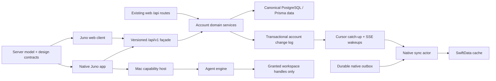

# Target architecture

Status: Phase 0 decision record, 2026-07-16. `Observed` statements describe the audited repositories. `Target` statements are approved rebuild decisions from the mission and are not claims about current behavior.

## Decision summary

`juno` remains the only account backend and canonical database. The production native client remains Swift/SwiftUI, with focused AppKit bridges for Mac-specific editor, PTY, windowing, focus, drag/drop, menus, and large-diff needs. SwiftData becomes an account-scoped cache plus durable mutation outbox. A typed `/api/v1` contract, generated or schema-validated Swift DTOs, a server-owned model manifest, and one change protocol replace the current ad hoc API, static native catalog, and periodic mirroring.

The existing `Juno/` target is the migration host because it contains the broadest native product surface. The incomplete `apps/desktop/JunoDesktop/` shell is not a second production app. Its useful interaction studies may be ported, then the competing target must be retired. The TypeScript `core/` engine may survive only behind a capability-secured boundary; it is not trusted with account credentials or arbitrary filesystem paths.

## Observed system

| Layer | Observed evidence | Consequence |
|---|---|---|
| Web account/backend | Next/Auth.js/Prisma in `src/app`, `src/lib`, and `prisma/schema.prisma`; authenticated routes centralize identity through `src/lib/session.ts`. | This is the integration point for app-scoped bearer identity and `/api/v1`, while existing cookie routes remain compatible. |
| Native product | `juno-app/Juno/` contains chat, projects, memory, settings, voice, artifacts, Code, persistence, and backend services. | Rebuild in vertical slices inside the proven product host instead of starting a fourth shell. |
| Native persistence | `juno-app/Juno/Models/PersistenceModels.swift` is a local product database; `PersistenceModels.swift:493-503` silently falls back to memory on store failure. | Add account ownership and sync metadata; persistent-store failure must block/recover visibly, never become ephemeral without consent. |
| Sync | `juno-app/Juno/Services/Backend/SyncService.swift:5-10` explicitly implements upsert-only coexistence. Creates can fall back to local IDs and mutation failures are swallowed. | Replace rather than extend this protocol. Signed-in mode must never create an invisible permanent local fork. |
| Native auth | `juno/src/app/app-auth/page.tsx` and `handoff.tsx` export the Auth.js cookie through `juno://`; `WebAuthService.swift`, `AuthSession.swift`, and `KeychainService.swift` retain it. | Replace callback payload and credential type before widening native API access. |
| Model metadata | `juno/src/lib/models.ts`, `models.generated.ts`, `model-metrics.ts`, and `juno-app/Juno/Models/ModelCatalog.swift` overlap. `.github/workflows/sync-models.yml` instructs maintainers to mirror Swift manually. | Backend response becomes authoritative; offline fallback is generated from the same versioned manifest. |
| Design metadata | Web semantics are split between `src/app/globals.css`, `tailwind.config.ts`, and `src/lib/accents.ts`; native values are duplicated in `Juno/DesignSystem` and `apps/desktop/JunoDesktop/Design`. | Establish one machine-readable semantic token source and generated bindings. |
| Code execution | Two Swift Code implementations and TypeScript `core/` coexist. `core/src/server.ts` permits an unauthenticated loopback client, and `core/src/tools/fs.ts` lacks workspace containment. | Shipping gate: disable or secure the sidecar; extract safety primitives into an explicitly tested boundary. |

## Target component map

The `/api/v1` layer owns transport schemas, typed errors, pagination, idempotency, revisions, and compatibility. It calls shared domain services rather than duplicating web business rules. Existing web handlers remain live and are migrated internally only when tests prove compatible behavior.

## Repository ownership

### `juno`: canonical server and shared contracts

- `prisma/schema.prisma` and reviewed migrations: account authority, device sessions, revisions, tombstones, mutation receipts, and the monotonic change log.
- `src/app/api/v1/**`: stable native transport surface.
- `src/lib/**`: shared authorization, entitlement, model, usage, storage, and domain commands used by both API generations.
- `contracts/**` or `docs/rebuild/contracts/**`: OpenAPI/JSON Schema sources, examples, compatibility rules, and generated-artifact checksums.
- Canonical design-token and model-manifest sources. Generated web/Swift outputs carry a source version and must not be edited manually.

### `juno-app`: native client, offline cache, and local capabilities

The intended boundaries are responsibilities, not ceremony:

| Boundary | Responsibility | Must not own |
|---|---|---|
| App shell | Scenes, navigation, commands, windows, deep links, account switch/lock state | Network DTOs or mutation policy |
| Account/Auth | Browser authorization, app credentials, device sessions, entitlement/bootstrap state | User passwords or provider API keys in normal mode |
| API v1 | Generated/validated DTOs, transport, typed errors, stream decoding | SwiftData or UI state |
| Sync | Cursor pull, realtime wakeups, outbox replay, canonical-ID mapping, conflicts, reconciliation | Feature rendering |
| Store | Account-scoped cache, outbox, migration state, corruption recovery | Server authority |
| Domain | Stable native feature concepts and capability enums with unknown-value preservation | Provider-specific ad hoc response shapes |
| Design | Generated semantic tokens and accessible components | Independent product colors/model truth |
| Features | Native chat, projects, library, artifacts, memory, connectors, tasks, settings | Direct cookies or arbitrary route knowledge |
| Code safety | Capability handles, path/process/Git/Computer Use policy, approvals, event persistence | Account refresh tokens or unrestricted `cwd` |
| Platform | Keychain, bookmarks, AppKit editor/PTY/window bridges, TCC, notifications | Product policy |

Dependencies point inward: feature UI consumes domain/store interfaces; API and SwiftData implementations sit behind those interfaces. UI state stays on `@MainActor`. Networking, sync, streaming, subprocess, and repository operations use actors and structured concurrency with explicit cancellation.

## Identity and account isolation

Target identity is an app-scoped device session, never the Auth.js browser cookie. The trusted browser signs in using existing website flows. A high-entropy state, S256 PKCE challenge, nonce, exact redirect allowlist, hashed one-time code, atomic consume, short-lived access token, and rotating refresh-token family bind the native callback to the initiating app instance. Keychain stores only app credentials. Access verification checks audience, issuer, expiry, account session version, user ban state, and unrevoked device session.

Every persistent native row is namespaced by an immutable account identifier. Sign-out revokes the device session when possible, clears access/refresh credentials and in-memory secrets, cancels streams/tasks, then either securely removes the account cache or leaves an explicitly locked cache according to the migration policy. One account can never observe another account's cache, outbox, workspace bookmark, or event stream.

## Server-authoritative sync

Every synchronizable aggregate has a canonical ID and revision. Every successful mutation transaction writes:

1. the aggregate update or tombstone;
2. a mutation receipt keyed by `(accountId, authenticatedDeviceSessionId, clientMutationId)`; and
3. an account change row with a monotonically increasing cursor.

The native outbox records the requested mutation, stable client mutation ID, target/local ID, base revision, dependency IDs, attempt state, and user-visible failure. Replays return the original receipt. Conflicts return typed current state; deterministic merge is allowed only for explicitly mergeable fields. Destructive or semantic conflicts remain visible for user resolution. A compact SSE event announces the latest cursor; it does not replace cursor-based pull. Reconnect always resumes from the durable cursor, and a full reconciliation endpoint repairs missed/corrupt cache state idempotently.

Offline-created records retain a local UUID and visible `pending` state until a receipt maps it to the canonical ID. References are rewritten transactionally. Delete is a tombstone until the documented retention/compaction window passes. See `03-api-and-sync-protocol.md` for wire rules.

## Dynamic models and entitlements

The versioned model response includes stable ID, provider, display metadata, lifecycle, server availability, required plan, modalities, context limit, pricing/cost classification, supported effort values in display order, and explicit capabilities. Clients preserve unknown enum values and disable only unsupported controls; they do not substitute another model silently. A generated, versioned emergency manifest permits safe offline browsing but is never a second maintained registry. `Juno/Models/ModelCatalog.swift` is removed after the rollout gate proves manifest availability and migration.

BYOK is a separate advanced, device-local mode. It is visibly distinct, cannot consume the normal account session as a provider credential, and does not silently change signed-in account semantics.

## Code workbench trust boundary

The native shell is the capability authority. It grants opaque workspace handles derived from security-scoped bookmarks; an engine never supplies an arbitrary absolute root. All path operations resolve canonical parents, reject traversal and symlink escape, and revalidate at mutation time. Shell processes run in a new process group with a minimal environment, bounded output, secret redaction, timeouts, and tree cancellation. An emergency stop cancels provider streams, tool work, child process groups, Computer Use, and queued approvals.

The direct-distribution Mac architecture uses a sandboxed UI/account process and a separately signed, notarized, non-root per-user XPC execution service registered through supported macOS service-management APIs. Arbitrary developer toolchains make pretending that the execution service is App-Sandbox-contained unsafe; its narrower trust boundary is instead enforced by designated-client code-signing validation, an unguessable per-launch channel capability, explicit bookmark-derived workspace handles, strict message schemas, a minimal environment, and the shared filesystem/process/network policy. The service never receives account refresh tokens, Auth.js cookies, unrestricted paths, or provider keys. Its greater user-level authority is a release-critical threat boundary and requires independent penetration/adversarial tests. If Apple platform validation shows this split cannot safely carry bookmarks or required toolchains, Code mode remains disabled; the UI process is not made broadly unsandboxed as a fallback.

Code sessions persist one versioned event protocol for turns, user-facing reasoning summaries, status, tool calls/results, approvals, commands, diffs, checkpoints, tests, Git, usage, errors, and completion. Account sync may include permitted session/task metadata and event history, but source files, full terminal output, workspace paths, and screenshots stay device-local unless the user explicitly shares them.

If the TypeScript engine remains, its loopback server must be replaced or gated by a random per-launch capability, strict Origin/peer rules, bounded message schemas, allowlisted workspace handles, and audience-scoped backend tokens. It never receives the Auth.js cookie or native refresh token. XPC or a protected Unix-domain transport is preferred for a production Mac build.

## Rendering and platform decisions

- SwiftUI is primary for shell, chat, projects, settings, permissions, and navigation.
- AppKit bridges are appropriate for a PTY terminal, high-performance editor/diff, first-responder/focus routing, menus/toolbars, drag/drop, and large data views.
- `WKWebView` is limited to sandboxed artifacts and explicit live preview. Remote subresources are denied by default; a page cannot inherit account cookies or arbitrary host access.
- macOS is primary. Shared iOS DTO/domain/cache code remains buildable where practical, but filesystem writes, shell/Git, worktrees, and Computer Use remain Mac-only.
- Enable Hardened Runtime and App Sandbox with the minimum reviewed entitlements for the UI/account process. The separately signed execution service follows the constrained direct-distribution boundary above. Workspace access uses bookmarks/capability handles, never broad home-directory assumptions.

## Observability and privacy

Operational telemetry may record schema version, endpoint class, status/error code, retry count, duration, byte/token counts, cursor lag, queue depth, migration stage, crash signature, and coarse feature flags. It must not record access/refresh tokens, cookies, passwords, provider keys, source contents, raw prompts/responses, attachments, file paths, terminal text, screenshots, or voice transcripts. Security audit events contain actor/device IDs and action metadata without secret payloads.

## Compatibility strategy

Expansion precedes cutover: additive schema, dual-compatible readers, feature-flagged v1 routes, shadow validation, native cohort, then legacy retirement. Website cookie sessions and existing endpoints remain functional. A new native build may detect only the presence of the legacy Keychain cookie and require a fresh trusted-browser authorization; it must not silently convert the legacy bearer into a longer-lived device session. The legacy value is deleted only after the new device session and initial sync validate. No new raw-token callback is issued, and no destructive production migration is authorized by this document.

## Architecture gates

The next layer cannot be called complete until all applicable gates pass:

- Contract generation is deterministic and CI rejects drift.
- Auth replay, expiry, PKCE, rotation/reuse, logout, and remote revocation tests pass.
- Two-client create/update/delete/conflict/offline/reconnect convergence tests pass.
- Existing web authentication and routes pass compatibility tests.
- A missing/corrupt SwiftData store produces a visible recovery path, never silent in-memory persistence.
- The unauthenticated sidecar cannot start in a release build.
- Workspace escape, secret environment, process-tree cancellation, network destination, install/destructive-command classification, checkpoint, approval replay, execution-service authentication, and designated-client tests pass before Code mode is enabled.
- Signed/notarized update provenance and rollback are validated before distribution.

## Rejected alternatives

- A second native backend or native-owned canonical database: rejects the one-account requirement.
- Extending periodic timestamp mirroring: cannot make deletes, retries, concurrent edits, or offline identity deterministic.
- Returning the web cookie through a custom URL: bearer leakage and replay compromise the full browser session.
- Maintaining a curated Swift model list or copied color constants: guarantees drift.
- Replacing the app with Electron/Tauri/full-window web content: violates the native product and security boundary.
- Treating the current Code primitives as proven: the audit found untested containment, cancellation, checkpoint, sidecar, and updater failures.
